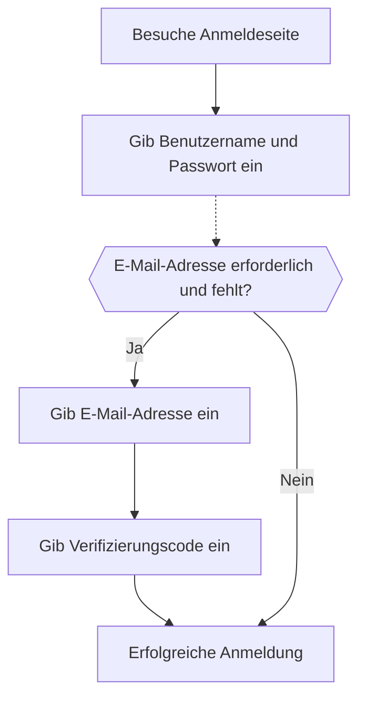

import signInEmailPasswordImage from '@site/docs/end-user-flows/sign-up-and-sign-in/assets/sign-in-email-password.png';
import signInEmailPhonePasswordVerificationCodeImage from '@site/docs/end-user-flows/sign-up-and-sign-in/assets/sign-in-email-phone-password-verification-code.png';

# E-Mail / Telefon / Benutzername Anmeldung

## Konfiguriere den Identifikator-Anmeldefluss \{#configure-the-identifier-sign-in-flow}

Wie bereits erwähnt, können verschiedene Identifikatortypen von Benutzern während des [Registrierungsflusses](/end-user-flows/sign-up-and-sign-in/sign-up) oder [direkter Kontoerstellung in Logto](/user-management/manage-users#add-users) erfasst werden. Darüber hinaus können Benutzer zusätzliche Informationen eingeben und vervollständigen, während sie das Produkt erkunden und nutzen. Diese Identifikatoren können verwendet werden, um Benutzer im Logto-System eindeutig zu identifizieren und ihnen die Authentifizierung und Anmeldung bei den mit Logto integrierten Anwendungen zu ermöglichen.

Egal, ob du die von Logto gehostete vorgefertigte Anmeldeseite verwenden oder [deine eigene benutzerdefinierte Anmelde-UI erstellen](/customization#custom-ui) möchtest, du musst die verfügbaren Anmeldemethoden und Verifizierungseinstellungen für deine Endbenutzer konfigurieren.

## Richte die Identifikator- und Authentifizierungseinstellungen ein \{#set-up-the-identifier-and-authentication-settings}

### 1. Lege die unterstützten Anmeldeidentifikatoren fest \{#1-set-the-supported-sign-in-identifiers}

Du kannst mehrere unterstützte Identifikatoren aus der Dropdown-Liste als aktivierte Anmeldemethoden für Endbenutzer hinzufügen. Die verfügbaren Optionen sind:

- **Benutzername**
- **E-Mail-Adresse**
- **Telefonnummer**

Das Neuanordnen der Identifikatoren ändert die Reihenfolge, in der sie auf der Anmeldeseite angezeigt werden. Der erste Identifikator wird die primäre Anmeldemethode für Benutzer sein.

### 2. Lege die Authentifizierungseinstellungen fest \{#2-set-the-authentication-settings}

Für jeden Anmeldeidentifikator musst du mindestens einen effektiven Verifizierungsfaktor konfigurieren, um die Identität des Benutzers zu überprüfen. Es gibt zwei Faktoren, aus denen du wählen kannst:

- **Passwort**: Verfügbar für alle Arten von Anmeldeidentifikatoren. Sobald aktiviert, müssen Benutzer ein Passwort angeben, um den Anmeldeprozess abzuschließen.
- **Verifizierungscode**: Nur verfügbar für **E-Mail-Adresse** und **Telefonnummer** Identifikatoren. Sobald aktiviert, müssen Benutzer einen Verifizierungscode eingeben, der an ihre E-Mail oder Telefonnummer gesendet wird, um den Anmeldeprozess abzuschließen.

Wenn beide Faktoren aktiviert sind, können Benutzer eine der Methoden wählen, um den Anmeldeprozess abzuschließen. Du kannst auch die Faktoren neu anordnen, um die Reihenfolge zu ändern, in der sie auf der Anmeldeseite angezeigt werden. Der erste Faktor wird als primäre Verifizierungsmethode für Benutzer verwendet und der zweite wird als alternativer Link angezeigt.

## Benutzererfahrung im Identifikator-Anmeldefluss \{#identifier-sign-in-flow-user-experience}

Die Anmeldeerfahrung passt sich basierend auf dem gewählten Identifikator und den verfügbaren Authentifizierungsfaktoren an.

- **Intelligente Eingabe für mehrere Identifikatoren:**
  Wenn mehr als eine Anmeldeidentifikator-Methode aktiviert ist, erkennt die integrierte Anmeldeseite von Logto automatisch den vom Benutzer eingegebenen Identifikatortyp und zeigt die entsprechenden Verifizierungsoptionen an. Wenn beispielsweise sowohl **E-Mail-Adresse** als auch **Telefonnummer** aktiviert sind, erkennt die Anmeldeseite automatisch den vom Benutzer eingegebenen Identifikatortyp und zeigt die entsprechenden Verifizierungsoptionen an. Sie wechselt zu einem Telefonnummernformat mit Regionscode, wenn Zahlen nacheinander eingegeben werden, oder zu einem E-Mail-Format, wenn ein „@“-Symbol verwendet wird.
- **Aktivierte Verifizierungsfaktoren:**
  - **Nur Passwort:** Sowohl das Identifikator- als auch das Passwortfeld werden auf dem ersten Bildschirm angezeigt.
  - **Nur Verifizierungscode:** Das Identifikatorfeld erscheint auf dem ersten Bildschirm, gefolgt vom Verifizierungscodefeld auf dem zweiten Bildschirm.
  - **Passwort und Verifizierungscode:** Das Identifikatorfeld wird zunächst auf dem ersten Bildschirm eingegeben, gefolgt von Schritten zur Eingabe des Passworts oder Verifizierungscodes auf dem zweiten Bildschirm basierend auf der Verifizierungsreihenfolge. Ein Umschaltlink wird bereitgestellt, um Benutzern das Wechseln zwischen den beiden Verifizierungsmethoden zu ermöglichen.

### Beispiele \{#examples}

  

### Beispiel 1: E-Mail-Adresse mit Passwortverifizierung \{#example-1-email-address-with-password-verification}

Füge die **E-Mail-Adresse** als Anmeldeidentifikator hinzu und aktiviere den **Passwort**-Faktor zur Verifizierung.

  

### Beispiel 2: E-Mail / Telefon mit Passwort (primär) und Verifizierungscode (alternativ) Verifizierung aktiviert \{#example-2-emailphone-with-passwordprimary-and-verification-code-alternative-verification-enabled}

Füge sowohl **E-Mail-Adresse** als auch **Telefonnummer** als Anmeldeidentifikatoren hinzu.
Aktiviere die **Passwort**- und **Verifizierungscode**-Faktoren für beide Identifikatoren.

## Zusätzliche Benutzerprofile bei der Anmeldung erfassen \{#collect-additional-user-profile-on-sign-in}

Im Anmeldefluss von Logto kann ein Profil-Erfüllungsprozess ausgelöst werden, wenn die Registrierungsidentifikatoreinstellungen aktualisiert werden. Dies stellt sicher, dass alle Benutzer, einschließlich bestehender, alle neu erforderlichen Identifikatoren bereitstellen.

Wenn ein Entwickler einen neuen Identifikator (wie eine E-Mail-Adresse) hinzufügt, wird er für alle Benutzer obligatorisch. Wenn sich ein zurückkehrender Benutzer mit einem bestehenden Identifikator (wie einem Benutzernamen) anmeldet, wird er aufgefordert, den neuen Identifikator bereitzustellen und zu verifizieren, wenn er in seinem Profil fehlt. Erst nach Abschluss dieses Schritts kann er auf die Anwendung zugreifen, was einen reibungslosen und konsistenten Übergang zu den aktualisierten Anforderungen gewährleistet.

Aufschlüsselung des Prozesses:

1. **Benutzername** wurde zuvor als Registrierungsidentifikator mit der Einstellung **Erstelle dein Passwort** automatisch aktiviert.
2. **E-Mail-Adresse** wird später als Registrierungsidentifikator festgelegt. Der **E-Mail-Adresse**-Identifikator wird automatisch als aktivierte Anmeldeoption hinzugefügt.
3. Ein zurückkehrender Benutzer meldet sich mit seinem Benutzernamen und Passwort an.
4. Der Benutzer wird aufgefordert, nach seinem ersten Anmeldeschritt eine E-Mail-Adresse bereitzustellen und zu verifizieren.

Der gleiche Prozess gilt auch für die **Erstelle dein Passwort**-Registrierungseinstellungen. Wenn die **Erstelle dein Passwort**-Einstellungen im Registrierungsfluss neu aktiviert werden, wird der **Passwort**-Faktor automatisch für alle von dir gewählten Anmeldeidentifikatoren aktiviert. Alle zurückkehrenden Benutzer ohne Passwort werden während des Anmeldeprozesses aufgefordert, eines zu erstellen.

:::note
Hinweis: Für benutzerdefinierte Anmeldeflüsse, siehe das Feature von [Bring your UI](/customization/bring-your-ui/).
:::

## FAQs \{#faqs}

  

### Selbstgehostete Anmeldeerfahrung (eingebettete Anmeldung) \{#self-hosted-sign-in-experience-embedded-sign-in}

Logto unterstützt derzeit keine Headless-API für Anmeldung und Registrierung. Du kannst jedoch unser [Bring your UI](/customization/bring-your-ui/) Feature verwenden, um dein benutzerdefiniertes Anmeldeformular bei Logto hochzuladen. Wir unterstützen auch mehrere Anmeldeparameter, die du verwenden kannst, um das Anmeldeformular mit Benutzeridentifikatoren aus deiner Anwendung vorab auszufüllen oder direkt mit einem Drittanbieter-SSO-Anbieter oder einem Unternehmens-SSO-Anbieter anzumelden. Erfahre mehr unter [Authentifizierungsparameter](/end-user-flows/authentication-parameters/).

## Verwandte Ressourcen \{#related-resources}

<Url href="https://www.youtube.com/watch?v=64rBXpWbScc">
  E-Mail-Registrierungs- und Anmeldeerfahrung
</Url>

<Url href="https://www.youtube.com/watch?v=chQxCJX6e6w">
  Benutzername Registrierungs- und Anmeldeerfahrung
</Url>
