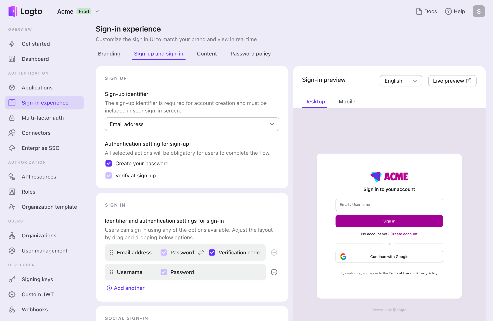

# E-Mail / Telefon / Benutzername Anmeldung

Die Benutzerregistrierung ist der erste Schritt, damit Benutzer mit deiner Anwendung interagieren können. Logto unterstützt eine Vielzahl von Anmeldemethoden, einschließlich Benutzername-Passwort, E-Mail- oder Telefonnummernverifizierung, soziale Anmeldung und Enterprise SSO. Du kannst die Anmeldemethoden einrichten, die am besten zu den Anforderungen deiner Anwendung passen.

Besuche <CloudLink to="/sign-in-experience/sign-up-and-sign-in">Konsole > Anmeldeerfahrung > Anmeldung und Anmeldung</CloudLink>, um den Anmeldefluss für Identifikatoren zu konfigurieren.

## Anmeldeidentifikator einrichten

Um erfolgreich ein neues Benutzerkonto in Logto zu erstellen, müssen Benutzer einen **Identifikator** angeben, der sie innerhalb des Logto-Systems eindeutig identifiziert. Als erster Schritt lege den **Identifikator** fest, den du während des Anmeldeprozesses von den Benutzern sammeln musst. Die verfügbaren Optionen sind:

- **Benutzername**: Ein eindeutiger Benutzername, den der Benutzer verwenden kann, um sich bei der Anwendung anzumelden.
- **E-Mail-Adresse**: Eine gültige E-Mail-Adresse, die der Benutzer verwenden kann, um sich bei der Anwendung anzumelden.
- **Telefonnummer**: Eine gültige Telefonnummer, die der Benutzer verwenden kann, um sich bei der Anwendung anzumelden.
- **E-Mail-Adresse oder Telefonnummer**: Erlaube Benutzern, sich entweder mit einer gültigen E-Mail-Adresse oder Telefonnummer anzumelden.
- **Nicht zutreffend**: Kein Anmeldeidentifikator ist aktiviert. Dies gilt für die ausschließlich soziale oder Enterprise SSO-Anmeldemethoden.

Alle während des Anmeldeprozesses gesammelten Identifikatoren müssen innerhalb desselben Mandanten eindeutig sein. Sie werden im Benutzerprofil gespeichert und können verwendet werden, um sich bei den Anwendungen anzumelden, die mit Logto integriert sind.

## Anmeldeverifizierungseinstellungen einrichten

Um die Sicherheit des Benutzeranmelde- und zukünftigen Anmeldeprozesses zu gewährleisten, musst du auch die Verifizierungseinstellungen für die Identifikatoren konfigurieren, die du während des Anmeldeprozesses sammelst. Die verfügbaren Einstellungen sind:

- **Erstelle dein Passwort:** Erfordere von Benutzern, während der Anmeldung ein Passwort zu erstellen, das der in deinen Anmeldeerfahrungseinstellungen konfigurierten Passwortrichtlinie entspricht. Dieses Passwort dient zusammen mit dem Benutzeridentifikator als Anmeldeinformation für die Anwendung. Wenn du **Benutzername** als Anmeldeidentifikator festlegst, wird diese Anforderung automatisch aktiviert, da der **Benutzername** nur mit einem Passwort verwendet werden kann, um die Identität des Benutzers effektiv zu verifizieren.
- **Bei der Anmeldung verifizieren**: Erfordere von Benutzern, ihre E-Mail-Adresse oder Telefonnummer während der Anmeldung zu verifizieren. Derzeit akzeptiert Logto nur verifizierte E-Mails und Telefonnummern als Identifikatoren. Diese Einstellung wird automatisch aktiviert, wenn eine **E-Mail-Adresse** oder **Telefonnummer** als Anmeldeidentifikator verwendet wird. Benutzer müssen den Besitz bestätigen, indem sie während des Anmeldeprozesses einen Verifizierungscode eingeben, der an ihre E-Mail-Adresse oder Telefonnummer gesendet wird.

| Identifikator             | Benutzerpasswort erstellen | Bei der Anmeldung verifizieren |
| ------------------------- | -------------------------- | ------------------------------ |
| Benutzername              | Erforderlich               | N/A                            |
| E-Mail-Adresse            | Optional                   | Erforderlich                   |
| Telefonnummer             | Optional                   | Erforderlich                   |
| E-Mail oder Telefonnummer | Optional                   | Erforderlich                   |
| Nicht zutreffend          | N/A                        | N/A                            |

## Beispiele für Anmeldeflüsse

  
Typ 1: Benutzername mit Passworterstellung

Wähle den **Benutzernamen** als Anmeldeidentifikator. Erstelle dein Passwort ist gezwungen, aktiviert zu sein.

  
Typ 2: E-Mail-Adresse oder Telefonnummer mit Verifizierungsfluss

Wähle die **E-Mail-Adresse oder Telefonnummer** als Anmeldeidentifikator. **Bei der Anmeldung verifizieren** ist gezwungen, aktiviert zu sein.

  
Typ 3: E-Mail-Adresse mit Verifizierung und Passworterstellung

Wähle die **E-Mail-Adresse** als Anmeldeidentifikator. **Bei der Anmeldung verifizieren** ist gezwungen, aktiviert zu sein. Aktiviere **Erstelle dein Passwort**, um von Benutzern zu verlangen, während der Anmeldung ein Passwort zu erstellen. (Gleiches gilt für den Anmeldefluss mit Telefonnummer)

## Anmeldung mit sozialem oder Enterprise SSO

Zusätzlich zu diesen traditionellen Anmeldeidentifikatoren unterstützt Logto auch die passwortlose Anmeldung mit sozialen und Enterprise SSO-Identitätsanbietern, was den Onboarding-Prozess nahtloser und benutzerfreundlicher macht.

Sobald ein sozialer Connector oder Enterprise SSO-Connector in Logto konfiguriert und aktiviert ist, können sich Benutzer einfach mit ihrer bestehenden sozialen oder Enterprise-Identität anmelden, die vom Connector bereitgestellt wird. Soziale und Enterprise SSO-Anmeldemethoden ermöglichen es Benutzern, zusätzliche Schritte wie das Erstellen eines Passworts oder das Verifizieren ihrer E-Mail-Adresse oder Telefonnummer zu überspringen. Logto synchronisiert automatisch die Informationen des Benutzers über ihre verifizierte soziale oder Enterprise-Identität und speichert sie im Benutzerprofil.

Sieh dir die Abschnitte [Soziale Anmeldung](/end-user-flows/sign-up-and-sign-in/social-sign-in/) und [Enterprise SSO](/end-user-flows/enterprise-sso/) an, um mehr über den Anmeldefluss mit sozialen und Enterprise SSO-Connectors zu erfahren.

:::note
Hinweis: Für benutzerdefinierte Anmeldeflüsse, siehe die Funktion von [Bring your UI](/customization/bring-your-ui/).
:::

## FAQs

  
Zusätzliche Benutzerinformationen bei der Anmeldung sammeln

  
Um zusätzliche Benutzerprofilinformationen (z. B. Vollständiger Name, Geburtstag, Firmenname) während der Anmeldung zu sammeln, hast du zwei Optionen:

- **Selbst gehostete Onboarding-Flows**: Leite Benutzer nach erfolgreicher Anmeldung zu deinem eigenen Onboarding-Flow weiter, um anpassbare Datensammlungen durchzuführen.
- **Bring your own UI**: Passe deinen eigenen Anmeldefluss mit unserer Bring your own UI-Funktion und der Benutzerprofil-Einstellungen-API (kommt bald) an.

  
 Vom Admin erstellte Benutzer / Eingeladene Benutzer

Erfahre, wie du den [Einladung nur Anmeldefluss](/end-user-flows/sign-up-and-sign-in/disable-user-registration/#implement-an-invitation-only-sign-up-flow) implementieren kannst.

  
 Eingebettete Anmeldeformulare auf deiner Website

  
Logto unterstützt derzeit keine Headless-API für Anmeldung und Registrierung. Du kannst die [Bring your UI](/customization/bring-your-ui/) Funktion verwenden, um dein eigenes Anmeldeformular zu Logto hochzuladen oder die Anmeldeparameter verwenden, um Benutzerinformationen von deiner Website zu Logto zu übertragen. Erfahre mehr über die Benutzeridentifikatorübertragung bei [Authentifizierungsparameter](/end-user-flows/authentication-parameters/).

  
Willkommens-E-Mails an neue Benutzer senden

Abonniere das `User.Created` Webhook-Ereignis, um eine Willkommens-E-Mail an neue Benutzer zu senden. Erfahre mehr über [Webhook-Ereignisse](/developers/webhooks/webhooks-events/#data-mutation-hook-events).

  
 E-Mail-Verifizierung bei der Anmeldung überspringen

Derzeit unterstützt Logto nur verifizierte E-Mails und Telefonnummern als Identifikatoren. Der Verifizierungsprozess ist erforderlich, um die Sicherheit und den Besitz des Benutzeridentifikators zu gewährleisten.
Die Unterstützung für nicht verifizierte E-Mails oder Telefonnummern steht auf unserer Roadmap. Bleib dran für Updates!

## Verwandte Ressourcen

<Url href="https://www.youtube.com/watch?v=64rBXpWbScc">
  E-Mail-Anmelde- und Anmeldungserfahrung
</Url>

<Url href="https://www.youtube.com/watch?v=chQxCJX6e6w">
  Benutzername-Anmelde- und Anmeldungserfahrung
</Url>
