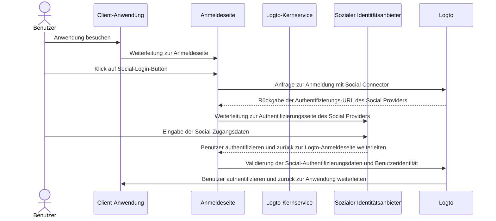
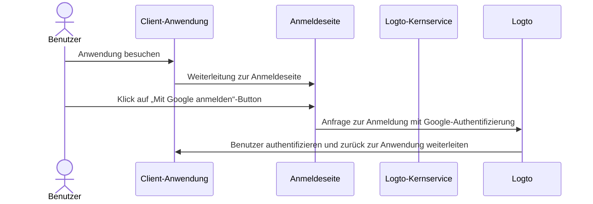

# Soziale Anmeldung

Die soziale Anmeldung ist eine weit verbreitete Authentifizierungsmethode, die es Benutzern ermöglicht, sich mit ihren bestehenden Social-Media-Konten wie Google, Facebook, Twitter und LinkedIn anzumelden und zu registrieren.

Vorteile der sozialen Anmeldung:

- **Vereinfachter Onboarding-Prozess**: Die soziale Anmeldung ermöglicht es Benutzern, sich mit nur einem Klick zu registrieren oder anzumelden, ohne ein neues Konto erstellen oder sich ein weiteres Passwort merken zu müssen. Dies reduziert Hürden und steigert das Nutzerengagement.
- **Erhöhtes Vertrauen und Sicherheit**: Durch die Nutzung etablierter, vertrauenswürdiger Plattformen wie Google oder Facebook fühlen sich Benutzer in deiner Anwendung sicherer.
- **Anreicherung von Benutzerdaten**: Die soziale Anmeldung ermöglicht es dir, zusätzliche Profilinformationen von der Social-Plattform zu erhalten, wie Name, E-Mail-Adresse, Profilbild und mehr.

## Soziale Anmeldung implementieren \{#implement-social-sign-in}

1. **Konfiguriere deine Social Connectors**:<br/>
   Navigiere zu <CloudLink to="/connectors/social">Konsole > Connectors > Social connectors</CloudLink>. Klicke auf die Schaltfläche „Social Connector hinzufügen“ und wähle den gewünschten Social Connector aus (z. B. Google oder Github). Siehe [Social Connector](/connectors/social-connectors/) für detaillierte Anweisungen.
2. **Füge Social-Login-Buttons hinzu**:<br/>
   Standardmäßig ist dein neu hinzugefügter Social Connector auf der Anmeldeseite für Endbenutzer nicht sichtbar. Um Social-Login-Buttons auf der Anmeldeseite hinzuzufügen, musst du den Social Connector in den Einstellungen der Anmeldeerfahrung aktivieren.

   Navigiere zu <CloudLink to="/sign-in-experience/sign-up-and-sign-in">Konsole > Anmeldeerfahrung > Registrierung und Anmeldung</CloudLink>. Klicke auf die Schaltfläche „Social Connector hinzufügen“, um Social-Login-Buttons auf deinen Registrierungs- und Anmeldeseiten zu integrieren. Verwende Drag & Drop, um deren Reihenfolge in der Benutzeroberfläche festzulegen.

3. **Lege Optionen zur Kontoverknüpfung fest**:<br/>
   Für neue Benutzer, die sich mit [sozialen Identitäten](/user-management/user-data#social-identities) registrieren, ermöglicht Logto die Verknüpfung ihres Social-Kontos mit einem bestehenden E-Mail- oder Telefonnummer-Konto im Logto-System. Standardmäßig wird während der sozialen Registrierung eine entsprechende [Kontoverknüpfungsseite](#account-linking) angezeigt, auf der Benutzer ihr Social-Konto mit einem bestehenden Konto verknüpfen oder ein neues erstellen können.

   Um diesen Prozess zu vereinfachen, kannst du die Option **Automatische Kontoverknüpfung** in den Einstellungen der Anmeldeerfahrung aktivieren. Dadurch wird das Social-Konto automatisch mit einem bestehenden Konto verknüpft, wenn E-Mail oder Telefonnummer übereinstimmen.

4. **Änderungen speichern**:<br/>
   Überprüfe deine Änderungen sorgfältig und speichere sie, um die Konfiguration zu übernehmen.

## Benutzererfahrung der sozialen Anmeldung \{#user-experience-of-social-sign-in}

Mit der sozialen Anmeldung werden Registrierungs- und Anmeldeprozesse in Logto für Benutzer vereinfacht.



1. **Anmeldung mit Social**: Der Benutzer klickt auf den auf der Anmeldeseite angezeigten Social-Login-Button.
2. **Weiterleitung**: Der Benutzer wird zur Authentifizierungsseite des sozialen Identitätsanbieters weitergeleitet.
3. **Soziale Authentifizierung**: Der Benutzer gibt seine Social-Zugangsdaten ein und authentifiziert sich beim Social Provider. Ist der Benutzer bereits beim Social Provider angemeldet, erfolgt die Authentifizierung ggf. automatisch. Bei mehreren aktiven Sitzungen kann der Benutzer aufgefordert werden, das richtige Konto auszuwählen (z. B. mehrere Google-Konten).
   :::note
   Google-„prompt“-Parameter können im Google Connector gesetzt werden, um die Benutzererfahrung bei der Kontenauswahl und dem Zustimmungsbildschirm für die Google-Anmeldung anzupassen.
   :::
4. **Rückkehr zu Logto**: Nach erfolgreicher Authentifizierung leitet der Social Provider den Benutzer mit den Authentifizierungsdaten zurück zur Logto-Anmeldeseite.
5. **Validierung der sozialen Identität**: Logto validiert die Social-Authentifizierungsdaten und die Benutzeridentität. Existiert kein Benutzerkonto, das mit der sozialen Identität verknüpft ist, wird ein neues Konto erstellt.
6. **Benutzerauthentifizierung**: Logto authentifiziert den Benutzer und leitet ihn zurück zur Client-Anwendung, um den Authentifizierungsprozess abzuschließen.

## Kontoverknüpfung \{#account-linking}

Wie oben erwähnt, ermöglicht Logto Benutzern, ihre Social-Konten mit bestehenden E-Mail- oder Telefonnummer-Konten im Logto-System zu verknüpfen. Dieser Prozess ist wichtig, um ein einheitliches Benutzerkonto über verschiedene Authentifizierungsmethoden und Identitätsanbieter hinweg zu gewährleisten.

- **Neues Konto erstellen**:
  Meldet sich ein Benutzer mit einer [sozialen Identität](/user-management/user-data#social-identities) an, die im Logto-System nicht existiert, und stimmen die angegebene E-Mail oder Telefonnummer mit keinem bestehenden Benutzerkonto überein, wird direkt ein neues Konto in Logto erstellt.
- **Verknüpfung mit bestehendem Konto**:
  Ist die von der sozialen Identität bereitgestellte E-Mail oder Telefonnummer bereits mit einem bestehenden Konto in Logto verknüpft, bieten wir einen flexiblen Kontoverknüpfungsprozess an.

  - **Automatische Kontoverknüpfung:** Ist die Option „Automatische Kontoverknüpfung“ in deinen <CloudLink to="/sign-in-experience/sign-up-and-sign-in">Anmeldeerfahrung</CloudLink>-Einstellungen aktiviert, verknüpft Logto das Social-Konto automatisch mit dem bestehenden Konto anhand der übereinstimmenden E-Mail oder Telefonnummer. Benutzer werden nicht zur Verknüpfung aufgefordert und direkt in ihr bestehendes Konto eingeloggt. Das Social-Konto wird verknüpft, sodass der Benutzer sich künftig mit beiden Methoden anmelden kann.
  - **Manuelle Kontoverknüpfung**: Ist die Option „Automatische Kontoverknüpfung“ deaktiviert, werden Benutzer während des Anmeldeprozesses aufgefordert, ihr Social-Konto mit dem bestehenden Konto zu verknüpfen. Sie können die Konten verknüpfen oder ein neues Konto erstellen.

    

    ```mermaid
    flowchart TD
    A[Authentifizierung mit sozialer Identität] --> B{{Soziale Identität existiert in Logto?}}
    B -- Ja --> C[Mit bestehendem Konto angemeldet]
    B -- Nein --> D{{E-Mail / Telefonnummer stimmt mit bestehendem Konto überein?}}
    D -- Ja --> E{{Automatische Kontoverknüpfung aktiviert?}}
    E -- Ja --> G[Soziale Identität mit bestehendem Konto verknüpfen]
    G --> C
    D -- Nein --> H[Neues Konto erstellen und anmelden]
    E -- Nein --> I{{Social-Konto verknüpfen?}}
    I -- Ja --> G
    I -- Nein --> H
    ```

:::note
Wird während der sozialen Registrierung ein passendes Konto mit einer E-Mail oder Telefonnummer gefunden und entscheidet sich der Benutzer gegen eine Verknüpfung, werden E-Mail oder Telefonnummer nicht mit dem neuen Konto in Logto synchronisiert. So bleibt die E-Mail und Telefonnummer über alle Benutzerkonten hinweg eindeutig.

Ist E-Mail oder Telefonnummer ein erforderlicher Registrierungsbezeichner, wird der Benutzer während der Registrierung aufgefordert, eine andere E-Mail oder Telefonnummer anzugeben. Siehe [Zusätzliche Benutzerprofildaten erfassen](#collect-additional-user-profile-data) für weitere Details.
:::

## Zusätzliche Benutzerprofildaten erfassen \{#collect-additional-user-profile-data}

Während des sozialen Registrierungsprozesses werden Benutzer je nach den von dir konfigurierten erforderlichen Registrierungsbezeichnern (**E-Mail-Adresse**, **Telefonnummer** und **Benutzername**) ggf. aufgefordert, zusätzliche verifizierte Informationen anzugeben, um die Registrierung oder Anmeldung nach der Authentifizierung beim Social Provider abzuschließen.

Beispiel: **E-Mail-Adresse** und **Benutzername** sind als erforderliche Registrierungsbezeichner festgelegt:

1. **Registrierung mit sozialer Identität, die eine verifizierte E-Mail-Adresse bereitstellt**

   Wird eine verifizierte E-Mail-Adresse von der sozialen Identität bereitgestellt, wird diese mit dem Benutzerprofil synchronisiert und der Benutzer wird aufgefordert, einen Benutzernamen anzugeben, um die Registrierung abzuschließen.

   ```mermaid
   flowchart TD
      A[Authentifizierung mit sozialer Identität] --> B{{Verifizierte E-Mail-Adresse enthalten?}}
      B -- Ja --> C[Benutzernamen eingeben]
      C --> D[Erfolgreiche Registrierung]
   ```

2. **Registrierung mit sozialer Identität, die keine verifizierte E-Mail-Adresse bereitstellt**

   Wird keine verifizierte E-Mail-Adresse bereitgestellt, wird der Benutzer während der Registrierung aufgefordert, eine E-Mail-Adresse anzugeben. Diese muss durch Eingabe eines an die angegebene Adresse gesendeten Codes verifiziert werden.

   ```mermaid
   flowchart TD
      A[Authentifizierung mit sozialer Identität] --> B{{Verifizierte E-Mail-Adresse enthalten?}}
      B -- Nein --> C[E-Mail-Adresse eingeben]
      C --> D[Verifizierungscode eingeben]
      D --> E[Benutzernamen eingeben]
      E --> F[Erfolgreiche Registrierung]
   ```

3. **Registrierung mit sozialer Identität, die eine bereits registrierte E-Mail-Adresse bereitstellt**

   Wird eine bereits im Logto-System registrierte E-Mail-Adresse bereitgestellt, wird der Benutzer aufgefordert, das Social-Konto mit dem bestehenden Konto zu verknüpfen oder ein neues Konto zu erstellen. Wählt der Benutzer die Erstellung eines neuen Kontos, muss er eine neue E-Mail-Adresse angeben und verifizieren.

   ```mermaid
      flowchart TD
       A[Authentifizierung mit sozialer Identität] --> B{{E-Mail-Adresse stimmt mit bestehendem Konto überein?}}
       B -- Ja --> C{{Social-Konto verknüpfen?}}
       C -- Ja --> D[Soziale Identität mit bestehendem Konto verknüpfen]
       D --> E[Erfolgreiche Anmeldung]
       C -- Nein --> F[Neue E-Mail-Adresse eingeben]
       F --> G[Verifizierungscode eingeben]
       G --> H[Benutzernamen eingeben]
       H --> I[Erfolgreiche Registrierung]
       B -- Nein --> H
   ```

## Google One-tap \{#google-one-tap}

Logto unterstützt auch die [Google One-tap](https://developers.google.com/identity/gsi/web/guides/features)-Anmeldemethode für den Google Connector, sodass Benutzer sich mit nur einem Klick anmelden können. Diese Funktion vereinfacht den Anmeldeprozess weiter, da Benutzer nicht mehr zur Google-Authentifizierungsseite weitergeleitet werden müssen.

Um Google One-tap zu aktivieren, folge den Anweisungen in den [Google Connector](/integrations/google)-Einstellungen. Nach der Aktivierung sehen Benutzer ein „Mit Google anmelden“-Popup, wenn sie auf der Anmeldeseite landen. Nach dem Klick werden sie automatisch mit ihrem Google-Konto authentifiziert und zurück zur Anwendung geleitet.




## Soziale Konten verknüpfen oder trennen \{#link-or-unlink-social-accounts}

Nach der ersten sozialen Anmeldung können Benutzer ihre verbundenen Social-Konten über ihre Kontoeinstellungen verwalten. So können sie weitere Social-Konten mit ihrem bestehenden Profil verknüpfen oder nicht mehr gewünschte Verbindungen entfernen.

Benutzer können diese Funktionen über ein Self-Service-Kontozentrum nutzen, das folgende Flexibilität bietet:

- **Neue Social-Konten verknüpfen**: Weitere Social Provider mit demselben Benutzerprofil verbinden
- **Bestehende Social-Konten trennen**: Soziale Verbindungen entfernen und weiterhin über andere Methoden Zugriff behalten
- **Verbundene Konten anzeigen**: Alle aktuell verknüpften sozialen Identitäten einsehen

Weitere Informationen zur Implementierung von Kontoverwaltungsfunktionen findest du in der [Dokumentation zu den Kontoeinstellungen](/end-user-flows/account-settings).

## Tokens speichern und Drittanbieter-APIs aufrufen \{#store-tokens-and-call-third-party-apis}

Du kannst optional die Speicherung von Drittanbieter-Tokens für unterstützte Social Connectors aktivieren, sodass nach der Authentifizierung und Zustimmung des Benutzers die vom Provider ausgegebenen Zugangstokens und Auffrischungstokens sicher im Secret Vault von Logto gespeichert werden. Deine Anwendung (über Account API) kann diese später abrufen und verwenden, um Provider-APIs (z. B. das Hinzufügen von Terminen zu Google Kalender) im Namen des Benutzers aufzurufen, ohne eine erneute soziale Authentifizierung zu erzwingen. Siehe [Drittanbieter-Token-Speicherung](/secret-vault/federated-token-set) für Details zur Einrichtung.

## FAQs \{#faqs}

<details>
  <summary>

### Wie füge ich Social-Login-Buttons hinzu und ermögliche die direkte Anmeldung mit Social auf meiner Website? \{#how-to-add-social-login-buttons-and-directly-sign-in-with-social-on-my-website}

</summary>

Mit Logto kannst du Social-Login-Buttons zu deiner Website hinzufügen und den Social-Login-Prozess direkt starten, ohne das Standard-Anmeldeformular anzuzeigen. Siehe unseren [Direct sign-in](/end-user-flows/authentication-parameters/direct-sign-in/)-Leitfaden für detaillierte Anweisungen.

</details>

<details>
  <summary>

### Warum werden meine E-Mails oder Telefonnummern nach der Anmeldung mit Social nicht übernommen? \{#why-my-emails-or-phone-numbers-are-not-populated-after-signing-up-with-social}

</summary>

In Logto können E-Mail-Adresse und Telefonnummer als Anmeldebezeichner verwendet werden, um Benutzer eindeutig zu identifizieren. Nur verifizierte E-Mail-Adressen und Telefonnummern werden als Bezeichner akzeptiert. Wenn die soziale Identität keinen `email_verified`- oder `phone_number_verified`-Anspruch liefert, werden E-Mail-Adresse oder Telefonnummer nicht mit dem Benutzerprofil synchronisiert. Du findest sie jedoch weiterhin unter den sozialen Identitätsdaten im Benutzerprofil.

Die Unterstützung von nicht verifizierten E-Mail-Adressen oder Telefonnummern als Benutzerprofil wird bald verfügbar sein.

</details>

## Verwandte Ressourcen \{#related-resources}

<Url href="https://www.youtube.com/watch?v=sv60N9eW8Ew">Soziale Anmeldungserfahrung</Url>

<Url href="https://blog.logto.io/maximize-google-sign-in-conversions">
  Google-Login-Konversionen mit 6 Konfigurationen maximieren
</Url>
