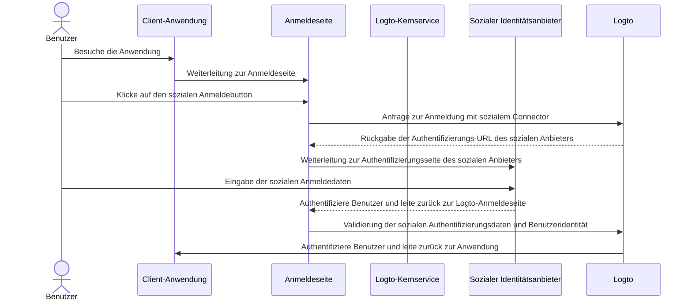
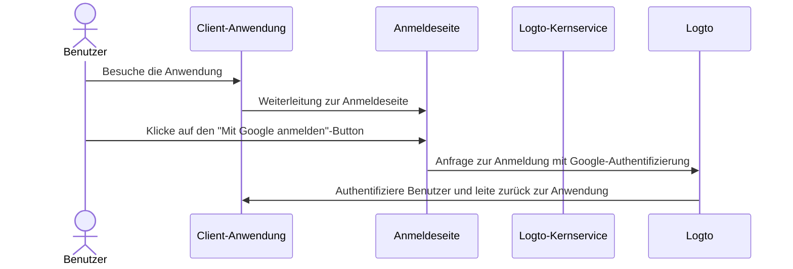

# Soziale Anmeldung

Die soziale Anmeldung ist eine weit verbreitete Authentifizierungsmethode, die es Benutzern ermöglicht, sich mit ihren bestehenden Social-Media-Konten, wie Google, Facebook, Twitter und LinkedIn, anzumelden und zu registrieren.

Vorteile der sozialen Anmeldung:

- **Vereinfachter Onboarding-Prozess**: Die soziale Anmeldung ermöglicht es Benutzern, sich mit einem einzigen Klick anzumelden oder zu registrieren, ohne ein neues Konto erstellen oder sich ein weiteres Passwort merken zu müssen. Dies reduziert Reibung und steigert das Benutzerengagement.
- **Erhöhtes Vertrauen und Sicherheit**: Durch die Nutzung etablierter, vertrauenswürdiger Plattformen wie Google oder Facebook fühlen sich Benutzer in deiner Anwendung sicherer.
- **Anreicherung von Benutzerdaten**: Die soziale Anmeldung ermöglicht es dir, zusätzliche Profilinformationen von der sozialen Plattform zu sammeln, wie Name, E-Mail-Adresse, Profilbild und mehr.

## Soziale Anmeldung implementieren \{#implement-social-sign-in}

1. **Konfiguriere deine sozialen Connectors**:<br/>
   Navigiere zu <CloudLink to="/connectors/social">Konsole > Connectors > Soziale Connectors</CloudLink>. Klicke auf die Schaltfläche „Sozialen Connector hinzufügen“ und finde den sozialen Connector, den du hinzufügen möchtest (z. B. Google oder Github). Siehe unsere Dokumentation für detaillierte Anweisungen zum Hinzufügen eines [sozialen Connectors](/connectors/social-connectors/).
2. **Füge soziale Login-Buttons hinzu**:<br/>
   Standardmäßig wird dein neu hinzugefügter sozialer Connector nicht auf der Anmeldeseite für Endbenutzer sichtbar sein. Um soziale Anmeldebuttons zur Anmeldeseite hinzuzufügen, musst du den sozialen Connector in den Einstellungen der Anmeldeerfahrung aktivieren.

   Navigiere zu <CloudLink to="/sign-in-experience/sign-up-and-sign-in">Konsole > Anmeldeerfahrung > Registrierung und Anmeldung</CloudLink>. Klicke auf die Schaltfläche „Sozialen Connector hinzufügen“, um soziale Login-Buttons auf deinen Registrierungs- und Anmeldeseiten zu integrieren. Verwende Drag-and-Drop, um ihre Reihenfolge in der Benutzeroberfläche anzuordnen.

3. **Lege Optionen zur Kontoverknüpfung fest**:<br/>
   Für neue Benutzer, die sich mit [sozialen Identitäten](/user-management/user-data#social-identities) registrieren, ermöglicht Logto die Verknüpfung ihres sozialen Kontos mit einem bestehenden E-Mail- oder Telefonnummernkonto innerhalb des Logto-Systems. Standardmäßig wird den Benutzern während der sozialen Registrierung eine zugehörige [Kontoverknüpfungsseite](#account-linking) angezeigt, die es ihnen ermöglicht, ihr soziales Konto mit einem bestehenden Konto zu verknüpfen oder ein neues zu erstellen.

   Um diesen Prozess zu vereinfachen, kannst du die Option **Automatische Kontoverknüpfung** in den Einstellungen der Anmeldeerfahrung aktivieren. Dadurch wird das soziale Konto automatisch mit einem bestehenden Konto verknüpft, wenn die E-Mail-Adresse oder Telefonnummer übereinstimmt.

4. **Änderungen speichern**: <br/>
   Überprüfe deine Änderungen sorgfältig und speichere sie, um die Konfiguration anzuwenden.

## Benutzererfahrung der sozialen Anmeldung \{#user-experience-of-social-sign-in}

Mit der sozialen Anmeldung werden die Registrierungs- und Anmeldeprozesse in Logto für Benutzer optimiert.



1. **Anmeldung mit sozialem Konto**: Der Benutzer klickt auf den sozialen Anmeldebutton, der auf der Anmeldeseite angezeigt wird.
2. **Weiterleitung**: Der Benutzer wird zur Authentifizierungsseite des sozialen Identitätsanbieters weitergeleitet.
3. **Soziale Authentifizierung**: Der Benutzer gibt seine sozialen Anmeldedaten ein und authentifiziert sich beim sozialen Anbieter. Wenn der Benutzer bereits beim sozialen Anbieter angemeldet ist, kann er automatisch authentifiziert werden. Wenn mehrere Anmeldesitzungen erkannt werden, kann der Benutzer aufgefordert werden, das richtige Konto auszuwählen (z. B. mehrere Google-Konten).
   :::note
   Google „prompt“-Parameter können im Google-Connector festgelegt werden, sodass du die Benutzererfahrung bei der Auswahl des Kontos und des Zustimmungsbildschirms für die Google-Anmeldung anpassen kannst.
   :::
4. **Rückkehr zu Logto**: Nach erfolgreicher Authentifizierung leitet der soziale Anbieter den Benutzer mit den Authentifizierungsdaten zurück zur Logto-Anmeldeseite.
5. **Validierung der sozialen Identität**: Logto validiert die sozialen Authentifizierungsdaten und die Benutzeridentität. Wenn kein Benutzerkonto mit der sozialen Identität verknüpft ist, wird ein neues Konto erstellt.
6. **Benutzerauthentifizierung**: Logto authentifiziert den Benutzer und leitet ihn zurück zur Client-Anwendung, um den Authentifizierungsprozess abzuschließen.

### Google One-tap \{#google-one-tap}

Logto unterstützt auch die [Google One-tap](https://developers.google.com/identity/gsi/web/guides/features) Anmeldemethode für den Google-Connector, die es Benutzern ermöglicht, sich mit einem einzigen Klick anzumelden. Diese Funktion vereinfacht den Anmeldeprozess weiter, indem sie die Notwendigkeit beseitigt, dass Benutzer zur Google-Authentifizierungsseite weitergeleitet werden.

Um die Google One-tap-Anmeldung zu aktivieren, folge den Anweisungen in den [Google-Connector](/integrations/google) Einstellungen. Sobald aktiviert, sehen Benutzer ein "Mit Google anmelden"-Popup, wenn sie auf der Anmeldeseite landen. Wenn sie darauf klicken, werden sie automatisch mit ihrem Google-Konto authentifiziert und zurück zur Anwendung geleitet.




## Kontoverknüpfung \{#account-linking}

Wie oben erwähnt, ermöglicht Logto Benutzern, ihre sozialen Konten mit bestehenden E-Mail- oder Telefonnummernkonten innerhalb des Logto-Systems zu verknüpfen. Dieser Prozess ist entscheidend, um ein einheitliches Benutzerkonto über verschiedene Authentifizierungsmethoden und Identitätsanbieter hinweg zu erhalten.

- **Neues Konto erstellen**:
  Wenn sich ein Benutzer mit einer [sozialen Identität](/user-management/user-data#social-identities) anmeldet, die im Logto-System nicht existiert, und die angegebene E-Mail-Adresse oder Telefonnummer keinem bestehenden Benutzerkonto entspricht, wird direkt ein neues Konto in Logto erstellt.
- **Bestehende Kontoverknüpfung**:
  Wenn die von der sozialen Identität bereitgestellte E-Mail-Adresse oder Telefonnummer bereits mit einem bestehenden Konto in Logto verknüpft ist, bieten wir einen flexiblen Kontoverknüpfungsprozess an.

  - **Automatische Kontoverknüpfung:** Wenn die Option „Automatische Kontoverknüpfung“ in deinen <CloudLink to="/sign-in-experience/sign-up-and-sign-in">Anmeldeerfahrung</CloudLink> Einstellungen aktiviert ist, wird Logto das soziale Konto automatisch mit dem bestehenden Konto basierend auf einer übereinstimmenden E-Mail-Adresse oder Telefonnummer verknüpfen. Benutzer werden nicht aufgefordert, die Konten zu verknüpfen, und werden sofort in ihr bestehendes Konto eingeloggt. Das soziale Konto wird verknüpft, sodass der Benutzer in Zukunft beide Methoden zur Anmeldung verwenden kann.
  - **Manuelle Kontoverknüpfung**: Wenn die Option „Automatische Kontoverknüpfung“ deaktiviert ist, werden Benutzer während des Anmeldeprozesses aufgefordert, ihr soziales Konto mit dem bestehenden Konto zu verknüpfen. Sie können wählen, ob sie die Konten verknüpfen oder ein neues erstellen möchten.

    

    ```mermaid
    flowchart TD
    A[Authentifizierung mit sozialer Identität] --> B{{Soziale Identität existiert in Logto?}}
    B -- Ja --> C[Angemeldet mit bestehendem Konto]
    B -- Nein --> D{{E-Mail/Telefonnummer stimmt mit einem bestehenden Konto überein?}}
    D -- Ja --> E{{Automatische Kontoverknüpfung aktiviert?}}
    E -- Ja --> G[Verknüpfe soziale Identität mit bestehendem Konto]
    G --> C
    D -- Nein --> H[Erstelle neues Konto und melde dich an]
    E -- Nein --> I{{Soziales Konto verknüpfen?}}
    I -- Ja --> G
    I -- Nein --> H
    ```

:::note
Wenn während des sozialen Registrierungsprozesses ein zugehöriges Konto mit einer E-Mail-Adresse oder Telefonnummer gefunden wird, die mit einem bestehenden Konto übereinstimmt, und der Benutzer sich entscheidet, die Konten nicht zu verknüpfen, wird die E-Mail-Adresse oder Telefonnummer nicht mit dem neuen Konto in Logto synchronisiert. Dies stellt sicher, dass die E-Mail-Adresse und Telefonnummer über alle Benutzerkonten hinweg einzigartig bleiben.

Wenn die E-Mail-Adresse oder Telefonnummer ein erforderlicher Registrierungsidentifikator ist, wird der Benutzer aufgefordert, während des Registrierungsprozesses eine andere E-Mail-Adresse oder Telefonnummer anzugeben. Siehe [Zusätzliche Benutzerprofilinformationen sammeln](#collect-additional-user-profile-data) für weitere Details.
:::

## Zusätzliche Benutzerprofilinformationen sammeln \{#collect-additional-user-profile-data}

Während des sozialen Registrierungsprozesses, abhängig von den von dir konfigurierten obligatorischen Registrierungsidentifikatoren (**E-Mail-Adresse**, **Telefonnummer** und **Benutzername**), können Benutzer aufgefordert werden, zusätzliche verifizierte Informationen bereitzustellen, um den Registrierungs- oder Anmeldeprozess nach der Authentifizierung mit dem sozialen Anbieter abzuschließen.

Zum Beispiel wurden **E-Mail-Adresse** und **Benutzername** als erforderliche Registrierungsidentifikatoren festgelegt:

1. **Registrierung mit sozialer Identität, die eine verifizierte E-Mail-Adresse bereitstellt**

   Wenn eine verifizierte E-Mail-Adresse von der sozialen Identität bereitgestellt wird, wird die E-Mail-Adresse mit dem Benutzerprofil synchronisiert und der Benutzer wird aufgefordert, einen Benutzernamen anzugeben, um den Registrierungsprozess abzuschließen.

   ```mermaid
   flowchart TD
      A[Authentifizierung mit sozialer Identität] --> B{{Enthält verifizierte E-Mail-Adresse?}}
      B -- Ja --> C[Benutzernamen eingeben]
      C --> D[Erfolgreiche Registrierung]
   ```

2. **Registrierung mit sozialer Identität, die keine verifizierte E-Mail-Adresse bereitstellt**

   Wenn die soziale Identität keine verifizierte E-Mail-Adresse bereitstellt, wird der Benutzer während des Registrierungsprozesses aufgefordert, eine E-Mail-Adresse anzugeben. Der Benutzer muss die E-Mail-Adresse verifizieren, indem er einen Bestätigungscode eingibt, der an die angegebene E-Mail-Adresse gesendet wird.

   ```mermaid
   flowchart TD
      A[Authentifizierung mit sozialer Identität] --> B{{Enthält verifizierte E-Mail-Adresse?}}
      B -- Nein --> C[E-Mail-Adresse eingeben]
      C --> D[Bestätigungscode eingeben]
      D --> E[Benutzernamen eingeben]
      E --> F[Erfolgreiche Registrierung]
   ```

3. **Registrierung mit sozialer Identität, die eine registrierte E-Mail-Adresse bereitstellt**

   Wenn die soziale Identität eine E-Mail-Adresse bereitstellt, die bereits im Logto-System registriert ist, wird der Benutzer aufgefordert, das soziale Konto mit dem bestehenden Konto zu verknüpfen oder ein neues Konto zu erstellen. Wenn der Benutzer sich entscheidet, ein neues Konto zu erstellen, wird er aufgefordert, eine neue E-Mail-Adresse anzugeben und zu verifizieren.

   ```mermaid
      flowchart TD
       A[Authentifizierung mit sozialer Identität] --> B{{E-Mail-Adresse stimmt mit einem bestehenden Konto überein?}}
       B -- Ja --> C{{Soziales Konto verknüpfen?}}
       C -- Ja --> D[Verknüpfe soziale Identität mit bestehendem Konto]
       D --> E[Erfolgreiche Anmeldung]
       C -- Nein --> F[Neue E-Mail-Adresse eingeben]
       F --> G[Bestätigungscode eingeben]
       G --> H[Benutzernamen eingeben]
       H --> I[Erfolgreiche Registrierung]
       B -- Nein --> H
   ```

## FAQs \{#faqs}

<details>
  <summary>

### Wie füge ich soziale Login-Buttons hinzu und melde mich direkt mit sozialen Konten auf meiner Website an? \{#how-to-add-social-login-buttons-and-directly-sign-in-with-social-on-my-website}

</summary>

Logto ermöglicht es dir, soziale Login-Buttons zu deiner Website hinzuzufügen und den sozialen Anmeldeprozess direkt zu starten, ohne das Standard-Anmeldeformular anzuzeigen. Sieh dir unseren [Direkte Anmeldung](/end-user-flows/authentication-parameters/direct-sign-in/) Leitfaden für detaillierte Anweisungen an.

</details>

<details>
  <summary>

### Warum werden meine E-Mails oder Telefonnummern nach der Anmeldung mit sozialen Konten nicht angezeigt? \{#why-my-emails-or-phone-numbers-are-not-populated-after-signing-up-with-social}

</summary>

In Logto können die E-Mail-Adresse und Telefonnummer als Anmeldeidentifikator verwendet werden, um Benutzer eindeutig zu identifizieren. Nur verifizierte E-Mail-Adressen und Telefonnummern werden als Identifikatoren akzeptiert. Wenn die soziale Identität den `email_verified` oder `phone_number_verified` Anspruch nicht bereitstellt, wird die E-Mail-Adresse oder Telefonnummer nicht mit dem Benutzerprofil synchronisiert. Du kannst sie dennoch unter den sozialen Identitätsdaten im Benutzerprofil finden.

Die Unterstützung von nicht verifizierten E-Mail-Adressen oder Telefonnummern als Benutzerprofil wird bald verfügbar sein.

</details>

## Verwandte Ressourcen \{#related-resources}

<Url href="https://www.youtube.com/watch?v=sv60N9eW8Ew">Erfahrung mit sozialer Anmeldung</Url>

<Url href="https://blog.logto.io/maximize-google-sign-in-conversions">
  Maximieren der Google-Anmeldekonversionen mit 6 Konfigurationen
</Url>