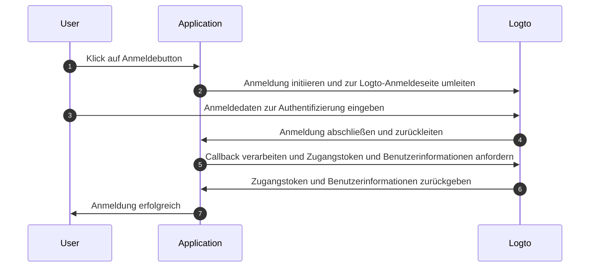
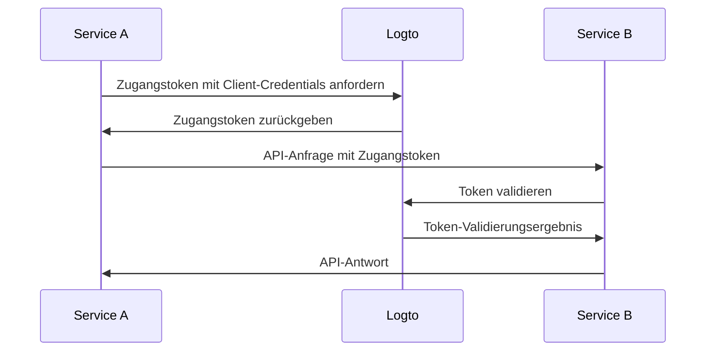

# Authentifizierungsablauf verstehen

Logto basiert auf den Standards [OAuth 2.0](https://auth.wiki/oauth-2.0) und [OpenID Connect (OIDC)](https://auth.wiki/openid-connect). Das Verständnis dieser Authentifizierungsstandards erleichtert den Integrationsprozess und macht ihn einfacher.

### Benutzer-Authentifizierungsablauf \{#user-authentication-flow}

Das passiert, wenn sich ein Benutzer mit Logto anmeldet:

In diesem Ablauf sind mehrere Schlüsselkonzepte für den Integrationsprozess wichtig:

- `Application`: Dies repräsentiert deine App in Logto. Du erstellst eine Anwendungskonfiguration in der Logto-Konsole, um eine Verbindung zwischen deiner tatsächlichen Anwendung und den Logto-Diensten herzustellen. Erfahre mehr über [Application](/integrate-logto/application-data-structure/#introduction).
- `Redirect URI`: Nachdem Benutzer die Authentifizierung auf der Logto-Anmeldeseite abgeschlossen haben, leitet Logto sie über diese URI zurück zu deiner Anwendung. Du musst die Redirect URI in deinen Anwendungseinstellungen konfigurieren. Weitere Details findest du unter [Redirect URIs](/integrate-logto/application-data-structure/#redirect-uris).
- `Handle sign-in callback`: Wenn Logto Benutzer zurück zu deiner Anwendung leitet, muss deine App die Authentifizierungsdaten verarbeiten und Zugangstokens und Benutzerinformationen anfordern. Keine Sorge - das Logto SDK übernimmt dies automatisch.

Diese Übersicht deckt die wesentlichen Punkte für eine schnelle Integration ab. Für ein tieferes Verständnis, schaue dir unseren Leitfaden [Sign-in experience explained](/concepts/sign-in-experience/) an.

### Maschine-zu-Maschine Authentifizierungsablauf \{#machine-to-machine-authentication-flow}

Logto bietet den [Maschine-zu-Maschine (M2M) Anwendungstyp](/quick-starts/m2m) an, um direkte Authentifizierung zwischen Diensten zu ermöglichen, basierend auf dem [OAuth 2.0 Client Credentials Flow](https://auth.wiki/client-credentials-flow):

Dieser Maschine-zu-Maschine (M2M) Authentifizierungsablauf ist für Anwendungen konzipiert, die direkt mit Ressourcen kommunizieren müssen, ohne Benutzerinteraktion (also keine Benutzeroberfläche), wie ein API-Dienst, der Benutzerdaten in Logto aktualisiert, oder ein Statistikdienst, der tägliche Bestellungen abruft.

In diesem Ablauf authentifizieren sich Dienste mit Client-Credentials - einer Kombination aus [Application ID](/integrate-logto/application-data-structure/#application-id) und [Application Secret](/integrate-logto/application-data-structure/#application-secret), die den Dienst eindeutig identifizieren und authentifizieren. Diese Anmeldedaten dienen als Identität des Dienstes, wenn er [Zugangstokens](https://auth.wiki/access-token) von Logto anfordert.

## Verwandte Ressourcen \{#related-resources}

<Url href="https://blog.logto.io/secure-cloud-apps-with-oauth-and-openid-connect">
  Blog: Sichere cloudbasierte Anwendungen mit OAuth 2.0 und OpenID Connect
</Url>

<Url href="https://blog.logto.io/sso-is-better">
  Warum Single Sign-On (SSO) für mehrere Anwendungen besser ist
</Url>

<Url href="https://blog.logto.io/centralized-identity-system">
  Warum du ein zentrales Identitätssystem für ein Multi-App-Geschäft benötigst
</Url>
