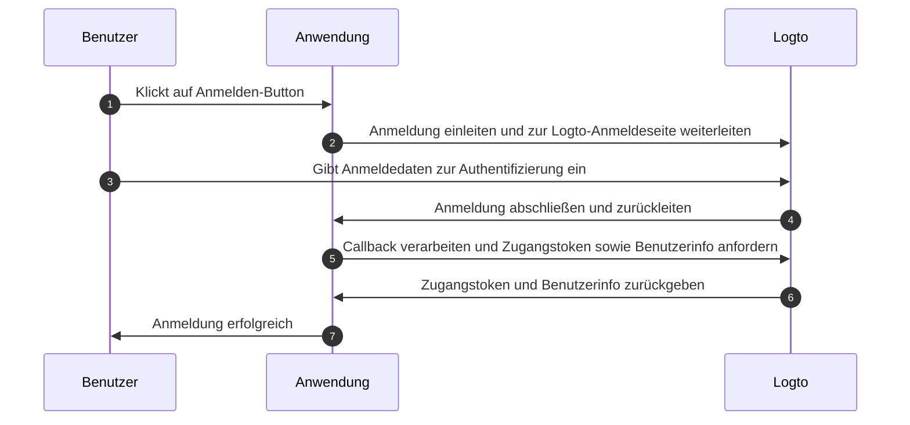
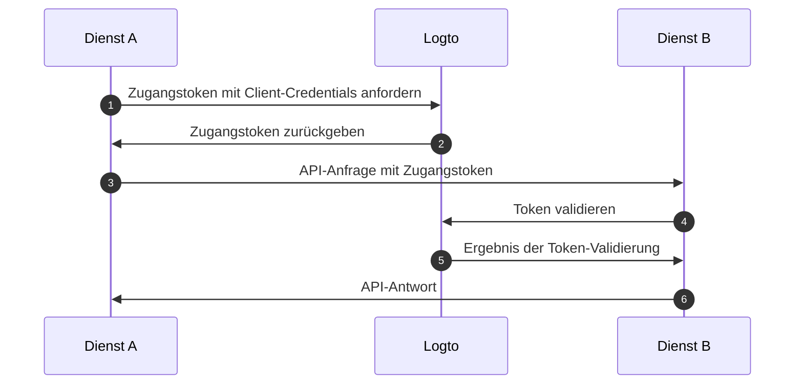
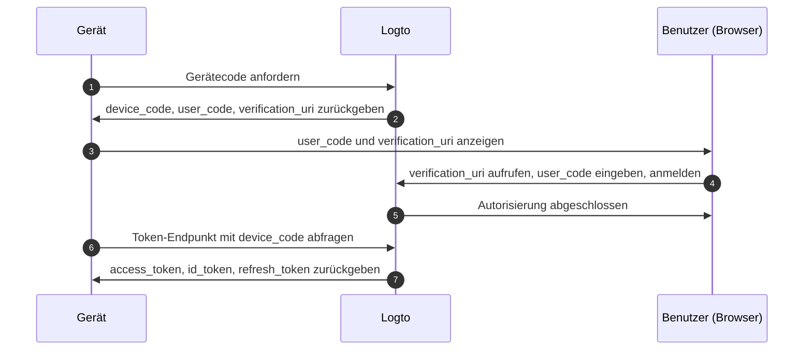
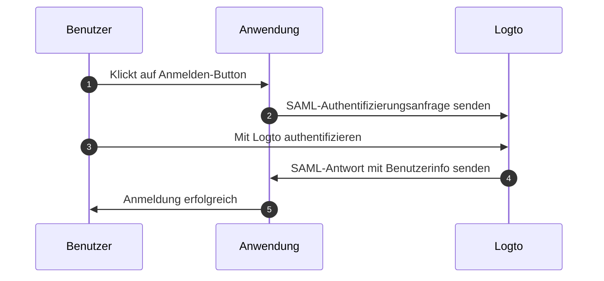

# OIDC-Authentifizierungsfluss verstehen

Logto basiert auf den Standards [OAuth 2.0](https://auth.wiki/oauth-2.0) und [OpenID Connect (OIDC)](https://auth.wiki/openid-connect). Das Verständnis dieser Authentifizierungsstandards macht den Integrationsprozess reibungsloser und unkomplizierter.

### Benutzer-Authentifizierungsfluss \{#user-authentication-flow}

So läuft es ab, wenn sich ein Benutzer mit Logto anmeldet:

```mermaid
sequenceDiagram
    autonumber
    participant Benutzer
    participant Anwendung
    participant Logto

    Benutzer->>Anwendung: Klickt auf Anmelden-Button
    Anwendung->>Logto: Anmeldung einleiten und zur Logto-Anmeldeseite weiterleiten
    Benutzer->>Logto: Gibt Anmeldedaten zur Authentifizierung ein
    Logto->>Anwendung: Anmeldung abschließen und zurückleiten
    Anwendung->>Logto: Callback verarbeiten und Zugangstoken sowie Benutzerinfo anfordern
    Logto->>Anwendung: Zugangstoken und Benutzerinfo zurückgeben
    Anwendung->>Benutzer: Anmeldung erfolgreich
```

In diesem Ablauf sind mehrere Schlüsselkonzepte für den Integrationsprozess wichtig:

- `Anwendung`: Dies repräsentiert deine App in Logto. Du erstellst eine Anwendungskonfiguration in der Logto-Konsole, um eine Verbindung zwischen deiner tatsächlichen Anwendung und den Logto-Diensten herzustellen. Erfahre mehr über [Application](/integrate-logto/application-data-structure/#introduction).
- `Redirect URI`: Nachdem Benutzer die Authentifizierung auf der Logto-Anmeldeseite abgeschlossen haben, leitet Logto sie über diese URI zurück zu deiner Anwendung. Du musst die Redirect URI in deinen Anwendungseinstellungen konfigurieren. Weitere Details findest du unter [Redirect URIs](/integrate-logto/application-data-structure/#redirect-uris).
- `Sign-in Callback verarbeiten`: Wenn Logto Benutzer zurück zu deiner Anwendung leitet, muss deine App die Authentifizierungsdaten verarbeiten und Zugangstokens sowie Benutzerinformationen anfordern. Keine Sorge – das Logto SDK übernimmt dies automatisch.

Diese Übersicht deckt das Wesentliche für eine schnelle Integration ab. Für ein tieferes Verständnis schaue dir unseren Leitfaden [Anmeldeerfahrung erklärt](/concepts/sign-in-experience/) an.

### Maschine-zu-Maschine-Authentifizierungsfluss \{#machine-to-machine-authentication-flow}

Logto bietet den [Maschine-zu-Maschine (M2M) Anwendungstyp](/quick-starts/m2m) an, um eine direkte Authentifizierung zwischen Diensten zu ermöglichen, basierend auf dem [OAuth 2.0 Client Credentials Flow](https://auth.wiki/client-credentials-flow):

```mermaid
sequenceDiagram
    autonumber
    participant Dienst A
    participant Logto
    participant Dienst B

    Dienst A->>Logto: Zugangstoken mit Client-Credentials anfordern
    Logto->>Dienst A: Zugangstoken zurückgeben
    Dienst A->>Dienst B: API-Anfrage mit Zugangstoken
    Dienst B->>Logto: Token validieren
    Logto->>Dienst B: Ergebnis der Token-Validierung
    Dienst B->>Dienst A: API-Antwort
```

Dieser Maschine-zu-Maschine (M2M) Authentifizierungsfluss ist für Anwendungen konzipiert, die direkt mit Ressourcen kommunizieren müssen, ohne Benutzerinteraktion (also ohne UI), wie z. B. ein API-Dienst, der Benutzerdaten in Logto aktualisiert, oder ein Statistikdienst, der tägliche Bestellungen abruft.

In diesem Ablauf authentifizieren sich Dienste mit Client-Credentials – einer Kombination aus [Application ID](/integrate-logto/application-data-structure/#application-id) und [Application Secret](/integrate-logto/application-data-structure/#application-secret), die den Dienst eindeutig identifizieren und authentifizieren. Diese Zugangsdaten dienen als Identität des Dienstes, wenn [Zugangstokens](https://auth.wiki/access-token) von Logto angefordert werden.

### Gerätefluss (geräte mit eingeschränkter Eingabe) \{#device-flow}

Für Geräte mit eingeschränkten Eingabemöglichkeiten (z. B. Smart-TVs, Spielkonsolen, CLI-Tools, IoT-Geräte) unterstützt Logto den [OAuth 2.0 Device Authorization Grant](https://auth.wiki/device-flow). Das Gerät zeigt einen Code und eine URL an, während der Benutzer die Authentifizierung auf einem separaten Gerät mit Browser abschließt:

```mermaid
sequenceDiagram
    autonumber
    participant Gerät
    participant Logto
    participant Benutzer as Benutzer (Browser)

    Gerät->>Logto: Gerätecode anfordern
    Logto->>Gerät: device_code, user_code, verification_uri zurückgeben
    Gerät->>Benutzer: user_code und verification_uri anzeigen
    Benutzer->>Logto: verification_uri aufrufen, user_code eingeben, anmelden
    Logto->>Benutzer: Autorisierung abgeschlossen
    Gerät->>Logto: Token-Endpunkt mit device_code abfragen
    Logto->>Gerät: access_token, id_token, refresh_token zurückgeben
```

In diesem Ablauf:

- Das Gerät fordert einen Gerätecode von Logto an und erhält einen kurzen `user_code` sowie eine `verification_uri`.
- Der Benutzer besucht die Verifizierungs-URL auf einem anderen Gerät (Handy, Laptop), gibt den Code ein und meldet sich an.
- Das Gerät fragt den Token-Endpunkt ab, bis der Benutzer die Autorisierung abgeschlossen hat, und erhält dann Tokens.

Im Gegensatz zum Standard-Benutzerfluss benötigt der Gerätefluss keine Redirect URIs oder Browser-Fähigkeiten auf dem Gerät selbst. Erfahre mehr im [Gerätefluss Quick Start](/quick-starts/device-flow).

### SAML-Authentifizierungsfluss \{#saml-authentication-flow}

Neben OAuth 2.0 und OIDC unterstützt Logto auch SAML (Security Assertion Markup Language) Authentifizierung und agiert als Identitätsanbieter (IdP), um die Integration mit Unternehmensanwendungen zu ermöglichen. Derzeit unterstützt Logto den SP-initiierten Authentifizierungsfluss:

#### SP-initiierter Fluss \{#saml-authentication-flow-sp-init}

Beim SP-initiierten Fluss startet der Authentifizierungsprozess beim Service Provider (deiner Anwendung):

```mermaid
sequenceDiagram
    autonumber
    participant Benutzer
    participant Anwendung
    participant Logto

    Benutzer->>Anwendung: Klickt auf Anmelden-Button
    Anwendung->>Logto: SAML-Authentifizierungsanfrage senden
    Benutzer->>Logto: Mit Logto authentifizieren
    Logto->>Anwendung: SAML-Antwort mit Benutzerinfo senden
    Anwendung->>Benutzer: Anmeldung erfolgreich
```

In diesem Ablauf:

- Der Benutzer startet den Authentifizierungsprozess von deiner Anwendung (Service Provider) aus
- Deine Anwendung generiert eine SAML-Anfrage und leitet den Benutzer zu Logto (Identitätsanbieter) weiter
- Nach erfolgreicher Authentifizierung bei Logto wird eine SAML-Antwort an deine Anwendung gesendet
- Deine Anwendung verarbeitet die SAML-Antwort und schließt die Authentifizierung ab

#### IdP-initiierter Fluss \{#saml-authentication-flow-idp-init}

Logto wird den IdP-initiierten Fluss in zukünftigen Versionen unterstützen, sodass Benutzer den Authentifizierungsprozess direkt vom Logto-Portal aus starten können. Bleibe für Updates zu diesem Feature dran.

Diese SAML-Integration ermöglicht es Unternehmensanwendungen, Logto als Identitätsanbieter zu nutzen und unterstützt sowohl moderne als auch ältere SAML-basierte Service Provider.

## Verwandte Ressourcen \{#related-resources}

<Url href="https://blog.logto.io/secure-cloud-apps-with-oauth-and-openid-connect">
  Blog: Cloud-basierte Anwendungen mit OAuth 2.0 und OpenID Connect absichern
</Url>

<Url href="https://blog.logto.io/sso-is-better">
  Warum Single Sign-On (SSO) für mehrere Anwendungen besser ist
</Url>

<Url href="https://blog.logto.io/centralized-identity-system">
  Warum du ein zentrales Identitätssystem für ein Multi-App-Unternehmen benötigst
</Url>
