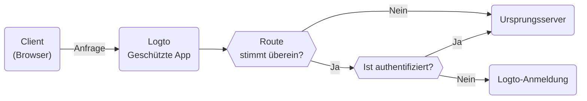

# Geschützte App

Die Geschützte App ist darauf ausgelegt, die Komplexität von [SDK-Integrationen](/quick-starts) zu beseitigen, indem sie die [Authentifizierung](https://auth.wiki/authentication) von deiner Anwendung trennt. Wir übernehmen die Authentifizierung, sodass du dich auf deine Kernfunktionen konzentrieren kannst. Sobald ein Benutzer authentifiziert ist, liefert die Geschützte App die Inhalte von deinem Server aus.

## Wie die Geschützte App funktioniert

Die Geschützte App, betrieben von Cloudflare, arbeitet weltweit auf Edge-Netzwerken und gewährleistet niedrige Latenzzeiten und hohe Verfügbarkeit für deine Anwendung.

Die Geschützte App verwaltet den Sitzungsstatus und die Benutzerinformationen. Wenn ein Benutzer nicht authentifiziert ist, leitet die Geschützte App ihn zur Anmeldeseite weiter. Sobald er authentifiziert ist, ergänzt die Geschützte App die Anfrage des Benutzers mit Authentifizierungs- und Benutzerinformationen und leitet sie dann an den Ursprungsserver weiter.

Dieser Prozess wird im folgenden Flussdiagramm visualisiert:



## Schütze deinen Ursprungsserver

Der Ursprungsserver, der entweder ein physisches oder virtuelles Gerät sein kann, das nicht von Logtos Geschützter App verwaltet wird, ist der Ort, an dem deine Anwendungsinhalte gespeichert sind. Ähnlich wie ein Content Delivery Network (CDN)-Server verwaltet die Geschützte App Authentifizierungsprozesse und ruft Inhalte von deinem Ursprungsserver ab. Daher können Benutzer, die direkten Zugriff auf deinen Ursprungsserver erhalten, die Authentifizierung umgehen, und deine Anwendung ist nicht mehr geschützt.

Es ist also wichtig, Ursprungsverbindungen zu sichern, um zu verhindern, dass Angreifer deinen Ursprungsserver ohne Authentifizierung entdecken und darauf zugreifen. Es gibt mehrere Möglichkeiten, dies zu tun:

1. HTTP-Header-Validierung
2. JSON Web Tokens (JWT) Validierung

### HTTP-Header-Validierung

Die Sicherung deines Ursprungsservers kann durch die Verwendung von [HTTP Basic Authentication](https://developer.mozilla.org/en-US/docs/Web/HTTP/Authentication#basic_authentication_scheme) erreicht werden, um deinen Ursprungsserver zu sichern.

Jede Anfrage von der Geschützten App enthält den folgenden Header:

```
Authorization: Basic base64(appId:appSecret)
```

Durch die Validierung dieses Headers kannst du bestätigen, dass die Anfrage von der Geschützten App stammt und alle Anfragen ablehnen, die diesen Header nicht enthalten.

Wenn du Nginx oder Apache verwendest, kannst du die folgenden Anleitungen zur Implementierung von HTTP Basic Authentication auf deinem Ursprungsserver verwenden:

1. Nginx: [Konfigurieren von HTTP Basic Authentication](https://docs.nginx.com/nginx/admin-guide/security-controls/configuring-http-basic-authentication/)
2. Apache: [Authentifizierung und Autorisierung](https://httpd.apache.org/docs/2.4/howto/auth.html)

Um die Header innerhalb deiner Anwendung zu überprüfen, kannst du das von Cloudflare bereitgestellte [HTTP Basic Authentication Beispiel](https://developers.cloudflare.com/workers/examples/basic-auth/) verwenden, um zu lernen, wie man den Zugriff mit dem HTTP Basic Schema einschränkt.

### JSON Web Tokens (JWT) Validierung

Eine weitere Möglichkeit, deinen Ursprungsserver zu sichern, ist die Verwendung von JSON Web Tokens (JWT).

Jede authentifizierte Anfrage von der Geschützten App enthält den folgenden Header:

```
Logto-ID-Token: <JWT>
```

Das JWT wird [ID-Token](https://auth.wiki/id-token) genannt, das von Logto signiert ist und Benutzerinformationen enthält. Durch die Validierung dieses JWT kannst du bestätigen, dass die Anfrage von der Geschützten App stammt und alle Anfragen ablehnen, die diesen Header nicht enthalten.

Das Token ist als [JWS](https://auth.wiki/jws) Token verschlüsselt und signiert.

Die Validierungsschritte:

1. [Validierung eines JWT](https://datatracker.ietf.org/doc/html/rfc7519#section-7.2)
2. [Validierung der JWS-Signatur](https://datatracker.ietf.org/doc/html/rfc7515#section-5.2)
3. Der Aussteller des Tokens ist `https://<your-logto-domain>/oidc` (ausgestellt von deinem Logto-Auth-Server)

```js
const express = require('express');
const jwksClient = require('jwks-rsa');
const jwt = require('jsonwebtoken');

const ISSUER = 'https://<your-logto-domain>/oidc';
const CERTS_URL = 'https://<your-logto-domain>/oidc/jwks';

const client = jwksClient({
  jwksUri: CERTS_URL,
});

const getKey = (header, callback) => {
  client.getSigningKey(header.kid, function (err, key) {
    callback(err, key?.getPublicKey());
  });
};

const verifyToken = (req, res, next) => {
  const token = req.headers['Logto-ID-Token'];

  // Stelle sicher, dass die eingehende Anfrage unseren Token-Header hat
  if (!token) {
    return res
      .status(403)
      .send({ status: false, message: 'fehlender erforderlicher Logto-ID-Token-Header' });
  }

  jwt.verify(token, getKey, { issuer: ISSUER }, (err, decoded) => {
    if (err) {
      return res.status(403).send({ status: false, message: 'ungültiges ID-Token' });
    }

    req.user = decoded;
    next();
  });
};

const app = express();

app.use(verifyToken);

app.get('/', (req, res) => {
  res.send('Hallo Welt!');
});

app.listen(3000);
```

## Authentifizierungsstatus und Benutzerinformationen abrufen

Wenn du Authentifizierungs- und Benutzerinformationen für deine Anwendung benötigst, kannst du auch den `Logto-ID-Token` Header verwenden.

Wenn du das Token nur dekodieren möchtest, kannst du den folgenden Code verwenden:

```js
const express = require('express');

const decodeIdToken = (req, res, next) => {
  const token = req.headers['Logto-ID-Token'];

  if (!token) {
    return res.status(403).send({
      status: false,
      message: 'fehlender erforderlicher Logto-ID-Token-Header',
    });
  }

  const parts = token.split('.');
  if (parts.length !== 3) {
    throw new Error('Ungültiges ID-Token');
  }

  const payload = parts[1];
  const decodedPayload = atob(payload.replace(/-/g, '+').replace(/_/g, '/'));
  const claims = JSON.parse(decodedPayload);

  req.user = claims;
  next();
};

const app = express();

app.use(decodeIdToken);

app.get('/', (req, res) => {
  res.json(req.user);
});

app.listen(3000);
```

## Den ursprünglichen Host abrufen

Wenn du den ursprünglichen Host, der vom Client angefordert wurde, abrufen musst, kannst du den `Logto-Host` oder `x-forwarded-host` Header verwenden.

## Authentifizierungsregeln anpassen

Standardmäßig schützt die Geschützte App alle Routen. Wenn du die Authentifizierungsregeln anpassen musst, kannst du das Feld "Benutzerdefinierte Authentifizierungsregeln" in der Konsole festlegen.

Es unterstützt reguläre Ausdrücke, hier sind zwei Fallbeispiele:

1. Um nur die Routen `/admin` und `/privacy` mit Authentifizierung zu schützen: `^/(admin|privacy)/.*`
2. Um JPG-Bilder von der Authentifizierung auszuschließen: `^(?!.*\.jpg$).*$`

## Lokale Entwicklung

Die Geschützte App ist darauf ausgelegt, mit deinem Ursprungsserver zu arbeiten. Wenn dein Ursprungsserver jedoch nicht öffentlich zugänglich ist, kannst du ein Tool wie [ngrok](https://ngrok.com/) oder [Cloudflare Tunnels](https://developers.cloudflare.com/pages/how-to/preview-with-cloudflare-tunnel/) verwenden, um deinen lokalen Server im Internet verfügbar zu machen.

## Übergang zur SDK-Integration

Die Geschützte App ist darauf ausgelegt, den Authentifizierungsprozess zu vereinfachen. Wenn du jedoch zur SDK-Integration wechseln möchtest, um mehr Kontrolle und Anpassungsmöglichkeiten zu haben, kannst du [eine neue Anwendung erstellen](/integrate-logto/integrate-logto-into-your-application) in Logto und die [SDK-Integration](/quick-starts) konfigurieren. Für einen reibungslosen Übergang kannst du die Anwendungsconfigs von der Geschützten App wiederverwenden. Die Geschützte App ist tatsächlich eine "Traditionelle Web-App" in Logto, du kannst die "[AppId](/integrate-logto/application-data-structure#application-id)" und "[AppSecret](/integrate-logto/application-data-structure#application-secret)" in den Anwendungseinstellungen finden. Nachdem der Übergang abgeschlossen ist, kannst du die Geschützte App aus deiner Anwendung entfernen.
