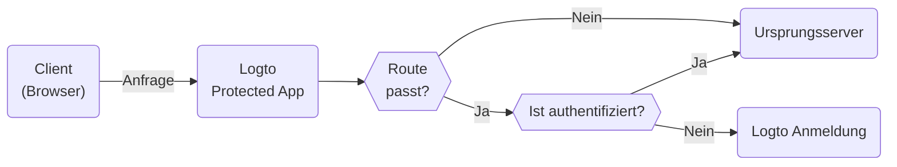

# Protected App — Nicht-SDK Authentifizierungsintegration

Die Protected App wurde entwickelt, um die Komplexität von [SDK-Integrationen](/quick-starts) zu beseitigen, indem die [Authentifizierung (Authentication)](https://auth.wiki/authentication) von deiner Anwendung getrennt wird. Wir übernehmen die Authentifizierung, sodass du dich auf deine Kernfunktionalität konzentrieren kannst. Sobald ein Benutzer authentifiziert ist, liefert die Protected App die Inhalte von deinem Server aus.

## Wie Protected App funktioniert \{#how-protected-app-works}

Die Protected App, unterstützt durch Cloudflare, arbeitet global auf Edge-Netzwerken und sorgt so für geringe Latenz und hohe Verfügbarkeit deiner Anwendung.

Die Protected App verwaltet den Sitzungsstatus und die Benutzerinformationen. Ist ein Benutzer nicht authentifiziert, leitet die Protected App ihn zur Anmeldeseite weiter. Nach erfolgreicher Authentifizierung versieht die Protected App die Anfrage des Benutzers mit Authentifizierungs- und Benutzerinformationen und leitet sie dann an den Ursprungsserver weiter.

Um einzuschränken, welche authentifizierten Benutzer auf eine Protected App zugreifen können, konfiguriere die [App-Ebene Zugangskontrolle](/integrate-logto/app-level-access-control) im **Regeln**-Tab der Anwendung.

Dieser Prozess wird im folgenden Flussdiagramm visualisiert:


```mermaid
graph LR
  A("Client<br/>(Browser)") -->|Anfrage| B(Logto<br/>Protected App)
  B --> Condition{{Route<br/>passt?}}
  Condition -->|Ja| Matched{{Ist authentifiziert?}}
  Matched -->|Ja| C(Ursprungsserver)
  Matched -->|Nein| D(Logto Anmeldung)
  Condition -->|Nein| C
```

## Schütze deinen Ursprungsserver \{#protect-your-origin-server}

Der Ursprungsserver, der entweder ein physisches oder virtuelles Gerät sein kann und nicht der Protected App von Logto gehört, ist der Ort, an dem deine Anwendungsinhalte liegen. Ähnlich wie ein Content Delivery Network (CDN)-Server verwaltet die Protected App Authentifizierungsprozesse und ruft Inhalte von deinem Ursprungsserver ab. Wenn Benutzer jedoch direkten Zugriff auf deinen Ursprungsserver erhalten, können sie die Authentifizierung umgehen und deine Anwendung ist nicht mehr geschützt.

Daher ist es wichtig, Ursprungsverbindungen abzusichern, um zu verhindern, dass Angreifer deinen Ursprungsserver ohne Authentifizierung entdecken und darauf zugreifen. Es gibt mehrere Möglichkeiten, dies zu tun:

1. HTTP-Header-Validierung
2. JSON Web Token (JWT)-Validierung

### HTTP-Header-Validierung \{#http-header-validation}

Die Absicherung deines Ursprungsservers kann durch [HTTP Basic Authentifizierung](https://developer.mozilla.org/en-US/docs/Web/HTTP/Authentication#basic_authentication_scheme) erfolgen.

Jede Anfrage von der Protected App enthält folgenden Header:

```
Authorization: Basic base64(appId:appSecret)
```

Durch die Validierung dieses Headers kannst du bestätigen, dass die Anfrage von der Protected App stammt, und alle Anfragen ablehnen, die diesen Header nicht enthalten.

Wenn du Nginx oder Apache verwendest, kannst du dich an den folgenden Anleitungen orientieren, um HTTP Basic Authentifizierung auf deinem Ursprungsserver zu implementieren:

1. Nginx: [HTTP Basic Authentifizierung konfigurieren](https://docs.nginx.com/nginx/admin-guide/security-controls/configuring-http-basic-authentication/)
2. Apache: [Authentifizierung und Autorisierung](https://httpd.apache.org/docs/2.4/howto/auth.html)

Um die Header innerhalb deiner Anwendung zu prüfen, siehe das [HTTP Basic Authentication Beispiel](https://developers.cloudflare.com/workers/examples/basic-auth/) von Cloudflare, um zu lernen, wie du den Zugriff mit dem HTTP Basic Schema einschränkst.

### JSON Web Token (JWT)-Validierung \{#json-web-tokens-jwt-validation}

Eine weitere Möglichkeit, deinen Ursprungsserver abzusichern, ist die Verwendung von JSON Web Tokens (JWT).

Jede authentifizierte Anfrage von der Protected App enthält folgenden Header:

```
Logto-ID-Token: <JWT>
```

Das JWT wird als [ID-Token (ID token)](https://auth.wiki/id-token) bezeichnet, das von Logto signiert ist und Benutzerinformationen enthält. Durch die Validierung dieses JWT kannst du bestätigen, dass die Anfrage von der Protected App stammt, und alle Anfragen ablehnen, die diesen Header nicht enthalten.

Das Token ist verschlüsselt und als [JWS](https://auth.wiki/jws)-Token signiert.

Die Validierungsschritte:

1. [Ein JWT validieren](https://datatracker.ietf.org/doc/html/rfc7519#section-7.2)
2. [Die JWS-Signatur validieren](https://datatracker.ietf.org/doc/html/rfc7515#section-5.2)
3. Der Aussteller (Issuer) des Tokens ist `https://<your-logto-domain>/oidc` (ausgestellt von deinem Logto Auth-Server)

```js
const express = require('express');
const jwksClient = require('jwks-rsa');
const jwt = require('jsonwebtoken');

const ISSUER = 'https://<your-logto-domain>/oidc';
const CERTS_URL = 'https://<your-logto-domain>/oidc/jwks';

const client = jwksClient({
  jwksUri: CERTS_URL,
});

const getKey = (header, callback) => {
  client.getSigningKey(header.kid, function (err, key) {
    callback(err, key?.getPublicKey());
  });
};

const verifyToken = (req, res, next) => {
  const token = req.headers['Logto-ID-Token'];

  // Stelle sicher, dass die eingehende Anfrage unseren Token-Header enthält
  if (!token) {
    return res
      .status(403)
      .send({ status: false, message: 'fehlender erforderlicher Logto-ID-Token Header' });
  }

  jwt.verify(token, getKey, { issuer: ISSUER }, (err, decoded) => {
    if (err) {
      return res.status(403).send({ status: false, message: 'ungültiges ID-Token' });
    }

    req.user = decoded;
    next();
  });
};

const app = express();

app.use(verifyToken);

app.get('/', (req, res) => {
  res.send('Hallo Welt!');
});

app.listen(3000);
```

## Authentifizierungsstatus und Benutzerinformationen abrufen \{#get-authentication-state-and-user-information}

Wenn du Authentifizierungs- und Benutzerinformationen für deine Anwendung benötigst, kannst du ebenfalls den `Logto-ID-Token` Header verwenden.

Wenn du das Token nur dekodieren möchtest, kannst du folgenden Code verwenden:

```js
const express = require('express');

const decodeIdToken = (req, res, next) => {
  const token = req.headers['Logto-ID-Token'];

  if (!token) {
    return res.status(403).send({
      status: false,
      message: 'fehlender erforderlicher Logto-ID-Token Header',
    });
  }

  const parts = token.split('.');
  if (parts.length !== 3) {
    throw new Error('Ungültiges ID-Token');
  }

  const payload = parts[1];
  const decodedPayload = atob(payload.replace(/-/g, '+').replace(/_/g, '/'));
  const claims = JSON.parse(decodedPayload);

  req.user = claims;
  next();
};

const app = express();

app.use(decodeIdToken);

app.get('/', (req, res) => {
  res.json(req.user);
});

app.listen(3000);
```

## ID-Token-Claims anpassen \{#customize-id-token-claims}

Standardmäßig enthält der `Logto-ID-Token` Header die Standard-OIDC-Ansprüche (Claims) (zum Beispiel `sub`, `name` und `email`). Um [erweiterte Ansprüche (extended claims)](/developers/custom-id-token#extended-claims) wie Rollen oder Organisationsdaten einzuschließen, müssen beide folgenden Einstellungen konfiguriert werden:

1. **Tenant-Umschalter**: Aktiviere den Anspruch in <CloudLink to="/customize-jwt">Konsole > Custom JWT > ID-Token</CloudLink>.
2. **Protected App Scopes**: Wähle in deinen Protected App Einstellungen den passenden Scope unter **ID-Token-Claims** > **Zusätzliche Scopes** aus.

Erweiterte Ansprüche werden nur dann im weitergeleiteten ID-Token enthalten, wenn der Anspruch in Custom JWT aktiviert ist und der entsprechende Scope für die Protected App ausgewählt wurde. Siehe [Custom ID-Token](/developers/custom-id-token) für die vollständige Liste der erweiterten Scopes und Claims.

| Scope                                | Claims                               |
| ------------------------------------ | ------------------------------------ |
| `custom_data`                        | `custom_data`                        |
| `identities`                         | `identities`, `sso_identities`       |
| `roles`                              | `roles`                              |
| `urn:logto:scope:organizations`      | `organizations`, `organization_data` |
| `urn:logto:scope:organization_roles` | `organization_roles`                 |

## Den ursprünglichen Host abrufen \{#get-the-original-host}

Wenn du den ursprünglichen Host benötigst, der vom Client angefragt wurde, kannst du den `Logto-Host` oder `x-forwarded-host` Header verwenden.

## Authentifizierungsregeln anpassen \{#customize-authentication-rules}

Standardmäßig schützt die Protected App alle Routen. Wenn du die Authentifizierungsregeln anpassen möchtest, kannst du das Feld "Benutzerdefinierte Authentifizierungsregeln" in der Konsole setzen.

Es werden reguläre Ausdrücke unterstützt, hier zwei Anwendungsfälle:

1. Um nur die Routen `/admin` und `/privacy` mit Authentifizierung zu schützen: `^/(admin|privacy)/.*`
2. Um JPG-Bilder von der Authentifizierung auszuschließen: `^(?!.*\.jpg$).*$`

## Lokale Entwicklung \{#local-development}

Die Protected App ist darauf ausgelegt, mit deinem Ursprungsserver zu arbeiten. Wenn dein Ursprungsserver jedoch nicht öffentlich zugänglich ist, kannst du ein Tool wie [ngrok](https://ngrok.com/) oder [Cloudflare Tunnels](https://developers.cloudflare.com/pages/how-to/preview-with-cloudflare-tunnel/) verwenden, um deinen lokalen Server im Internet verfügbar zu machen.

## Umstieg auf SDK-Integration \{#transition-to-sdk-integration}

Die Protected App wurde entwickelt, um den Authentifizierungsprozess zu vereinfachen. Wenn du jedoch für mehr Kontrolle und Anpassung auf eine SDK-Integration umsteigen möchtest, kannst du in Logto [eine neue Anwendung erstellen](/integrate-logto/integrate-logto-into-your-application) und die [SDK-Integration](/quick-starts) konfigurieren. Für einen reibungslosen Übergang kannst du die Anwendungskonfigurationen aus der Protected App wiederverwenden. Die Protected App ist tatsächlich eine "Traditionelle Web-App" in Logto, du findest die "[AppId](/integrate-logto/application-data-structure#application-id)" und den "[AppSecret](/integrate-logto/application-data-structure#application-secret)" in den Anwendungseinstellungen. Nach Abschluss des Umstiegs kannst du die Protected App aus deiner Anwendung entfernen.

## Verwandte Ressourcen \{#related-resources}

<Url href="https://www.youtube.com/watch?v=ZBrXW3iZyKY">
  Protected App: Baue die Authentifizierung deiner App in wenigen Klicks. Kein Code erforderlich.
</Url>

<Url href="https://blog.logto.io/protected-app">Die Motivation hinter der Protected App</Url>

<Url href="https://blog.logto.io/fastest-way-to-build-auth-system">
  Der schnellste Weg, ein Authentifizierungssystem zu bauen
</Url>
