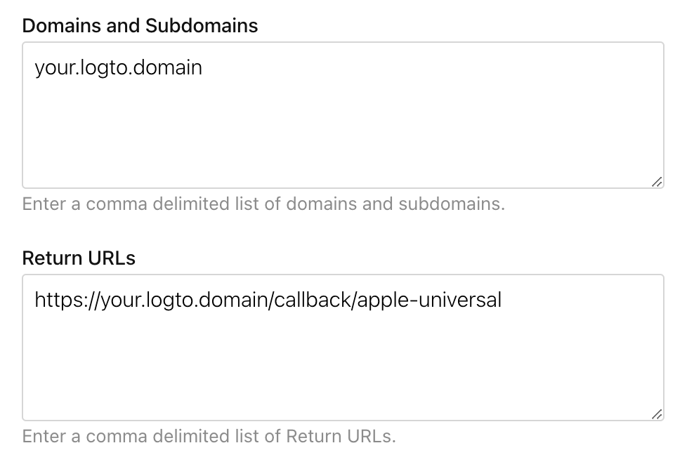

import GuideTip from '../../fragments/_guide-tip.mdx';

# Soziale Anmeldung mit Apple einrichten

Der offizielle Logto-Connector für die soziale Anmeldung mit Apple.

<GuideTip />

## Erste Schritte

Wenn du das Konzept des Connectors nicht kennst oder nicht weißt, wie du diesen Connector zu deiner Anmeldeerfahrung hinzufügen kannst, sieh dir bitte das [Logto-Tutorial](/connectors/social-connectors) an.

> ℹ️ **Hinweis**
>
> Die Anmeldung mit Apple ist für den AppStore erforderlich, wenn du andere soziale Anmeldemethoden in deiner App hast.
> Eine Anmeldung mit Apple auf Android-Geräten ist großartig, wenn du auch eine Android-App anbietest.

Du musst dich beim [Apple Developer Program](https://developer.apple.com/programs/) anmelden, bevor du fortfährst.

### Anmeldung mit Apple für deine App aktivieren

> ⚠️ **Vorsicht**
>
> Selbst wenn du die Anmeldung mit Apple nur in einer Web-App implementieren möchtest, musst du dennoch eine bestehende App haben, die das AppStore-Ökosystem umfasst (d. h. eine gültige App-ID haben).

Du kannst dies über Xcode -> Projekteinstellungen -> Signing & Capabilities tun oder [Certificates, Identifiers & Profiles](https://developer.apple.com/account/resources/identifiers/list/bundleId) besuchen.

Siehe den Abschnitt "Enable an App ID" in den [offiziellen Apple-Dokumenten](https://developer.apple.com/documentation/sign_in_with_apple/configuring_your_environment_for_sign_in_with_apple) für weitere Informationen.

### Einen Identifikator erstellen

1. Besuche [Certificates, Identifiers & Profiles](https://developer.apple.com/account/resources/identifiers/list/serviceId) und klicke auf die "+"-Schaltfläche neben "Identifier".
2. Auf der Seite "Register a new identifier" wähle "Services IDs" und klicke auf "Continue".
3. Fülle "Description" und "Identifier" aus (z. B. `Logto Test` und `io.logto.test`), dann klicke auf "Continue".
4. Überprüfe die Informationen und klicke auf "Register".

### Anmeldung mit Apple für deinen Identifikator aktivieren

Klicke auf den gerade erstellten Identifikator. Aktiviere "Sign in with Apple" auf der Detailseite und klicke auf "Configure".

Im sich öffnenden Modal wähle die App-ID, die du gerade für die Anmeldung mit Apple aktiviert hast.

Gib die Domain deiner Logto-Instanz ohne Protokoll und Port ein, z. B. `your.logto.domain`; gib dann die "Return URL" ein (d. h. Redirect URI), die die Logto-URL mit `/callback/${connector_id}` ist, z. B. `https://your.logto.domain/callback/apple-universal`. Du kannst die zufällig generierte `connector_id` erhalten, nachdem du den Apple-Connector in der Admin-Konsole erstellt hast.

Klicke auf "Next" und dann auf "Done", um das Modal zu schließen. Klicke auf "Continue" in der oberen rechten Ecke und dann auf "Save", um deine Konfiguration zu speichern.

> ⚠️ **Vorsicht**
>
> Apple erlaubt KEINE Return-URLs mit HTTP-Protokoll und `localhost`-Domain.
>
> Wenn du lokal testen möchtest, musst du die Datei `/etc/hosts` bearbeiten, um localhost einer benutzerdefinierten Domain zuzuordnen und eine lokale HTTPS-Umgebung einrichten. [mkcert](https://github.com/FiloSottile/mkcert) kann dir beim Einrichten von lokalem HTTPS helfen.

## Berechtigung konfigurieren

Um die E-Mail des Benutzers von Apple zu erhalten, musst du die Berechtigung so konfigurieren, dass `email` enthalten ist. Für sowohl E-Mail als auch Name kannst du `name email` als Berechtigung verwenden. Siehe [offizielle Apple-Dokumente](https://developer.apple.com/documentation/sign_in_with_apple/sign_in_with_apple_js/incorporating_sign_in_with_apple_into_other_platforms#3332113) für weitere Informationen.

> ℹ️ **Hinweis**
>
> Der Benutzer kann wählen, seine E-Mail-Adresse vor deiner App zu verbergen. In diesem Fall kannst du die echte E-Mail-Adresse nicht abrufen. Stattdessen wird eine E-Mail-Adresse wie `random@privaterelay.appleid.com` zurückgegeben.

### Fallstricke bei der Konfiguration der Berechtigung

Wenn du deine App so konfiguriert hast, dass sie die E-Mail-Adressen der Benutzer anfordert, nachdem sie sich bereits mit Apple angemeldet haben, kannst du die E-Mail-Adressen dieser bestehenden Benutzer nicht abrufen, selbst wenn sie sich erneut mit Apple ID anmelden. Um dies zu beheben, musst du deine Benutzer anweisen, die [Apple ID-Kontoverwaltungsseite](https://appleid.apple.com/account/manage) zu besuchen und deine Anwendung aus dem Abschnitt "Sign in with Apple" zu entfernen. Dies kann durch Auswahl von "Stop using Apple Sign In" auf der Detailseite deiner App erfolgen.

Wenn deine App beispielsweise sowohl die E-Mail als auch den Namen der Benutzer anfordert (`email name` Berechtigung), sollte der Zustimmungsbildschirm, den neue Benutzer bei ihrer ersten Anmeldung sehen, ähnlich aussehen wie dieser:

Siehe die Entwicklerdiskussion [hier](https://forums.developer.apple.com/forums/thread/132223).

## Apple-Connector testen

Das war's. Der Apple-Connector sollte sowohl in Web- als auch in nativen Apps verfügbar sein. Vergiss nicht, [Soziale Anmeldung im Anmeldeerlebnis aktivieren](/connectors/social-connectors/#enable-social-sign-in).
