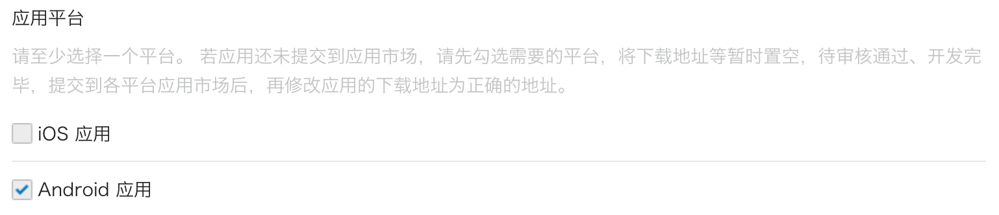

import GuideTip from '../../fragments/_guide-tip.mdx';

# Soziale Anmeldung mit WeChat (Native) einrichten

Der offizielle Logto-Connector für die WeChat-Sozialanmeldung in nativen Apps (iOS und Android).

<GuideTip />

## Erste Schritte \{#get-started}

Wenn du das Konzept des Connectors nicht kennst oder nicht weißt, wie du diesen Connector zu deiner Anmeldeerfahrung hinzufügen kannst, sieh dir bitte das [Logto-Tutorial](/connectors/social-connectors) an.

In nativen Apps kannst du das Web nicht als Anmeldemethode von WeChat verwenden: Eine Navigation zur WeChat-App ist erforderlich, und es erfordert auch die Verwendung ihres SDK.

Wir wissen, dass es beängstigend klingt, aber keine Sorge. Wir werden es in diesem Tutorial leicht handhaben.

## Erstelle eine mobile App auf der WeChat Open Platform \{#create-a-mobile-app-in-the-wechat-open-platform}

> 💡 **Tipp**
>
> Du kannst einige Abschnitte überspringen, wenn du sie bereits abgeschlossen hast.

### Erstelle ein Konto \{#create-an-account}

Öffne https://open.weixin.qq.com/, klicke auf die Schaltfläche "Registrieren" in der oberen rechten Ecke und schließe dann den Registrierungsprozess ab.

### Erstelle eine mobile App \{#create-a-mobile-app}

Melde dich mit dem gerade erstellten Konto an. Im Tab "Mobile Anwendung" (移动应用) klicke auf die große grüne Schaltfläche "Erstelle eine mobile App" (创建移动应用).


Fülle die erforderlichen Informationen im Antragsformular aus.


#### Grundlegende Informationen \{#basic-info}

Die meisten sind ziemlich selbsterklärend, und wir haben hier einige Tipps:

- Wenn du nur die WeChat-Anmeldung testen möchtest und die App nicht im App Store ist, wähle im Abschnitt "App ist verfügbar" "Nein", um den "App-Download-Link" zu überspringen.
- Das "App-Betriebsablaufdiagramm" sieht knifflig aus. Aus unserer Erfahrung musst du ein einfaches Flussdiagramm und mehrere App-Screenshots vorbereiten, um die Möglichkeit zu erhöhen, die Überprüfung zu bestehen.

Klicke auf "Nächster Schritt", um fortzufahren.

#### Plattforminformationen \{#platform-info}

Du kannst eine oder beide Plattformen, iOS und Android, konfigurieren, um Logto mit der WeChat-Native-Anmeldung zu integrieren.

**iOS-App**

Wähle "iOS-App" (iOS 应用) aus und wähle dann den Zielgerätetyp deiner App entsprechend aus.


Wenn du "Nein" für die Verfügbarkeit im App Store gewählt hast, kannst du das Ausfüllen der "AppStore-Download-Adresse" hier überspringen.

Fülle _Bundle ID_, _Testversion Bundle ID_ und _Universal Links_ aus (tatsächlich wird nur ein Link benötigt 😂).

> ℹ️ **Hinweis**
>
> _Bundle ID_ und _Testversion Bundle ID_ können denselben Wert haben.

> 💡 **Tipp**
>
> WeChat erfordert einen universellen Link für die native Anmeldung. Wenn du ihn nicht eingerichtet hast oder nicht weißt, was es ist, sieh dir bitte die [offizielle Apple-Dokumentation](https://developer.apple.com/ios/universal-links/) an.

**Android-App**

Wähle "Android-App" (Android 应用) aus.



Fülle _Anwendungssignatur_ (应用签名) und _Anwendungspaketname_ (应用包名) aus.

> ℹ️ **Hinweis**
>
> Du musst deine App signieren, um eine Signatur zu erhalten. Siehe [App signieren](https://developer.android.com/studio/publish/app-signing) für weitere Informationen.

Nachdem du das Signieren abgeschlossen hast, kannst du die `signingReport`-Aufgabe ausführen, um die Signatursignatur zu erhalten.

```bash
./gradlew your-android-project:signingReport
```

Der `MD5`-Wert des entsprechenden Build-Variantenberichts wird die _Anwendungssignatur_ (应用签名) sein, aber denke daran, alle Doppelpunkte aus dem Wert zu entfernen und ihn in Kleinbuchstaben zu schreiben.

Z.B. `1A:2B:3C:4D` -> `1a2b3c4d`.

#### Warten auf das Überprüfungsergebnis \{#waiting-for-the-review-result}

Nachdem du die Plattforminformationen abgeschlossen hast, klicke auf "Überprüfung einreichen", um fortzufahren. Normalerweise geht die Überprüfung schnell, sie endet innerhalb von 1-2 Tagen.

Wir vermuten, dass der Prüfer bei jeder Einreichung zufällig zugewiesen wird, da der Standard schwankt. Du könntest beim ersten Mal abgelehnt werden, aber gib nicht auf! Erkläre deinen aktuellen Status und frage den Prüfer, wie du ihn ändern kannst.

## Aktiviere die WeChat-Native-Anmeldung in deiner App \{#enable-wechat-native-sign-in-in-your-app}

### iOS \{#ios}

Wir gehen davon aus, dass du das [Logto iOS SDK](/quick-starts/swift) in deiner App integriert hast. In diesem Fall sind die Dinge ziemlich einfach, und du musst nicht einmal die WeChat SDK-Dokumentation lesen:

**1. Konfiguriere den universellen Link und das URL-Schema in deinem Xcode-Projekt**

Im Xcode-Projekt -> Tab "Signing & Capabilities", füge die Fähigkeit "Associated Domains" und den zuvor konfigurierten universellen Link hinzu.


Gehe dann zum Tab "Info" und füge ein [benutzerdefiniertes URL-Schema](https://developer.apple.com/documentation/xcode/defining-a-custom-url-scheme-for-your-app) mit der WeChat-App-ID hinzu.


Öffne schließlich deine `Info.plist` und füge `weixinULAPI` und `weixin` unter `LSApplicationQueriesSchemes` hinzu.


> 🤦 **Hinweis**
>
> Wir wissen, dass diese Aktionen nicht sehr vernünftig sind, aber dies ist die minimal funktionsfähige Lösung, die wir gefunden haben. Siehe den [magischen offiziellen Leitfaden](https://developers.weixin.qq.com/doc/oplatform/en/Mobile_App/Access_Guide/iOS.html) für weitere Informationen.

**2. Füge `LogtoSocialPluginWechat` zu deinem Xcode-Projekt hinzu**

Füge das Framework hinzu:


Und füge `-ObjC` zu deinen Build-Einstellungen > Linking > Other Linker Flags hinzu:


> ℹ️ **Hinweis**
>
> Das Plugin enthält das WeChat Open SDK 1.9.2. Du kannst `import WechatOpenSDK` direkt verwenden, sobald das Plugin importiert wurde.

**3. Füge das Plugin zu deinen `LogtoClient`-Init-Optionen hinzu**

```swift
let logtoClient = LogtoClient(
  useConfig: config,
  socialPlugins: [LogtoSocialPluginWechat()]
)
```

**4. Behandle `onOpenURL` richtig**

> ℹ️ **Hinweis**
>
> Die Funktion `LogtoClient.handle(url:)` wird alle nativen Connectoren behandeln, die du aktiviert hast. Du musst sie nur einmal aufrufen.

```swift
// SwiftUI
YourRootView()
  .onOpenURL { url in
      LogtoClient.handle(url: url)
  }

// oder AppDelegate
func application(_ app: UIApplication, open url: URL, options: /*...*/) -> Bool {
  LogtoClient.handle(url: url)
}
```

### Android \{#android}

Wir gehen davon aus, dass du das [Logto Android SDK](/quick-starts/android) in deiner App integriert hast. In diesem Fall sind die Dinge ziemlich einfach, und du musst nicht einmal die WeChat SDK-Dokumentation lesen:

**1. Füge `Wechat Open SDK` zu deinem Projekt hinzu**

Stelle sicher, dass das `mavenCentral()`-Repository in deinen Gradle-Projektrepositories enthalten ist:

```kotlin
repositories {
  // ...
  mavenCentral()
}
```

Füge das Wechat Open SDK zu deinen Abhängigkeiten hinzu:

```kotlin
dependencies {
  // ...
  api("com.tencent.mm.opensdk:wechat-sdk-android:6.8.0")  // kotlin-script
  // oder
  api 'com.tencent.mm.opensdk:wechat-sdk-android:6.8.0'   // groovy-script
}
```

**2. Führe `WXEntryActivity` in dein Projekt ein**

Erstelle ein `wxapi`-Paket unter deinem Paketstamm und füge die `WXEntryActivity` im `wxapi`-Paket hinzu (Nehmen wir `com.sample.app` als Beispiel):

```kotlin
// WXEntryActivity.kt
package com.sample.app.wxapi

import io.logto.sdk.android.auth.social.wechat.WechatSocialResultActivity

class WXEntryActivity: WechatSocialResultActivity()
```

```java
// WXEntryActivity.java
package com.sample.app.wxapi

import io.logto.sdk.android.auth.social.wechat.WechatSocialResultActivity

public class WXEntryActivity extends WechatSocialResultActivity {}
```

Die endgültige Position der `WXEntryActivity` im Projekt sollte so aussehen (Nehmen wir Kotlin als Beispiel):

```bash
src/main/kotlin/com/sample/app/wxapi/WXEntryActivity.kt
```

**3. Ändere die `AndroidManifest.xml`**

Füge die folgende Zeile zu deiner `AndroidManifest.xml` hinzu:

```xml
\<?xml version="1.0" encoding="utf-8"?>
\<manifest xmlns:android="http://schemas.android.com/apk/res/android"
  package="com.sample.app">

  \<application>
    \<!-- hinzuzufügende Zeile -->
    \<activity android:name=".wxapi.WXEntryActivity" android:exported="true"/>
  \</application>

\</manifest>
```

## Teste den WeChat-Native-Connector \{#test-wechat-native-connector}

Das war's. Vergiss nicht, den [sozialen Connector in der Anmeldeerfahrung zu aktivieren](/connectors/social-connectors/#enable-social-sign-in).

Sobald der WeChat-Native-Connector aktiviert ist, kannst du deine App erstellen und ausführen, um zu sehen, ob sie funktioniert.

> ⚠️ **Vorsicht**
>
> WeChat hat keinen Plan für Geräte ohne installierte WeChat-App. Logto wird diesen Connector während der Anmeldung ausblenden, falls dies der Fall ist (was die empfohlene Vorgehensweise aus dem [offiziellen Entwicklungsleitfaden](https://developers.weixin.qq.com/doc/oplatform/en/Mobile_App/WeChat_Login/Development_Guide.html) ist).
