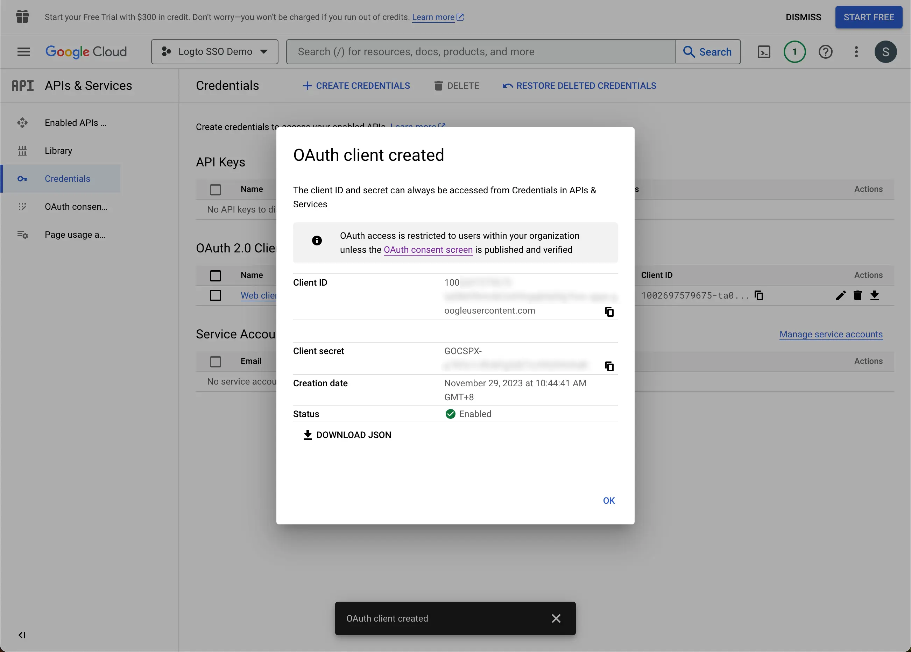

import GuideTip from '../../fragments/_sso_guide_tip.mdx';

# Single Sign-On mit Google Workspace einrichten

Mit minimalem Konfigurationsaufwand ermöglicht dieser Connector die Integration mit Microsoft Entra ID für Enterprise SSO.

<GuideTip />

## Schritt 1: Ein neues Projekt auf der Google Cloud Platform erstellen \{#step-1-create-a-new-project-on-google-cloud-platform}

Bevor du Google Workspace als Authentifizierungsanbieter verwenden kannst, musst du ein Projekt in der [Google API Console](https://console.developers.google.com/) einrichten, um OAuth 2.0-Anmeldeinformationen zu erhalten. Wenn du bereits ein Projekt hast, kannst du diesen Schritt überspringen. Andernfalls erstelle ein neues Projekt unter deiner Google-Organisation.

## Schritt 2: Den Zustimmungsbildschirm für deine Anwendung konfigurieren \{#step-2-config-the-consent-screen-for-your-application}

Um eine neue OIDC-Anmeldeinformation zu erstellen, musst du den Zustimmungsbildschirm für deine Anwendung konfigurieren.

1. Gehe zur Seite [OAuth-Zustimmungsbildschirm](https://console.cloud.google.com/apis/credentials/consent) und wähle den Benutzertyp `Intern` aus. Dadurch wird die OAuth-Anwendung nur für Benutzer innerhalb deiner Organisation verfügbar.

2. Fülle die Einstellungen des `Zustimmungsbildschirms` gemäß den Anweisungen auf der Seite aus. Du musst die folgenden Mindestinformationen angeben:

- **Anwendungsname**: Der Name deiner Anwendung. Er wird auf dem Zustimmungsbildschirm angezeigt.
- **Support-E-Mail**: Die Support-E-Mail deiner Anwendung. Sie wird auf dem Zustimmungsbildschirm angezeigt.

3. Setze die `Berechtigungen (Scopes)` für deine Anwendung. Um die Identitätsinformationen und die E-Mail-Adresse des Benutzers ordnungsgemäß vom IdP abzurufen, müssen Logto SSO-Connectors die folgenden Berechtigungen vom IdP gewähren:

- **openid**: Diese Berechtigung ist für die OIDC-Authentifizierung erforderlich. Sie wird verwendet, um das ID-Token abzurufen und Zugriff auf den userInfo-Endpunkt des IdP zu erhalten.
- **profile**: Diese Berechtigung ist erforderlich, um auf die grundlegenden Profilinformationen des Benutzers zuzugreifen.
- **email**: Diese Berechtigung ist erforderlich, um auf die E-Mail-Adresse des Benutzers zuzugreifen.

Klicke auf die Schaltfläche `Speichern`, um die Einstellungen des Zustimmungsbildschirms zu speichern.

## Schritt 3: Eine neue OAuth-Anmeldeinformation erstellen \{#step-3-create-a-new-oauth-credential}

Gehe zur Seite [Anmeldeinformationen](https://console.cloud.google.com/apis/credentials) und klicke auf die Schaltfläche `Anmeldeinformationen erstellen`. Wähle die Option `OAuth-Client-ID` aus dem Dropdown-Menü, um eine neue OAuth-Anmeldeinformation für deine Anwendung zu erstellen.

Fahre mit der Einrichtung der OAuth-Anmeldeinformation fort, indem du die folgenden Informationen ausfüllst:

1. Wähle `Webanwendung` als Anwendungstyp aus.
2. Fülle den `Namen` deiner Client-Anwendung aus, zum Beispiel `Logto SSO Connector`. Dies hilft dir, die Anmeldeinformationen in der Zukunft zu identifizieren.
3. Fülle die `Autorisierte Weiterleitungs-URIs` mit der Logto-Callback-URI aus. Dies ist die URI, zu der Google den Browser des Benutzers nach erfolgreicher Authentifizierung umleitet. Nachdem sich ein Benutzer erfolgreich beim IdP authentifiziert hat, leitet der IdP den Browser des Benutzers zusammen mit einem Autorisierungscode zurück zu dieser festgelegten URI. Logto wird den Authentifizierungsprozess basierend auf dem von dieser URI erhaltenen Autorisierungscode abschließen.
4. Fülle die `Autorisierte JavaScript-Ursprünge` mit dem Ursprung der Logto-Callback-URI aus. Dies stellt sicher, dass nur deine Logto-Anwendung Anfragen an den Google OAuth-Server senden kann.
5. Klicke auf die Schaltfläche `Erstellen`, um die OAuth-Anmeldeinformation zu erstellen.

## Schritt 4: Logto-Connector mit den Client-Anmeldeinformationen einrichten \{#step-4-set-up-logto-connector-with-the-client-credentials}

Nach erfolgreicher Erstellung der OAuth-Anmeldeinformation erhältst du ein Eingabeaufforderungsfenster mit der Client-ID und dem Client-Geheimnis.

Kopiere die `Client-ID` und das `Client-Geheimnis` und fülle die entsprechenden Felder im `Verbindung`-Tab des Logto SSO-Connectors aus.

Jetzt hast du erfolgreich einen Google Workspace SSO-Connector auf Logto konfiguriert.

## Schritt 5: Zusätzliche Berechtigungen (Optional) \{#step-5-additional-scopes-optional}

Verwende das Feld `Berechtigung (Scope)`, um zusätzliche Berechtigungen zu deiner OAuth-Anfrage hinzuzufügen. Dadurch kannst du mehr Informationen vom Google OAuth-Server anfordern. Bitte sieh dir die [Google OAuth-Berechtigungen](https://developers.google.com/identity/protocols/oauth2/scopes) Dokumentation für weitere Informationen an.

Unabhängig von den benutzerdefinierten Berechtigungseinstellungen sendet Logto immer die Berechtigungen `openid`, `profile` und `email` an den IdP. Dies stellt sicher, dass Logto die Identitätsinformationen und die E-Mail-Adresse des Benutzers ordnungsgemäß abrufen kann.

## Schritt 6: E-Mail-Domains festlegen und den SSO-Connector aktivieren \{#step-6-set-email-domains-and-enable-the-sso-connector}

Gib die `E-Mail-Domains` deiner Organisation im `SSO-Erfahrung`-Tab des Logto-Connectors an. Dadurch wird der SSO-Connector als Authentifizierungsmethode für diese Benutzer aktiviert.

Benutzer mit E-Mail-Adressen in den angegebenen Domains werden zur Verwendung deines SSO-Connectors als einzige Authentifizierungsmethode umgeleitet.

Für weitere Informationen über den Google Workspace SSO-Connector, sieh dir bitte den [Google OpenID Connector](https://developers.google.com/identity/openid-connect/openid-connect) an.
