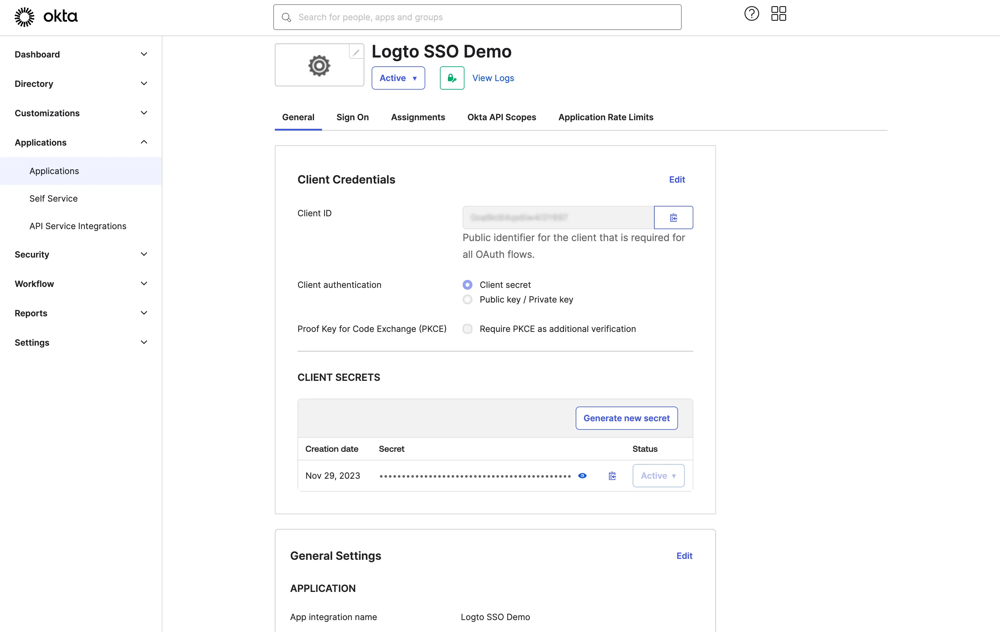

import GuideTip from '../../fragments/_sso_guide_tip.mdx';

# Single Sign-On mit Okta einrichten

Mit minimalem Konfigurationsaufwand ermöglicht dieser Connector die Integration mit Okta für Enterprise SSO.

<GuideTip />

## Schritt 1: Erstellen einer OIDC-Anwendung im Okta-Admin-Portal

- Besuche das Okta-Admin-Portal und melde dich als Administrator an.
- Navigiere zur Seite `Applications` / `Applications` über das Seitenmenü.
- Klicke auf die Schaltfläche `Create App Integration`, um eine neue OIDC-Anwendung zu erstellen.
- Wähle die Option `OIDC - OpenID Connect` als `Sign-in method`.
- Wähle die Option `Web Application` als `Application type`.

Klicke auf die Schaltfläche `Next`, um fortzufahren.

## Schritt 2: Konfigurieren der Anwendungseinstellungen

1. Gib einen `App integration name` an. Er wird als Identifikator deiner OIDC-Anwendung verwendet.
2. Füge eine neue `Sign-in redirect URIs` mit der Callback-URL des Logto SSO Connectors hinzu.

Dies ist die URI, zu der Okta den Browser des Benutzers nach erfolgreicher Authentifizierung umleitet. Nachdem sich ein Benutzer erfolgreich beim IdP authentifiziert hat, leitet der IdP den Browser des Benutzers zurück zu dieser angegebenen URI zusammen mit einem Autorisierungscode. Logto wird den Authentifizierungsprozess basierend auf dem von dieser URI erhaltenen Autorisierungscode abschließen.

3. Weise Benutzer der Anwendung zu.

Basierend auf den `Assignments`-Einstellungen kannst du wählen, ob die Anwendung allen Benutzern oder bestimmten Benutzern / Gruppen zugewiesen werden soll.

Klicke auf die Schaltfläche `Save`, um die Anwendungseinstellungen zu speichern.

## Schritt 3: Logto-Connector mit den Client-Anmeldeinformationen einrichten

Nach erfolgreicher Erstellung der OIDC-Anwendung wirst du zur Anwendungsdetailseite weitergeleitet.

Kopiere die `client ID` und das `client secret` und fülle die entsprechenden Felder auf der `Connection`-Registerkarte des Logto SSO Connectors aus.

Verwende deine Okta-Domain als `issuer`. Beispiel: `https://dev-12345678.okta.com`. Sobald du alle Felder ausgefüllt hast, klicke auf die Schaltfläche `Save`, um die Connector-Einstellungen zu speichern.

Wenn der von dir angegebene `issuer`-Link gültig ist, siehst du eine geparste vollständige Liste der Okta IdP-Konfigurationen unter dem `issuer`-Feld.

## Schritt 4: Zusätzliche Berechtigungen (Optional)

Verwende das `Scope`-Feld, um zusätzliche Berechtigungen zu deiner OAuth-Anfrage hinzuzufügen. Dadurch kannst du mehr Informationen vom Okta OAuth-Server anfordern. Bitte schaue in der [Okta-Dokumentation](https://developer.okta.com/docs/reference/api/oidc/#scopes) nach, um mehr über die verfügbaren Berechtigungen zu erfahren.

Unabhängig von den benutzerdefinierten Berechtigungseinstellungen sendet Logto immer die Berechtigungen `openid`, `profile` und `email` an den IdP. Dies stellt sicher, dass Logto die Identitätsinformationen und die E-Mail-Adresse des Benutzers korrekt abrufen kann.

## Schritt 5: E-Mail-Domains festlegen und den SSO-Connector aktivieren

Gib die `email domains` deiner Organisation auf der `SSO experience`-Registerkarte des Logto Connectors an. Dadurch wird der SSO-Connector als Authentifizierungsmethode für diese Benutzer aktiviert.

Benutzer mit E-Mail-Adressen in den angegebenen Domains werden zur Verwendung deines SSO Connectors als einzige Authentifizierungsmethode weitergeleitet.

Für weitere Details zur Erstellung einer OIDC-Integration mit Okta, siehe bitte [Create OIDC App Integrations](https://help.okta.com/oie/en-us/content/topics/apps/apps_app_integration_wizard_oidc.htm).
