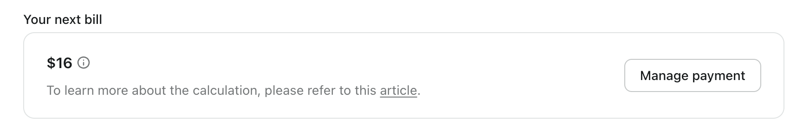

# Abrechnung und Preisgestaltung

In Logto ist unser [Pro-Plan](https://logto.io/pricing) vollständig selbstbedienbar und auf Transparenz ausgelegt, damit du deine Abrechnung leicht verstehen und verwalten kannst.

## Die Struktur verstehen \{#understand-the-structure}

Die Grundstruktur sieht folgendermaßen aus:

```math
\begin{align*}
\text{Deine nächste Rechnung} &= \$16 \text{(Grundpreis)} \\
&+ \text{Zusatzkosten (nicht abgerechnete Nutzung)} \\
&+ \text{Zusatzkosten (nächste Zyklusgebühren)}
\end{align*}
```

In der Konsole findest du im Abschnitt "Deine nächste Rechnung" in den Mandanteneinstellungen, wo du deine bevorstehenden Gebühren überwachen und kontrollieren kannst.



## Aufschlüsselung der Posten \{#item-breakdown}

Beachte, dass nur wenige Funktionen Teil der Zusatzstruktur sind.

Gleichzeitig bietet Logto auch ein nutzungsabhängiges und anteiliges Preismodell, um sicherzustellen, dass du unseren Service bequem optimal nutzen kannst.

|                                    | Inklusive Kontingent | Zusätzliche Kosten          |
| ---------------------------------- | -------------------- | --------------------------- |
| **Tokens**                         | 100K                 | $0.08 pro Mo / 100 danach   |
| **Maschine-zu-Maschine-Apps**      | 1                    | $8 **_jeweils_** pro Monat  |
| **API-Ressourcen**                 | 3                    | $4 **_jeweils_** pro Monat  |
| **Enterprise SSO**                 | 0                    | $48 **_jeweils_** pro Monat |
| **Multi-Faktor-Authentifizierung** | _N/A_                | $48 pro Monat               |
| **Organisation**                   | Unbegrenzt           | $48 pro Monat               |
| **Mandantenmitglieder**            | 3                    | $8 **_jeweils_** pro Monat  |

Wenn wir diese Faktoren berücksichtigen, lautet der Algorithmus

```math
\begin{align*}
\text{Deine nächste Rechnung} &= \$16 \\
&+ \text{Zusatzpreis pro Einheit} \times \\
\quad & (\text{hinzugefügte Menge} \times \text{anteilige verbleibende Zeit bei Erstellung} \\
\quad &- \text{entfernte Menge} \times \text{anteilige verbleibende Zeit bei Löschung}) \\
\quad &+ \text{Zusatzpreis pro Einheit} \times \text{verbleibende Menge}
\end{align*}
```

1. **Zusatzpreis pro Einheit**: Der Einheitspreis dieses Zusatzes
2. **hinzugefügte Menge**: Die Menge des Zusatzes, die im **_aktuellen_** Abrechnungszyklus hinzugefügt wurde
3. **entfernte Menge**: Die Menge des Zusatzes, die im **_aktuellen_** Abrechnungszyklus entfernt wurde
4. **anteilige verbleibende Zeit bei Erstellung**: anteilige verbleibende Zeit im **_aktuellen_** Zyklus, wenn du die Ressourcen ERSTELLST
5. **anteilige verbleibende Zeit bei Löschung**: anteilige verbleibende Zeit im **_aktuellen_** Zyklus, wenn du die Ressourcen LÖSCHST
6. **verbleibende Menge**: die Menge, die für eine konsistente Abrechnung im **_nächsten_** Zyklus benötigt wird

Lass uns zwei Beispiele betrachten, um zu sehen, wie es funktioniert.

### Beispiel 1: Konsistente Abrechnung ohne Änderungen \{#example-1-consistent-billing-with-no-changes}

Deine Rechnung bleibt konsistent, wenn du keine Änderungen vornimmst, wie das Hinzufügen oder Entfernen von Posten.

Zum Beispiel, wenn du im Pro-Plan bist und 2 SSO-Dienste in Gebrauch hast, bleibt deine Rechnung konsistent, solange du keine Änderungen vornimmst.

```math
\text{Deine nächste Rechnung} = \$ 16 + \$ 48 \times 2 = \$ 112
```

### Beispiel 2: Hinzufügen von Add-ons oder Änderungen wirken sich auf deine bevorstehenden Rechnungen aus \{#example-2-adding-add-ons-or-making-changes-will-affect-your-upcoming-bills}

Dies wird deine bevorstehende Rechnung je nach Fall etwas anders gestalten. Der Algorithmus funktioniert weiterhin.

**Fall 1: Du hast den Pro-Plan ohne Add-ons abonniert und nur das Enterprise SSO für 10 Tage getestet.**

Wenn dein Abonnement am 5. jedes Monats erneuert wird und du am 20. ein Enterprise SSO hinzufügst, wirst du es für 15 Tage in diesem Monat nutzen. Wenn du das Enterprise SSO am 30. löschst, bedeutet das, dass du es nur für 10 Tage genutzt hast.

```math
\$16 + \$48 \times (1 \times 15 / 30) - \$48 \times (1 \times 5 / 30) = \$32
```

**Fall 2: Du hast den Pro-Plan ohne Add-ons abonniert. Nach dem Hinzufügen und Entfernen von API-Ressourcen hast du letztendlich 5 API-Ressourcen genutzt**

In diesem Fall hast du die Add-on-Funktionen während dieses Abrechnungszyklus aktualisiert, sodass die Änderungen auf deiner nächsten Rechnung erscheinen. Der erste Monat nach der Änderung könnte etwas höher ausfallen. Deine Rechnung wird den $16 Grundpreis, die Zusatzkosten für nicht abgerechnete Nutzung und die volle Gebühr für den nächsten wiederkehrenden Zyklus enthalten.

Dein Abrechnungszyklus beginnt am 1. jedes Monats, und du hast die ersten 3 kostenlosen API-Ressourcen genutzt. In diesem Monat hast du zwei Aktionen durchgeführt:

1. Am 5. hast du 4 weitere Ressourcen hinzugefügt.
2. Am 15. hast du 2 dieser Ressourcen gelöscht.

Als Ergebnis wirst du konsistent 2 API-Ressourcen für den kommenden Zyklus zur Verfügung haben.

```math
\$16 + \$8 \times (4 \times 25 - 2 \times 15) / 30 + 2 \times \$8 = \$50.67
```

### Wie wird die Nutzungszeit des Add-ons bestimmt? \{#how-is-the-add-on-usage-time-determined}

Wir verwenden ein nutzungsabhängiges Modell, und du fragst dich vielleicht, was passiert, wenn du häufig Ressourcen hinzufügst oder entfernst. Das Add-on wird für die genaue Dauer, in der es aktiv ist, als in Gebrauch betrachtet. Keine Sorge—unser System, unterstützt von Stripe, berechnet deine Nutzung auf die Sekunde genau und sorgt so für eine genaue Abrechnung basierend darauf, wie lange jede Ressource tatsächlich genutzt wird.

Wenn du das Pro-Plan-Abonnement kündigst, erstatten wir die ungenutzten Zusatzkosten, und der Betrag wird von deiner Schlussrechnung abgezogen.

## Upgrade oder Downgrade \{#upgrade-or-downgrade}

### Upgrade vom Free-Plan zum Pro-Plan \{#free-plan-upgrade-to-pro}

Upgrades und Downgrades gelten nur für den Produktionstenant. Hier sind Situationen, in denen du ein Upgrade vom Free-Plan in Betracht ziehen solltest:

1. Wenn deine MAU- oder Token-Nutzung das Kontingent überschreitet, senden wir dir rechtzeitig eine E-Mail-Benachrichtigung, die dich auf die Notwendigkeit eines Upgrades hinweist.
2. Wenn du auf Funktionen zugreifen möchtest, die nur im Premium-Plan verfügbar sind.

### Upgrade vom Pro-Plan zum Enterprise-Plan \{#pro-plan-upgrade-to-enterprise}

Wenn der Pro-Plan nicht deinen Anforderungen entspricht und du nach vollständigem Enterprise-Support suchst, kontaktiere uns bitte, um einen individuellen Enterprise-Plan zu besprechen.

### Downgrade vom Pro-Plan zum Free-Plan \{#pro-plan-downgrade-to-free-plan}

Wenn du dich entscheidest, den Pro-Plan nicht mehr zu nutzen, kannst du zum Free-Plan wechseln, musst jedoch deine Nutzung an das Kontingent des Free-Plans anpassen.

## Zukünftige Preisplanänderung \{#future-pricing-plan-change}

Um dir eine stabile und vorhersehbare Abrechnungserfahrung zu bieten, werden wir deinen aktuellen Plan beibehalten, wann immer Preisänderungen auftreten.

## FAQs \{#faqs}

<details>

<summary>

### Was ist der Zusammenhang zwischen Tokenverbrauch und MAU? \{#what-is-the-connection-between-token-consumption-and-mau}

</summary>

Logto verwendet tokenbasierte Authentifizierung. Eine einmalige Anmeldung eines einzelnen Benutzers kann den Verbrauch von zwei oder drei Tokens beinhalten: ID-Token, Zugangstoken und Auffrischungstoken. Wenn du Funktionen wie M2M oder Organisation verwendest, können zusätzliche Tokens, wie M2M-Tokens oder Organisationstokens, ebenfalls beteiligt sein. Der Tokenverbrauch hängt davon ab, wie Benutzer mit deinem System interagieren. Um dir dabei zu helfen, bieten wir in der <CloudLink to="/dashboard">Konsole > Dashboard</CloudLink> eine Echtzeitüberwachung der Token-Nutzung an. Hier ist ein Beispiel: Unser Free-Plan bietet 100k Tokens kostenlos, was ungefähr 30k-50k MAU (Monatlich Aktive Benutzer) unterstützen kann.

</details>
