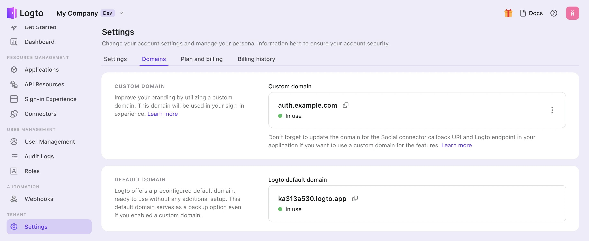

# Benutzerdefinierte Domain

Dein Logto-Mandant wird mit einer standardmäßigen kostenlosen Domain `{{tenant-id}}.app.logto` geliefert. Du kannst jedoch das Benutzererlebnis und die Markenbekanntheit verbessern, indem du eine benutzerdefinierte Domain verwendest, wie `auth.example.com`.

Deine benutzerdefinierte Domain wird für mehrere Funktionen verwendet:

- URLs für [Anmelde- und Registrierungsseite](/end-user-flows/sign-up-and-sign-in)
- Verknüpfungs-URLs für [Passkey](/end-user-flows/mfa/webauthn) (Das Ändern der Domain, nachdem Benutzer Passkeys verknüpft haben, kann ihre Authentifizierung blockieren).
- Callback-URIs für [soziale Connectors](/connectors/social-connectors) oder [Enterprise SSO Connectors](/connectors/enterprise-connectors).
- [SDK-Endpunkt](/integrate-logto/application-data-structure#openid-provider-configuration-endpoint) zur Integration von Logto mit deiner Anwendung.

:::note
Das Ändern der Domain nach der Veröffentlichung deines Dienstes kann Probleme verursachen, da dein Anwendungscode und Integrationen möglicherweise noch auf die alte Domain verweisen. Um einen reibungslosen Übergang zu gewährleisten, **richte deine benutzerdefinierte Domain zu Beginn** bei der Erstellung eines Produktionsmandanten ein.
:::

## Benutzerdefinierte Domain in der Konsole konfigurieren

Um eine neue benutzerdefinierte Domain in der Logto-Konsole hinzuzufügen, folge diesen Schritten:

1. Navigiere zu <CloudLink to="/tenant-settings/domains">Konsole > Einstellungen > Domains</CloudLink>.
2. Gib im Abschnitt "Benutzerdefinierte Domain" deinen Domainnamen ein und klicke auf "Domain hinzufügen".

   

3. Kopiere den CNAME-Wert in der Tabelle und gehe zu deinem DNS-Anbieter, um den Eintrag hinzuzufügen.

   

4. Warte auf die Verifizierung und den SSL-Prozess.
   1. Wir werden deine Einträge alle 10 Sekunden automatisch überprüfen, bis die benutzerdefinierte Domain hinzugefügt ist. Stelle einfach sicher, dass der eingegebene Domainname oder die DNS-Einträge korrekt sind.
   2. Die Verifizierung dauert in der Regel einige Minuten, kann aber je nach DNS-Anbieter bis zu 24 Stunden dauern. Du kannst während des Prozesses gerne weg navigieren.

## Fehlerbehebung

<details>
<summary>

### SSL-Zertifikatsprobleme

</summary>

Wenn du auf SSL-Zertifikatsprobleme beim Einrichten deiner benutzerdefinierten Domain stößt, kann dies mit CAA-Einträgen in deiner DNS-Konfiguration zusammenhängen. CAA-Einträge geben an, welche Zertifizierungsstellen (CAs) berechtigt sind, Zertifikate für deine Domain auszustellen.

Um SSL-Zertifikatsprobleme im Zusammenhang mit CAA-Einträgen zu beheben, siehe [Cloudflares Dokumentation](https://developers.cloudflare.com/ssl/edge-certificates/caa-records/) zu CAA-Einträgen.

</details>

<details>
<summary>

### "Der Hostname ist mit einer gehaltenen Zone verbunden" Fehler

</summary>

Wenn du die Fehlermeldung "Der Hostname ist mit einer gehaltenen Zone verbunden, bitte kontaktiere den Besitzer, um die Sperre zu entfernen" beim Hinzufügen einer benutzerdefinierten Domain erhältst, bedeutet dies, dass die Domain bereits in der Cloudflare-Zone ist und auf den Status "Zone Hold" gesetzt ist. Siehe diese [Cloudflare-Dokumentation](https://developers.cloudflare.com/fundamentals/setup/account/account-security/zone-holds/) für weitere Informationen.

Um dieses Problem zu lösen, musst du die Zonensperre aufheben. Folge dem obigen Link für Anweisungen, wie du die Zonensperre in Cloudflare aufheben kannst.

</details>

## Benutzerdefinierte Domain verwenden

Sobald du deine Einstellungen konfiguriert hast, stehen sowohl dein benutzerdefinierter Domainname als auch der standardmäßige Logto-Domainname für deinen Mandanten zur Verfügung. Bestimmte Konfigurationen sind jedoch erforderlich, um deinen benutzerdefinierten Domainnamen zu aktivieren.

:::note
In diesem Artikel gehen wir davon aus, dass deine benutzerdefinierte Domain `auth.example.com` ist.


:::

### Aktualisierung des SDK-Endpunkts für Anwendungen

Ändere deinen Initialisierungscode für das Logto SDK, indem du den Domainnamen des Endpunkts modifizierst.

```typescript
const client = new LogtoClient({
  ...,// andere Optionen
  endpoint: 'https://auth.example.com',
});
```

### Änderung der Auth-Endpunkte für andere Anwendungen

Wenn du Anwendungen hast, die das Logto SDK nicht verwenden, ist es notwendig, deren Auth-Endpunkte zu aktualisieren.

Du kannst die Auth-Endpunkte unter der bekannten URL finden:

```
https://auth.example.com/oidc/.well-known/openid-configuration
```

### Aktualisierung der Callback-URI des sozialen Connectors

Die Callback-URI des sozialen Connectors wird automatisch aktualisiert, wenn deine Benutzer die benutzerdefinierte Domain verwenden. Du musst zur Entwicklerkonsole des sozialen Anbieters gehen, um die Callback-URI zu aktualisieren.

Wenn deine Benutzer die benutzerdefinierte Domain verwenden, wird die Callback-URI des sozialen Connectors die neue Domain verwenden. Daher musst du zur Entwicklerkonsole des sozialen Anbieters navigieren, um die Callback-URI manuell zu aktualisieren.
