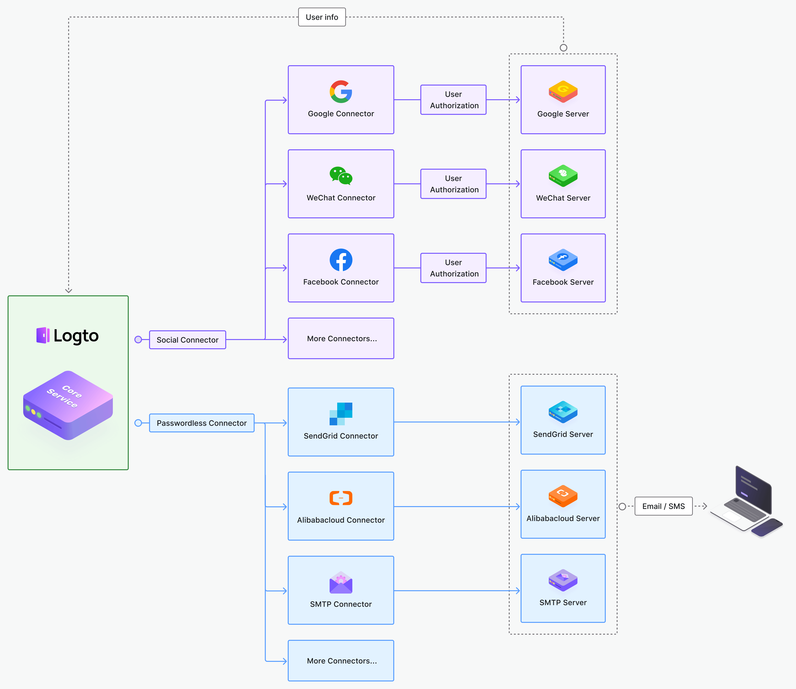

# Entwickle deinen Connector

Derzeit bietet Logto viele weit verbreitete soziale Anmelde-Connectors wie WeChat, Alipay, Google, Facebook usw. sowie SMS / E-Mail-Connectors wie AliCloud, SendGrid und Twilio.

Hier ist ein Architekturdiagramm, das veranschaulicht, wie Connectors mit dem Logto-Kernservice arbeiten.

Sie sollten in der Lage sein, die meisten Benutzerbedürfnisse in dieser Phase zu erfüllen, aber wir werden weiterhin Fortschritte machen.

Während wir an weiteren Connectors arbeiten, kannst du auch deine eigenen Connectors entwickeln. Du bist eingeladen, deine Connectors mit der gesamten Community zu teilen.

Lass uns sehen, wie man zum Logto-Projekt beitragen kann, indem man mit dem Bau eines Connectors beginnt.
