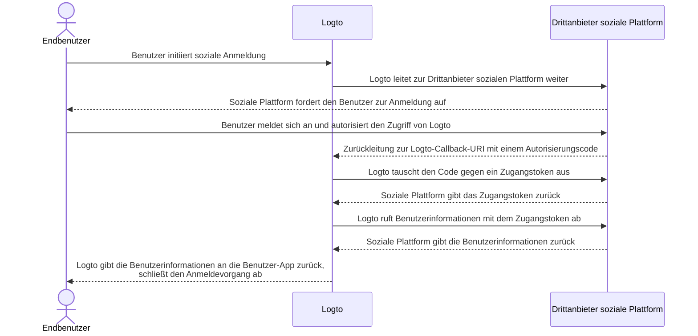

# Connectors implementieren

Nachdem wir uns die Dateistruktur des Connectors angesehen haben, lassen Sie uns die Implementierung und die Hauptidee der Entwicklung eines Connectors besprechen.

Wir werden ein einfaches Beispiel für soziale und passwortlose Connectors durchgehen, damit Sie Ihren Connector mit fast derselben Idee erstellen können.

In diesem Teil gehen wir nicht tief in die Details spezifischer Parameter (wie `config`) ein, da dies nicht der Punkt dieses Leitfadens ist. Entwickler, die neue Connectors implementieren, sollten die von Drittanbietern bereitgestellten Dokumente lesen, und diese Dokumente sollten die Parameter im Detail erläutern.

## Einen sozialen Connector erstellen

Nehmen wir den GitHub-Connector als Beispiel.

Der Autorisierungsfluss der meisten sozialen Connectors folgt dem [OAuth Authorization Code Flow](https://openid.net/specs/openid-connect-basic-1_0.html).

:::note
Die Mehrheit der _sozialen Connectors_ folgt einem zweistufigen Schema, um ein Benutzerprofil mit der Authentifizierung der Endbenutzer zu erhalten (angenommen, dass alle Schritte erfolgreich sind):

1. Eine Authentifizierungsanfrage starten und die Authentifizierung des Benutzers erhalten.
2. `Zugangstoken (Access token)` mit einem vom Connector-Anbieter gewährten `authCode` abrufen.
3. Ein öffentlich zugängliches Benutzerprofil mit `Zugangstoken (Access token)` anfordern.

:::



Um den Fluss zu vervollständigen, benötigen wir die folgenden drei Methoden:

### getAuthorizationUri

`getAuthorizationUri` generiert eine Umleitungs-URL, die Endbenutzer zur Seite leiten kann, die die Authentifizierung der Benutzer erfordert.

Die Schnittstelle ist als `GetAuthorizationUri` in [`@logto/connector-kit`](https://github.com/logto-io/logto/blob/master/packages/toolkit/connector-kit/src/types/social.ts) definiert.

Sie dürfen wesentliche Informationen zur Anmeldung mit `setSession` (dem zweiten Eingabeparameter von `GetAuthorizationUri`) speichern, um der `getUserInfo`-Methode zu dienen.

Folgende Parameter sind erforderlich:

- `authorizationEndpoint` kann in der GitHub OAuth-Dokumentationsseite gefunden werden, dies ist die Seite, zu der der Endbenutzer zur Authentifizierung gehen sollte
- `config`, das `clientId` und `clientSecret` im GitHub-Szenario enthält
- `state`, ein zufälliger String zur CSRF-Prüfung
- `redirectUri` der Zielseite nach erfolgreicher Authentifizierung des Endbenutzers

```typescript
const getAuthorizationUri = async ({ state, redirectUri }) => {
  const queryParameters = new URLSearchParams({
    client_id: config.clientId, // `config` enthält Ihre GitHub-Anwendungsanmeldeinformationen
    redirect_uri: redirectUri,
    state,
  });

  return `${authorizationEndpoint}?${queryParameters.toString()}`;
};
```

### getAccessToken

`getAccessToken` erhält das Zugangstoken mit dem Autorisierungscode, der nach erfolgreicher Authentifizierung der Endbenutzer ausgestellt wurde.

Neben `config`, das wir in der vorherigen `getAuthorizationUri`-Methode erwähnt haben, möchten wir auch Folgendes erhalten:

- Autorisierungs-`code` aus den Parametern, die zur Umleitungszielseite gebracht werden
- `accessTokenEndpoint`, das der Endpunkt ist, um das Zugangstoken mit dem Autorisierungscode zu erhalten

```typescript
const getAccessToken = async (config: GithubConfig, code: string) => {
  const { clientId: client_id, clientSecret: client_secret } = config;

  const httpResponse = await got.post({
    url: accessTokenEndpoint,
    json: {
      client_id,
      client_secret,
      code,
    },
    timeout: defaultTimeout,
  });

  const result = accessTokenResponseGuard.safeParse(qs.parse(httpResponse.body));

  if (!result.success) {
    throw new ConnectorError(ConnectorErrorCodes.InvalidResponse, result.error);
  }

  const { access_token: accessToken } = result.data;

  assert(accessToken, new ConnectorError(ConnectorErrorCodes.SocialAuthCodeInvalid));

  return { accessToken };
};
```

### getUserInfo

`getUserInfo` ruft Benutzerinformationen mit dem in den vorherigen Schritten erhaltenen Zugangstoken ab.

Die Schnittstelle ist als `GetUserInfo` in [`@logto/connector-kit`](https://github.com/logto-io/logto/blob/master/packages/toolkit/connector-kit/src/types/social.ts) definiert.

Für Anmeldezwecke können Sie notwendige Informationen mit der Funktion `getSession` abrufen.

`userInfoEndpoint` ist der Endpunkt, der verwendet wird, um Benutzerinformationen zu erhalten.

Sie können offizielle Dokumente überprüfen, um spezifische Benutzerinformationen zu finden, die am Benutzerinfo-Endpunkt zugänglich sind, und die entsprechende Berechtigung.

`id`, das vom Identitätsanbieter des Connectors (in diesem Fall GitHub) zugewiesen wird, ist erforderlich; andere Informationen sind optional. Wenn Sie `email` oder `phone` aus dem Benutzerprofil erhalten können, STELLEN SIE SICHER, dass sie "verifiziert" sind. Sie müssen auch die zurückgegebenen Schlüssel mit den Feldnamen im [Logto-Benutzerprofil](/user-management/user-data/#basic-data) abgleichen.

```typescript
const getUserInfo = async (
  data: { code: string; config: GithubConfig },
  getSession: GetSession,
  { set: SetStorageValue, get: GetStorageValue }
) => {
  const { code, config } = data;
  const { accessToken } = await getAccessToken(config, code);

  try {
    const httpResponse = await got.get(userInfoEndpoint, {
      headers: {
        authorization: `token ${accessToken}`,
      },
      timeout: defaultTimeout,
    });

    const result = userInfoResponseGuard.safeParse(parseJson(httpResponse.body));

    if (!result.success) {
      throw new ConnectorError(ConnectorErrorCodes.InvalidResponse, result.error);
    }

    const { id, avatar_url: avatar, email, name } = result.data;

    return {
      id: String(id),
      avatar: conditional(avatar),
      email: conditional(email),
      name: conditional(name),
    };
  } catch (error: unknown) {
    if (error instanceof HTTPError) {
      const { statusCode, body: rawBody } = error.response;

      if (statusCode === 401) {
        throw new ConnectorError(ConnectorErrorCodes.SocialAccessTokenInvalid);
      }

      throw new ConnectorError(ConnectorErrorCodes.General, JSON.stringify(rawBody));
    }

    throw error;
  }
};
```

Die vollständige Implementierung finden Sie [hier](https://github.com/logto-io/connectors/blob/master/packages/connector-github/src/index.ts).

Für weitere Details zu konfigurierbaren Parametern siehe GitHub-Connector-README oder die offiziellen GitHub-Dokumente.

:::note
Das Beispiel, das wir besprochen haben, basiert auf dem Autorisierungscode-Grant-Typ des OAuth-Protokolls, der im GitHub-Connector von Logto verwendet wird. Es ist jedoch erwähnenswert, dass ein anderer Grant-Typ, der implizite Grant-Typ, ebenfalls verwendet werden kann, um das Profil eines Benutzers abzurufen, und tatsächlich ein Zugangstoken direkt in der Authentifizierungsantwort bereitstellt. Trotz dieser Bequemlichkeit wird der Autorisierungscode-Grant-Typ im Allgemeinen gegenüber dem impliziten Typ aufgrund seiner stärkeren Sicherheit empfohlen.

Sie können auch einen Connector basierend auf OIDC oder einigen anderen offenen Protokollen erstellen, es hängt von Ihrem Anwendungsfall sowie der Kompatibilität des sozialen Anbieters ab, mit dem Sie sich verbinden möchten.
:::

## Einen passwortlosen Connector erstellen

Lassen Sie uns die Implementierung des Aliyun Direct Mail Connectors durchgehen, um den Prozess des Aufbaus eines passwortlosen Connectors zu verstehen.

Passwortlose Connectors werden verwendet, um einen zufälligen Code an die E-Mail oder das Telefon der Endbenutzer zu senden. Daher ist eine `sendMessage`-Methode erforderlich.

### sendMessage

Um eine Nachricht zu senden, müssen `config` und `endpoint` korrekt eingerichtet sein.

- `endpoint` ist der Endpunkt, mit dem Ihre API-Aufrufe verbunden werden
- `config` enthält `templates` (Inhaltsschablonen zum Senden von Passcodes in verschiedenen Benutzerflüssen), `clientId` und `clientSecret` (zum Zugriff auf API-Anfragen)

```typescript
const sendMessage = async (data, inputConfig) => {
  const { to, type, payload } = data;
  const config = inputConfig ?? (await getConfig(defaultMetadata.id));
  validateConfig<AliyunDmConfig>(config, aliyunDmConfigGuard);
  const { accessKeyId, accessKeySecret, accountName, fromAlias, templates } = config;
  const template = templates.find((template) => template.usageType === type);

  assert(
    template,
    new ConnectorError(
      ConnectorErrorCodes.TemplateNotFound,
      `Cannot find template for type: ${type}`
    )
  );

  const parameters = {
    AccessKeyId: accessKeyId,
    AccountName: accountName,
    ReplyToAddress: 'false',
    AddressType: '1',
    ToAddress: to,
    FromAlias: fromAlias,
    Subject: template.subject,
    HtmlBody:
      typeof payload.code === 'string'
        ? template.content.replace(/{{code}}/g, payload.code)
        : template.content,
  };

  try {
    const httpResponse = await request(
      endpoint,
      { Action: 'SingleSendMail', ...staticConfigs, ...parameters },
      accessKeySecret
    );

    const result = sendEmailResponseGuard.safeParse(parseJson(httpResponse.body));

    if (!result.success) {
      throw new ConnectorError(ConnectorErrorCodes.InvalidResponse, result.error);
    }

    return result.data;
  } catch (error: unknown) {
    if (error instanceof HTTPError) {
      const {
        response: { body: rawBody },
      } = error;

      assert(typeof rawBody === 'string', new ConnectorError(ConnectorErrorCodes.InvalidResponse));

      errorHandler(rawBody);
    }

    throw error;
  }
};

const request = async (
  url: string,
  parameters: PublicParameters & Record<string, string>,
  accessKeySecret: string
) => {
  const finalParameters: Record<string, string> = {
    ...parameters,
    SignatureNonce: String(Math.random()),
    Timestamp: new Date().toISOString(),
  };
  const signature = getSignature(finalParameters, accessKeySecret, 'POST');

  const payload = new URLSearchParams();

  for (const [key, value] of Object.entries(finalParameters)) {
    payload.append(key, value);
  }
  payload.append('Signature', signature);

  return got.post({
    url,
    headers: {
      'Content-Type': 'application/x-www-form-urlencoded',
    },
    form: payload,
  });
};
```

Die vollständige Implementierung finden Sie [hier](https://github.com/logto-io/connectors/blob/master/packages/connector-aliyun-dm/src/index.ts).

Für weitere Details zu konfigurierbaren Parametern siehe Aliyun Direct Mail Connector README oder die offiziellen Aliyun Direct Mail-Dokumente.

## Was noch?

Um die Definition der Connector-Methoden zu sehen und ein Bild des Connector-Schnittstellendesigns zu erstellen, siehe [`@logto/connector-kit`](https://github.com/logto-io/logto/tree/master/packages/toolkit/connector-kit). Sie können auch die _ConnectorMetadata_-Referenz unter "[Connectors - ConnectorMetadata](/connectors/connector-data-structure/#connectors-local-storage-connectormetadata)" und "[Connector-Dateistruktur](/logto-oss/develop-your-connector/connector-file-structure/)" finden, die Ihnen helfen kann, Ihre Implementierung zu organisieren.

- Ein Connector-Config-_Zod_-Schema ist für alle Connectors obligatorisch. Dies ist sehr wichtig, da wir einen Typencheck durchführen, bevor wir `config` in der Datenbank speichern und APIs aufrufen, die `config`-Informationen erfordern.
- Alle _SMS-Connectors_ und _E-Mail-Connectors_ erfordern eine `sendMessage`-Methode, um die Nachrichtensende-APIs der Dienstanbieter mit Konfigurationen aus der Datenbank aufzurufen. Entwickler können diese Methode auch wiederverwenden, um eine Testnachricht mit nicht gespeicherter Konfiguration zu senden, während sie Connectors in der Admin-Konsole einrichten.
- Der Autorisierungs-URL-Generator `getAuthorizationUri` und der Benutzerprofil-Abruf `getUserInfo` sind für alle _sozialen Connectors_ erforderlich (`getAccessToken` wird als optionaler Schritt in `getUserInfo` angesehen).
- Alle Methoden der Connectors arbeiten über API-Aufrufe, daher müssen Connector-Entwickler Dokumente überprüfen und mögliche erfolglose API-Antworten behandeln.

## Installiere deine eigenen Connectors

Wir gehen davon aus, dass Sie bereits Ihren eigenen Connector erstellt haben. Gehen Sie die folgenden Schritte durch, um ihn manuell zu installieren:

1. Kopieren Sie den von Ihnen implementierten Connector-Ordner in das Verzeichnis `/packages/connectors` von [`logto-io/logto`](https://github.com/logto-io/logto).
2. Installieren Sie die Abhängigkeiten des Connector-Repositorys, indem Sie `pnpm pnpm:devPreinstall && pnpm i` im Stammverzeichnis des Logto-Ordners eingeben.
3. Bauen Sie den Connector mit `pnpm connectors build`.
4. Verknüpfen Sie lokale Connectors mit `pnpm cli connector link`.
5. Starten Sie die Logto-Instanz mit `pnpm dev` im Stammverzeichnis von `logto-io/logto` neu, und Sie können sehen, dass die Connectors erfolgreich installiert wurden.

Sie können nun Ihren Connector testen und ausprobieren, um zu sehen, ob er wie erwartet funktioniert.

Wenn Sie Connectors hinzufügen möchten, die bereits auf NPM oder Logto offiziellen Connectors veröffentlicht wurden, können Sie [Using Logto CLI - Manage connectors](/logto-oss/using-cli/manage-connectors/#add-connectors) überprüfen.
