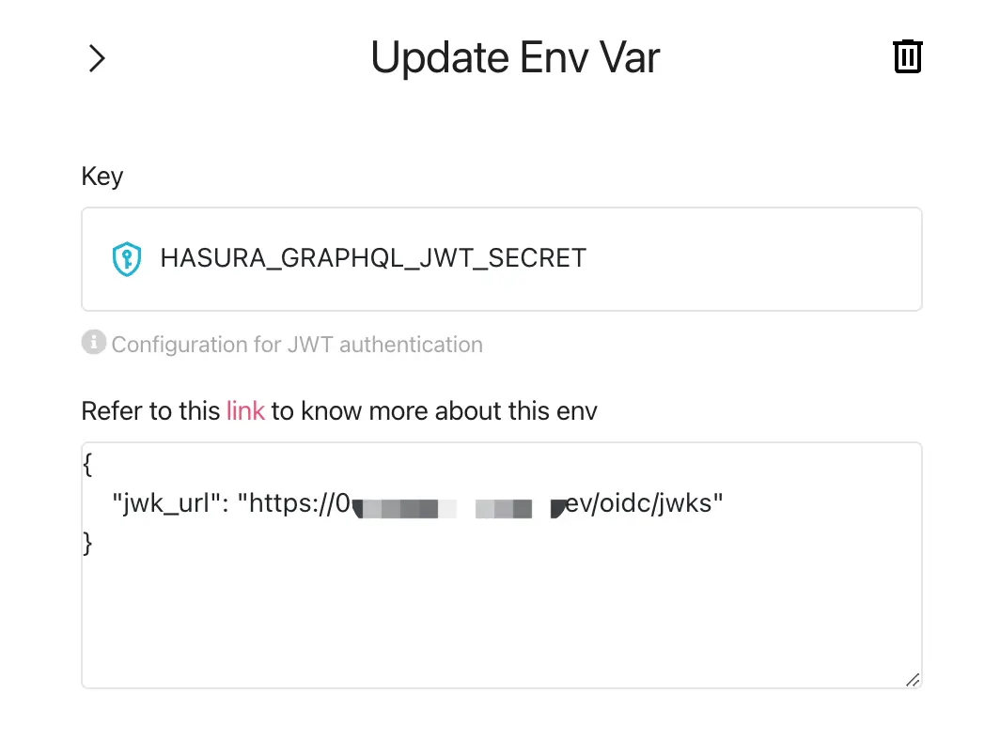

# Authentifizierung zu deiner Hasura-Anwendung hinzufügen

[Hasura](https://hasura.io/) ist ein Tool, das schnell entsprechende GraphQL- und REST-APIs für deine Daten bereitstellen kann. In Anbetracht der Datensicherheit bietet Hasura auch die Möglichkeit, den Zugriff auf jede API fein abzustimmen.

Normalerweise nutzen Hasura-Benutzer andere Identitätsmanagement- und Authentifizierungsdienste, wobei Logto einer der beliebtesten ist.

In diesem Blogbeitrag gehen wir davon aus, dass du bereits Hasura-Dienste nutzt. Wir werden vorstellen, wie man Hasura und Logto integriert, um die Sicherheit deiner Daten zu maximieren. Wenn du noch kein Logto-Konto hast, melde dich an und beginne jetzt damit!

## Hintergrund \{#background}

Hasura verwendet [rollenbasierte Zugriffsverwaltung](https://hasura.io/docs/latest/auth/overview/), während Logto die standardmäßige [rollenbasierte Zugangskontrolle (RBAC)](/authorization/role-based-access-control) nutzt.

In Logtos Modell und Best Practices für RBAC empfehlen wir Benutzern, `Berechtigung` zu verwenden, um der feinsten Granularität von Berechtigungen zu entsprechen, `Rolle` als eine Sammlung von `Berechtigungen` für bequeme Batch-Operationen zu verwenden und letztendlich `Berechtigung` (normalerweise auf der Seite der Ressourcenanbieter) zu überprüfen, um zu verifizieren, ob ein Benutzer eine bestimmte Operation ausführen kann.

In Hasura entspricht eine `Rolle` der feinsten Granularität von Berechtigungen, und Berechtigungsprüfungen werden gegen `Rollen` durchgeführt. Daher empfehlen wir bei der Konfiguration von Logto, eine `Rolle` genau einer `Berechtigung` zuzuordnen. Dieser Ansatz kann die Berechtigungen von Logto und Hasura miteinander verknüpfen, um Verwirrung und Missbrauch zu vermeiden.

Hasura kann die Zugangskontrolle mit Webhooks oder JWT unterstützen. Unser vorheriger [Blogbeitrag](https://blog.logto.io/logto-x-hasura) stellte vor, wie man Webhooks verwendet, und in den folgenden Abschnitten erklären wir, wie man Hasuras JWT-Modus-Zugangskontrolle nutzt.

## Erste Schritte \{#get-started}

Beginnen wir mit einem einfachen Beispiel. Angenommen, ein Benutzer hat bereits zwei APIs in Hasura, `GET /user` und `PATCH /user`, die zwei Rollen entsprechen: `user:reader` und `user:maintainer`.

### 1. Hasura API-Ressource in Logto erstellen \{#1-create-hasura-api-resource-in-logto}

Erstelle eine Hasura API-Ressource in Logto.


### 2. Rollen gemäß Hasura-Setup in Logto erstellen \{#2-create-roles-according-to-hasura-setup-in-logto}

Wir müssen zwei `Berechtigungen` für die in Schritt 1 erwähnte Hasura API-Ressource erstellen, nämlich `read:user` und `maintain:user`, und dann zwei Rollen erstellen: `user:reader` (enthält die `read:user` Berechtigung) und `user:maintainer` (einschließlich der `maintain:user` Berechtigung), um eins zu eins mit Hasuras Rollen zu korrespondieren. Und diese Rollen nach Bedarf Logto-Benutzern zuweisen.


### 3. Hasura-Umgebungsvariable `HASURA_GRAPHQL_JWT_SECRET` konfigurieren, um den JWT-Modus zu aktivieren \{#3-configure-hasura-environment-variable-hasura_graphql_jwt_secret-to-enable-jwt-mode}

Durch das Studium der [Hasura JWT-Konfigurationsoptionen](https://hasura.io/docs/latest/auth/authentication/jwt/#hasura-jwt-configuration-options) müssen wir die Umgebungsvariable `HASURA_GRAPHQL_JWT_SECRET` hinzufügen und konfigurieren, bevor wir JWT für die Zugangskontrolle verwenden können.

Es gibt viele verschiedene Optionen, die konfiguriert werden können, aber hier stellen wir den einfachsten Fall vor: nur die `jwk_url` muss konfiguriert werden. Dieser Wert kann von deinem Logto OpenID-Konfigurationsendpunkt (https://your.logto.domain/oidc/.well-known/openid-configuration) abgerufen werden.



### 4. Benutzer-Zugangstoken mit zusätzlichen Ansprüchen anpassen \{#4-customize-user-access-token-extra-claims}

Verwende die benutzerdefinierte Token-Ansprüche-Funktion von Logto, um die Logik anzupassen, um zusätzliche Ansprüche zum Benutzer-Zugangstoken hinzuzufügen.


Passe die Methode `getCustomJwtClaims` an, um Daten im JWT hinzuzufügen, auf die Hasura zur Implementierung der Zugangskontrolle angewiesen ist. Dies kann Daten im Zusammenhang mit dem Benutzer umfassen, der in diesem Fall autorisiert wird, einschließlich der `Rollen`, die sie besitzen, auf die über `context` zugegriffen werden kann.

Wir haben auch eine Umgebungsvariable `USER_DEFAULT_ROLE_NAMES` definiert, um Hardcoding zu vermeiden.

### 5. Logto SDK integrieren \{#5-integrate-logto-sdk}

Nach der Konfiguration von Logto und Hasura integriere deine App mit dem Logto SDK. Hier verwenden wir ein React-Beispiel, um das Benutzer-Zugangstoken anzuzeigen, das von Logto nach der Benutzeranmeldung ausgegeben wird.


Zuerst weisen wir dem Benutzer die zuvor erstellten `user:reader` und `user:maintainer` Rollen zu und melden uns dann als dieser Benutzer an.

```tsx
const config: LogtoConfig = {
  endpoint: 'http://localhost:3001',
  appId: '<your-application-id>',
  appSecret: '<your-application-secret>',
  scopes: [
    ...// bestehende Berechtigungen
    'read:user',
    'maintain:user',
  ],
  resources: [
    ...// bestehende Ressourcen
    'https://*.hasura.app/api',
  ],
};
```

Erhalte das Benutzer-Zugangstoken und fordere Hasura-APIs an:

```tsx
const accessToken = await logto.getAccessToken('https://*.hasura.app/api');

// Bevor die Anfrage an Hasura gesendet wird
request.headers.set('Authorization', `Bearer ${accessToken}`);
request.headers.set('x-Hasura-Role', '<required-role-for-the-endpoint>');
```

## Fazit \{#conclusion}

In diesem Artikel bieten wir eine weitere Methode der JWT-basierten Zugangskontrolle an, die von Hasura unterstützt wird, neben Webhook.

Durch den Vergleich der Prozesse von Hasuras [Webhook](https://hasura.io/docs/latest/auth/authentication/webhook/) und [JWT](https://hasura.io/docs/latest/auth/authentication/jwt/) Zugangskontrolle können wir sehen, dass der Webhook-Ansatz bei jeder Hasura-Anfrage einen Webhook an Logto sendet und auf eine Antwort wartet; während der JWT-basierte Ansatz kontinuierlich verwendet werden kann, bis das JWT abläuft.

Der JWT-Ansatz kann die Netzwerklast reduzieren und die durch Webhooks verursachte Netzwerklatenz eliminieren; während der Webhook-Ansatz Änderungen in den Benutzerberechtigungen in Echtzeit synchronisieren kann.

Benutzer können den geeigneten Ansatz basierend auf diesen Schlussfolgerungen in Kombination mit ihren tatsächlichen Geschäftsanforderungen wählen.
