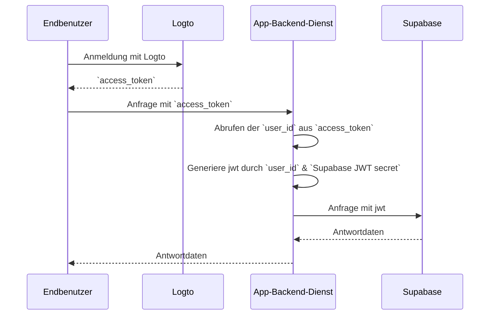

# Authentifizierung zu deiner Supabase-Anwendung hinzufügen

## Supabase-Grundlagen \{#supabase-basics}

Supabase nutzt [Postgres's Row-Level Security](https://www.postgresql.org/docs/current/ddl-rowsecurity.html), um Datenzugriffsberechtigungen zu steuern. Einfach ausgedrückt, können wir durch das Erstellen von Row-Level-Security-Richtlinien für Tabellen in der Datenbank einschränken und verwalten, wer Daten in einer Tabelle lesen, schreiben und aktualisieren kann.

Angenommen, du hast eine Tabelle namens "posts" in deiner Datenbank mit folgendem Inhalt:


Das `user_id`-Feld in der Tabelle repräsentiert den Benutzer, dem die jeweiligen Post-Daten gehören. Du kannst jeden Benutzer darauf beschränken, nur auf seine eigenen Post-Daten basierend auf dem `user_id`-Feld zuzugreifen.

Bevor dies jedoch implementiert werden kann, muss Supabase in der Lage sein, den aktuellen Benutzer zu identifizieren, der auf die Datenbank zugreift.

### Benutzerdaten zu den Supabase-Anfragen hinzufügen \{#add-user-data-to-the-supabase-requests}

Dank der Unterstützung von JWT durch Supabase können wir, wenn unsere Anwendung mit Supabase interagiert, ein JWT generieren, das Benutzerdaten enthält, indem wir das von Supabase bereitgestellte JWT-Geheimnis verwenden. Wir verwenden dieses JWT dann als Authentifizierungs-Header bei Anfragen. Beim Empfang der Anfrage überprüft Supabase automatisch die Gültigkeit des JWT und erlaubt den Zugriff auf die darin enthaltenen Daten während der nachfolgenden Prozesse.

Zuerst können wir das von Supabase bereitgestellte JWT-Geheimnis aus den "Project Settings" im Supabase-Dashboard erhalten:


Dann, wenn wir das Supabase SDK verwenden, um Anfragen an Supabase zu stellen, nutzen wir dieses Geheimnis, um unser JWT zu generieren und es als Authentifizierungs-Header an die Anfrage anzuhängen. (Bitte beachte, dass dieser Prozess innerhalb des Backend-Dienstes deiner Anwendung stattfindet und das JWT-Geheimnis niemals Dritten offengelegt werden sollte).

```jsx
import { createClient } from '@supabase/supabase-js';
import { sign } from 'jsonwebtoken';

/*
 * Hinweis:
 * Du kannst die SUPABASE_URL, SUPABASE_ANON_KEY an derselben Stelle finden, an der du das JWT-Geheimnis findest.
 */
const SUPABASE_URL = process.env.SUPABASE_URL;
const SUPABASE_ANON_KEY = process.env.SUPABASE_ANON_KEY;

const SUPABASE_JWT_SECRET = process.env.SUPABASE_JWT_SECRET;

export const getSupabaseClient = (userId) => {
  const jwtPayload = {
    userId,
  };

  const jwt = sign(jwtPayload, SUPABASE_JWT_SECRET, {
    expiresIn: '1h', // Nur zur Demonstration
  });

  const client = createClient(SUPABASE_URL, SUPABASE_ANON_KEY, {
    global: {
      headers: {
        Authorization: `Bearer ${jwt}`,
      },
    },
  });

  return client;
};
```

Als nächstes navigiere zum SQL-Editor im Supabase-Dashboard und erstelle eine Funktion, um die userId abzurufen, die in der Anfrage übermittelt wird:


Der im Bild verwendete Code lautet wie folgt:

```sql
create or replace function auth.user_id() returns text as $$
  select nullif(current_setting('request.jwt.claims', true)::json->>'userId', '')::text;
$$ language sql stable;
```

Wie der Code zeigt, kannst du in Supabase die Nutzlast des von uns generierten JWT abrufen, indem du `request.jwt.claims` aufrufst. Das `userId`-Feld innerhalb der Nutzlast ist der von uns gesetzte Wert.

Mit dieser Funktion kann Supabase den Benutzer bestimmen, der derzeit auf die Datenbank zugreift.

### Row-Level-Security-Richtlinie erstellen \{#create-row-level-security-policy}

Als nächstes können wir eine Row-Level-Security-Richtlinie erstellen, um jeden Benutzer darauf zu beschränken, nur auf seine eigenen Post-Daten basierend auf dem `user_id`-Feld in der Posts-Tabelle zuzugreifen.

1. Navigiere zur Table Editor-Seite im Supabase-Dashboard und wähle die Posts-Tabelle aus.
2. Klicke oben in der Tabelle auf "Add RLS Policy".
3. Klicke im angezeigten Fenster auf "Create policy".
4. Gib einen Richtliniennamen ein und wähle den SELECT-Richtlinienbefehl.
5. Gib im `using`-Block des folgenden Codes ein:

```sql
auth.user_id() = user_id
```


Durch die Nutzung solcher Richtlinien wird die Datenzugriffskontrolle innerhalb von Supabase erreicht.

In realen Anwendungen würdest du verschiedene Richtlinien erstellen, um Benutzeraktionen wie das Einfügen und Ändern von Daten einzuschränken. Dies liegt jedoch außerhalb des Umfangs dieses Artikels. Für weitere Informationen zu Row-Level Security (RLS) siehe [Sichern Sie Ihre Daten mit Postgres Row Level Security](https://supabase.com/docs/guides/database/postgres/row-level-security).

### Grundlegender Integrationsprozess mit Logto \{#basic-integration-process-with-logto}

Wie bereits erwähnt, da Supabase RLS für seine Zugangskontrolle verwendet, liegt der Schlüssel zur Integration mit Logto (oder einem anderen Authentifizierungsdienst) darin, die Benutzer-ID des autorisierten Benutzers zu erhalten und an Supabase zu senden. Der gesamte Prozess wird im folgenden Diagramm veranschaulicht:



Als nächstes erklären wir, wie man Logto basierend auf diesem Prozessdiagramm mit Supabase integriert.

## Logto-Integration \{#logto-integration}

Logto bietet Integrationsanleitungen für verschiedene Frameworks und Programmiersprachen.

Im Allgemeinen fallen Apps, die mit diesen Frameworks und Sprachen erstellt wurden, in Kategorien wie Native Apps, SPA (Single-Page-Apps), traditionelle Web-Apps und M2M (Maschine-zu-Maschine)-Apps. Du kannst die [Logto Quick Starts](/quick-starts) Seite besuchen, um Logto basierend auf dem von dir verwendeten Tech-Stack in deine Anwendung zu integrieren. Danach folge den untenstehenden Anweisungen, um Logto basierend auf dem Typ deiner Anwendung in dein Projekt zu integrieren.

### Native App oder SPA \{#native-app-or-spa}

Sowohl Native Apps als auch SPAs laufen auf deinem Gerät, und die Anmeldeinformationen (Zugangstoken), die nach der Anmeldung erhalten werden, werden lokal auf deinem Gerät gespeichert.

Daher musst du bei der Integration deiner App mit Supabase über deinen Backend-Dienst mit Supabase interagieren, da du keine sensiblen Informationen (wie das Supabase JWT-Geheimnis) auf jedem Benutzergerät offenlegen kannst.

Angenommen, du erstellst deine SPA mit React und Express. Du hast Logto erfolgreich in deine Anwendung integriert, indem du der [Logto React SDK-Anleitung](/quick-starts/react) gefolgt bist (du kannst den Code in unserem [React-Beispiel](https://github.com/logto-io/js/tree/master/packages/react-sample) einsehen). Außerdem hast du die Logto-Zugangstoken-Validierung zu deinem Backend-Server gemäß der [Schütze deine API auf Node (Express)](/authorization/api-resources/node-express) Dokumentation hinzugefügt.

Als nächstes verwendest du das von Logto erhaltene Zugangstoken, um Benutzerdaten von deinem Backend-Server anzufordern:

```jsx
import { useLogto } from '@logto/react';
import { useState, useEffect } from 'react';
import PostList from './PostList';

const endpoint = '<https://www.mysite.com/api/posts>';
const resource = '<https://www.mysite.com/api>';

function PostPage() {
  const { isAuthenticated, getAccessToken } = useLogto();
  const [posts, setPosts] = useState();

  useEffect(() => {
    const fetchPosts = async () => {
      const response = await fetch(endpoint, {
        headers: {
          Authorization: `Bearer ${await getAccessToken(resource)}`,
        },
      });
      setPosts(response.json());
    };

    if (isAuthenticated) {
      void fetchPosts();
    }
  }, [isAuthenticated, getAccessToken]);

  return <PostList posts={posts} />;
}

export default PostPage;
```

In deinem Backend-Server hast du bereits die ID des angemeldeten Benutzers aus dem Zugangstoken mithilfe von Middleware extrahiert:

```jsx
// auth-middleware.ts
import { createRemoteJWKSet, jwtVerify } from 'jose';

//...

export const verifyAuthFromRequest = async (ctx, next) => {
  // Extrahiere das Token
  const token = extractBearerTokenFromHeaders(ctx.request.headers);

  const { payload } = await jwtVerify(
    token, // Das rohe Bearer-Token, das aus dem Anfrage-Header extrahiert wurde
    createRemoteJWKSet(new URL('https://<your-logto-domain>/oidc/jwks')), // Erzeuge ein jwks mithilfe von jwks_uri, das vom Logto-Server abgefragt wurde
    {
      // Erwarteter Aussteller des Tokens, sollte vom Logto-Server ausgestellt sein
      issuer: 'https://<your-logto-domain>/oidc',
      // Erwartetes Zielgruppen-Token, sollte der Ressourcenindikator der aktuellen API sein
      audience: '<your request listener resource indicator>',
    }
  );

  // wenn du RBAC verwendest
  assert(payload.scope.includes('some_scope'));

  // benutzerdefinierte Nutzlastlogik
  ctx.auth = {
    userId: payload.sub,
  };

  return next();
};
```

Jetzt kannst du den oben beschriebenen `getSupabaseClient` verwenden, um die `userId` an das JWT anzuhängen, das in nachfolgenden Anfragen an Supabase verwendet wird. Alternativ kannst du eine Middleware erstellen, um einen Supabase-Client für Anfragen zu erstellen, die mit Supabase interagieren müssen:

```jsx
export const withSupabaseClient = async (ctx, next) => {
  ctx.supabase = getSupabaseClient(ctx.auth.userId);

  return next();
};
```

Im nachfolgenden Verarbeitungsfluss kannst du direkt `ctx.supabase` aufrufen, um mit Supabase zu interagieren:

```jsx
const fetchPosts = async (ctx) => {
  const { data } = await ctx.supabase.from('posts').select('*');

  return data;
};
```

In diesem Code gibt Supabase nur die Post-Daten zurück, die dem aktuellen Benutzer basierend auf den zuvor festgelegten Richtlinien gehören.

### Traditionelle Web-App \{#traditional-web-app}

Der Hauptunterschied zwischen einer traditionellen Web-App und einer Native App oder SPA besteht darin, dass eine traditionelle Web-App Seiten ausschließlich auf dem Webserver rendert und aktualisiert. Daher werden Benutzeranmeldeinformationen direkt vom Webserver verwaltet, während sie in Native Apps und SPAs auf dem Gerät des Benutzers gespeichert sind.

Bei der Integration von Logto mit einer traditionellen Web-App in Supabase kannst du die ID des angemeldeten Benutzers direkt vom Backend abrufen.

Am Beispiel eines Next.js-Projekts kannst du, nachdem du Logto gemäß der [Next.js SDK-Anleitung](/quick-starts/next-app-router) in dein Projekt integriert hast, das Logto SDK verwenden, um Benutzerinformationen abzurufen und das entsprechende JWT für die Interaktion mit Supabase zu erstellen.

```jsx
import { getLogtoContext } from '@logto/next-server-actions';
import { logtoConfig } from '@/logto';
import { getSupabaseClient } from '@/utils';
import PostList from './PostList';

export default async function PostPage() {
  const { claims } = await getLogtoContext(logtoConfig);

  // Der `sub`-Wert in `claims` ist die Benutzer-ID.
  const supabase = getSupabaseClient(claims.sub);

  const { data: posts } = await supabase.from('posts').select('*');

  return <PostList posts={posts} />;
}
```

### Maschine-zu-Maschine-App \{#machine-to-machine-app}

Maschine-zu-Maschine (M2M) wird häufig verwendet, wenn deine App direkt mit Ressourcendiensten kommunizieren muss, wie z. B. ein statischer Dienst, der tägliche Posts abruft usw.

Du kannst den [Maschine-zu-Maschine: Auth mit Logto](/quick-starts/m2m) Leitfaden für die Authentifizierung von Maschine-zu-Maschine-Apps verwenden. Die Integration zwischen Supabase und Maschine-zu-Maschine-Apps ähnelt der von Native Apps und SPAs (wie im Abschnitt "[Native App oder SPA](#native-app-or-spa)" beschrieben). Es geht darum, ein Zugangstoken von Logto zu erhalten und es dann über eine geschützte Backend-API zu validieren.

Es ist jedoch wichtig zu beachten, dass Native Apps und SPAs typischerweise für Endbenutzer entwickelt werden, sodass die erhaltene Benutzer-ID den Benutzer selbst repräsentiert. Das Zugangstoken für Maschine-zu-Maschine-Apps repräsentiert jedoch die Anwendung selbst, und das `sub`-Feld in der Zugangstoken-Nutzlast ist die Client-ID der M2M-App, nicht ein spezifischer Benutzer. Daher ist es während der Entwicklung entscheidend, zu unterscheiden, welche Daten für M2M-Apps bestimmt sind.

Darüber hinaus, wenn du möchtest, dass eine spezifische M2M-App auf Supabase im Namen des gesamten Dienstes zugreift, um RLS-Beschränkungen zu umgehen, kannst du das `service_role`-Geheimnis von Supabase verwenden, um einen Supabase-Client zu erstellen. Dies ist nützlich, wenn du einige administrative oder automatisierte Aufgaben ausführen möchtest, die Zugriff auf alle Daten erfordern, ohne durch die für einzelne Benutzer festgelegten Row-Level-Security-Richtlinien eingeschränkt zu werden.

Das `service_role`-Geheimnis findest du auf derselben Seite wie das JWT-Geheimnis:


Beim Erstellen eines Supabase-Clients verwende das `service_role`-Geheimnis, dann kann dieser Client auf alle Daten in der Datenbank zugreifen:

```jsx
import { createClient } from '@supabase/supabase-js';

// ...
const SUPABASE_SERVICE_ROLE_SECRET = process.env.SUPABASE_SERVICE_ROLE_SECRET;

const client = createClient(SUPABASE_URL, SUPABASE_SERVICE_ROLE_SECRET, {
  // ...options
});
```
