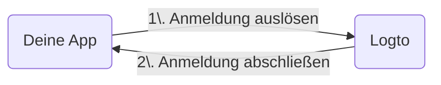

import RegardingRedirectBasedSignIn from './_regarding-redirect-based-sign-in.mdx';

Bevor wir ins Detail gehen, hier ein schneller Überblick über die Endbenutzererfahrung. Der Anmeldeprozess lässt sich wie folgt vereinfachen:

1. Deine App löst die Anmeldemethode aus.
2. Der Benutzer wird auf die Logto-Anmeldeseite umgeleitet. Bei nativen Apps wird der Systembrowser geöffnet.
3. Der Benutzer meldet sich an und wird zurück zu deiner App umgeleitet (konfiguriert als Redirect-URI).

<RegardingRedirectBasedSignIn />

---
