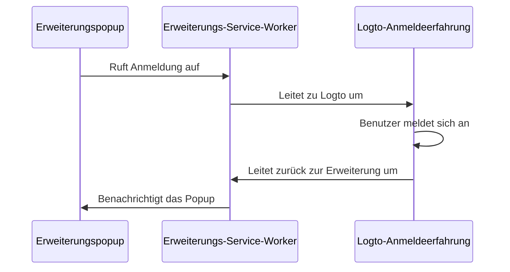

import RegardingRedirectBasedSignIn from '../../fragments/_regarding-redirect-based-sign-in.mdx';

### Der Authentifizierungsablauf \{#the-authentication-flow}

Angenommen, du platzierst einen "Anmelden"-Button im Popup deiner Chrome-Erweiterung, sieht der Authentifizierungsablauf folgendermaßen aus:



Für andere interaktive Seiten in deiner Erweiterung musst du nur den Teilnehmer `Erweiterungspopup` durch den Namen der Seite ersetzen. In diesem Tutorial konzentrieren wir uns auf die Popup-Seite.

<RegardingRedirectBasedSignIn />

### Aktualisiere die `manifest.json` \{#update-the-manifestjson}

Das Logto SDK erfordert die folgenden Berechtigungen in der `manifest.json`:

```json title="manifest.json"
{
  "permissions": ["identity", "storage"],
  "host_permissions": ["https://*.logto.app/*"]
}
```

- `permissions.identity`: Erforderlich für die Chrome Identity API, die zum Anmelden und Abmelden verwendet wird.
- `permissions.storage`: Erforderlich zum Speichern der Benutzersitzung.
- `host_permissions`: Erforderlich, damit das Logto SDK mit den Logto APIs kommunizieren kann.

:::note
Wenn du eine benutzerdefinierte Domain auf Logto Cloud verwendest, musst du die `host_permissions` aktualisieren, um deine Domain anzupassen.
:::

### Richte ein Hintergrundskript (Service-Worker) ein \{#set-up-a-background-script-service-worker}

In deinem Hintergrundskript der Chrome-Erweiterung initialisiere das Logto SDK:

```js title="service-worker.js"
import LogtoClient from '@logto/chrome-extension';

export const logtoClient = new LogtoClient({
  endpoint: '<your-logto-endpoint>'
  appId: '<your-logto-app-id>',
});
```

Ersetze `<your-logto-endpoint>` und `<your-logto-app-id>` durch die tatsächlichen Werte. Du findest diese Werte auf der Anwendungsseite, die du gerade im Logto Console erstellt hast.

Wenn du kein Hintergrundskript hast, kannst du der [offiziellen Anleitung](https://developer.chrome.com/docs/extensions/develop/concepts/service-workers/basics) folgen, um eines zu erstellen.

:::info
**Warum benötigen wir ein Hintergrundskript?**

Normale Erweiterungsseiten wie das Popup oder die Optionsseite können nicht im Hintergrund ausgeführt werden und könnten während des Authentifizierungsprozesses geschlossen werden. Ein Hintergrundskript stellt sicher, dass der Authentifizierungsprozess ordnungsgemäß abgewickelt werden kann.
:::

Dann müssen wir auf Nachrichten von anderen Erweiterungsseiten hören und den Authentifizierungsprozess abwickeln:

```js title="service-worker.js"
chrome.runtime.onMessage.addListener((message, sender, sendResponse) => {
  // Im folgenden Code, da wir `true` für jede Aktion zurückgeben, müssen wir `sendResponse` aufrufen,
  // um den Absender zu benachrichtigen. Du kannst hier auch Fehler behandeln oder andere Wege nutzen, um den Absender zu benachrichtigen.

  if (message.action === 'signIn') {
    const redirectUri = chrome.identity.getRedirectURL('/callback');
    logtoClient.signIn(redirectUri).finally(sendResponse);
    return true;
  }

  if (message.action === 'signOut') {
    const redirectUri = chrome.identity.getRedirectURL();
    logtoClient.signOut(redirectUri).finally(sendResponse);
    return true;
  }

  return false;
});
```

Du wirst bemerken, dass im obigen Code zwei Redirect-URIs verwendet werden. Beide werden durch `chrome.identity.getRedirectURL` erstellt, eine [eingebaute Chrome API](https://developer.chrome.com/docs/extensions/reference/api/identity#method-getRedirectURL), um eine Redirect-URL für Authentifizierungsabläufe zu generieren. Die beiden URIs werden sein:

- `https://<extension-id>.chromiumapp.org/callback` für die Anmeldung.
- `https://<extension-id>.chromiumapp.org/` für die Abmeldung.

Beachte, dass diese URIs nicht zugänglich sind und nur von Chrome verwendet werden, um bestimmte Aktionen für den Authentifizierungsprozess auszulösen.

### Aktualisiere die Logto-Anwendungseinstellungen \{#update-logto-application-settings}

Jetzt müssen wir die Logto-Anwendungseinstellungen aktualisieren, um die gerade erstellten Redirect-URIs zuzulassen.

1. Gehe zur Anwendungsseite im Logto Console.
2. Füge im Abschnitt "Redirect URIs" die URI hinzu: `https://<extension-id>.chromiumapp.org/callback`.
3. Füge im Abschnitt "Post sign-out redirect URIs" die URI hinzu: `https://<extension-id>.chromiumapp.org/`.
4. Füge im Abschnitt "CORS erlaubte Ursprünge" die URI hinzu: `chrome-extension://<extension-id>`. Das SDK in der Chrome-Erweiterung wird diesen Ursprung verwenden, um mit den Logto APIs zu kommunizieren.
5. Klicke auf **Änderungen speichern**.

Denke daran, `<extension-id>` durch deine tatsächliche Erweiterungs-ID zu ersetzen. Du findest die Erweiterungs-ID auf der Seite `chrome://extensions`.

### Füge Anmelde- und Abmeldebuttons zum Popup hinzu \{#add-sign-in-and-sign-out-buttons-to-the-popup}

Wir sind fast fertig! Lass uns die Anmelde- und Abmeldebuttons und andere notwendige Logik zur Popup-Seite hinzufügen.

In der Datei `popup.html`:

```html title="popup.html"
<button id="sign-in">Anmelden</button> <button id="sign-out">Abmelden</button>
```

In der Datei `popup.js` (angenommen, `popup.js` ist in `popup.html` enthalten):

```js title="popup.js"
document.getElementById('sign-in').addEventListener('click', async () => {
  await chrome.runtime.sendMessage({ action: 'signIn' });
  // Anmeldung abgeschlossen (oder fehlgeschlagen), du kannst hier die Benutzeroberfläche aktualisieren.
});

document.getElementById('sign-out').addEventListener('click', async () => {
  await chrome.runtime.sendMessage({ action: 'signOut' });
  // Abmeldung abgeschlossen (oder fehlgeschlagen), du kannst hier die Benutzeroberfläche aktualisieren.
});
```

### Checkpoint: Teste den Authentifizierungsablauf \{#checkpoint-test-the-authentication-flow}

Jetzt kannst du den Authentifizierungsablauf in deiner Chrome-Erweiterung testen:

1. Öffne das Erweiterungspopup.
2. Klicke auf den "Anmelden"-Button.
3. Du wirst zur Logto-Anmeldeseite weitergeleitet.
4. Melde dich mit deinem Logto-Konto an.
5. Du wirst zurück zu Chrome weitergeleitet.

### Überprüfe den Authentifizierungsstatus \{#check-authentication-state}

Da Chrome einheitliche Speicher-APIs bereitstellt, können alle anderen Logto SDK-Methoden, abgesehen vom Anmelde- und Abmeldeablauf, direkt auf der Popup-Seite verwendet werden.

In deinem `popup.js` kannst du die `LogtoClient`-Instanz aus dem Hintergrundskript wiederverwenden oder eine neue mit derselben Konfiguration erstellen:

```js title="popup.js"
import LogtoClient from '@logto/chrome-extension';

const logtoClient = new LogtoClient({
  endpoint: '<your-logto-endpoint>'
  appId: '<your-logto-app-id>',
});

// Oder die logtoClient-Instanz aus dem Hintergrundskript wiederverwenden
import { logtoClient } from './service-worker.js';
```

Dann kannst du eine Funktion erstellen, um den Authentifizierungsstatus und das Benutzerprofil zu laden:

```js title="popup.js"
const loadAuthenticationState = async () => {
  const isAuthenticated = await logtoClient.isAuthenticated();
  // Aktualisiere die Benutzeroberfläche basierend auf dem Authentifizierungsstatus

  if (isAuthenticated) {
    const user = await logtoClient.getIdTokenClaims(); // { sub: '...', email: '...', ... }
    // Aktualisiere die Benutzeroberfläche mit dem Benutzerprofil
  }
};
```

Du kannst die Funktion `loadAuthenticationState` auch mit der Anmelde- und Abmeldelogik kombinieren:

```js title="popup.js"
document.getElementById('sign-in').addEventListener('click', async () => {
  await chrome.runtime.sendMessage({ action: 'signIn' });
  await loadAuthenticationState();
});

document.getElementById('sign-out').addEventListener('click', async () => {
  await chrome.runtime.sendMessage({ action: 'signOut' });
  await loadAuthenticationState();
});
```

Hier ist ein Beispiel der Popup-Seite mit dem Authentifizierungsstatus:


### Weitere Überlegungen \{#other-considerations}

- **Service-Worker-Bundling**: Wenn du einen Bundler wie Webpack oder Rollup verwendest, musst du das Ziel explizit auf `browser` oder ähnlich setzen, um unnötiges Bundling von Node.js-Modulen zu vermeiden.
- **Modulauflösung**: Das Logto Chrome-Erweiterungs-SDK ist ein ESM-only-Modul.

Siehe unser [Beispielprojekt](https://github.com/logto-io/js/tree/HEAD/packages/chrome-extension-sample) für ein vollständiges Beispiel mit TypeScript, Rollup und anderen Konfigurationen.
