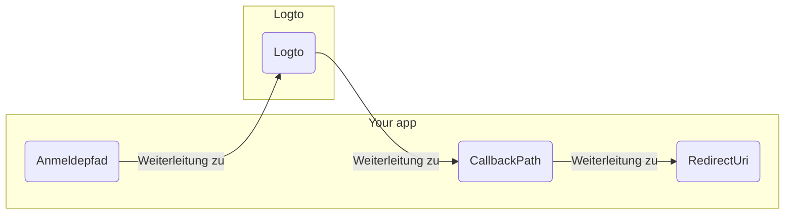

import RegardingRedirectBasedSignIn from '../../fragments/_regarding-redirect-based-sign-in.mdx';

Bevor wir fortfahren, gibt es zwei verwirrende Begriffe im .NET Core Authentifizierungs-Middleware, die wir klären müssen:

1. **CallbackPath**: Die URI, zu der Logto den Benutzer zurückleitet, nachdem der Benutzer sich angemeldet hat (die "Redirect-URI" in Logto)
2. **RedirectUri**: Die URI, zu der weitergeleitet wird, nachdem die notwendigen Aktionen im Logto Authentifizierungs-Middleware durchgeführt wurden.

Der Anmeldeprozess kann wie folgt veranschaulicht werden:

 

Ähnlich hat .NET Core auch **SignedOutCallbackPath** und **RedirectUri** für den Abmeldefluss.

Zur Klarheit werden wir sie wie folgt bezeichnen:

| Begriff, den wir verwenden        | .NET Core Begriff     |
| --------------------------------- | --------------------- |
| Logto Redirect-URI                | CallbackPath          |
| Logto Post-Abmeldung Redirect-URI | SignedOutCallbackPath |
| Anwendungs-Redirect-URI           | RedirectUri           |

<RegardingRedirectBasedSignIn />
