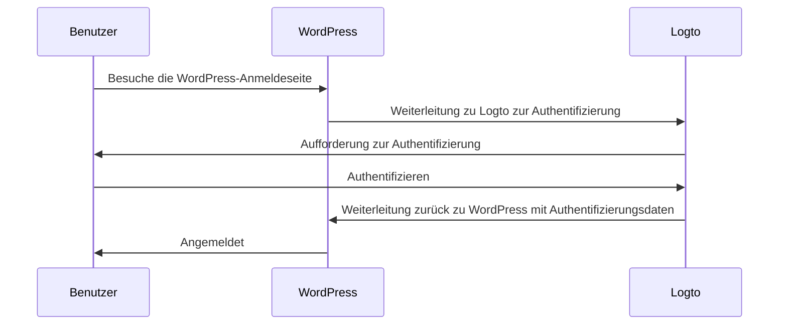
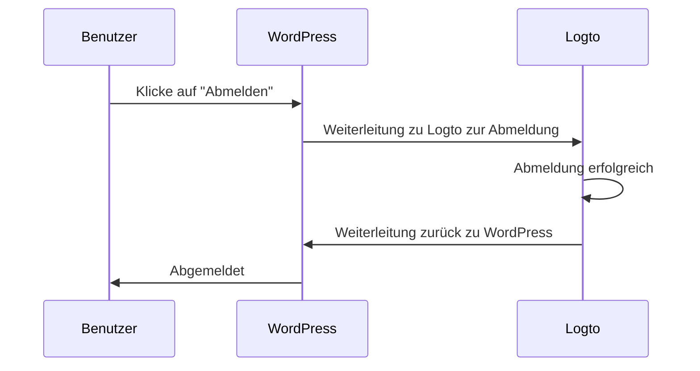

import TabItem from '@theme/TabItem';
import Tabs from '@theme/Tabs';

import FurtherReadings from '../../fragments/_further-readings.md';

# Authentifizierung zu deiner WordPress-Website mit Logto-Plugin hinzufügen

Dieses Tutorial zeigt dir, wie du Logto in deine [WordPress](https://wordpress.org) Website mit unserem offiziellen WordPress-Plugin integrierst.

## Voraussetzungen \{#prerequisites}

- Ein [Logto Cloud](https://cloud.logto.io) Konto oder ein [selbst gehostetes Logto](/introduction/set-up-logto-oss).
- Eine Logto traditionelle Anwendung erstellt.
- Ein WordPress-Projekt: Folge der offiziellen [WordPress-Installationsanleitung](https://wordpress.org/support/article/how-to-install-wordpress/), um deine WordPress-Website einzurichten, bevor du fortfährst.

## Integration \{#integration}

### Installiere das Plugin \{#authentication-settings}

:::info
Momentan wird unser Plugin noch überprüft und ist nicht im WordPress-Plugin-Verzeichnis verfügbar. Wir werden diese Seite aktualisieren, sobald es verfügbar ist.
:::

<Tabs>

{/* Uncomment the following block when plugin is available in the WordPress plugin directory */}
{/* <TabItem value="admin-panel" label="Aus dem WordPress-Admin-Panel"> */}

{/* 1. Gehe zu **Plugins** > **Neu hinzufügen**. */}
{/* 2. Suche nach "Logto". */}
{/* 3. Klicke auf **Jetzt installieren**. */}
{/* 4. Klicke auf **Aktivieren**. */}

{/* </TabItem> */}

<TabItem value="upload" label="Vom Upload">

1. Lade das Logto WordPress-Plugin von einem der folgenden Links herunter:
   - [Neueste Version](https://github.com/logto-io/wordpress/releases): Lade die Datei herunter, deren Name im Format `logto-plugin-<version>.zip` ist.
     {/* Uncomment the following line when plugin is available in the WordPress plugin directory */}
     {/* - [WordPress-Plugin-Verzeichnis](https://wordpress.org/plugins) und suche nach "Logto". */}
2. Lade die Plugin-ZIP-Datei herunter.
3. Gehe zu **Plugins** > **Neu hinzufügen** in deinem WordPress-Admin-Panel.
4. Klicke auf **Plugin hochladen**.
5. Wähle die heruntergeladene ZIP-Datei aus und klicke auf **Jetzt installieren**.
6. Klicke auf **Aktivieren**.

</TabItem>

</Tabs>

### Konfiguriere das Plugin \{#scopes}

Jetzt solltest du das Logto-Menü in der Seitenleiste deines WordPress-Admin-Panels sehen können. Klicke auf **Logto** > **Einstellungen**, um das Plugin zu konfigurieren.

:::note
Du solltest eine **traditionelle Web**-Anwendung in der Logto-Konsole erstellt haben, bevor du das Plugin konfigurierst. Wenn du noch keine erstellt hast, siehe [Logto in deine Anwendung integrieren](/integrate-logto/integrate-logto-into-your-application) für weitere Informationen.
:::

Die minimale Konfiguration, um mit dem Plugin zu starten, ist:

- Logto-Endpunkt: Der Endpunkt deines Logto-Tenants.
- App-ID: Die App-ID deiner Logto-Anwendung.
- App-Geheimnis: Eines der gültigen App-Geheimnisse deiner Logto-Anwendung.

Alle Werte findest du auf der Anwendungsdetailseite in der Logto-Konsole.

Nachdem du die Werte eingegeben hast, klicke auf **Änderungen speichern** (scrolle nach unten, wenn du den Button nicht finden kannst).

### Konfiguriere die Redirect-URI \{#extra-params}

Die Redirect-URI ist die URL, zu der Logto Benutzer weiterleitet, nachdem sie authentifiziert wurden; und die Post-Sign-out-Redirect-URI ist die URL, zu der Logto Benutzer weiterleitet, nachdem sie sich abgemeldet haben.

Hier ist ein nicht-normativer Sequenzdiagramm, um den Anmeldefluss zu veranschaulichen:

So sieht der Abmeldefluss in einem nicht-normativen Sequenzdiagramm aus:

Um mehr darüber zu erfahren, warum eine Weiterleitung erforderlich ist, siehe [Anmeldeerfahrung erklärt](/concepts/sign-in-experience).

In unserem Fall müssen wir beide Redirect-URIs in deiner Logto-Konsole konfigurieren. Um die Redirect-URI zu finden, gehe zur **Logto** > **Einstellungen** Seite in deinem WordPress-Admin-Panel. Du wirst die Felder **Redirect URI** und **Post-Sign-out Redirect URI** sehen.

1. Kopiere die Werte **Redirect URI** und **Post-Sign-out Redirect URI** und füge sie in die Felder **Redirect URIs** und **Post-Sign-out Redirect URIs** in deiner Logto-Konsole ein.
2. Klicke auf **Änderungen speichern** in der Logto-Konsole.

### Checkpoint: Teste deine WordPress-Website \{#require-verified-email}

Jetzt kannst du deine Logto-Integration auf deiner WordPress-Website testen:

1. Öffne ein Inkognito-Browserfenster, falls erforderlich.
2. Besuche deine WordPress-Website und klicke auf den **Anmelden**-Link, falls zutreffend; oder besuche direkt die Anmeldeseite (z. B. `https://example.com/wp-login.php`).
3. Die Seite sollte dich zur Logto-Anmeldeseite weiterleiten.
4. Schließe den Anmelde- oder Registrierungsprozess ab.
5. Nach erfolgreicher Authentifizierung solltest du automatisch zurück zu deiner WordPress-Website weitergeleitet und angemeldet werden.
6. Klicke auf den **Abmelden**-Link, um dich von deiner WordPress-Website abzumelden.
7. Du solltest zur Logto-Abmeldeseite und dann zurück zu deiner WordPress-Website weitergeleitet werden.
8. Du solltest von deiner WordPress-Website abgemeldet sein.

## Authentifizierungseinstellungen \{#require-organization-id}

Obwohl das Plugin sofort einsatzbereit ist, kannst du die Authentifizierungseinstellungen auf der Logto-Plugin-Einstellungsseite anpassen, um sie besser an deine Bedürfnisse anzupassen.

### Berechtigungen \{#authorization-settings}

Logto verwendet Berechtigungen, um zu steuern, welche Informationen mit deiner Anwendung geteilt werden. Das Logto WordPress-Plugin verwendet das [Logto PHP SDK](https://github.com/logto-io/php), um den Authentifizierungsprozess zu handhaben, der standardmäßig die folgenden Berechtigungen umfasst:

- `openid`: Die grundlegende Berechtigung, die für OpenID Connect erforderlich ist.
- `profile`: Um die grundlegenden Profildaten des Benutzers zu erhalten.
- `offline_access`: Um ein Auffrischungstoken für den Offline-Zugriff zu erhalten.

Für weitere Informationen über Berechtigungen siehe [Berechtigungen und Ansprüche](/quick-starts/php#scopes-and-claims).

Das Plugin fügt standardmäßig auch zwei zusätzliche Berechtigungen hinzu:

- `email`: Um die E-Mail-Adresse des Benutzers zu erhalten.
- `roles`: Um die Rollen des Benutzers in Logto zu erhalten.

Diese beiden Berechtigungen werden verwendet, um Logto-E-Mail und -Rollen mit WordPress-E-Mail und -Rollen zu verknüpfen. Du kannst die Berechtigungen anpassen, indem du das Feld **Berechtigungen** in den Plugin-Einstellungen bearbeitest.

:::warning
Wenn du die Berechtigung `email` oder `roles` entfernst, funktionieren einige Funktionen des Plugins möglicherweise nicht richtig.
:::

### Zusätzliche Parameter \{#role-mapping}

Möglicherweise möchtest du einige zusätzliche Parameter zur Authentifizierungsanfrage hinzufügen, um den Authentifizierungsprozess anzupassen. Zum Beispiel kannst du den Parameter `first_screen` hinzufügen, um zu entscheiden, welcher Bildschirm zuerst im Authentifizierungsprozess angezeigt wird.

Für weitere Informationen über zusätzliche Parameter siehe [Authentifizierungsparameter](/end-user-flows/authentication-parameters).

### Verifizierte E-Mail erforderlich \{#advanced-settings}

Standardmäßig erfordert das Plugin, dass Benutzer eine verifizierte E-Mail-Adresse in Logto haben, um sich auf deiner WordPress-Website anzumelden. Wenn ein Benutzer versucht, sich ohne verifizierte E-Mail-Adresse anzumelden, wird das Plugin einen Fehler auslösen.

Du kannst diese Funktion deaktivieren, indem du die Option **Verifizierte E-Mail erforderlich** in den Plugin-Einstellungen deaktivierst.

### Organisations-ID erforderlich \{#remember-session}

Du kannst verlangen, dass Benutzer eine bestimmte Organisationsmitgliedschaft in Logto haben, um sich auf deiner WordPress-Website anzumelden. Wenn eine Organisations-ID angegeben ist, überprüft das Plugin, ob der Benutzer die angegebene Organisations-ID in seinem ID-Token hat. Wenn nicht, wird ein Fehler ausgelöst.

Um mehr über Organisationen zu erfahren, siehe [Organisationen](/organizations).

## Autorisierungseinstellungen \{#sync-profile}

Neben der Authentifizierung bietet Logto auch Autorisierungsfunktionen wie [rollenbasierte Zugangskontrolle (RBAC)](/authorization/role-based-access-control). Während es etwas benutzerdefinierten Code erfordert, um RBAC zu implementieren, wenn du deine eigene Anwendung entwickelst, bietet das Logto WordPress-Plugin eine integrierte Möglichkeit, Logto-Rollen mit [WordPress-Rollen](https://wordpress.org/documentation/article/roles-and-capabilities/) zu verknüpfen.

### Rollenzuordnung \{#wordpress-form-login}

Das Logto WordPress-Plugin ermöglicht es dir, Logto-Rollen mit WordPress-Rollen zu verknüpfen. Das bedeutet, dass du in Logto verschiedene Rollen an Benutzer vergeben kannst, und das Plugin wird diesen Benutzern beim Anmelden automatisch die entsprechenden WordPress-Rollen zuweisen.

Um Rollen zuzuordnen, klicke auf **Hinzufügen** im Abschnitt **Rollenzuordnung**, um eine neue Rollenzuordnung hinzuzufügen. Wenn du beispielsweise die Rolle `group:editors` in Logto mit der Rolle `Editor` in WordPress verknüpfen möchtest, kannst du dies tun, indem du eine neue Rollenzuordnung mit den folgenden Werten hinzufügst:

- Logto-Rolle: `group:editors`
- WordPress-Rolle: `editor` (der Rollenslug der `Editor`-Rolle in WordPress)

Du findest die Rollenslugs aller WordPress-Rollen in der [Rollen und Fähigkeiten](https://wordpress.org/documentation/article/roles-and-capabilities/) Dokumentation.

:::note
Rollenslugs sind case-sensitive. Wenn du den Rollennamen wie `Editor` anstelle von `editor` eingibst, funktioniert die Rollenzuordnung nicht.
:::

Gehe jetzt zur Logto-Konsole und klicke auf **Rollen** in der linken Seitenleiste. Erstelle eine neue Rolle namens `group:editors` und weise sie einem Benutzer zu. Melde dich dann mit diesem Benutzer auf deiner WordPress-Website an. Du solltest sehen, dass dem Benutzer die `Editor`-Rolle in WordPress zugewiesen wurde.

:::note
Wenn der Benutzer sich bereits auf deiner WordPress-Website angemeldet hat, wird die Rollenzuordnung erst wirksam, wenn der Benutzer sich abmeldet und erneut anmeldet.
:::

Du kannst auch mehrere Rollenzuordnungen hinzufügen, um mehrere Logto-Rollen mit WordPress-Rollen zu verknüpfen. Momentan versucht das Plugin, die Rollen in der Reihenfolge der Priorität zuzuordnen. Wenn du beispielsweise die folgenden Rollenzuordnungen hast:

- Logto-Rolle: `group:editors`, WordPress-Rolle: `editor`
- Logto-Rolle: `group:authors`, WordPress-Rolle: `author`
- Logto-Rolle: `group:subscribers`, WordPress-Rolle: `subscriber`

Und ein Benutzer hat sowohl die Rollen `group:editors` als auch `group:authors` in Logto, wird dem Benutzer die `Editor`-Rolle in WordPress zugewiesen.

## Erweiterte Einstellungen \{#username-strategy}

### Sitzung merken \{#troubleshooting}

Standardmäßig merkt sich das Plugin die Sitzung des Benutzers für 2 Wochen. Das bedeutet, dass wenn sich ein Benutzer auf deiner WordPress-Website anmeldet, er für 2 Wochen nicht erneut zur Anmeldung aufgefordert wird. Du kannst diese Zeit auf 2 Tage reduzieren, indem du die Option **Sitzung merken** in den Plugin-Einstellungen deaktivierst.

### Profil synchronisieren \{#callback-url-shows-404}

Standardmäßig synchronisiert das Plugin das Profil des Benutzers bei jedem Login. Das bedeutet, dass wenn sich ein Benutzer auf deiner WordPress-Website anmeldet, sein Profil mit den neuesten Informationen von Logto aktualisiert wird. Du kannst diese Funktion deaktivieren, indem du die Option **Profil synchronisieren** in den Plugin-Einstellungen deaktivierst.

:::warning
Wenn du diese Funktion deaktivierst, wird die Rollenzuordnung nur wirksam, wenn sich der Benutzer zum ersten Mal anmeldet.
:::

### WordPress-Formular-Login \{#frequently-asked-questions}

Standardmäßig kannst du `?form=1` an die WordPress-Login-URL anhängen, um den WordPress-Formular-Login zu verwenden. Dies ist nützlich für Testzwecke, aber du kannst diese Funktion deaktivieren, wenn du nicht möchtest, dass Benutzer sich mit dem WordPress-Formular anmelden.

### Benutzernamen-Strategie \{#how-can-i-trigger-the-forgot-password-flow}

Es gibt mehrere Möglichkeiten, einen Benutzernamen für einen Benutzer in WordPress zu generieren. Es ist sicher, die Standardstrategie zu verwenden, wenn du dich auf die E-Mail als eindeutigen Identifikator eines Benutzers verlässt.

## Fehlerbehebung \{#how-can-i-use-the-wordpress-form-login}

### Callback-URL zeigt 404 \{#further-readings}

Wenn die Callback-URL einen 404-Fehler anzeigt, ist es wahrscheinlich, dass deine WordPress-Umschreiberegeln veraltet sind und manuell aktualisiert werden müssen. Gehe dazu zu **Einstellungen** > **Permalinks** in deinem WordPress-Admin-Panel (oder besuche `/wp-admin/options-permalink.php` direkt) und klicke auf **Änderungen speichern**.

## Häufig gestellte Fragen \{#frequently-asked-questions}

### Wie kann ich den Passwort-vergessen-Fluss auslösen? \{#how-can-i-trigger-the-forgot-password-flow}

Es gibt zwei Möglichkeiten, den Passwort-vergessen-Fluss auszulösen:

1. Klicke auf den Passwort-vergessen-Link auf der Logto-Anmeldeseite.
2. Hänge `?action=lostpassword` an die WordPress-Login-URL an. Zum Beispiel `https://example.com/wp-login.php?action=lostpassword`.
   Dies wird dich zur Logto-Passwort-vergessen-Seite weiterleiten.

### Wie kann ich den WordPress-Formular-Login verwenden? \{#how-can-i-use-the-wordpress-form-login}

Standardmäßig kannst du `?form=1` an die WordPress-Login-URL anhängen, um den WordPress-Formular-Login zu verwenden. Zum Beispiel `https://example.com/wp-login.php?form=1`.

Wenn du diese Funktion deaktivieren möchtest, kannst du die Option **WordPress-Formular-Login** in den Plugin-Einstellungen deaktivieren.

## Weiterführende Lektüre \{#further-readings}

<FurtherReadings />
