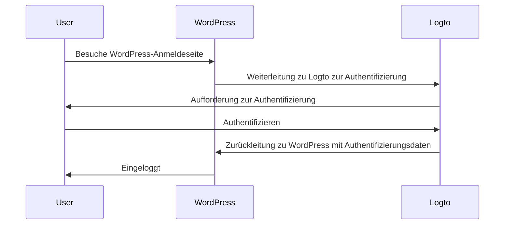
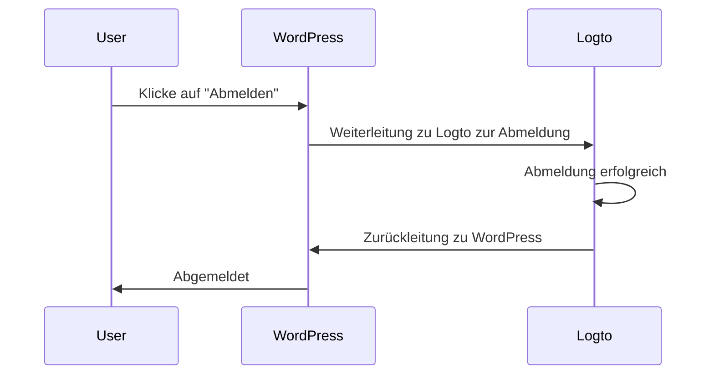

import TabItem from '@theme/TabItem';
import Tabs from '@theme/Tabs';

### Plugin installieren \{#install-the-plugin}

<Tabs>

<TabItem value="admin-panel" label="Über das WordPress-Admin-Panel">

1. Gehe zu **Plugins** > **Neu hinzufügen**.
2. Suche nach "Logto" oder gib https://wordpress.org/plugins/logto/ in das Suchfeld ein.
3. Klicke auf **Jetzt installieren**.
4. Klicke auf **Aktivieren**.

</TabItem>

<TabItem value="upload" label="Über Upload">

1. Lade das Logto WordPress-Plugin von einem der folgenden Links herunter:
   - [Neueste Version](https://github.com/logto-io/wordpress/releases): Lade die Datei herunter, deren Name im Format `logto-plugin-<version>.zip` ist.
   - [WordPress Plugin-Verzeichnis](https://wordpress.org/plugins/logto/): Lade die Datei herunter, indem du auf die **Download**-Schaltfläche klickst.
2. Lade die Plugin-ZIP-Datei herunter.
3. Gehe zu **Plugins** > **Neu hinzufügen** in deinem WordPress-Admin-Panel.
4. Klicke auf **Plugin hochladen**.
5. Wähle die heruntergeladene ZIP-Datei aus und klicke auf **Jetzt installieren**.
6. Klicke auf **Aktivieren**.

</TabItem>

</Tabs>

### Plugin konfigurieren \{#configure-the-plugin}

Nun solltest du das Logto-Menü in der Seitenleiste deines WordPress-Admin-Panels sehen können. Klicke auf **Logto** > **Einstellungen**, um das Plugin zu konfigurieren.

:::note
Du solltest eine **traditionelle Web**-Anwendung in der Logto Console erstellt haben, bevor du das Plugin konfigurierst. Wenn du noch keine erstellt hast, siehe [Logto in deine Anwendung integrieren](/integrate-logto/integrate-logto-into-your-application) für weitere Informationen.
:::

Die minimale Konfiguration, um mit dem Plugin zu starten, ist:

- Logto-Endpunkt: Der Endpunkt deines Logto-Tenants.
- App-ID: Die App-ID deiner Logto-Anwendung.
- App-Geheimnis: Eines der gültigen App-Geheimnisse deiner Logto-Anwendung.

Alle Werte findest du auf der Anwendungsdetailseite in der Logto Console.

Nachdem du die Werte eingegeben hast, klicke auf **Änderungen speichern** (scrolle nach unten, wenn du die Schaltfläche nicht finden kannst).

### Redirect-URI konfigurieren \{#configure-redirect-uri}

Die Redirect-URI ist die URL, zu der Logto Benutzer nach der Authentifizierung weiterleitet; und die Post-Sign-out-Redirect-URI ist die URL, zu der Logto Benutzer nach dem Abmelden weiterleitet.

Hier ist ein nicht-normativer Sequenzdiagramm, um den Anmeldefluss zu veranschaulichen:

So sieht der Abmeldefluss in einem nicht-normativen Sequenzdiagramm aus:

Um mehr darüber zu erfahren, warum eine Weiterleitung erforderlich ist, siehe [Anmeldeerfahrung erklärt](/concepts/sign-in-experience).

In unserem Fall müssen wir beide Redirect-URIs in deiner Logto Console konfigurieren. Um die Redirect-URI zu finden, gehe zur **Logto** > **Einstellungen**-Seite in deinem WordPress-Admin-Panel. Du siehst die Felder **Redirect URI** und **Post-Sign-out Redirect URI**.

1. Kopiere die Werte **Redirect URI** und **Post-Sign-out Redirect URI** und füge sie in die Felder **Redirect URIs** und **Post-Sign-out Redirect URIs** in deiner Logto Console ein.
2. Klicke auf **Änderungen speichern** in der Logto Console.

### Checkpoint: Teste deine WordPress-Website \{#checkpoint-test-your-website}

Jetzt kannst du deine Logto-Integration auf deiner WordPress-Website testen:

1. Öffne ein Inkognito-Browserfenster, falls erforderlich.
2. Besuche deine WordPress-Website und klicke auf den **Anmelden**-Link, falls zutreffend; oder besuche direkt die Anmeldeseite (z. B. `https://example.com/wp-login.php`).
3. Die Seite sollte dich zur Logto-Anmeldeseite weiterleiten.
4. Schließe den Anmelde- oder Registrierungsprozess ab.
5. Nach erfolgreicher Authentifizierung solltest du automatisch zurück zu deiner WordPress-Website weitergeleitet und eingeloggt werden.
6. Klicke auf den **Abmelden**-Link, um dich von deiner WordPress-Website abzumelden.
7. Du solltest zur Logto-Abmeldeseite und dann zurück zu deiner WordPress-Website weitergeleitet werden.
8. Du solltest von deiner WordPress-Website abgemeldet sein.