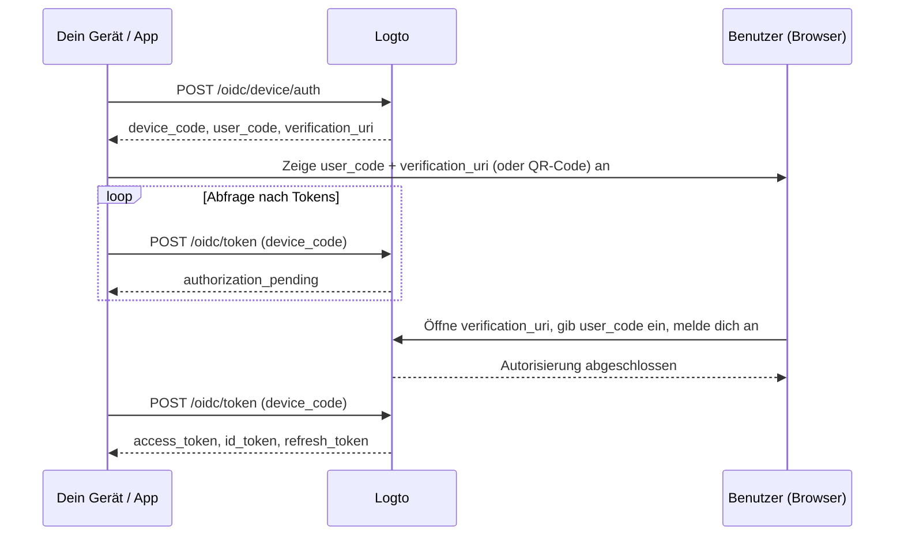

import ApiResourcesDescription from '../../fragments/_api-resources-description.md';
import FurtherReadings from '../../fragments/_further-readings.md';
import ScopeClaimList from '../../fragments/_scope-claim-list.md';
import ScopesAndClaimsIntroduction from '../../fragments/_scopes-claims-introduction.md';

# Device flow: Auth mit Logto

:::note
Diese Anleitung setzt voraus, dass du eine Anwendung vom Typ „Native“ mit Device Flow als Autorisierungsflow in der Logto-Konsole erstellt hast.
:::

## Einführung \{#introduction}

Der [OAuth 2.0 Device Authorization Grant](https://auth.wiki/device-flow) (Device Flow) ist für Geräte mit eingeschränkten Eingabemöglichkeiten konzipiert, wie Smart-TVs, Spielkonsolen, CLI-Tools und IoT-Geräte. Er ermöglicht es Benutzern, den Anmeldeprozess auf dem Gerät zu starten, aber die Authentifizierung auf einem separaten Gerät mit Browser, wie einem Telefon oder Laptop, abzuschließen.

Da das Gerät selbst keinen browserbasierten Anmeldeflow durchführen kann, zeigt das Gerät einen kurzen Code und eine URL an. Der Benutzer besucht diese URL auf einem anderen Gerät, gibt den Code ein und meldet sich an. In der Zwischenzeit fragt das ursprüngliche Gerät Logto ab, bis die Autorisierung abgeschlossen ist.



## Anwendungs-Credentials abrufen \{#get-application-credentials}

Navigiere in deiner Logto-Konsole zur Detailseite deiner Anwendung, um die folgenden Zugangsdaten zu erhalten:

- **App ID**: Die eindeutige Kennung deiner Anwendung (auch bekannt als `client_id`).
- **Logto-Endpunkt**: Dein Logto-Autorisierungsserver-Endpunkt. Du findest ihn in der Logto-Konsole unter „Anwendungsdetails“.

Für Logto Cloud lautet der Endpunkt `https://{your-tenant-id}.logto.app`.

:::note
Device Flow Apps sind öffentliche Clients, daher ist kein App Secret erforderlich.
:::

## Device Code anfordern \{#request-a-device-code}

Starte den Device Flow, indem du eine `POST`-Anfrage an den Device Authorization Endpoint sendest:

```bash
curl --request POST 'https://your.logto.endpoint/oidc/device/auth' \
  --header 'Content-Type: application/x-www-form-urlencoded' \
  --data-urlencode 'client_id=your-application-id' \
  --data-urlencode 'scope=openid offline_access profile'
```

Die Antwort enthält:

| Feld                        | Beschreibung                                                                                                                                                                                 |
| --------------------------- | -------------------------------------------------------------------------------------------------------------------------------------------------------------------------------------------- |
| `device_code`               | Ein eindeutiger Code, den deine App beim Polling des Token-Endpunkts verwendet.                                                                                                              |
| `user_code`                 | Ein kurzer Code, der dem Benutzer angezeigt wird, damit er ihn im Browser eingibt.                                                                                                           |
| `verification_uri`          | Die URL, bei der der Benutzer den `user_code` eingibt.                                                                                                                                       |
| `verification_uri_complete` | Eine URL mit vorausgefülltem `user_code`. Benutzer können diese URL direkt besuchen, um die manuelle Codeeingabe zu überspringen — du kannst sie als QR-Code, Link oder anders präsentieren. |
| `expires_in`                | Die Lebensdauer in Sekunden von `device_code` und `user_code`. Nach Ablauf nicht mehr weiter abfragen.                                                                                       |

## Zeige die Verifizierungs-URL dem Benutzer an \{#display-verification-url}

Zeige den `user_code` und die `verification_uri` auf dem Bildschirm deines Geräts an.

Alternativ kannst du `verification_uri_complete` verwenden, bei dem der Code bereits vorausgefüllt ist — der Benutzer muss nur noch bestätigen. Wie du es präsentierst, bleibt dir überlassen: QR-Code, klickbarer Link usw.

## Abfrage nach Tokens \{#poll-for-tokens}

Während der Benutzer die Authentifizierung im Browser abschließt, sollte dein Gerät den Token-Endpunkt abfragen. Deine App sollte mindestens **5 Sekunden** zwischen den Abfragen warten:

```bash
curl --request POST 'https://your.logto.endpoint/oidc/token' \
  --header 'Content-Type: application/x-www-form-urlencoded' \
  --data-urlencode 'client_id=your-application-id' \
  --data-urlencode 'grant_type=urn:ietf:params:oauth:grant-type:device_code' \
  --data-urlencode 'device_code=DEVICE_CODE'
```

Ersetze `DEVICE_CODE` durch den Wert `device_code` aus der Device Authorization Antwort.

**Beende das Polling**, wenn:

- Du eine erfolgreiche Token-Antwort erhältst.
- Die `expires_in`-Zeit aus der Device Code Antwort abgelaufen ist.
- Du einen nicht wiederholbaren Fehler wie `expired_token` oder `access_denied` erhältst.

### Token-Antwort \{#token-response}

Nachdem der Benutzer zugestimmt hat, enthält die Antwort:

| Feld            | Beschreibung                                                                                                                                                                    |
| --------------- | ------------------------------------------------------------------------------------------------------------------------------------------------------------------------------- |
| `access_token`  | Das Zugangstoken (Access token). Dies ist standardmäßig eine opake Zeichenkette; wenn ein `resource` angefordert wird, ist es ein JWT mit `aud` auf die Ressourcen-URI gesetzt. |
| `id_token`      | Das ID-Token (ID token) mit Benutzeridentitätsansprüchen. Nur vorhanden, wenn der `openid` Scope angefordert wurde.                                                             |
| `refresh_token` | Wird verwendet, um neue Tokens ohne erneute Authentifizierung zu erhalten. Nur vorhanden, wenn der `offline_access` Scope angefordert wurde.                                    |
| `token_type`    | Immer `Bearer`.                                                                                                                                                                 |
| `expires_in`    | Lebensdauer des Tokens in Sekunden.                                                                                                                                             |
| `scope`         | Die vom Autorisierungsserver gewährten Berechtigungen (Scopes).                                                                                                                 |

## Checkpoint: Teste deinen Device Flow \{#checkpoint}

Teste jetzt deine Device Flow-Integration:

1. Starte deine App und löse den Device Flow aus, um einen `device_code` und `user_code` zu erhalten.
2. Öffne die `verification_uri` in einem Browser und gib den `user_code` ein, oder verwende `verification_uri_complete`, um die manuelle Codeeingabe zu überspringen.
3. Schließe den Anmeldeprozess im Browser ab.
4. Überprüfe, ob deine App nach dem Polling Tokens erhält.

## Benutzerinformationen abrufen \{#get-user-information}

### ID-Token-Ansprüche dekodieren \{#decode-id-token-claims}

Das im Token-Response zurückgegebene `id_token` ist ein standardmäßiges [JSON Web Token (JWT)](https://auth.wiki/jwt). Du kannst den Base64URL-codierten Payload-Teil (der zweite Teil des JWT, durch `.` getrennt) dekodieren, um grundlegende Benutzeransprüche ohne zusätzliche Netzwerkabfrage zu erhalten.

Der dekodierte Payload enthält Ansprüche wie `sub` (Benutzer-ID), `name`, `email` usw., abhängig von den angeforderten Berechtigungen (Scopes).

:::tip
Für den produktiven Einsatz solltest du die JWT-Signatur validieren, bevor du den Ansprüchen vertraust. Verwende das JWKS von deinem Logto-Endpunkt (`https://your.logto.endpoint/oidc/jwks`), um das Token zu überprüfen.
:::

### Vom userinfo-Endpunkt abrufen \{#fetch-from-userinfo-endpoint}

Das ID-Token enthält grundlegende Ansprüche basierend auf den angeforderten Berechtigungen (Scopes). Einige erweiterte Ansprüche (wie `custom_data`, `identities`) sind nur über den [OIDC UserInfo Endpoint](https://openid.net/specs/openid-connect-core-1_0.html#UserInfo) verfügbar:

```bash
curl --request GET 'https://your.logto.endpoint/oidc/me' \
  --header 'Authorization: Bearer ACCESS_TOKEN'
```

Ersetze `ACCESS_TOKEN` durch das opake Zugangstoken (nicht das JWT-Ressourcen-Token) aus der Token-Antwort. Die Antwort ist ein JSON-Objekt mit den Benutzeransprüchen basierend auf den gewährten Berechtigungen.

### Zusätzliche Ansprüche anfordern \{#request-additional-claims}

Du stellst möglicherweise fest, dass einige Benutzerinformationen im ID-Token fehlen. Das liegt daran, dass OAuth 2.0 und OpenID Connect (OIDC) nach dem Prinzip der minimalen Rechtevergabe (PoLP) konzipiert sind und Logto auf diesen Standards aufbaut.

<ScopesAndClaimsIntroduction />

Um zusätzliche Berechtigungen (Scopes) anzufordern, füge sie in den `scope`-Parameter der Device Authorization Anfrage ein. Um beispielsweise die E-Mail und Telefonnummer des Benutzers anzufordern:

```bash
curl --request POST 'https://your.logto.endpoint/oidc/device/auth' \
  --header 'Content-Type: application/x-www-form-urlencoded' \
  --data-urlencode 'client_id=your-application-id' \
  --data-urlencode 'scope=openid offline_access profile email phone'
```

### Berechtigungen und Ansprüche \{#scopes-and-claims}

<ScopeClaimList />

## API-Ressourcen und Organisationen \{#api-resources-and-organizations}

<ApiResourcesDescription />

### Zugriff auf API-Ressourcen anfordern \{#request-access-for-api-resources}

Um auf eine bestimmte API-Ressource zuzugreifen, füge den `resource`-Parameter in die Device Authorization Anfrage ein:

```bash
curl --request POST 'https://your.logto.endpoint/oidc/device/auth' \
  --header 'Content-Type: application/x-www-form-urlencoded' \
  --data-urlencode 'client_id=your-application-id' \
  --data-urlencode 'scope=openid offline_access' \
  --data-urlencode 'resource=https://your-api-resource-indicator'
```

Sobald der Benutzer die Autorisierung abgeschlossen hat und du ein Auffrischungstoken (refresh_token) erhalten hast, kannst du JWT-Zugangstokens für die API-Ressource abrufen:

```bash
curl --request POST 'https://your.logto.endpoint/oidc/token' \
  --header 'Content-Type: application/x-www-form-urlencoded' \
  --data-urlencode 'client_id=your-application-id' \
  --data-urlencode 'grant_type=refresh_token' \
  --data-urlencode 'refresh_token=REFRESH_TOKEN' \
  --data-urlencode 'resource=https://your-api-resource-indicator'
```

Die Antwort enthält ein JWT `access_token` mit `aud` auf deinen API-Ressourcenindikator gesetzt.

:::note
Das `refresh_token` ist nur verfügbar, wenn der `offline_access` Scope in der initialen Device Authorization Anfrage enthalten ist. Speichere und verwende immer das neueste `refresh_token`, da Logto Token-Rotation verwendet.
:::

### Organisationstokens abrufen \{#fetch-organization-tokens}

Falls [Organisationen](/organizations) neu für dich sind, lies bitte [🏢 Organisationen (Multi-Tenancy)](/organizations), um loszulegen.

Um organisationsbezogene Informationen anzufordern, füge den Scope `urn:logto:scope:organizations` in die Device Authorization Anfrage ein:

```bash
curl --request POST 'https://your.logto.endpoint/oidc/device/auth' \
  --header 'Content-Type: application/x-www-form-urlencoded' \
  --data-urlencode 'client_id=your-application-id' \
  --data-urlencode 'scope=openid offline_access urn:logto:scope:organizations' \
  --data-urlencode 'resource=urn:logto:resource:organizations'
```

Sobald der Benutzer angemeldet ist, kannst du Organisationstokens mit dem Auffrischungstoken abrufen:

```bash
curl --request POST 'https://your.logto.endpoint/oidc/token' \
  --header 'Content-Type: application/x-www-form-urlencoded' \
  --data-urlencode 'client_id=your-application-id' \
  --data-urlencode 'grant_type=refresh_token' \
  --data-urlencode 'refresh_token=REFRESH_TOKEN' \
  --data-urlencode 'organization_id=your-organization-id'
```

Die Antwort enthält ein Zugangstoken, das auf die angegebene Organisation beschränkt ist.

#### Organisations-API-Ressourcen \{#organization-api-resources}

Um ein Zugangstoken für eine API-Ressource innerhalb einer Organisation zu erhalten, füge sowohl die Parameter `resource` als auch `organization_id` hinzu:

```bash
curl --request POST 'https://your.logto.endpoint/oidc/token' \
  --header 'Content-Type: application/x-www-form-urlencoded' \
  --data-urlencode 'client_id=your-application-id' \
  --data-urlencode 'grant_type=refresh_token' \
  --data-urlencode 'refresh_token=REFRESH_TOKEN' \
  --data-urlencode 'organization_id=your-organization-id' \
  --data-urlencode 'resource=https://your-api-resource-indicator'
```

## Weiterführende Literatur \{#further-readings}

<FurtherReadings />
