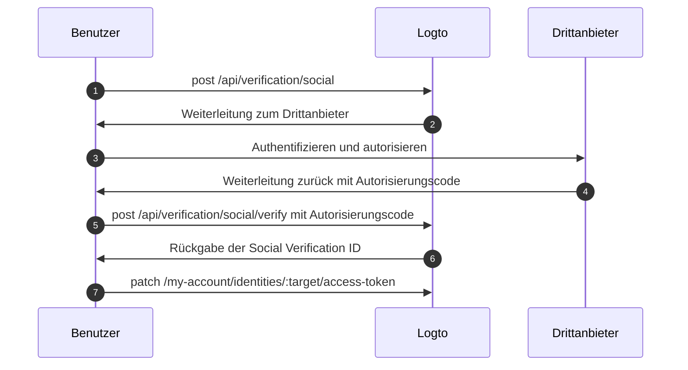

import Availability from '@components/Availability';

<Availability cloud oss={{ major: 1, minor: 31 }} />

Das Drittanbieter-Token-Set (auch als föderiertes Token-Set bekannt) ist ein Geheimnistyp, der im [Secret Vault](/secret-vault) von Logto gespeichert wird, um Zugriffs- und Auffrischungstokens, die von Drittanbieter-Identitätsanbietern ausgestellt wurden, sicher zu verwalten. Wenn sich ein Benutzer über einen Social- oder Enterprise-SSO-Connector authentifiziert, speichert Logto die ausgestellten Tokens im Vault. Diese Tokens können später abgerufen werden, um im Namen des Benutzers auf Drittanbieter-APIs zuzugreifen, ohne dass eine erneute Authentifizierung erforderlich ist.

## Häufige Anwendungsfälle \{#common-use-cases}

Diese Fähigkeit ist essenziell für moderne Anwendungen wie KI-Agenten, SaaS-Plattformen, Produktivitätstools und Kundenanwendungen, die im Namen der Benutzer mit Drittanbieterdiensten interagieren müssen. Hier einige praktische Beispiele:

**📅 Kalenderverwaltungs-Apps**: Nachdem sich ein Benutzer mit Google angemeldet hat, kann deine Produktivitäts-App automatisch dessen Kalendereinträge synchronisieren, neue Meetings erstellen und Einladungen versenden, ohne erneut nach einer Authentifizierung zu fragen.

**🤖 KI-Assistenten**: Ein KI-Agent kann auf die GitHub-Repositories eines Benutzers zugreifen, um Code zu analysieren, Pull Requests zu erstellen oder Issues zu verwalten. All dies mit der einmaligen Zustimmung des Benutzers während der Anmeldung oder Kontoverknüpfung.

**📊 Analyse-Dashboards**: SaaS-Plattformen können Daten aus den verbundenen Social-Media-Konten der Benutzer (Facebook, LinkedIn) abrufen, um Einblicke und Berichte zu generieren, ohne den Arbeitsablauf der Benutzer durch wiederholte Login-Aufforderungen zu unterbrechen.

## Drittanbieter-Token-Speicherung aktivieren \{#enable-third-party-token-storage}

### Social Connectors \{#social-connectors}

Diese Funktion ist für [Social Connectors](/connectors/social-connectors) verfügbar, die die Token-Speicherung unterstützen. Drittanbieter-Tokens können während der [sozialen Anmeldung](/end-user-flows/sign-up-and-sign-in/social-sign-in), [sozialen Kontoverknüpfung](/end-user-flows/account-settings/by-account-api#link-a-new-social-connection) und [bei der Erneuerung von Tokens für den Drittanbieter-API-Zugriff](/secret-vault/federated-token-set#reauthentication-and-token-renewal) gespeichert werden. Derzeit unterstützte Connectors sind: [GitHub](/integrations/github), [Google](/integrations/google), [Facebook](/integrations/facebook), [Standard OAuth 2.0](/integrations/oauth2) und [Standard OIDC](/integrations/oidc). Die Unterstützung für weitere Connectors wird schrittweise eingeführt.

1. Navigiere zu <CloudLink to="/connectors/social">Konsole > Connectors > Social Connectors</CloudLink>.
2. Wähle den Social Connector aus, für den du die Drittanbieter-Token-Speicherung aktivieren möchtest.
3. Folge den Einrichtungsanleitungen, um den Connector zu konfigurieren, einschließlich der Hinzufügung der erforderlichen Berechtigungen (Scopes) für den Zugriff auf bestimmte Drittanbieter-APIs.
4. Aktiviere auf der Seite „Einstellungen“ die Option **Tokens für dauerhaften API-Zugriff speichern**.

### Enterprise SSO Connectors \{#enterprise-sso-connectors}

Die Token-Speicherung ist für alle OIDC [Enterprise Connectors](/connectors/enterprise-connectors) verfügbar. Zugriffs- und Auffrischungstokens können während des [Enterprise Single Sign-On](/end-user-flows/enterprise-sso) gespeichert werden. Derzeit unterstützte Connectors sind: [Google Workspace](/integrations/google-workspace), [Microsoft Entra ID (OIDC)](/integrations/entra-id-oidc), [Okta](/integrations/okta) und [OIDC (Enterprise)](/integrations/oidc-sso).

1. Navigiere zu <CloudLink to="/enterprise-sso">Konsole > Enterprise SSO</CloudLink>.
2. Wähle den Enterprise SSO Connector aus, für den du die Drittanbieter-Token-Speicherung aktivieren möchtest.
3. Folge den Einrichtungsanleitungen, um den Connector zu konfigurieren, einschließlich der Hinzufügung der erforderlichen Berechtigungen (Scopes) für den Zugriff auf bestimmte Drittanbieter-APIs.
4. Aktiviere im Tab „SSO-Erfahrung“ die Option **Tokens für dauerhaften API-Zugriff speichern**.

Vergiss nicht, deine Änderungen zu speichern.

## Token-Speicherung \{#token-storage}

Sobald die Drittanbieter-Token-Speicherung aktiviert ist, speichert Logto automatisch die Zugriffs- und Auffrischungstokens, die vom föderierten Identitätsanbieter ausgestellt werden, wann immer sich ein Benutzer über einen Social- oder Enterprise-SSO-Connector authentifiziert. Dies umfasst:

- [Soziale Anmeldung und Registrierung](/end-user-flows/sign-up-and-sign-in/social-sign-in)
- [Enterprise SSO Anmeldung und Registrierung](/end-user-flows/enterprise-sso)
- [Soziale Kontoverknüpfung über Account API](/end-user-flows/account-settings/by-account-api#link-a-new-social-connection)

Die gespeicherten Tokens sind mit der Social- oder Enterprise-SSO-Identität des Benutzers verknüpft, sodass sie später für den API-Zugriff abgerufen werden können, ohne dass eine erneute Authentifizierung erforderlich ist.

### Überprüfung des Token-Speicherstatus \{#checking-token-storage-status}

Du kannst den Drittanbieter-Token-Speicherstatus eines Benutzers in der Logto-Konsole überprüfen:

1. Navigiere zu <CloudLink to="/users">Konsole > Benutzer</CloudLink>.
2. Klicke auf den Benutzer, den du überprüfen möchtest. Dadurch gelangst du zur Detailseite des Benutzers.
3. Scrolle zum Abschnitt **Verbindungen**. Dieser Bereich listet alle Social- und Enterprise-SSO-Verbindungen auf, die mit dem Benutzer verknüpft sind.
4. Jeder Eintrag zeigt ein Token-Status-Label, das angibt, ob Tokens für diese Verbindung gespeichert sind.
5. Klicke auf den Verbindungseintrag, um weitere Details anzuzeigen, einschließlich der gespeicherten Zugriffs-Token-Metadaten und der Verfügbarkeit eines Auffrischungstokens (falls vorhanden).

Du kannst auch die Drittanbieter-Identitäten und den Token-Speicherstatus eines Benutzers über die Management API prüfen:

- `GET /api/users/{userId}/identities/{target}?includeTokenSecret=true`: Ruft die Social-Identität eines Benutzers und den zugehörigen Token-Speicherstatus für einen bestimmten Connector-Target (z. B. `github`, `google` usw.) ab.
- `GET /api/users/{userId}/sso-identities/{ssoConnectorId}?includeTokenSecret=true`: Ruft die Enterprise-SSO-Identität eines Benutzers und den zugehörigen Token-Speicherstatus für eine bestimmte SSO-Connector-ID ab.

### Token-Speicherstatus \{#token-storage-status}

- **Aktiv**: Das Zugangstoken ist gespeichert und aktiv.
- **Abgelaufen**: Das Zugangstoken ist gespeichert, aber abgelaufen. Wenn ein Auffrischungstoken verfügbar ist, kann damit ein neues Zugangstoken abgerufen werden.
- **Inaktiv**: Für diese Verbindung ist kein Zugangstoken gespeichert. Dies kann passieren, wenn der Benutzer sich nicht über diese Verbindung authentifiziert hat oder die Token-Speicherung gelöscht wurde.
- **Nicht anwendbar**: Der Connector unterstützt keine Token-Speicherung.

### Token-Metadaten \{#token-metadata}

Zur Wahrung der Datenintegrität und Sicherheit werden alle Tokens vor der Speicherung im Secret Vault verschlüsselt. Die tatsächlichen Token-Werte sind nur für den Endbenutzer mit entsprechender Autorisierung zugänglich. Entwickler können hingegen nur die Metadaten des Token-Sets abrufen, um den Status der gespeicherten Tokens zu verstehen, ohne sensible Inhalte offenzulegen.

- `createdAt`: Der Zeitstempel, zu dem die Verbindung erstmals hergestellt und das Token-Set initial im Secret Vault gespeichert wurde.
- `updatedAt`: Der Zeitpunkt der letzten Aktualisierung des Token-Sets.
  - Wenn kein Auffrischungstoken verfügbar ist, entspricht dieser Wert **createdAt**.
  - Wenn ein Auffrischungstoken vorhanden ist, spiegelt dieser Wert die letzte Aktualisierung des Zugangstokens wider.
- `hasRefreshToken`: Gibt an, ob ein Auffrischungstoken verfügbar ist.
  Wenn der Connector Offline-Zugriff unterstützt und die Autorisierungsanfrage entsprechend konfiguriert ist, speichert Logto das Auffrischungstoken, wenn es vom Identitätsanbieter zusammen mit dem Zugangstoken ausgestellt wird.
  Wenn das Zugangstoken abläuft und ein gültiges Auffrischungstoken existiert, versucht Logto automatisch, ein neues Zugangstoken mit dem gespeicherten Auffrischungstoken zu erhalten, sobald der Benutzer Zugriff auf den verbundenen Anbieter anfordert.
- `expiresAt`: Die geschätzte Ablaufzeit des Zugangstokens in **Sekunden**.
  Dies wird basierend auf dem `expires_in`-Wert berechnet, der vom Token-Endpunkt des Identitätsanbieters zurückgegeben wird. (Dieses Feld ist nur verfügbar, wenn der Anbieter `expires_in` in der Token-Antwort enthält.)
- `scope`: Die Berechtigung des Zugangstokens, die die vom Identitätsanbieter gewährten Berechtigungen angibt.
  Dies ist nützlich, um zu verstehen, welche Aktionen mit dem gespeicherten Zugangstoken durchgeführt werden können. (Dieses Feld ist nur verfügbar, wenn der Anbieter `scope` in der Token-Antwort enthält.)
- `tokenType`: Der Typ des Zugangstokens, typischerweise "Bearer".
  (Dieses Feld ist nur verfügbar, wenn der Anbieter `token_type` in der Token-Antwort enthält.)

## Token-Abruf \{#token-retrieval}

Sobald die Token-Speicherung aktiviert und Tokens sicher im Secret Vault von Logto gespeichert sind, können Endbenutzer ihre Drittanbieter-Zugangstokens aus deiner Client-Anwendung abrufen, indem sie die [User Account API](/end-user-flows/account-settings/by-account-api) von Logto integrieren.

- `GET /my-account/identities/:target/access-token`: Ruft das Zugangstoken für eine Social-Identität ab, indem der Connector-Target angegeben wird (z. B. github, google).

- `GET /my-account/sso-identities/:connectorId/access-token`: Ruft das Zugangstoken für eine Enterprise-SSO-Identität ab, indem die Connector-ID angegeben wird.

:::info
Erfahre, wie du die [Account API aktivierst](/end-user-flows/account-settings/by-account-api#how-to-enable-account-api) und [auf die Account API mit dem von Logto ausgestellten Zugangstoken zugreifst](/end-user-flows/account-settings/by-account-api#access-account-api-using-access-token).
:::

### Token-Rotation \{#token-rotation}

Die Token-Abruf-Endpunkte liefern:

- `200` OK: Wenn das Zugangstoken erfolgreich abgerufen wurde und noch gültig ist.
- `404` Nicht gefunden: Wenn der Benutzer keine Social- oder Enterprise-SSO-Identität mit dem angegebenen Target oder der Connector-ID hat oder wenn das Zugangstoken nicht gespeichert ist.
- `401` Nicht autorisiert: Wenn das Zugangstoken abgelaufen ist.

Wenn das Zugangstoken abgelaufen ist und ein Auffrischungstoken verfügbar ist, versucht Logto automatisch, das Zugangstoken zu erneuern und gibt das neue Zugangstoken in der Antwort zurück. Die Token-Speicherung im Secret Vault wird ebenfalls mit dem neuen Zugangstoken und dessen Metadaten aktualisiert.

## Token-Speicherung löschen \{#token-storage-deletion}

Die Drittanbieter-Token-Speicherung ist direkt mit den Social- oder Enterprise-SSO-Verbindungen jedes Benutzers verknüpft. Das bedeutet, dass das gespeicherte Token-Set in folgenden Fällen automatisch gelöscht wird:

- Die zugehörige Social- oder Enterprise-SSO-Identität wird aus dem Benutzerkonto entfernt.
- Das Benutzerkonto wird aus deinem Mandanten gelöscht.
- Der Social- oder Enterprise-SSO-Connector wird aus deinem Mandanten gelöscht.

### Tokens widerrufen \{#revoking-tokens}

Du kannst das Drittanbieter-Token-Set eines Benutzers auch manuell löschen, um den Zugriff zu widerrufen:

- Über die Konsole:
  Navigiere zur Identitätsdetailseite des Benutzers. Scrolle zum Abschnitt **Zugangstoken** (falls Token-Speicherung verfügbar ist) und klicke am Ende des Abschnitts auf die Schaltfläche **Tokens löschen**.
- Über die Management API:
  - `DELETE /api/secret/:id`: Löscht ein bestimmtes Geheimnis anhand seiner ID, die du aus den Identitätsdetails des Benutzers erhältst.

Das Widerrufen des Token-Sets zwingt den Benutzer, sich erneut beim Drittanbieter zu authentifizieren, um ein neues Zugangstoken zu erhalten, bevor er wieder auf Drittanbieter-APIs zugreifen kann.

## Reauthentifizierung und Token-Erneuerung \{#reauthentication-and-token-renewal}

In Szenarien, in denen ein gespeichertes Zugangstoken abgelaufen ist oder eine Anwendung zusätzliche API-Berechtigungen anfordern muss, können Endbenutzer sich beim Drittanbieter erneut authentifizieren, um ein frisches Zugangstoken zu erhalten – ohne sich erneut bei Logto anmelden zu müssen.
Dies kann über die [Social Verification API](https://openapi.logto.io/operation/operation-createverificationbysocial) von Logto erfolgen, die es Benutzern ermöglicht, einen föderierten Social-Autorisierungsfluss erneut zu starten und ihr gespeichertes Token-Set zu aktualisieren.

:::note
Das erneute Initiieren der föderierten Autorisierung ist derzeit auf Social Connectors beschränkt.
Für Enterprise-SSO-Connectors erfordern Reauthentifizierung und Token-Erneuerung, dass der Benutzer erneut einen vollständigen Logto-Authentifizierungsfluss startet, da eine direkte Reautorisierung mit dem Enterprise-SSO-Anbieter nach der Anmeldung derzeit nicht unterstützt wird.
:::



1. Der Benutzer initiiert eine Social Verification-Anfrage, indem er den Endpunkt `POST /api/verification/social` aufruft. Der Benutzer kann benutzerdefinierte Berechtigungen (Scopes) angeben, um zusätzliche Berechtigungen vom Drittanbieter anzufordern.

   ```sh
   curl -X POST https://<your-logto-domain>/api/verification/social \
     -H "Authorization: Bearer <access_token>" \
     -H "Content-Type: application/json" \
     -d '{
       "state": "<state>",
       "connectorId": "<logto_connectorId>",
       "redirectUri": "<redirect_uri>",
       "scope": "<custom_scope>"
     }'
   ```

   - **authorization header**: Das vom Logto ausgestellte Zugangstoken des Benutzers.
   - **connectorId**: Die Social Connector ID in Logto.
   - **redirectUri**: Die URI, zu der der Benutzer nach der Authentifizierung in deine Anwendung zurückgeleitet wird. Diese URI muss in den Anwendungseinstellungen des Anbieters registriert werden.
   - **scope**: (Optional) Benutzerdefinierte Berechtigungen, um zusätzliche Rechte vom Drittanbieter anzufordern. Wenn nicht angegeben, werden die in der Connector-Konfiguration hinterlegten Standard-Berechtigungen verwendet.

2. Logto erstellt einen neuen Social Verification-Datensatz und gibt die Social Verification ID sowie die Autorisierungs-URL zurück, um den Benutzer zum Drittanbieter zur Authentifizierung weiterzuleiten.

   Die Antwort sieht wie folgt aus:

   ```json
   {
     "verificationRecordId": "<social_verification_id>",
     "authorizationUri": "<authorization_url>",
     "expiresAt": "<expiration_time>"
   }
   ```

3. Leite den Benutzer zur Autorisierungs-URL weiter. Der Benutzer authentifiziert sich beim Drittanbieter und erteilt die Berechtigungen.

4. Der Drittanbieter leitet den Benutzer mit einem Autorisierungscode zurück zu deiner Client-Anwendung.

5. Verarbeite den Autorisierungs-Callback, indem du den Autorisierungscode an den Verification-Endpunkt von Logto weiterleitest:

   ```sh
   curl -X POST https://<your-logto-domain>/api/verification/social/verify \
     -H "Authorization: Bearer <access_token>" \
     -d '{
       "verificationRecordId": "<social_verification_id>",
       "connectorData": {
         "code": "<authorization_code>",
         "state": "<state>",
         "redirectUri": "<redirect_uri>"
       }
     }'
   ```

   - **authorization header**: Das vom Logto ausgestellte Zugangstoken des Benutzers.
   - **verificationRecordId**: Die im vorherigen Schritt zurückgegebene Social Verification ID.
   - **connectorData**: Der Autorisierungscode und weitere Daten, die vom Drittanbieter beim Callback zurückgegeben wurden.

   :::note
   Vergiss nicht, den `state`-Parameter zu validieren, um CSRF-Angriffe zu verhindern.
   :::

6. Logto überprüft den Autorisierungscode und tauscht ihn gegen ein neues Zugangstoken und Auffrischungstoken vom Drittanbieter aus und gibt dann die Social Verification ID in der Antwort zurück.

7. Aktualisiere abschließend die Token-Speicherung des Benutzers, indem du den Endpunkt `PATCH /my-account/identities/:target/access-token` mit der Social Verification ID aufrufst:

   ```sh
   curl -X PATCH https://<your-logto-domain>/my-account/identities/<target>/access-token \
     -H "Authorization: Bearer <access_token>" \
     -H "Content-Type: application/json" \
     -d '{
       "socialVerificationId": "<social_verification_id>"
     }'
   ```

   - **authorization header**: Das vom Logto ausgestellte Zugangstoken des Benutzers.
   - **socialVerificationId**: Die im vorherigen Schritt zurückgegebene verifizierte Social Verification Record ID.

   Dadurch wird das Token-Set des Benutzers im Secret Vault von Logto mit dem neuen Zugangstoken und Auffrischungstoken aktualisiert, sodass der Benutzer auf Drittanbieter-APIs zugreifen kann, ohne sich erneut bei Logto anmelden zu müssen.

   Das aktualisierte Zugangstoken wird zurückgegeben.
