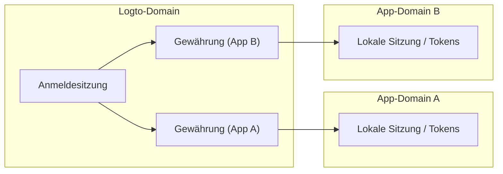
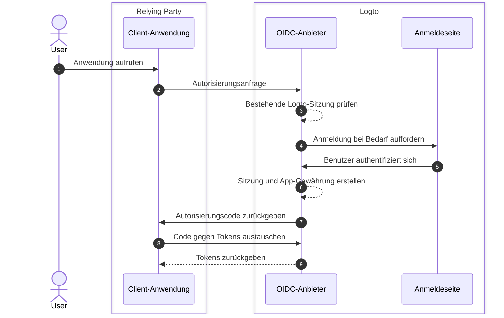
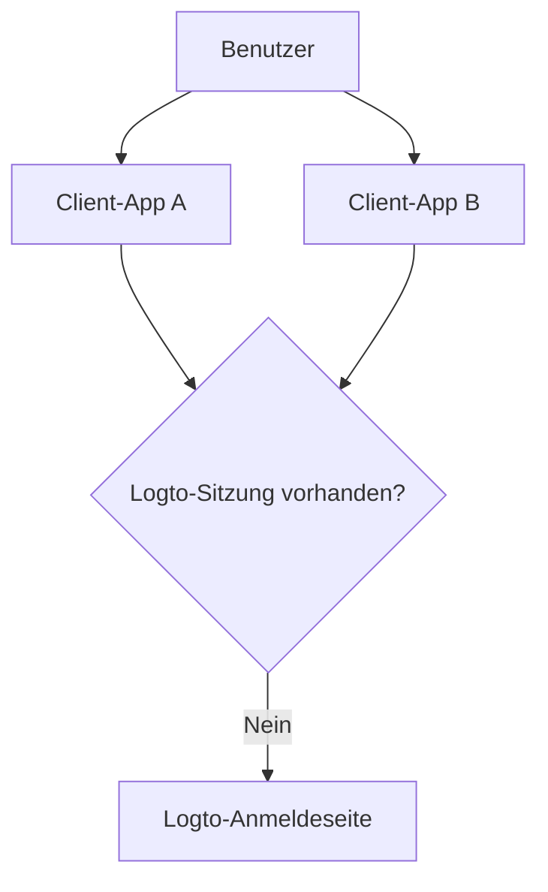

# Sitzungen

Sitzungen in Logto definieren, wie der Authentifizierungsstatus über Apps, Browser und Geräte erstellt, geteilt, aktualisiert und widerrufen wird.

In der Praxis erleben Benutzer den Zustand "angemeldet" als einen Zustand, aber der Systemzustand ist in mehrere Schichten aufgeteilt. Das Verständnis dieser Schichten ist der Schlüssel zur Gestaltung eines vorhersehbaren SSO, zur Token-Erneuerung und zum Abmeldeverhalten.

## Sitzungsmodell in Logto \{#session-model-in-logto}

- **Logto-Anmeldesitzung**: Zentralisierter Anmeldestatus, der als Logto-Domain-Cookies gespeichert wird. Dies steuert die Verfügbarkeit von SSO im aktuellen Browserkontext.
- **Gewährung**: App-spezifischer Autorisierungsstatus für `Benutzer + Client-App`. Gewährungen sind die Brücke zwischen zentralisierter Anmeldung und App-Token-Ausgabe.
- **App-lokale Sitzung / Tokens**: Lokaler Authentifizierungsstatus in jeder App (ID / Zugangstoken / Auffrischungstoken, App-Sitzungscookie usw.).

## Kernkonzepte \{#core-concepts}

### Was ist eine Logto-Sitzung? \{#what-is-a-logto-session}

Eine Logto-Sitzung ist der zentralisierte Authentifizierungsstatus, der nach erfolgreicher Anmeldung erstellt wird. Wenn sie noch gültig ist, kann Logto Benutzer für andere Apps im selben Mandanten stillschweigend authentifizieren. Wenn sie nicht existiert, müssen sich Benutzer erneut anmelden.

### Was sind Gewährungen? \{#what-are-grants}

Eine Gewährung ist ein App-Ebene-Autorisierungsstatus, der an einen bestimmten Benutzer und eine Client-App gebunden ist.

- Eine Logto-Sitzung kann Gewährungen für mehrere Apps haben.
- Tokens für eine App werden unter der Gewährung dieser App ausgegeben.
- Der Widerruf einer Gewährung beeinflusst die Fähigkeit dieser App, weiterhin tokenbasierten Zugriff zu haben.

### Wie sich Sitzung, Gewährungen und App-Auth-Status zueinander verhalten \{#how-session-grants-and-app-auth-state-relate}

- **Sitzung** beantwortet: "Kann dieser Browser gerade SSO mit Logto durchführen?"
- **Gewährung** beantwortet: "Ist dieser Benutzer für diese Client-App autorisiert?"
- **App-lokale Sitzung** beantwortet: "Behandelt diese App den Benutzer derzeit als angemeldet?"

## Anmeldung und Sitzungserstellung \{#sign-in-and-session-creation}

## Sitzungstopologie über Apps und Geräte \{#session-topology-across-apps-and-devices}

### Gleicher Browser: geteilte Logto-Sitzung \{#same-browser-shared-logto-session}

Apps im gleichen Browser können den zentralisierten Logto-Sitzungsstatus teilen, sodass SSO ohne wiederholte Eingabe von Anmeldeinformationen erfolgen kann.

### Verschiedene Browser oder Geräte: isolierte Logto-Sitzungen \{#different-browsers-or-devices-isolated-logto-sessions}

Jeder Browser / jedes Gerät hat einen separaten Cookie-Speicher. Eine gültige Sitzung auf Gerät A impliziert keine gültige Sitzung auf Gerät B.

## Sitzungslebenszyklus \{#session-lifecycle}

### 1. Erstellen \{#1-create}

Nach der Benutzer-Authentifizierung erstellt Logto eine zentralisierte Sitzung und eine app-spezifische Gewährung.

### 2. Wiederverwenden (SSO) \{#2-reuse-sso}

Solange Sitzungscookies im gleichen Browser gültig sind, können neue Autorisierungsanfragen oft stillschweigend abgeschlossen werden.

### 3. Tokens erneuern \{#3-renew-tokens}

Der App-Zugriff wird normalerweise durch Token-Auffrischungsflüsse fortgesetzt (wenn aktiviert). Dies ist eine App-Ebene-Kontinuität, unabhängig davon, ob die zentralisierte Logto-Sitzung noch existiert.

### 4. Widerrufen / ablaufen \{#4-revokeexpire}

Der Widerruf kann auf verschiedenen Ebenen erfolgen:

- Lokale App-Abmeldung entfernt App-lokale Tokens / Sitzung.
- End-Sitzung entfernt zentralisierte Logto-Sitzung.
- Gewährungswiderruf entfernt App-Ebene-Autorisierungskontinuität.

## Designempfehlungen \{#design-recommendations}

- Halte die App-lokale Sitzungsverwaltung in deinem App-Code explizit.
- Behandle Logto-Sitzung, Gewährungen und App-lokale Sitzung als separate Schichten.
- Entscheide, ob die Abmeldung nur App-lokal oder global sein soll.
- Verwende [Back-Channel-Abmeldung](/end-user-flows/sign-out#federated-sign-out-back-channel-logout), wenn Konsistenz über mehrere Apps erforderlich ist.
- Für Abmeldeverhalten und Implementierungsdetails siehe [Abmelden](/end-user-flows/sign-out).

## Best Practices zum Widerrufen des Zugriffs \{#best-practices-for-revoking-access}

Verwende unterschiedliche Widerrufsstrategien basierend auf deinem Ziel:

- **Zugriff von deinen First-Party-Apps widerrufen**:
  Widerrufe die Ziel-Sitzung mit `revokeGrantsTarget=firstParty`.
  Dies meldet den Benutzer über First-Party-Apps ab, die mit dieser Sitzung verbunden sind, was ein konsistentes Abmeldeerlebnis schafft.
  Gleichzeitig können Gewährungen für Drittanbieter-Apps, die `offline_access` gewährt haben, für laufende Integrationen verfügbar bleiben.
  Siehe [Benutzersitzungen verwalten](/sessions/manage-user-sessions) für Details zum Sitzungswiderruf.

- **Zugriff auf Drittanbieter-Apps widerrufen**:
  Wähle eine der folgenden Optionen:

  - Widerrufe die Sitzung mit `revokeGrantsTarget=all`, um alle mit dieser Sitzung verbundenen Gewährungen zu widerrufen.
  - Widerrufe spezifische Gewährungen direkt über Gewährungsverwaltungs-APIs, um Drittanbieter-App-Autorisierungen zu entfernen, ohne eine vollständige Sitzungsabmeldung zu erzwingen.
    Siehe [Benutzerautorisierte Apps (Gewährungen) verwalten](/sessions/grants-management) für gewährungsspezifische Widerrufsstrategien.

- **Bei Verwendung der Logto-Konsole**:
  Auf der Benutzerdetailseite bietet Logto sowohl Sitzungsverwaltung als auch Verwaltung autorisierter Drittanbieter-Apps von Haus aus.
  - Der Widerruf einer Sitzung widerruft auch First-Party-App-Gewährungen, um das First-Party-Abmeldeverhalten konsistent zu halten.
  - Der Widerruf einer Drittanbieter-App-Autorisierung widerruft Gewährungen für diese Drittanbieter-App, während der ursprüngliche Sitzungsstatus unverändert bleibt.

## Verwandte Ressourcen \{#related-resources}

<Url href="/sessions/manage-user-sessions">Benutzersitzungen verwalten</Url>
<Url href="/sessions/grants-management">Benutzerautorisierte Apps (Gewährungen) verwalten</Url>
<Url href="/sessions/session-configs">Sitzungskonfiguration</Url>
<Url href="/end-user-flows/sign-out">Abmelden</Url>
<Url href="/end-user-flows/sign-up-and-sign-in">Registrieren und Anmelden</Url>
<Url href="/integrate-logto/integrate-logto-into-your-application/understand-authentication-flow">
  Authentifizierungsfluss verstehen
</Url>
