# Verbinde deinen KI-Agenten mit Drittanbieter-APIs

Diese Anleitung führt dich durch die Aktivierung deines KI-Agenten, damit er im Namen der Benutzer auf Drittanbieter-APIs (z. B. Google Kalender, GitHub usw.) zugreifen kann. Durch die Nutzung der Social Connectors und des Secret Vault von Logto kannst du Zugangstokens sicher speichern und verwalten, sodass dein Agent automatisierte Aufgaben ausführen kann, ohne die Benutzer wiederholt zur erneuten Authentifizierung aufzufordern.

Du lernst, wie du:

- Social Connectors mit Drittanbieter-Token-Speicherung konfigurierst.
- Minimale Berechtigungen beim ersten Anmelden anforderst.
- Nach Bedarf schrittweise zusätzliche Berechtigungen anforderst.
- Gespeicherte Tokens abrufst und verwendest, um auf Drittanbieter-APIs zuzugreifen.

## Warum dein KI-Agent Zugriff auf Drittanbieter-APIs benötigt \{#why-your-ai-agent-needs-third-party-api-access}

KI-Agenten werden zunehmend eingesetzt, um Aufgaben zu automatisieren, die eine Interaktion mit externen Diensten erfordern. Zum Beispiel:

- **📅 Kalenderverwaltung**: Dein KI-Agent kann automatisch Meetings planen, Ereignisse hinzufügen oder Termine im Google Kalender anpassen.
- **📧 E-Mail-Automatisierung**: Folge-E-Mails senden, Posteingänge organisieren oder Antworten mit Gmail-APIs entwerfen.
- **💻 Codeverwaltung**: GitHub-Issues erstellen, Pull Requests prüfen oder Repositories verwalten.
- **📁 Dateiverwaltung**: Dateien auf Google Drive oder Dropbox hochladen, organisieren oder teilen.

Um diese Aufgaben auszuführen, benötigt dein KI-Agent sicheren Zugriff auf von Benutzern autorisierte Drittanbieter-APIs, was bedeutet, dass OAuth-Tokens korrekt und sicher gehandhabt werden müssen.

## Wie es funktioniert \{#how-it-works}

Hier ist ein kurzer Überblick über den Ablauf:

```mermaid
sequenceDiagram
    participant User as Benutzer
    participant Agent as Dein KI-Agent
    participant Logto
    participant Google as Drittanbieter<br/>(z. B. Google)

    rect rgba(200, 230, 200, 0.5)
        Note over User, Google: Benutzer erteilt Berechtigungen an Drittanbieter
        User->>Agent: "Füge morgen um 15 Uhr ein Meeting zu meinem Kalender hinzu"
        Agent->>User: Benötigt Zugriff auf Google Kalender, bitte autorisieren
        User->>Agent: Google-Autorisierung starten
        Agent->>Logto: Soziale Verifizierung starten
        Logto->>Google: Weiterleitung zu Google
        User->>Google: Authentifizieren und Berechtigungen erteilen
        Google->>Logto: Autorisierungscode zurückgeben
        Logto->>Google: Code gegen Tokens austauschen
        Logto->>Logto: Tokens im Secret Vault speichern
        Logto->>Agent: Verifizierungsergebnis zurückgeben
    end

    rect rgba(200, 200, 230, 0.5)
        Note over User, Google: KI-Agent-Aufgabenausführung
        Agent->>Logto: Google-Zugangstoken abrufen
        Logto->>Agent: Zugangstoken zurückgeben
        Agent->>Google: Google Kalender API aufrufen
        Google->>Agent: Erfolg zurückgeben
        Agent->>User: "Erledigt! Ich habe das Meeting zu deinem Kalender hinzugefügt."
    end
```



1. **Benutzer fordert eine Aufgabe an**: Der Benutzer bittet den KI-Agenten, eine Aufgabe auszuführen, die Zugriff auf eine Drittanbieter-API erfordert (z. B. einen Kalendereintrag hinzufügen).
2. **Autorisierungsaufforderung**: Der Agent erkennt den Bedarf an Drittanbieter-Zugriff und fordert den Benutzer zur Autorisierung auf.
3. **Tokens gespeichert**: Nach der Benutzerautorisierung speichert Logto die Zugangs- und Auffrischungstokens sicher im Secret Vault.
4. **Aufgabenausführung**: Der Agent ruft das gespeicherte Token ab und ruft die Drittanbieter-API auf, um die Aufgabe abzuschließen.

Nach der Autorisierung kann der Benutzer mehrere Aufgaben ausführen, ohne erneut zu autorisieren. Logto speichert die Tokens sicher und erneuert sie bei Bedarf automatisch, was eine nahtlose Erfahrung für fortlaufende KI-Agenten-Interaktionen bietet.

## Voraussetzungen \{#prerequisites}

Bevor du beginnst, stelle sicher, dass du Folgendes hast:

- Einen [Logto Cloud](https://cloud.logto.io) (oder selbst gehosteten Logto v1.31+) Mandanten
- Ein Drittanbieter-Konto mit API-Zugriff (z. B. [Google Cloud Console](https://console.cloud.google.com))
- Eine KI-Agenten-Anwendung, die mit Logto SDK integriert ist (Benutzer können sich bei deinem KI-Agenten anmelden)

## Social Connector mit Token-Speicherung einrichten \{#set-up-social-connector-with-token-storage}

Um deinem KI-Agenten den Zugriff auf Drittanbieter-APIs zu ermöglichen, musst du einen Social Connector mit aktivierter Token-Speicherung konfigurieren. Dadurch kann Logto Zugangstokens speichern und verwalten, wenn Benutzer während der Interaktion mit deinem KI-Agenten Drittanbieterdienste autorisieren.

Nehmen wir Google als Beispiel:

1. Navigiere zu <CloudLink to="/connectors/social">Konsole > Connectors > Social Connectors</CloudLink>.
2. Klicke auf **Social Connector hinzufügen** und wähle **Google** aus.
3. Folge der [Google Connector-Einrichtungsanleitung](/integrations/google), um deine OAuth-Client-Zugangsdaten zu konfigurieren.
4. In den Connector-Einstellungen:
   - Aktiviere **Tokens für dauerhaften API-Zugriff speichern**, um Tokens im Secret Vault zu speichern.
   - Setze **Prompts** auf `consent`, damit Benutzer die Berechtigungsanfrage sehen.
   - Aktiviere **Offline-Zugriff**, um Auffrischungstokens für langfristigen API-Zugriff zu erhalten.
5. Speichere deine Änderungen.

:::info
Du musst diesen Connector nicht zu deiner Anmeldeerfahrung hinzufügen. Der Connector wird für die bedarfsorientierte Autorisierung verwendet, wenn dein KI-Agent auf Drittanbieter-APIs zugreifen muss, nicht für die Benutzeranmeldung.
:::

## Autorisierung anfordern und auf Drittanbieter-APIs zugreifen \{#request-authorization-and-access-third-party-apis}

Wenn dein KI-Agent auf eine Drittanbieter-API (z. B. Google Kalender) zugreifen muss, sollte er zunächst prüfen, ob der Benutzer bereits Zugriff autorisiert hat. Falls nicht, fordere den Benutzer zur Autorisierung auf.

:::info Account API aktivieren
Bevor du fortfährst, aktiviere die Account API unter <CloudLink to="/sign-in-experience/account-center">Konsole > Anmeldeerfahrung > Account Center</CloudLink>. Erfahre mehr über das [Aktivieren der Account API](/end-user-flows/account-settings/by-account-api#how-to-enable-account-api).
:::

### Schritt 1: Prüfe auf bestehende Autorisierung \{#step-1-check-for-existing-authorization}

Versuche zunächst, das gespeicherte Zugangstoken abzurufen, um zu sehen, ob der Benutzer bereits autorisiert hat:

```tsx
async function getGoogleAccessToken(userAccessToken: string) {
  const response = await fetch(
    'https://[tenant-id].logto.app/my-account/identities/google/access-token',
    {
      headers: {
        Authorization: `Bearer ${userAccessToken}`,
      },
    }
  );

  return response.json();
}
```

### Schritt 2: Autorisierung anfordern, falls erforderlich \{#step-2-request-authorization-if-needed}

Wenn kein Token existiert, das Token abgelaufen ist oder du den Geltungsbereich des Zugangstokens erweitern musst, verwende die [Social Verification API](/secret-vault/federated-token-set#reauthentication-and-token-renewal) von Logto, um den Autorisierungsablauf zu starten:

```tsx
async function requestGoogleAuthorization(userAccessToken: string, scopes: string) {
  // Generiere einen zufälligen State zum CSRF-Schutz
  const state = crypto.randomUUID();
  sessionStorage.setItem('oauth_state', state);

  // Soziale Verifizierung starten
  const response = await fetch('https://[tenant-id].logto.app/api/verification/social', {
    method: 'POST',
    headers: {
      Authorization: `Bearer ${userAccessToken}`,
      'Content-Type': 'application/json',
    },
    body: JSON.stringify({
      connectorId: '<google_connector_id>',
      state,
      redirectUri: 'https://your-ai-agent.com/callback',
      scope: scopes,
    }),
  });

  const { verificationRecordId, authorizationUri } = await response.json();

  // verificationRecordId für später speichern
  sessionStorage.setItem('verificationRecordId', verificationRecordId);

  // Benutzer zur Google-Autorisierung weiterleiten
  window.location.href = authorizationUri;
}
```

### Schritt 3: Den Autorisierungs-Callback behandeln \{#step-3-handle-the-authorization-callback}

Nachdem der Benutzer Berechtigungen erteilt hat, leitet Google zurück zu deiner App. Schließe die Verifizierung ab und speichere die Tokens:

```tsx
async function handleAuthorizationCallback(
  userAccessToken: string,
  callbackParams: URLSearchParams
) {
  const verificationRecordId = sessionStorage.getItem('verificationRecordId');
  const storedState = sessionStorage.getItem('oauth_state');
  const code = callbackParams.get('code');
  const state = callbackParams.get('state');

  // State validieren, um CSRF-Angriffe zu verhindern
  if (state !== storedState) {
    throw new Error('Invalid state parameter');
  }

  // Autorisierung verifizieren
  await fetch('https://[tenant-id].logto.app/api/verification/social/verify', {
    method: 'POST',
    headers: {
      Authorization: `Bearer ${userAccessToken}`,
      'Content-Type': 'application/json',
    },
    body: JSON.stringify({
      verificationRecordId,
      connectorData: {
        code,
        state,
        redirectUri: 'https://your-ai-agent.com/callback',
      },
    }),
  });

  // Tokens im Secret Vault von Logto speichern
  await fetch('https://[tenant-id].logto.app/my-account/identities/google/access-token', {
    method: 'PUT',
    headers: {
      Authorization: `Bearer ${userAccessToken}`,
      'Content-Type': 'application/json',
    },
    body: JSON.stringify({
      verificationRecordId,
    }),
  });

  // Aufräumen
  sessionStorage.removeItem('verificationRecordId');
  sessionStorage.removeItem('oauth_state');
}
```

### Schritt 4: Die Drittanbieter-API aufrufen \{#step-4-call-the-third-party-api}

Jetzt kann dein KI-Agent das Token abrufen und die API aufrufen:

```tsx
async function addCalendarEvent(userAccessToken: string, eventDetails: EventDetails) {
  // Das gespeicherte Google-Zugangstoken abrufen
  const tokenData = await getGoogleAccessToken(userAccessToken);

  if (!tokenData) {
    // Benutzer hat nicht autorisiert, Autorisierung mit Kalender-Berechtigung anfordern
    await requestGoogleAuthorization(
      userAccessToken,
      'https://www.googleapis.com/auth/calendar.events'
    );
    return; // Wird nach Weiterleitung fortgesetzt
  }

  // Die Google Kalender API aufrufen
  const response = await fetch('https://www.googleapis.com/calendar/v3/calendars/primary/events', {
    method: 'POST',
    headers: {
      Authorization: `Bearer ${tokenData.accessToken}`,
      'Content-Type': 'application/json',
    },
    body: JSON.stringify(eventDetails),
  });

  return response.json();
}
```

Logto übernimmt die Token-Erneuerung automatisch. Wenn das Zugangstoken abgelaufen ist, aber ein Auffrischungstoken existiert, wird Logto beim nächsten Abruf automatisch ein neues Zugangstoken erhalten.

## Zusätzliche Berechtigungen anfordern \{#request-additional-permissions}

Wenn dein KI-Agent mehr Aufgaben übernimmt, musst du möglicherweise zusätzliche Berechtigungen anfordern. Wenn der Benutzer beispielsweise zunächst nur Lesezugriff auf den Kalender autorisiert hat, jetzt aber Ereignisse erstellen möchte, benötigst du Schreibberechtigungen.

### Warum inkrementelle Autorisierung? \{#why-incremental-authorization}

- **Bessere Benutzererfahrung**: Benutzer sind eher bereit, Berechtigungen zu erteilen, wenn sie verstehen, warum sie im Kontext benötigt werden.
- **Höhere Konversionsraten**: Weniger anfängliche Berechtigungen bedeuten weniger Reibung.
- **Vertrauensaufbau**: Benutzer vertrauen Anwendungen, die nur das anfordern, was sie wirklich benötigen.

### Beispiel: Upgrade von Lese- auf Schreibzugriff \{#example-upgrading-from-read-to-write-access}

```tsx
async function createCalendarEvent(userAccessToken: string, eventDetails: EventDetails) {
  const tokenData = await getGoogleAccessToken(userAccessToken);

  if (!tokenData) {
    // Noch keine Autorisierung, Kalender-Schreibberechtigung direkt anfordern
    await requestGoogleAuthorization(userAccessToken, 'https://www.googleapis.com/auth/calendar');
    return;
  }

  // Versuche, das Ereignis zu erstellen
  const response = await fetch('https://www.googleapis.com/calendar/v3/calendars/primary/events', {
    method: 'POST',
    headers: {
      Authorization: `Bearer ${tokenData.accessToken}`,
      'Content-Type': 'application/json',
    },
    body: JSON.stringify(eventDetails),
  });

  if (response.status === 403) {
    // Unzureichende Berechtigungen, zusätzlichen Geltungsbereich anfordern
    await requestGoogleAuthorization(
      userAccessToken,
      'https://www.googleapis.com/auth/calendar' // Voller Kalenderzugriff
    );
    return;
  }

  return response.json();
}
```

:::tip
Wenn zusätzliche Geltungsbereiche angefordert werden, sieht der Benutzer einen Zustimmungsbildschirm (Consent screen), auf dem nur die neuen Berechtigungen angezeigt werden. Bestehende Berechtigungen bleiben erhalten.
:::

## Tokenstatus verwalten \{#manage-token-status}

Die Logto-Konsole bietet Einblick in den Tokenstatus für jeden Benutzer:

1. Navigiere zu <CloudLink to="/users">Konsole > Benutzerverwaltung</CloudLink>.
2. Klicke auf einen Benutzer, um dessen Details anzuzeigen.
3. Scrolle zum Abschnitt **Verbindungen**, um alle verknüpften Social Accounts zu sehen.
4. Jede Verbindung zeigt den Tokenstatus an:
   - **Aktiv**: Das Zugangstoken ist gültig und einsatzbereit.
   - **Abgelaufen**: Das Zugangstoken ist abgelaufen. Wenn ein Auffrischungstoken existiert, wird es beim nächsten Abruf automatisch erneuert.
   - **Inaktiv**: Für diese Verbindung sind keine Tokens gespeichert.

## Sicherheitsbest Practices \{#security-best-practices}

Wenn du KI-Agenten entwickelst, die auf Drittanbieter-APIs zugreifen, beachte diese Sicherheitspraktiken:

- **Minimale Geltungsbereiche anfordern**: Fordere nur die Berechtigungen an, die dein Agent tatsächlich benötigt.
- **Inkrementelle Autorisierung verwenden**: Fordere zusätzliche Berechtigungen im Kontext an, nicht alle auf einmal.
- **Tokenablauf elegant behandeln**: Gehe immer mit Fällen um, in denen Tokens abgelaufen oder widerrufen wurden.
- **Benutzer-Zugangstokens sichern**: Das Logto-Zugangstoken des Benutzers ist der Schlüssel zum Abrufen von Drittanbieter-Tokens. Schütze es entsprechend.
- **API-Zugriffe protokollieren**: Protokolliere, wenn dein KI-Agent auf Drittanbieter-APIs zugreift, für Fehlerbehebung und Compliance.

## Verwandte Ressourcen \{#related-resources}

<Url href="/secret-vault/federated-token-set">Drittanbieter-Token-Speicherung</Url>
<Url href="/connectors/social-connectors">Social Connectors</Url>
<Url href="/end-user-flows/sign-up-and-sign-in/social-sign-in">Social Sign-in</Url>
<Url href="/end-user-flows/account-settings/by-account-api">Account API</Url>
