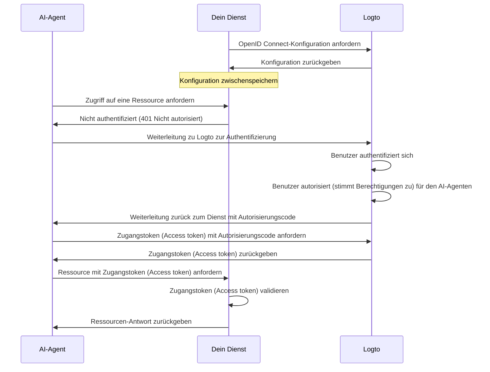

import ConfigureThirdPartyAiAgent from './fragments/_configure-third-party-ai-agent.mdx';

# Drittanbieter-AI-Agenten-Zugriff auf deine App ermöglichen

Diese Anleitung führt dich durch die Integration von Logto mit deinem Dienst und das Ermöglichen des Zugriffs für AI-Agenten.

Du lernst, wie du:

- Logto als Autorisierungsserver für deinen Dienst konfigurierst.
- Ein Zugangstoken (Access token) für den AI-Agenten erhältst, um auf deinen Dienst zuzugreifen.
- Den Ablauf mit einem AI-Agenten testest.

## Unterschied zwischen Drittanbieter-AI-Agent und deinem eigenen AI-Agent (oder App) \{#difference-between-third-party-ai-agent-and-your-own-ai-agent-or-app}

Schauen wir uns ein Beispiel an. Stell dir vor, du bist Entwickler und betreibst einen Dienst, der Wetterdaten bereitstellt.

**Offizielle Wetter-App (Dein eigener AI-Agent / App)**

- Du stellst eine offizielle Wetter-App bereit, mit der Nutzer das Wetter abfragen können.
- So funktioniert es: Die offizielle Wetter-App verbindet sich mit deinem Dienst und nutzt Logto, um Benutzer zu authentifizieren. Wenn sich Alice anmeldet, erhält sie automatisch Zugriff auf die Wetterdaten, ohne dass zusätzliche Zustimmungsbildschirme (Consent screens) erforderlich sind, da es sich um deine vertrauenswürdige App handelt.

**Drittanbieter-AI-Agent**

- Du baust ein Ökosystem rund um deinen Dienst auf, daher entwickelt ein anderer Entwickler „WeatherBot“ (einen AI-Assistenten, der Wetter-Updates und Vorhersagen liefern kann) und integriert ihn als Drittanbieter-AI-Agent.
- So funktioniert es: WeatherBot (Drittanbieter-AI-Agent) möchte über deinen Dienst auf die Wetterdaten der Nutzer zugreifen. Wenn sich Alice mit ihrem Konto bei WeatherBot anmeldet:
  - Ihr wird ein Zustimmungsbildschirm (Consent screen) angezeigt, der um Erlaubnis bittet, dass WeatherBot auf ihre Wetterdaten zugreifen darf.
  - Alice kann diesen Zugriff erlauben oder verweigern.
  - Nur die Daten, denen sie zustimmt, werden mit WeatherBot geteilt, und WeatherBot kann ohne erneute ausdrückliche Zustimmung auf keine weiteren Daten zugreifen.

Diese Zugriffskontrolle (Berechtigung) stellt die Sicherheit der Nutzerdaten sicher: Auch wenn dein Dienst alle Daten verwaltet, können Drittanbieter-AI-Agenten wie WeatherBot nur auf das zugreifen, was der Nutzer ausdrücklich erlaubt hat. Sie können diesen Prozess nicht umgehen, da er durch deine Zugriffskontroll-Implementierung im Dienst erzwungen wird.

**Zusammenfassung**

| Client-Typ             | Beispiel                | Zustimmung erforderlich? | Wer steuert es?        |
| ---------------------- | ----------------------- | ------------------------ | ---------------------- |
| Offizielle Wetter-App  | Deine eigene Wetter-App | Nein                     | Du (der Entwickler)    |
| Drittanbieter-AI-Agent | WeatherBot-Assistent    | Ja                       | Ein anderer Entwickler |

:::note
Wenn du deinen Dienst mit deinem eigenen AI-Agenten oder deiner eigenen App integrieren möchtest, schaue bitte in unsere [Schnellstart-Anleitungen](/quick-starts) für weitere Informationen.
:::

## Voraussetzungen \{#prerequisites}

- Ein [Logto Cloud](https://cloud.logto.io) (oder selbst gehosteter) Mandant
- Ein Dienst, der API-Endpunkte bereitstellt, auf die der AI-Agent zugreifen kann

### Den Ablauf verstehen \{#understanding-the-flow}

- **Dienst**: Der Dienst, den du dem AI-Agenten zugänglich machen möchtest.
- **AI-Agent**: Der AI-Agent, der auf deinen Dienst zugreifen wird.
- **Logto**: Dient als OpenID Connect-Anbieter (Autorisierungsserver) und verwaltet Benutzeridentitäten.

Ein nicht-normativer Sequenzdiagramm veranschaulicht den gesamten Ablauf des Prozesses:

## Drittanbieter-AI-Agent einrichten \{#set-up-third-party-ai-agent}

Um einen Drittanbieter-AI-Agenten für den Zugriff auf deinen Dienst einzurichten, befolge diese Schritte:

1. **Registriere den AI-Agenten in Logto**: Erstelle eine Anwendung in Logto, die den AI-Agenten repräsentiert.
2. **Konfiguriere den AI-Agenten**: Stelle sicher, dass der AI-Agent Anfragen an deinen Dienst stellen und auf die 401 Nicht autorisiert-Antwort reagieren kann.
3. **Implementiere den Autorisierungsablauf**: Der AI-Agent sollte in der Lage sein, den OAuth 2.0-Autorisierungsablauf zu durchlaufen, um ein Zugangstoken (Access token) von Logto zu erhalten.
4. **Teste die Integration**: Nutze den AI-Agenten, um auf deinen Dienst zuzugreifen und prüfe, ob er Anfragen erfolgreich authentifizieren und autorisieren kann.

<ConfigureThirdPartyAiAgent />

## Autorisierung in deinem Dienst einrichten \{#set-up-authorization-in-your-service}

Um Zugriffskontrolle in deinem Dienst zu ermöglichen, musst du Folgendes umsetzen:

1. **Definiere API-Ressourcen in Logto**: Erstelle API-Ressourcen in Logto, die die Endpunkte repräsentieren, auf die dein AI-Agent zugreifen wird.
2. **Implementiere Zugriffskontroll-Logik**: Implementiere in deinem Dienst eine Logik, um das vom AI-Agenten erhaltene Zugangstoken (Access token) zu validieren und zu prüfen, ob der Benutzer die erforderlichen Berechtigungen zum Zugriff auf die angeforderte Ressource hat.
3. **Antworte dem AI-Agenten**: Wenn das Zugangstoken (Access token) gültig ist und der Benutzer die Berechtigung hat, gib die angeforderte Ressource zurück. Andernfalls gib eine 401 Nicht autorisiert-Antwort zurück.

Um mehr darüber zu erfahren, wie du Zugriffskontrolle in deinem Dienst implementierst, siehe unseren [Autorisierungsleitfaden](/authorization).

## Integration testen \{#test-the-integration}

1. Starte deinen Dienst.
2. Starte den AI-Agenten.
3. Rufe im AI-Agenten den API-Endpunkt auf, um auf deinen Dienst zuzugreifen.
4. Der AI-Agent sollte auf die 401 Nicht autorisiert-Antwort reagieren und den Benutzer zu Logto zur Authentifizierung weiterleiten.
5. Nach erfolgreicher Authentifizierung sollte der AI-Agent ein Zugangstoken (Access token) erhalten und es für Anfragen an deinen Dienst verwenden.
6. Der AI-Agent sollte in der Lage sein, die Ressource mit dem Zugangstoken (Access token) von deinem Dienst abzurufen.
