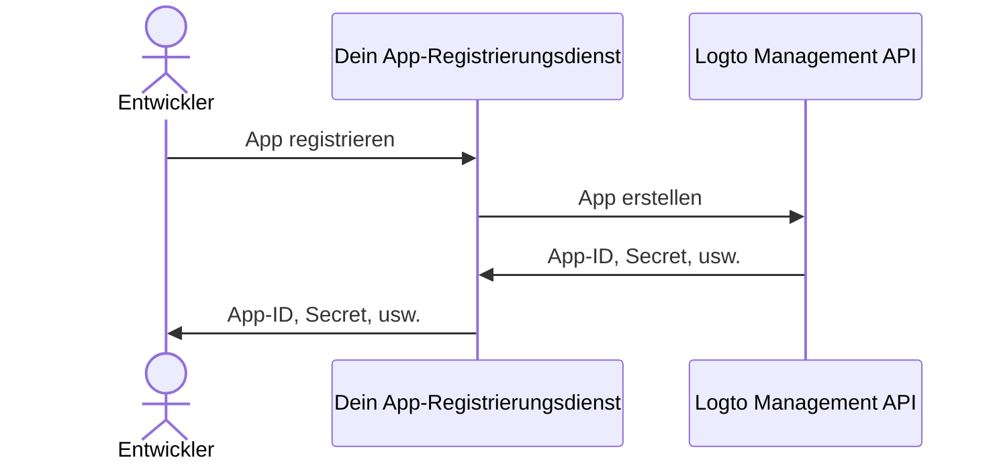

import QuickStartsReference from '../../../quick-starts/third-party/oidc/_quick-starts-reference.md';

## Drittanbieter-AI-Agent in Logto konfigurieren \{#configure-third-party-ai-agent-in-logto}

Um dem Drittanbieter-AI-Agent den Zugriff auf {props.serviceName ?? 'deinen Dienst'} zu ermöglichen, musst du eine **Drittanbieter-App** in Logto einrichten. Diese App wird verwendet, um den AI-Agent zu repräsentieren und die notwendigen Zugangsdaten für Authentifizierung (Authentifizierung) und Autorisierung (Autorisierung) zu erhalten.

### Entwicklern erlauben, Drittanbieter-Apps in Logto zu erstellen \{#allow-developers-to-create-third-party-apps-in-logto}

Wenn du einen Marktplatz aufbaust oder Entwicklern erlauben möchtest, Drittanbieter-Apps in Logto zu erstellen, kannst du die [Logto Management API](/integrate-logto/interact-with-management-api) nutzen, um Drittanbieter-Apps programmatisch zu erstellen. Dadurch können Entwickler ihre Anwendungen registrieren und die notwendigen Zugangsdaten für die Authentifizierung erhalten.

Du musst einen eigenen Dienst hosten, um den Client-Registrierungsprozess zu verwalten. Dieser Dienst interagiert mit der Logto Management API, um Drittanbieter-Apps im Namen der Entwickler zu erstellen.

Alternativ kannst du Drittanbieter-Apps auch manuell in der Logto Console erstellen, um dich mit dem Prozess vertraut zu machen.

### Drittanbieter-App manuell in Logto erstellen \{#manually-create-a-third-party-app-in-logto}

Du kannst eine Drittanbieter-App manuell in der Logto Console für Testzwecke oder Ad-hoc-Integrationen erstellen. Das ist nützlich, wenn du die Integration schnell testen möchtest, ohne einen vollständigen Client-Registrierungs-Flow zu implementieren.

1. Melde dich in deiner Logto Console an.
2. Gehe zu <CloudLink to="/applications">**Anwendungen**</CloudLink> → **Anwendung erstellen** → **Drittanbieter-App** -> **OIDC**.
3. Gib den App-Namen und andere erforderliche Felder ein und klicke dann auf **Anwendung erstellen**.
4. Klicke auf den Tab **Berechtigungen**, im Abschnitt **Benutzer** auf "Hinzufügen" klicken.
5. Im geöffneten Dialog -> **Benutzerdaten** -> wähle die Berechtigungen **`profile`** und **`email`** aus und klicke dann auf **Speichern**.
6. Konfiguriere in der Drittanbieter-App die Scopes, um die Berechtigungen (Berechtigungen) `openid profile email` anzufordern.

   **Hinweis**: `openid` ist für OIDC erforderlich, und `profile` sowie `email` sind die Berechtigungen, die du im vorherigen Schritt hinzugefügt hast.

7. Konfiguriere die **Redirect-URI** deiner Drittanbieter-Anwendung entsprechend. Denke daran, die Redirect-URI auch in Logto zu aktualisieren.

---

<QuickStartsReference />
