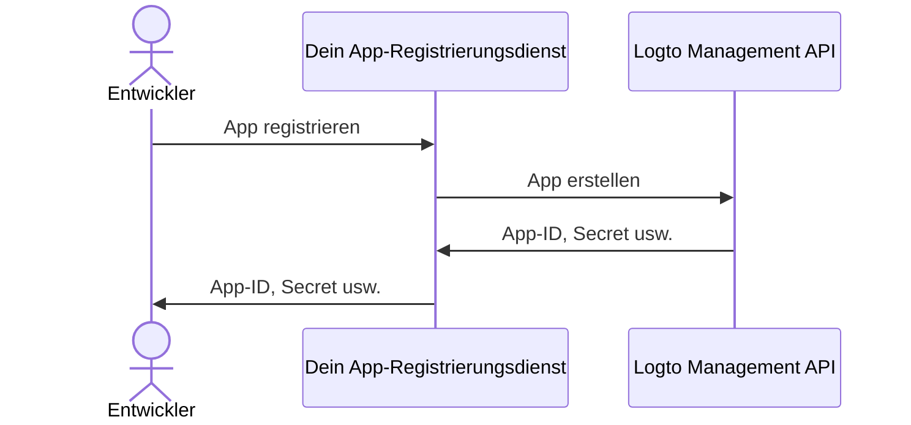

import QuickStartsReference from '../../quick-starts/third-party/oidc/_quick-starts-reference.md';

import thirdPartyAppPermissions from './assets/third-party-app-permissions.png';
import Prerequisites from './fragments/_mcp-prerequisites.mdx';
import SampleCode from './fragments/_mcp-sample-code.mdx';
import SetUpServer from './fragments/_mcp-set-up-server.mdx';

# Zugriff von Drittanbieter-AI-Agenten auf deinen MCP-Server ermöglichen

Diese Anleitung führt dich durch die Integration von Logto mit deinem MCP-Server unter Verwendung von [mcp-auth](https://mcp-auth.dev), sodass du Benutzer authentifizieren und deren Identitätsinformationen sicher über den standardmäßigen OpenID Connect-Flow abrufen kannst.

Du lernst, wie du:

- Logto als Autorisierungsserver für deinen MCP-Server konfigurierst.
- Ein „whoami“-Tool in deinem MCP-Server einrichtest, um die Identitätsansprüche des aktuellen Benutzers zurückzugeben.
- Den Ablauf mit einem Drittanbieter-AI-Agenten (MCP-Client) testest.

Nach diesem Tutorial wird dein MCP-Server:

- Benutzer in deinem Logto-Mandanten authentifizieren.
- Identitätsansprüche (`sub`, `username`, `name`, `email` usw.) für den Aufruf des "whoami"-Tools zurückgeben.

## Unterschied zwischen Drittanbieter-AI-Agent (MCP-Client) und deinem eigenen MCP-Client \{#difference-between-third-party-ai-agent-mcp-client-and-your-own-mcp-client}

Schauen wir uns ein Beispiel an. Stell dir vor, du bist Entwickler und betreibst einen MCP-Server zur Verwaltung von E-Mail-Zugriff und Automatisierung.

**Offizielle E-Mail-App (Dein eigener MCP-Client)**

- Du stellst eine offizielle E-Mail-App bereit, mit der Benutzer ihre E-Mails lesen und verwalten können.
- So funktioniert es: Die offizielle E-Mail-App verbindet sich mit deinem MCP-Server und verwendet Logto zur Authentifizierung der Benutzer. Wenn sich Alice anmeldet, erhält sie automatisch Zugriff auf ihre E-Mails, ohne dass zusätzliche Zustimmungsbildschirme erforderlich sind, da es sich um deine vertrauenswürdige App handelt.

**Drittanbieter-AI-Agent (Drittanbieter-MCP-Client)**

- Du baust ein Ökosystem rund um deinen MCP-Server auf, sodass ein anderer Entwickler „SmartMail AI“ (einen KI-Assistenten, der E-Mails zusammenfassen und automatisch Meetings planen kann) als Drittanbieter-Client integriert.
- So funktioniert es: SmartMail AI (Drittanbieter-MCP-Client) möchte über deinen MCP-Server auf Benutzere-Mails zugreifen. Wenn sich Alice mit ihrem Konto bei SmartMail AI anmeldet:
  - Ihr wird ein Zustimmungsbildschirm angezeigt, der um Erlaubnis bittet, dass SmartMail AI ihre E-Mails und ihren Kalender lesen darf.
  - Alice kann diesen Zugriff erlauben oder verweigern.
  - Nur die Daten, denen sie zustimmt, werden mit SmartMail AI geteilt, und SmartMail AI kann ohne erneute ausdrückliche Zustimmung auf keine weiteren Daten zugreifen.

Diese Zugriffskontrolle (Berechtigung) stellt die Sicherheit der Benutzerdaten sicher: Auch wenn dein MCP-Server alle Daten verwaltet, können Drittanbieter-Apps wie SmartMail AI nur auf das zugreifen, was der Benutzer ausdrücklich erlaubt hat. Sie können diesen Prozess nicht umgehen, da er durch deine Zugriffskontroll-Implementierung im MCP-Server erzwungen wird.

**Zusammenfassung**

| Client-Typ             | Beispiel                | Zustimmung erforderlich? | Wer steuert es?        |
| ---------------------- | ----------------------- | ------------------------ | ---------------------- |
| Offizielle E-Mail-App  | Deine eigene E-Mail-App | Nein                     | Du (der Entwickler)    |
| Drittanbieter-AI-Agent | SmartMail AI-Assistent  | Ja                       | Ein anderer Entwickler |

:::note
Wenn du deinen MCP-Server mit deinem eigenen AI-Agenten oder deiner eigenen App integrieren möchtest, siehe die Anleitung [Authentifizierung für deine MCP-basierten Apps mit Logto aktivieren](./mcp-server-add-auth).
:::

<Prerequisites isThirdParty />

## Drittanbieter-AI-Agent einrichten \{#set-up-third-party-ai-agent}

Um dem Drittanbieter-AI-Agenten den Zugriff auf deinen MCP-Server zu ermöglichen, musst du Folgendes einrichten:

1. Der Client sollte in der Lage sein, MCP-Anfragen zu stellen, um die vom MCP-Server bereitgestellten Tools aufzurufen.
2. Der Client sollte in der Lage sein, auf die Antwort 401 Unauthorized zu reagieren. Siehe [Autorisierungsablauf-Schritte](https://modelcontextprotocol.io/specification/2025-03-26/basic/authorization#2-5-authorization-flow-steps) für weitere Details.
3. Nach erfolgreicher Authentifizierung sollte der Client in der Lage sein, Anfragen an den MCP-Server mit dem von Logto erhaltenen Zugangstoken zu stellen.

## AI-Agent in Logto einrichten \{#set-up-ai-agent-in-logto}

Um dem Drittanbieter-AI-Agenten den Zugriff auf deinen MCP-Server zu ermöglichen, musst du eine **Drittanbieter-App** in Logto einrichten. Diese App repräsentiert den AI-Agenten und erhält die notwendigen Zugangsdaten für Authentifizierung und Autorisierung.

### Entwicklern erlauben, Drittanbieter-Apps in Logto zu erstellen \{#allow-developers-to-create-third-party-apps-in-logto}

Wenn du einen Marktplatz aufbaust oder Entwicklern erlauben möchtest, Drittanbieter-Apps in Logto zu erstellen, kannst du die [Logto Management API](/integrate-logto/interact-with-management-api) nutzen, um Drittanbieter-Apps programmatisch zu erstellen. So können Entwickler ihre Anwendungen registrieren und die erforderlichen Zugangsdaten für die Authentifizierung erhalten.

Du musst einen eigenen Dienst hosten, um den Client-Registrierungsprozess zu verwalten. Dieser Dienst interagiert mit der Logto Management API, um Drittanbieter-Apps im Namen der Entwickler zu erstellen.

Alternativ kannst du Drittanbieter-Apps auch manuell in der Logto-Konsole erstellen, um dich mit dem Prozess vertraut zu machen.

### Drittanbieter-App in Logto manuell erstellen \{#manually-create-a-third-party-app-in-logto}

Du kannst eine Drittanbieter-App in der Logto-Konsole manuell für Testzwecke oder Ad-hoc-Integrationen erstellen. Das ist nützlich, wenn du die Integration schnell testen möchtest, ohne einen vollständigen Client-Registrierungsablauf zu implementieren.

1. Melde dich in deiner Logto-Konsole an.
2. Gehe zu <CloudLink to="/applications">**Anwendungen**</CloudLink> → **Anwendung erstellen** → **Drittanbieter-App** -> **OIDC**.
3. Gib den App-Namen und andere erforderliche Felder ein und klicke dann auf **Anwendung erstellen**.
4. Klicke auf den Tab **Berechtigungen**, im Bereich **Benutzer** auf "Hinzufügen" klicken.
5. Im geöffneten Dialog -> **Benutzerdaten** -> wähle die Berechtigungen **`profile`**, **`email`** aus und klicke dann auf **Speichern**.
6. Konfiguriere in der Drittanbieter-App die Scopes, um die Berechtigungen `openid profile email` anzufordern.
7. Konfiguriere die **Redirect-URI** deiner Drittanbieter-Anwendung entsprechend. Denke daran, die Redirect-URI auch in Logto zu aktualisieren.

---

<QuickStartsReference />

<SetUpServer />

## Integration testen \{#test-the-integration}

1. Starte den MCP-Server.
2. Starte den AI-Agenten.
3. Rufe im Client das `whoami`-Tool auf, um die Identitätsansprüche des aktuellen Benutzers abzurufen.
4. Der Client sollte auf die Antwort 401 Unauthorized reagieren und den Benutzer zur Authentifizierung an Logto weiterleiten.
5. Nach erfolgreicher Authentifizierung sollte der Client ein Zugangstoken erhalten und dieses für Anfragen an den MCP-Server verwenden.
6. Der Client sollte in der Lage sein, die Identitätsansprüche vom MCP-Server mit dem Zugangstoken abzurufen.

<SampleCode />
