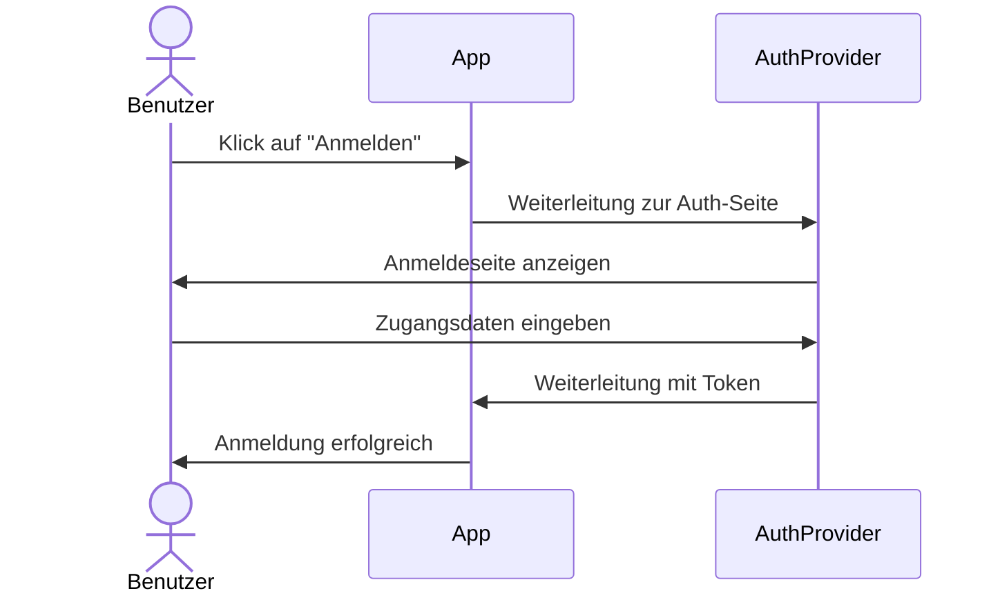
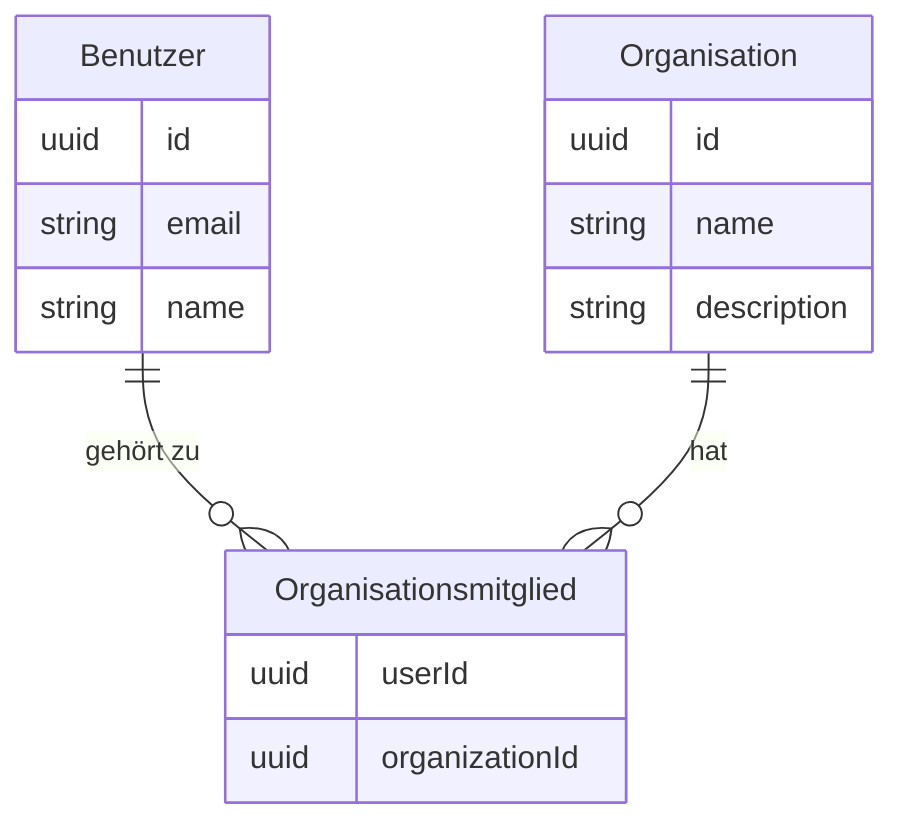
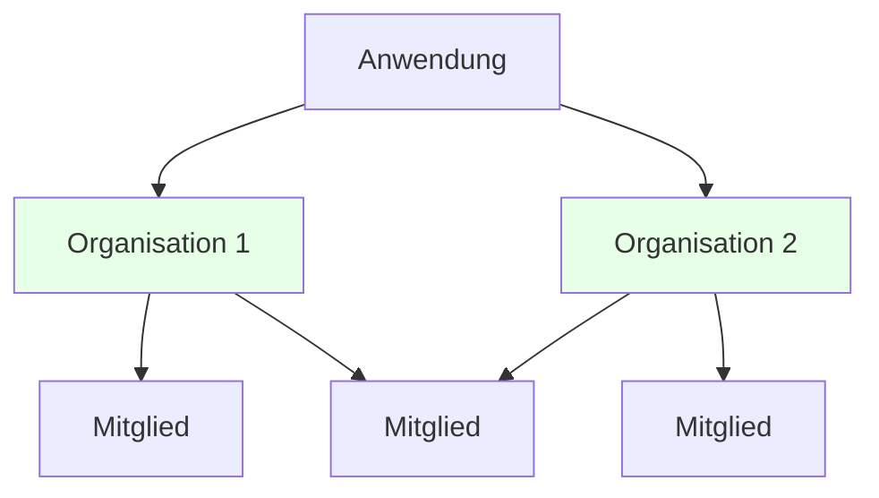
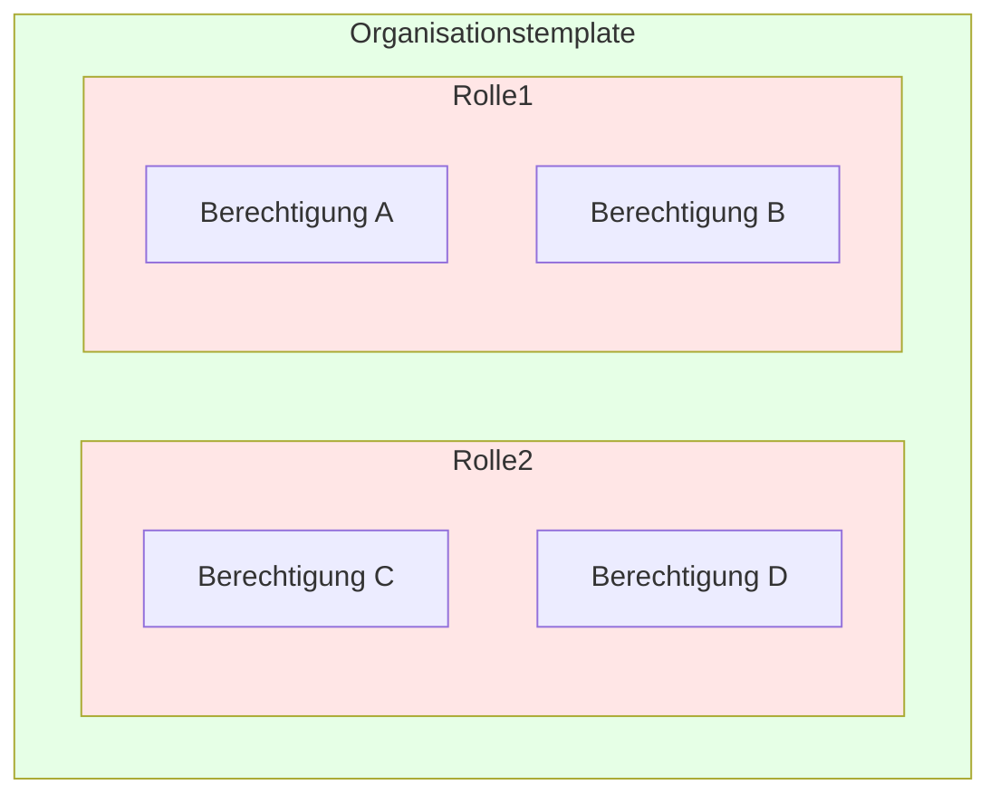
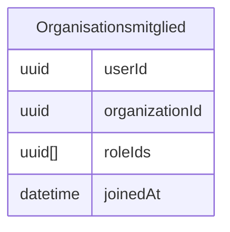
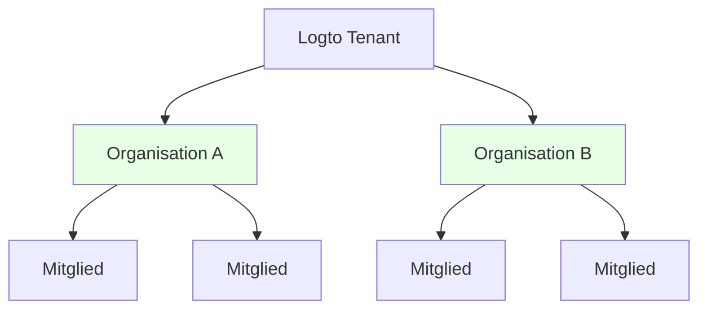
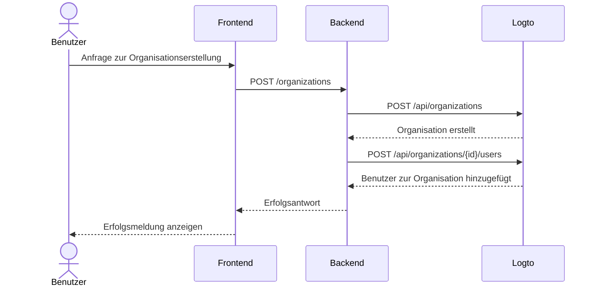

<head>
  <link rel="canonical" href="https://blog.logto.io/build-multi-tenant-saas-application" />
</head>

<style>
  {`
    .twoColumn {
      display: grid;
      grid-template-columns: 1fr 1fr;
      gap: 24px;
    }
    .twoColumn + .twoColumn {
      margin-top: 24px;
    }
  `}
</style>

# Multi-Tenant SaaS-Anwendung erstellen: Ein vollständiger Leitfaden von Design bis Implementierung

Wie werden Apps wie Notion, Slack oder Figma gebaut? Diese Multi-Tenant SaaS-Anwendungen wirken einfach zu bedienen, aber selbst eine zu bauen? Das ist eine andere Geschichte.

Als ich zum ersten Mal darüber nachdachte, so ein komplexes Biest zu bauen, explodierte mein Kopf:

- Benutzer benötigen mehrere Anmeldeoptionen (E-Mail, Google, GitHub)
- Jeder Benutzer kann mehrere Organisationen erstellen und zu mehreren Organisationen gehören
- Unterschiedliche Berechtigungsstufen innerhalb jeder Organisation
- Enterprise-Organisationen, die automatisches Beitreten für bestimmte E-Mail-Domains erfordern
- MFA-Anforderungen für sensible Vorgänge
- Und mehr...

„Chef, lass uns in zwei Wochen über das Produktdesign sprechen. Ich stecke gerade fest.“

Aber als ich tatsächlich damit anfing, **stellte ich fest, dass es gar nicht so entmutigend ist, wie es scheint.**

Ich habe **ein System mit all diesen Funktionen mit überraschend wenig Aufwand gebaut!**


<div className="twoColumn">
  
  
</div>

Ich zeige dir genau, wie du ein solches System von Grund auf entwirfst und implementierst – und du wirst erstaunt sein, wie einfach es im Jahr 2025 mit modernen Tools und dem richtigen Architekturansatz wirklich ist.

> **Der vollständige Quellcode ist in diesem [Github-Repo](https://github.com/logto-io/multi-tenant-saas-sample) verfügbar. Los geht's!**

Wir starten mit einem KI-Dokumentations-SaaS-Produkt namens DocuMind.

DocuMind ist ein KI-Dokumentations-SaaS-Produkt, das mit einem Multi-Tenant-Modell entwickelt wurde, um Einzelpersonen, kleine Unternehmen und Konzerne zu unterstützen.

Die Plattform bietet leistungsstarke KI-Funktionen für das Dokumentenmanagement, darunter automatische Zusammenfassungen, Schlüsselpunktextraktion und intelligente Inhaltsvorschläge innerhalb von Organisationen.

## Welche Funktionen sind für Authentifizierung und Autorisierung in SaaS erforderlich? \{#what-features-are-required-for-saas-authentication-and-authorization}

Zuerst schauen wir uns die notwendigen Anforderungen an. Welche Funktionen brauchst du?

### Multi-Tenant-Architektur \{#multi-tenant-architecture}

Um eine Multi-Tenant-Architektur zu ermöglichen, benötigst du eine Entitätsschicht namens **Organisation**. Stell dir einen einzigen Pool von Benutzern vor, die auf mehrere Arbeitsbereiche zugreifen können. Jede Organisation repräsentiert einen Arbeitsbereich, und Benutzer behalten eine einzige Identität, während sie je nach zugewiesener Rolle auf verschiedene Arbeitsbereiche (Organisationen) zugreifen.


Dies ist eine weit verbreitete Funktion bei Authentifizierungsanbietern. Eine Organisation in einem Identitätsmanagementsystem entspricht dem Workspace, Projekt oder Tenant deiner SaaS-App.


### Mitgliedschaft \{#membership}

Ein Mitglied ist ein temporäres Konzept, das den Mitgliedsstatus einer Identität innerhalb einer Organisation anzeigt.

Beispiel: Sarah registriert sich mit ihrer E-Mail **sarah@gmail.com** in deiner App. Sie kann zu verschiedenen Arbeitsbereichen gehören. Ist Sarah Teil von **Workspace A**, aber nicht von **Workspace B**, gilt sie als Mitglied von **Workspace A**, aber nicht von **Workspace B**.

### Rollen- und Berechtigungsdesign \{#role-and-permission-design}

In einer Multi-Tenant-Architektur benötigen Benutzer **Rollen** mit bestimmten **Berechtigungen**, um auf ihre Tenant-Ressourcen zuzugreifen.
Berechtigungen sind detaillierte Zugangskontrollen, die bestimmte Aktionen definieren, wie `read: order` oder `write: order`. Sie bestimmen, welche Aktionen auf bestimmten Ressourcen ausgeführt werden dürfen.

Rollen sind eine Sammlung von Berechtigungen, die Mitgliedern in einer Multi-Tenant-Umgebung zugewiesen werden.

Du musst diese Rollen und Berechtigungen definieren, dann Rollen an Benutzer zuweisen, manchmal auch automatisiert. Zum Beispiel:

1. Benutzer, die einer Organisation beitreten, erhalten automatisch die **Mitglied**-Rolle.
2. Der erste Benutzer, der einen Arbeitsbereich erstellt, erhält automatisch die **Admin**-Rolle.

### Registrierungs- und Login-Flow \{#sign-up-and-login-flow}

Sorge für einen benutzerfreundlichen und sicheren Registrierungs- und Authentifizierungsprozess, einschließlich grundlegender Anmelde- und Registrierungsoptionen:

1. **E-Mail- und Passwort-Anmeldung**: Traditionelle Anmeldemethode mit E-Mail und Passwort.
2. **Passwortlose Anmeldung**: Nutze E-Mail-Bestätigungscodes für einfachen und sicheren Zugang.
3. **Kontoverwaltung**: Ein Account Center, in dem Benutzer ihre E-Mail, ihr Passwort und andere Details aktualisieren können.
4. **Soziale Anmeldung**: Optionen wie Google und GitHub für schnelles Login.
5. **Multi-Faktor-Authentifizierung (MFA)**: Erhöhe die Sicherheit durch Anmeldung über Authenticator-Apps wie Duo.

### Tenant-Erstellung und Einladung \{#tenant-creation-and-invitation}

In einer Multi-Tenant-SaaS-App ist ein wichtiger Unterschied im Benutzerfluss die Unterstützung der Tenant-Erstellung und der Einladung von Mitgliedern. Dieser Prozess erfordert sorgfältige Planung und Umsetzung, da er eine Schlüsselrolle bei der Produktaktivierung und beim Wachstum spielt.

Hier sind einige typische Use-Flows, die du berücksichtigen solltest:

| Benutzertyp                                    | Einstiegspunkt                                                                    |
| ---------------------------------------------- | --------------------------------------------------------------------------------- |
| Neues Konto                                    | Einstieg über Anmelde- und Registrierungsseite zur Erstellung eines neuen Tenants |
| Bestehendes Konto                              | Erstelle einen weiteren Tenant innerhalb des Produkts                             |
| Bestehendes Konto erhält neue Tenant-Einladung | Einstieg über Anmelde- und Registrierungsseite                                    |
| Bestehendes Konto erhält neue Tenant-Einladung | Einstieg über die Einladungsemail                                                 |
| Neues Konto erhält neue Tenant-Einladung       | Einstieg über Anmelde- und Registrierungsseite                                    |
| Neues Konto erhält neue Tenant-Einladung       | Einstieg über die Einladungsemail                                                 |

Dies sind gängige Szenarien, die in fast jeder SaaS-App zu finden sind. Nutze sie als Referenz, um dein Produkt- und Designteam zu inspirieren, und erstelle bei Bedarf eigene Flows.

<div className="twoColumn">
  
  
</div>

<div className="twoColumn">
  
  
</div>

<div className="twoColumn">
  
  
</div>

## Technische Architektur und Systemdesign \{#technical-architecture-and-system-design}

Sobald wir alle Produktanforderungen verstanden haben, gehen wir zur Umsetzung über.

### Authentifizierungsstrategie festlegen \{#define-authentication-strategy}

Authentifizierung wirkt abschreckend. Benutzer benötigen:

- E-Mail & Passwort Registrierung/Login
- Ein-Klick-Anmeldung mit Google/Github
- Passwort-Reset bei Vergessen
- Teamweite Anmeldung für Unternehmenskunden
- ...

Allein diese Basisfunktionen zu implementieren, könnte Wochen dauern.

Aber jetzt **müssen wir das alles NICHT mehr selbst bauen!**

Moderne Auth-Anbieter (ich wähle diesmal [Logto](https://logto.io/)) haben all diese Funktionen für uns gebündelt. Der Authentifizierungsablauf ist einfach:



**Von Wochen Entwicklungszeit zu 15 Minuten Einrichtung** – Logto übernimmt alle komplexen Abläufe für uns! Die Integrationsschritte behandeln wir später im Implementierungsteil. Jetzt können wir uns auf die Kernfunktionen von DocuMind konzentrieren!

### Multi-Tenant-Architektur etablieren \{#establish-multi-tenant-architecture}

Das Organisationssystem ermöglicht es Benutzern, mehrere Organisationen zu erstellen und ihnen beizutreten. Verstehen wir die Kernbeziehungen:



In diesem System kann jeder Benutzer zu mehreren Organisationen gehören, und jede Organisation kann mehrere Mitglieder haben.



### Zugangskontrolle in der Multi-Tenant-App aktivieren \{#enable-access-control-in-multi-tenant-app}

Rollenbasierte Zugangskontrolle (RBAC) ist wichtig für Sicherheit und Skalierbarkeit in Multi-Tenant SaaS-Anwendungen.

In einer Multi-Tenant-App ist das Design von Berechtigungen und Rollen meist konsistent, da es aus dem Produktdesign hervorgeht. In mehreren Arbeitsbereichen gibt es typischerweise eine Admin-Rolle und eine Mitgliederrolle. Logto als Auth-Anbieter hat folgendes organisationsbasiertes rollenbasiertes Zugangskontroll-Design:

1. **Einheitliche Berechtigungsdefinitionen**: Berechtigungen werden auf Systemebene definiert und gelten konsistent für alle Organisationen, was eine wartbare und konsistente Berechtigungsverwaltung ermöglicht.
2. **Organisationstemplates**: Vorgefertigte Kombinationen aus Rollen und Berechtigungen durch Organisationstemplates, die die Initialisierung von Organisationen vereinfachen.

Die Berechtigungsbeziehung sieht so aus:



Da jeder Benutzer eigene Rolle(n) innerhalb jeder Organisation benötigt, muss die Beziehung zwischen Rollen und Organisationen die zugewiesenen Rollen jedes Benutzers widerspiegeln:



Wir haben das Organisationssystem und das Zugangskontrollsystem entworfen – jetzt können wir mit dem Bau unseres Produkts beginnen!

## Tech-Stack \{#tech-stack}

Ich habe einen einsteigerfreundlichen, portablen Stack gewählt:

1. **Frontend**: React (leicht auf Vue/Angular/Svelte übertragbar)
2. **Backend**: Express (einfaches, intuitives API)

Warum Frontend und Backend trennen? Weil es eine klare Architektur bietet, leicht zu erlernen und einfach den Stack zu wechseln ist. Und als Auth-Anbieter verwende ich Logto als Beispiel.

Und für die folgenden Anleitungen gilt: **Das Muster funktioniert mit jedem Frontend, jedem Backend und jedem Auth-System.**

## Füge deiner App einen grundlegenden Authentifizierungs-Flow hinzu \{#add-basic-authentication-flow-to-your-app}

Das ist der einfachste Schritt. Wir müssen Logto nur in unser Projekt integrieren. Dann können wir im Logto Console die Methoden für Benutzer-Login/Registrierung nach unseren Bedürfnissen konfigurieren.

### Logto in deiner App installieren \{#install-logto-to-your-app}

Melde dich zuerst bei [Logto Cloud](https://cloud.logto.io/) an. Du kannst ein kostenloses Konto erstellen, falls du noch keines hast. Erstelle einen Development Tenant zum Testen.

Im Tenant Console klicke auf die Schaltfläche „Application“ auf der linken Seite. Wähle dann React aus, um mit dem Bau unserer Anwendung zu beginnen.

Folge der Anleitung auf der Seite. Die Logto-Integration ist in etwa 5 Minuten abgeschlossen!

Hier ist mein Integrationscode:

```jsx
const config: LogtoConfig = {
  endpoint: "<YOUR_LOGTO_ENDPOINT>",
  appId: "<YOUR_LOGTO_APP_ID>",
};

function App() {
  return (
    <LogtoProvider config={config}>
      <div className="min-h-screen bg-gradient-to-b from-gray-50 to-gray-100">
        <Routes>
          {/* Dieser Callback verarbeitet die Benutzer-Login-Weiterleitung von Logto */}
          <Route path="/callback" element={<Callback />} />
          <Route path="/*" element={<AppContent />} />
        </Routes>
      </div>
    </LogtoProvider>
  );
}

function AppContent() {
  const { isAuthenticated } = useLogto();

  if (!isAuthenticated) {
    // Landing-Page für nicht authentifizierte Benutzer anzeigen
    return <Landing />;
  }

  // Haupt-App für authentifizierte Benutzer anzeigen
  return (
    <Routes>
      {/* Dashboard zeigt alle verfügbaren Organisationen */}
      <Route path="/" element={<Dashboard />} />

      {/* Organisationsseite nach Klick auf eine Organisation im Dashboard */}
      <Route path="/:orgId" element={<Organization />} />
    </Routes>
  );
}
```


Ein nützlicher Trick: Unsere Login-Seite hat sowohl Anmelden- als auch Registrieren-Buttons. Der Registrieren-Button führt direkt zur Registrierungsseite von Logto. Das funktioniert über Logtos [First Screen](/end-user-flows/authentication-parameters/first-screen)-Funktion. Sie bestimmt, welchen Schritt des Auth-Flows Benutzer zuerst sehen.

Du kannst die Registrierungsseite als Standard festlegen, wenn dein Produkt viele neue Benutzer erwartet.

```jsx
function LandingPage() {
  const { signIn } = useLogto();

  return (
    <div className="landing-container">
      <div className="auth-buttons">
        <button
          className="sign-in-button"
          onClick={() => {
            signIn({
              redirectUri: '<YOUR_APP_CALLBACK_URL>',
            });
          }}
        >
          Anmelden
        </button>

        <button
          className="register-button"
          onClick={() => {
            signIn({
              redirectUri: '<YOUR_APP_CALLBACK_URL>',
              firstScreen: 'register',
            });
          }}
        >
          Registrieren
        </button>
      </div>
    </div>
  );
}
```

Nach dem Klick auf Anmelden gelangst du zur Logto-Anmeldeseite. Nach erfolgreicher Anmeldung (oder Registrierung) – Glückwunsch! Deine App hat ihren ersten Benutzer (dich)!

Und rufe die Funktion `signOut` aus dem `useLogto`-Hook auf, um den Benutzer abzumelden, wann immer du möchtest.

```jsx
function SignOutButton() {
  const { signOut } = useLogto();

  return <button onClick={() => signOut('<YOUR_POST_LOGOUT_REDIRECT_URL>')}>Abmelden</button>;
}
```

### Anmelde- und Registrierungsarten anpassen \{#customize-sign-in-and-sign-up-methods}

Im Logto Console klicke im linken Menü auf „Sign-in Experience“. Dann auf den Tab „Sign-up and sign-in“.
Folge auf dieser Seite den Anweisungen, um die Login-/Registrierungsmethoden von Logto zu konfigurieren.


Und der Anmelde-Flow sieht dann so aus:


### Multi-Faktor-Authentifizierung aktivieren \{#enable-multi-factor-authentication}

Mit Logto ist das Aktivieren von MFA einfach. Klicke einfach auf die Schaltfläche „Multi-factor auth“ im Logto Console. Aktiviere es dann auf der Multi-Faktor-Authentifizierungsseite.


Und der MFA-Flow sieht so aus:

<div className="twoColumn">
  
  
</div>

Alles ist so einfach! Wir haben in wenigen Minuten ein komplexes Benutzer-Authentifizierungssystem eingerichtet!

## Multi-Tenant-Organisationserlebnis hinzufügen \{#adding-multi-tenant-organization-experience}

Jetzt haben wir unseren ersten Benutzer! Allerdings gehört dieser Benutzer noch keiner Organisation an, und wir haben auch noch keine Organisationen erstellt.

Logto bietet integrierte Unterstützung für Multi-Tenancy. Du kannst beliebig viele Organisationen in Logto erstellen. Jede Organisation kann mehrere Mitglieder haben.



Jeder Benutzer kann seine Organisationsinformationen von Logto abrufen. Das ermöglicht Multi-Tenancy-Unterstützung.

### Organisationsinformationen eines Benutzers abrufen \{#get-a-user-s-organization-information}

Um die Organisationsinformationen eines Benutzers von Logto zu erhalten, befolge diese zwei Schritte:

Deklariere den Zugriff auf Organisationsinformationen im Logto Config. Dies geschieht durch Setzen der entsprechenden `scopes` und `resources`.

```jsx
import { UserScope, ReservedResource } from "@logto/react";
const config: LogtoConfig = {
  endpoint: "<YOUR_LOGTO_ENDPOINT>",
  appId: "<YOUR_LOGTO_APP_ID>",
  scopes: [UserScope.Organizations], // Wert: "urn:logto:scope:organizations"
  resources: [ReservedResource.Organization], // Wert: "urn:logto:resource:organizations"
};

```

Nutze die Methode `fetchUserInfo` von Logto, um Benutzerinformationen einschließlich Organisationsdaten zu erhalten.

```jsx
function Dashboard() {
  // Benutzerinfo abrufen
  const { fetchUserInfo } = useLogto();
  const [organizations, setOrganizations] = useState<OrganizationData[]>([]);
  const [loading, setLoading] = useState(false);

  useEffect(() => {
    const loadOrganizations = async () => {
      try {
        setLoading(true);
        // Benutzerinfo abrufen
        const userInfo = await fetchUserInfo();
        // Organisationsinfo des Benutzers abrufen
        const organizationData = userInfo?.organization_data || [];
        setOrganizations(organizationData);
      } catch (error) {
        console.error('Fehler beim Abrufen der Organisationen:', error);
      } finally {
        setLoading(false);
      }
    };

    loadOrganizations();
  }, [fetchUserInfo]);

  if (loading) {
    return <div>Lädt...</div>;
  }

  if (organizations.length === 0) {
    return <div>Du bist noch kein Mitglied einer Organisation</div>;
  }

  return <div>Organisationen: {organizations.map(org => org.name).join(', ')}</div>;
}

```

Nachdem du diese Schritte abgeschlossen hast, musst du dich ab- und wieder anmelden. Das ist notwendig, weil wir den angeforderten Scope und die Resource geändert haben.

Im Moment hast du noch keine Organisationen erstellt. Der Benutzer ist auch noch keiner Organisation beigetreten. Das Dashboard zeigt „Du hast noch keine Organisation“.


Als Nächstes erstellen wir eine Organisation für unsere Benutzer und fügen sie hinzu.

Dank Logto müssen wir keine komplexen Organisationsbeziehungen bauen. Wir müssen nur eine Organisation in Logto erstellen und Benutzer hinzufügen. Logto übernimmt die gesamte Komplexität für uns. Es gibt zwei Möglichkeiten, Organisationen zu erstellen:

1. Manuelles Erstellen von Organisationen über das Logto Console
2. Nutzung der Logto Management API zum Erstellen von Organisationen, insbesondere wenn du einen SaaS-Flow entwirfst, der es Benutzern ermöglicht, eigene Organisationen (Workspaces) zu erstellen.

### Organisation im Logto Console erstellen \{#create-organization-in-logto-console}

Klicke im Logto Console auf die Schaltfläche „Organizations“ im linken Menü. Erstelle eine Organisation.

Jetzt hast du deine erste Organisation.


Als Nächstes fügen wir den Benutzer dieser Organisation hinzu.

Gehe zur Organisationsdetailseite. Wechsle zum Tab Mitglieder. Klicke auf die Schaltfläche „+ Mitglied hinzufügen“. Wähle deinen Login-Benutzer aus der linken Liste. Klicke auf die Schaltfläche „Mitglieder hinzufügen“ unten rechts. Jetzt hast du den Benutzer erfolgreich zur Organisation hinzugefügt.


Aktualisiere deine APP-Seite. Du siehst, dass der Benutzer jetzt zu einer Organisation gehört!


## Self-Service-Organisationserstellung implementieren \{#implement-self-serve-organization-creation-experience}

Eine Organisation im Console zu erstellen reicht nicht aus. Deine SaaS-App braucht einen Flow, der Endbenutzern ermöglicht, eigene Workspaces einfach zu erstellen und zu verwalten. Um diese Funktion zu implementieren, nutze die Logto Management API.

Für Anleitungen siehe die Dokumentation [Mit Management API interagieren](/integrate-logto/interact-with-management-api), um die API-Kommunikation mit Logto einzurichten.

### Auth-Interaktionsfluss für Organisationen verstehen \{#understand-organization-auth-interaction-flow}

Nehmen wir den Organisations-Erstellungsflow als Beispiel. So funktioniert der Prozess:



Dieser Flow hat zwei wichtige Authentifizierungsanforderungen:

1. **Backend-Service-API schützen**:
   - Frontend-Zugriff auf unsere Backend-Service-API erfordert Authentifizierung
   - API-Endpunkte werden durch Validierung des Logto Zugangstokens des Benutzers geschützt
   - Stellt sicher, dass nur authentifizierte Benutzer auf unsere Dienste zugreifen können
2. **Zugriff auf Logto Management API**:
   - Backend-Service muss sicher die Logto Management API aufrufen
   - Folge dem Leitfaden [Mit Management API interagieren](/integrate-logto/interact-with-management-api) für die Einrichtung
   - Nutze Maschine-zu-Maschine Authentifizierung, um Zugangsdaten zu erhalten

### Deine Backend-API schützen \{#protect-your-backend-api}

Erstelle zunächst einen API-Endpunkt in unserem Backend-Service zur Organisationserstellung.

```jsx
app.post('/organizations', async (req, res) => {
  // Implementierung mit Logto Management API
  // ...
});
```

Unsere Backend-Service-API erlaubt nur authentifizierten Benutzern den Zugriff. Wir müssen Logto nutzen, um unsere API zu schützen. Außerdem benötigen wir die aktuellen Benutzerinformationen (wie Benutzer-ID).

Im Logto-Konzept (und OAuth 2.0) agiert unser Backend-Service als Ressourcensserver. Benutzer greifen mit einem Zugangstoken vom Frontend auf den DocuMind-Ressourcenserver zu. Der Ressourcenserver prüft dieses Token. Ist es gültig, gibt er die angeforderten Ressourcen zurück.

Erstelle eine API-Ressource, die unseren Backend-Service repräsentiert.

Gehe zum Logto Console.

1. Klicke auf die Schaltfläche „API resources“ rechts.
2. Klicke auf „Create API resource“. Wähle Express im Popup.
3. Gib „DocuMind API“ als API-Namen ein. Verwende „[https://api.documind.com](https://api.documind.com/)“ als API-Identifier.
4. Klicke auf Erstellen.

Mach dir keine Sorgen um diese API-Identifier-URL. Sie ist nur ein eindeutiger Bezeichner für deine API in Logto. Sie ist nicht mit deiner tatsächlichen Backend-Service-URL verbunden.

Du siehst ein Tutorial zur Verwendung der API-Ressource. Du kannst diesem Tutorial oder unseren Schritten unten folgen.

Erstelle ein requireAuth-Middleware, um unseren POST /organizations-Endpunkt zu schützen.

```jsx
const { createRemoteJWKSet, jwtVerify } = require('jose');

const getTokenFromHeader = (headers) => {
  const { authorization } = headers;
  const bearerTokenIdentifier = 'Bearer';

  if (!authorization) {
    throw new Error('Authorization header missing');
  }

  if (!authorization.startsWith(bearerTokenIdentifier)) {
    throw new Error('Authorization token type not supported');
  }

  return authorization.slice(bearerTokenIdentifier.length + 1);
};

const requireAuth = (resource) => {
  if (!resource) {
    throw new Error('Resource parameter ist für die Authentifizierung erforderlich');
  }

  return async (req, res, next) => {
    try {
      // Token extrahieren
      const token = getTokenFromHeader(req.headers);

      const { payload } = await jwtVerify(
        token,
        createRemoteJWKSet(new URL(process.env.LOGTO_JWKS_URL)),
        {
          issuer: process.env.LOGTO_ISSUER,
          audience: resource,
        }
      );

      // Benutzerinfo zur Anfrage hinzufügen
      req.user = {
        id: payload.sub,
      };

      next();
    } catch (error) {
      console.error('Auth-Fehler:', error);
      res.status(401).json({ error: 'Nicht autorisiert' });
    }
  };
};

module.exports = {
  requireAuth,
};
```

Um dieses Middleware zu nutzen, benötigen wir diese Umgebungsvariablen:

- LOGTO_JWKS_URL
- LOGTO_ISSUER

Hole diese Variablen aus dem OpenID Configuration Endpoint deines Logto Tenants. Besuche `https://<your-tenant-id>.logto.app/oidc/.well-known/openid-configuration`. Die benötigten Informationen findest du im zurückgegebenen JSON:

```json
{
  "jwks_uri": "<https://tenant-id.logto.app/oidc/jwks>",
  "issuer": "<https://tenant-id.logto.app/oidc>"
}
```

Jetzt verwende das requireAuth-Middleware in unserem POST /organizations-Endpunkt.

```jsx
app.post('/organizations', requireAuth('<https://api.documind.com>'), async (req, res) => {
  // Logik zur Organisationserstellung
  // ...
});
```

Damit ist unser POST /organizations-Endpunkt geschützt. Nur Benutzer mit gültigen Logto Zugangstokens können darauf zugreifen.

Wir können das Token jetzt im Frontend von Logto erhalten. Benutzer können mit diesem Token Organisationen über unseren Backend-Service erstellen. Das Middleware gibt uns auch die Benutzer-ID. Das hilft beim Hinzufügen von Benutzern zu Organisationen.

Im Frontend-Code deklariere diese API-Ressource im Logto-Config. Füge ihren Identifier zum Ressourcen-Array hinzu.

```jsx
const config: LogtoConfig = {
  endpoint: "<YOUR_LOGTO_ENDPOINT>",
  appId: "<YOUR_LOGTO_APP_ID>",
  scopes: [UserScope.Organizations],
  resources: [ReservedResource.Organization, "<https://api.documind.com>"], // Neu erstellter API-Ressourcen-Identifier
};

```

Wie zuvor müssen sich Benutzer nach der Aktualisierung des Logto-Configs erneut anmelden.

Im Dashboard hole das Logto Zugangstoken beim Erstellen einer Organisation. Verwende dieses Token, um auf unsere Backend-Service-API zuzugreifen.

```jsx
// Zugangstoken für "DocuMind API" holen
const token = await getAccessToken('<https://api.documind.com>');

// Zugriff auf unsere Backend-Service-API mit dem Token
const response = await fetch('<http://localhost:3000/organizations>', {
  method: 'POST',
  headers: {
    'Content-Type': 'application/json',
    Authorization: `Bearer ${token}`,
  },
  body: JSON.stringify({
    name: 'Organisation A',
    description: 'Beschreibung Organisation A',
  }),
});
```

Jetzt können wir korrekt auf die DocuMind Backend-Service-API zugreifen.

### Logto Management API aufrufen \{#calling-logto-management-api}

Implementieren wir die Organisationserstellung mit der Logto Management API.

Wie Frontend-Anfragen an den Backend-Service benötigen Backend-Service-Anfragen an Logto Zugangstokens.

In Logto nutzen wir Maschine-zu-Maschine Authentifizierung für Zugangstokens. Siehe [Mit Management API interagieren](/integrate-logto/interact-with-management-api).

Gehe zur Anwendungsseite im Logto Console. Erstelle eine Maschine-zu-Maschine-Anwendung. Weisen Sie die Rolle „Logto Management API access“ zu. Kopiere den Token-Endpunkt, App-ID und App-Secret. Wir verwenden diese für Zugangstokens.


Jetzt können wir Logto Management API Zugangstokens über diese M2M-Anwendung erhalten.

```jsx
async function fetchLogtoManagementApiAccessToken() {
  const response = await fetch(process.env.LOGTO_MANAGEMENT_API_TOKEN_ENDPOINT, {
    method: 'POST',
    headers: {
      'Content-Type': 'application/x-www-form-urlencoded',
      Authorization: `Basic ${Buffer.from(
        `${process.env.LOGTO_MANAGEMENT_API_APPLICATION_ID}:${process.env.LOGTO_MANAGEMENT_API_APPLICATION_SECRET}`
      ).toString('base64')}`,
    },
    body: new URLSearchParams({
      grant_type: 'client_credentials',
      resource: process.env.LOGTO_MANAGEMENT_API_RESOURCE,
      scope: 'all',
    }).toString(),
  });
  const data = await response.json();
  return data.access_token;
}
```

Verwende dieses Zugangstoken, um die Logto Management API aufzurufen.

Wir nutzen diese Management APIs:

- `POST /api/organizations`: Organisation erstellen (siehe: [Create organization API reference](https://openapi.logto.io/operation/operation-createorganization))
- `POST /api/organizations/{id}/users`: Benutzer zur Organisation hinzufügen (siehe: [Add users to organization API reference](https://openapi.logto.io/operation/operation-addusers))

```jsx
app.post('/organizations', requireAuth('<https://api.documind.com>'), async (req, res) => {
  const accessToken = await fetchLogtoManagementApiAccessToken();
  // Organisation in Logto erstellen und Benutzer hinzufügen
  const response = await fetch(`${process.env.LOGTO_ENDPOINT}/api/organizations`, {
    method: 'POST',
    headers: {
      'Content-Type': 'application/json',
      Authorization: `Bearer ${accessToken}`,
    },
    body: JSON.stringify({
      name: req.body.name,
      description: req.body.description,
    }),
  });

  const createdOrganization = await response.json();

  await fetch(`${process.env.LOGTO_ENDPOINT}/api/organizations/${createdOrganization.id}/users`, {
    method: 'POST',
    headers: {
      'Content-Type': 'application/json',
      Authorization: `Bearer ${accessToken}`,
    },
    body: JSON.stringify({
      userIds: [req.user.id],
    }),
  });

  res.json({ data: createdOrganization });
});
```

Wir haben jetzt die Organisationserstellung über die Logto Management API implementiert. Wir können auch Benutzer zu Organisationen hinzufügen.

Testen wir dieses Feature im Dashboard.


und klicke auf „Organisation erstellen“


Erstellung erfolgreich!

Der nächste Schritt wäre, Benutzer zu einer Organisation einzuladen. Wir implementieren dieses Feature in unserem Tutorial noch nicht. Du weißt jetzt, wie du die Management API nutzt. Du kannst dich an diesem [**Tenant-Erstellung und Einladung**](https://blog.logto.io/build-multi-tenant-saas-application#tenant-creation-and-invitation) als Produktdesign-Referenz orientieren und dieses Feature leicht umsetzen, indem du diesem Blogpost folgst: [How we implement user collaboration within a multi-tenant app](https://blog.logto.io/implement-user-collaboration-in-your-app).

## Zugangskontrolle in deiner Multi-Tenant-App implementieren \{#implement-access-control-to-your-multi-tenant-app}

Kommen wir nun zur Zugangskontrolle auf Organisationsebene.

Wir wollen erreichen:

- Benutzer können nur auf Ressourcen ihrer eigenen Organisationen zugreifen: Das kann über Logtos `Organisationstoken` erfolgen
- Benutzer haben spezifische Rollen innerhalb von Organisationen (mit unterschiedlichen Berechtigungen), um autorisierte Aktionen auszuführen: Das kann über Logtos Organisationstemplate-Feature umgesetzt werden

Schauen wir uns an, wie diese Features implementiert werden.

### Verwendung des Logto Organisationstokens \{#using-logto-organization-token}

Ähnlich wie das zuvor erwähnte Logto Zugangstoken gibt Logto ein Zugangstoken für eine bestimmte Ressource aus, und Benutzer nutzen dieses Token, um auf geschützte Ressourcen im Backend-Service zuzugreifen. Entsprechend gibt Logto ein Organisationstoken für eine bestimmte Organisation aus, und Benutzer nutzen dieses Token, um auf geschützte Organisationsressourcen im Backend-Service zuzugreifen.

In der Frontend-Anwendung können wir die Methode `getOrganizationToken` von Logto verwenden, um ein Token für den Zugriff auf eine bestimmte Organisation zu erhalten.

```jsx
const { getOrganizationToken } = useLogto();
const organizationToken = await getOrganizationToken(organizationId);
```

Hier ist `organizationId` die ID der Organisation, zu der der Benutzer gehört.

Bevor du `getOrganization` oder andere Organisationsfunktionen verwendest, stelle sicher, dass der Scope `urn:logto:scope:organizations` und die Resource `urn:logto:resource:organization` im Logto-Config enthalten sind. Da wir das bereits deklariert haben, wiederholen wir es nicht.

Auf unserer Organisationsseite verwenden wir das Organisationstoken, um Dokumente innerhalb der Organisation abzurufen.

```jsx
function OrganizationPage() {
  const { organizationId } = useParams();
  const navigate = useNavigate();
  const { signOut, getOrganizationToken } = useLogto();
  const [error, setError] = useState<Error | null>(null);
  const [documents, setDocuments] = useState([]);

  const fetchDocuments = useCallback(async () => {
    if (!organizationId) return;

    try {
      const organizationToken = await getOrganizationToken(organizationId);
      const response = await fetch(`http://localhost:3000/documents`, {
          headers: {
          'Content-Type': 'application/json',
          Authorization: `Bearer ${organizationToken}`,
        },
      });
      const documents = await response.json();
      setDocuments(documents);
    } catch (error: unknown) {
      if (error instanceof Error) {
        setError(error);
      } else {
        setError(new Error(String(error)));
      }
    }
  },[getOrganizationToken, organizationId]);

  useEffect(() => {
    void fetchDocuments();
  }, [fetchDocuments]);

  if (error) {
    return <div>Fehler: {error.message}</div>;
  }

  return <div>
    <h1>Organisationsdokumente</h1>
    <ul>
      {documents.map((document) => (
        <li key={document.id}>{document.name}</li>
      ))}
    </ul>
  </div>
}

```

Zwei wichtige Punkte sind bei dieser Implementierung zu beachten:

1. Wenn die an `getOrganizationToken` übergebene `organizationId` keine Organisation ist, zu der der aktuelle Benutzer gehört, kann diese Methode kein Token erhalten. So wird sichergestellt, dass Benutzer nur auf ihre eigenen Organisationen zugreifen können.
2. Beim Anfordern von Organisationsressourcen verwenden wir das Organisationstoken anstelle des Zugangstokens, da wir für Ressourcen, die zu einer Organisation gehören, die Organisationsberechtigungen und nicht die Benutzerberechtigungen verwenden möchten (das wird noch klarer, wenn wir später die API `GET /documents` implementieren).

Als Nächstes erstellen wir eine API `GET /documents` in unserem Backend-Service. Ähnlich wie wir die API-Ressource zum Schutz der API `POST /organizations` verwenden, nutzen wir organisationsspezifische Ressourcenindikatoren zum Schutz der API `GET /documents`.

Erstellen wir zunächst ein `requireOrganizationAccess`-Middleware, um Organisationsressourcen zu schützen.

```jsx
const getTokenFromHeader = (headers) => {
  const { authorization } = headers;
  const bearerTokenIdentifier = 'Bearer';

  if (!authorization) {
    throw new Error('Authorization header missing');
  }

  if (!authorization.startsWith(bearerTokenIdentifier)) {
    throw new Error('Authorization token type not supported');
  }

  return authorization.slice(bearerTokenIdentifier.length + 1);
};

const extractOrganizationId = (aud) => {
  if (!aud || typeof aud !== 'string' || !aud.startsWith('urn:logto:organization:')) {
    throw new Error('Ungültiges Organisationstoken');
  }
  return aud.replace('urn:logto:organization:', '');
};

const decodeJwtPayload = (token) => {
  try {
    const [, payloadBase64] = token.split('.');
    if (!payloadBase64) {
      throw new Error('Ungültiges Tokenformat');
    }
    const payloadJson = Buffer.from(payloadBase64, 'base64').toString('utf-8');
    return JSON.parse(payloadJson);
  } catch (error) {
    throw new Error('Fehler beim Dekodieren des Token-Payloads');
  }
};

const requireOrganizationAccess = () => {
  return async (req, res, next) => {
    try {
      // Token extrahieren
      const token = getTokenFromHeader(req.headers);

      // Audience dynamisch aus dem Token holen
      const { aud } = decodeJwtPayload(token);
      if (!aud) {
        throw new Error('Audience im Token fehlt');
      }

      // Token mit Audience verifizieren
      const { payload } = await jwtVerify(
        token,
        createRemoteJWKSet(new URL(process.env.LOGTO_JWKS_URL)),
        {
          issuer: process.env.LOGTO_ISSUER,
          audience: aud,
        }
      );

      // Organisations-ID aus dem Audience-Claim extrahieren
      const organizationId = extractOrganizationId(payload.aud);

      // Organisationsinfo zur Anfrage hinzufügen
      req.user = {
        id: payload.sub,
        organizationId,
      };

      next();
    } catch (error) {
      console.error('Organisation Auth-Fehler:', error);
      res.status(401).json({ error: 'Nicht autorisiert – Ungültiger Organisationszugriff' });
    }
  };
};
```

Dann verwenden wir das `requireOrganizationAccess`-Middleware, um die API `GET /documents` zu schützen.

```jsx
app.get('/documents', requireOrganizationAccess(), async (req, res) => {
  // Du kannst die aktuelle Benutzer-ID und organizationId über req.user erhalten
  console.log('userId', req.user.id);
  console.log('organizationId', req.user.organizationId);

  // Dokumente aus der Datenbank nach organizationId abrufen
  // ....
  const documents = await getDocumentsByOrganizationId(req.user.organizationId);

  res.json(documents);
});
```

So haben wir die Nutzung von Organisationstokens zum Zugriff auf Organisationsressourcen implementiert. Im Backend-Service kannst du die entsprechenden Ressourcen aus der Datenbank anhand der Organisations-ID abrufen.

Manche Software erfordert eine Datenisolation zwischen Organisationen. Für weitere Diskussionen und Implementierungen siehe den Blogpost: [Multi-Tenancy-Implementierung mit PostgreSQL: Lerne anhand eines einfachen Praxisbeispiels](https://blog.logto.io/implement-multi-tenancy).

### Organisationsebene rollenbasierte Zugangskontrolle implementieren \{#implement-organization-level-role-based-access-control-design}

Wir haben die Nutzung von Organisationstokens zum Zugriff auf Organisationsressourcen implementiert. Als Nächstes implementieren wir die Benutzerberechtigungssteuerung innerhalb von Organisationen mittels RBAC.

Nehmen wir an, DocuMind hat zwei Rollen: Admin und Mitarbeiter.

Admins können Dokumente erstellen und darauf zugreifen, während Mitarbeiter nur auf Dokumente zugreifen können.

Unsere Organisation benötigt also diese zwei Rollen: Admin und Mitarbeiter.

Admin hat sowohl die Berechtigungen `read:documents` als auch `create:documents`, während Mitarbeiter nur die Berechtigung `read:documents` haben.

- Admin
  - `read:documents`
  - `create:documents`
- Mitarbeiter
  - `read:documents`

Hier kommt das Organisationstemplate-Feature von Logto ins Spiel.

Ein Organisationstemplate ist eine Blaupause des Zugangskontrollmodells für jede Organisation: Es definiert die Rollen und Berechtigungen, die für alle Organisationen gelten.

> Warum Organisationstemplate?
>
> Weil Skalierbarkeit eine der wichtigsten Anforderungen für SaaS-Produkte ist. Was für einen Kunden funktioniert, sollte für alle funktionieren.

Gehe zu Logto Console > Organization Templates > Organization permissions und erstelle zwei Berechtigungen: `read:documents` und `create:documents`.


Gehe dann zum Tab Organisationsrollen, um zwei Benutzerrollen zu erstellen: Admin und Mitarbeiter, und weise diesen Rollen die entsprechenden Berechtigungen zu.


So haben wir ein RBAC-Berechtigungsmodell für jede Organisation erstellt.

Als Nächstes gehen wir auf unsere Organisationsdetailseite, um unseren Mitgliedern die passenden Rollen zuzuweisen.


Jetzt haben unsere Organisationsbenutzer Rollen!
Du kannst diese Schritte auch über die Logto Management API durchführen:

```jsx
// 'Admin'-Rolle dem Organisationsersteller zuweisen
app.post('/organizations', requireAuth('https://api.documind.com'), async (req, res) => {
  const accessToken = await fetchLogtoManagementApiAccessToken();
  // Organisation in Logto erstellen
  // bestehender Code...

  // Benutzer zur Organisation in Logto hinzufügen
  await fetch(`${process.env.LOGTO_ENDPOINT}/api/organizations/${createdOrganization.id}/users`, {
    method: 'POST',
    headers: {
      'Content-Type': 'application/json',
      Authorization: `Bearer ${accessToken}`,
    },
    body: JSON.stringify({
      userIds: [req.user.id],
    }),
  });

  // 'Admin'-Rolle dem ersten Benutzer zuweisen.
  const rolesResponse = await fetch(`${process.env.LOGTO_ENDPOINT}/api/organization-roles`, {
    method: 'GET',
    headers: {
      'Content-Type': 'application/json',
      Authorization: `Bearer ${accessToken}`,
    },
  });

  const roles = await rolesResponse.json();

  // Die 'Admin'-Rolle finden
  const adminRole = roles.find((role) => role.name === 'Admin');

  // 'Admin'-Rolle dem ersten Benutzer zuweisen.
  await fetch(
    `${process.env.LOGTO_ENDPOINT}/api/organizations/${createdOrganization.id}/users/${req.user.id}/roles`,
    {
      method: 'POST',
      headers: {
        'Content-Type': 'application/json',
        Authorization: `Bearer ${accessToken}`,
      },
      body: JSON.stringify({
        organizationRoleIds: [adminRole.id],
      }),
    }
  );

  // bestehender Code...
});
```

Jetzt können wir die Benutzerberechtigungssteuerung durch Überprüfung ihrer Berechtigungen implementieren.

Im Code müssen wir dafür sorgen, dass das Organisationstoken des Benutzers Berechtigungsinformationen enthält, und diese dann im Backend überprüfen.

Im Logto-Config des Frontends müssen wir die Berechtigungen deklarieren, die Benutzer innerhalb der Organisation anfordern sollen. Fügen wir `read:documents` und `create:documents` zu den `scopes` hinzu.

```jsx
const config: LogtoConfig = {
  endpoint: "<YOUR_LOGTO_ENDPOINT>",
  appId: "<YOUR_LOGTO_APP_ID>",
  scopes: [UserScope.Organizations, "read:documents", "create:documents"],
  resources: [ReservedResource.Organization, "<https://api.documind.com>"], // Neu erstellter API-Ressourcen-Identifier
};

```

Wie üblich, melde dich erneut mit deinem Benutzer an, damit diese Konfigurationen wirksam werden.

Dann fügen wir im Backend im `requireOrganizationAccess`-Middleware die Überprüfung der Benutzerberechtigungen hinzu.

```jsx
const hasRequiredScopes = (tokenScopes, requiredScopes) => {
  if (!requiredScopes || requiredScopes.length === 0) {
    return true;
  }
  const scopeSet = new Set(tokenScopes);
  return requiredScopes.every((scope) => scopeSet.has(scope));
};

const requireOrganizationAccess = ({ requiredScopes = [] } = {}) => {
  return async (req, res, next) => {
    try {
      //...

      // Token mit Audience verifizieren
      const { payload } = await jwtVerify(
        token,
        createRemoteJWKSet(new URL(process.env.LOGTO_JWKS_URL)),
        {
          issuer: process.env.LOGTO_ISSUER,
          audience: aud,
        }
      );

      //...

      // Scopes aus dem Token holen
      const scopes = payload.scope?.split(' ') || [];

      // Erforderliche Scopes überprüfen
      if (!hasRequiredScopes(scopes, requiredScopes)) {
        throw new Error('Unzureichende Berechtigungen');
      }

      //...

      next();
    } catch (error) {
      //...
    }
  };
};
```

Erstelle dann eine API POST /documents und verwende das `requireOrganizationAccess`-Middleware mit requiredScopes-Konfiguration, um diese API und die vorherige API `GET /documents` zu schützen.

```jsx
// API zum Erstellen von Dokumenten
app.post(
  '/documents',
  requireOrganizationAccess({ requiredScopes: ['create:documents'] }),
  async (req, res) => {
    //...
  }
);

// API zum Abrufen von Dokumenten
app.get(
  '/documents',
  requireOrganizationAccess({ requiredScopes: ['read:documents'] }),
  async (req, res) => {
    //...
  }
);
```

So haben wir die Benutzerberechtigungssteuerung durch Überprüfung der Benutzerberechtigungen implementiert.

Im Frontend kannst du die Benutzerberechtigungsinformationen durch Dekodieren des Organisationstokens oder durch Aufruf der Methode `getOrganizationTokenClaims` von Logto erhalten.

```jsx
const [scopes, setScopes] = useState([]);
const { getOrganizationTokenClaims } = useLogto();

const loadScopes = async () => {
  const claims = await getOrganizationTokenClaims(organizationId);
  setScopes(claims.scope.split(' '));
};

// ...
```

Steuere Seitenelemente basierend auf den Benutzerberechtigungen, indem du die Scopes in den Claims prüfst.

## Weitere Multi-Tenant-App-Funktionen hinzufügen \{#add-more-multi-tenant-app-features}

Bisher haben wir die grundlegenden Benutzer- und Organisationsfunktionen in einem Multi-Tenant-SaaS-System implementiert! Es gibt jedoch noch einige Funktionen, die wir nicht behandelt haben, wie z. B. individuelles Branding der Anmeldeseite für jede Organisation, automatisches Hinzufügen von Benutzern mit bestimmten Domain-E-Mails zu bestimmten Organisationen und Integration von Enterprise-SSO-Funktionalität.

Dies sind alles Out-of-the-Box-Funktionen, und du findest weitere Informationen dazu in der Logto-Dokumentation:

- [Enterprise SSO Integration](/end-user-flows/enterprise-sso)
- [Just-in-Time (JIT) Provisioning](/organizations/just-in-time-provisioning)
- [Branding auf Organisationsebene](/customization/match-your-brand#organization-specific-branding)
- [Multi-Faktor-Authentifizierung auf Organisationsebene](/organizations/organization-management#require-mfa-for-organization-members)
- [Organisationsebene Verwaltung](/end-user-flows/organization-experience/organization-management)

## Zusammenfassung \{#summary}

Erinnerst du dich, wie überwältigend es am Anfang wirkte? Benutzer, Organisationen, Berechtigungen, Enterprise-Features ... es schien ein endloser Berg zu sein.

Aber schau, was wir erreicht haben:

- Ein vollständiges Authentifizierungssystem mit mehreren Anmeldeoptionen und MFA-Unterstützung
- Ein flexibles Organisationssystem, das mehrere Mitgliedschaften unterstützt
- Rollenbasierte Zugangskontrolle innerhalb von Organisationen

Und das Beste? Wir mussten das Rad nicht neu erfinden. Durch den Einsatz moderner Tools wie Logto haben wir aus Monaten Entwicklungszeit wenige Minuten gemacht.

Der vollständige Quellcode zu diesem Tutorial ist verfügbar unter: [Multi-tenant SaaS Sample](https://github.com/logto-io/multi-tenant-saas-sample).

Das ist die Kraft moderner Entwicklung im Jahr 2025 – wir können uns darauf konzentrieren, einzigartige Produktfunktionen zu bauen, statt uns mit Infrastruktur herumzuschlagen. Jetzt bist du dran, etwas Großartiges zu bauen!

Entdecke alle Funktionen von Logto, von Logto Cloud bis Logto OSS, auf der [Logto-Website](https://logto.io/) oder registriere dich noch heute bei [Logto Cloud](https://cloud.logto.io/?sign_up).
