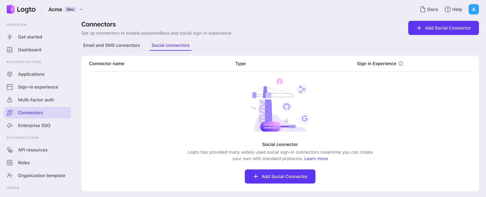

Para habilitar un inicio de sesión rápido y mejorar la conversión de usuarios, conéctate con {props.framework} como un proveedor de identidad (IdP). El conector social de Logto te ayuda a establecer esta conexión en minutos permitiendo la entrada de varios parámetros.

Para añadir un conector social, simplemente sigue estos pasos:

1. Navega a [Console > Connectors > Social Connectors](https://cloud.logto.io/to/connectors/social).
2. Haz clic en "Add social connector" y selecciona "{props.connector}".
3. Sigue la guía README y completa los campos requeridos y personaliza la configuración.

:::note
Si estás siguiendo la guía del Conector en el lugar, puedes omitir la siguiente sección.
:::
