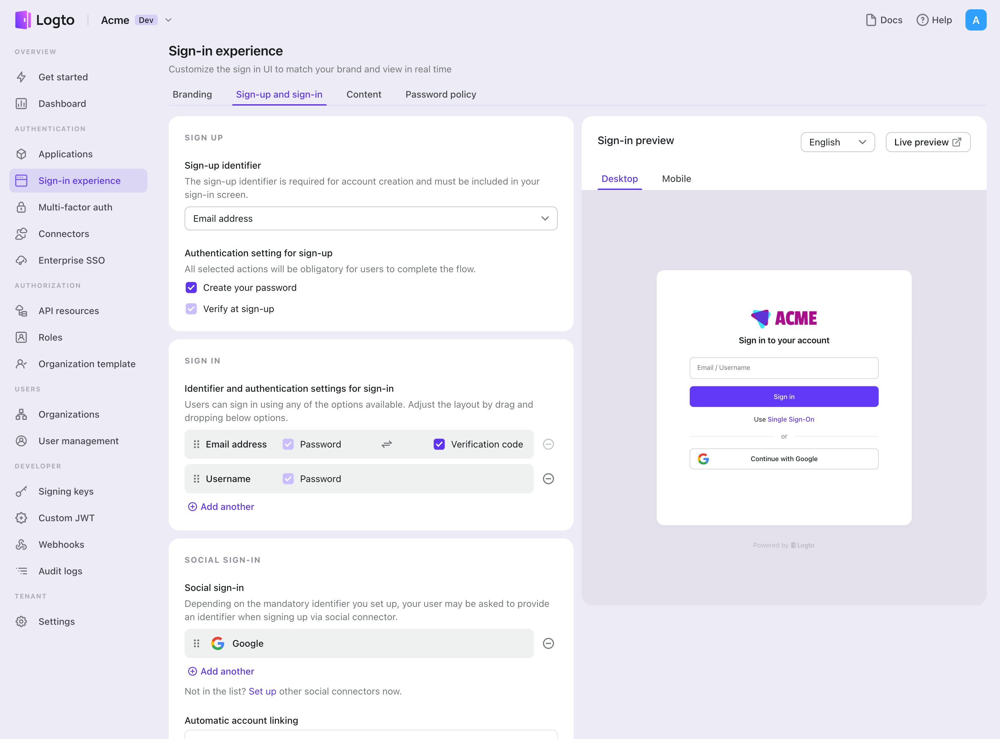

Una vez que crees un conector social con éxito, puedes habilitarlo como un botón "Continuar con {props.connector}" en la Experiencia de inicio de sesión.

1. Navega a [Console > Sign-in experience > Sign-up and sign-in](https://cloud.logto.io/to/sign-in-experience/sign-up-and-sign-in).
2. (Opcional) Elige "No aplicable" para el identificador de registro si solo necesitas inicio de sesión social.
3. Añade el conector {props.connector} configurado a la sección "Inicio de sesión social".

