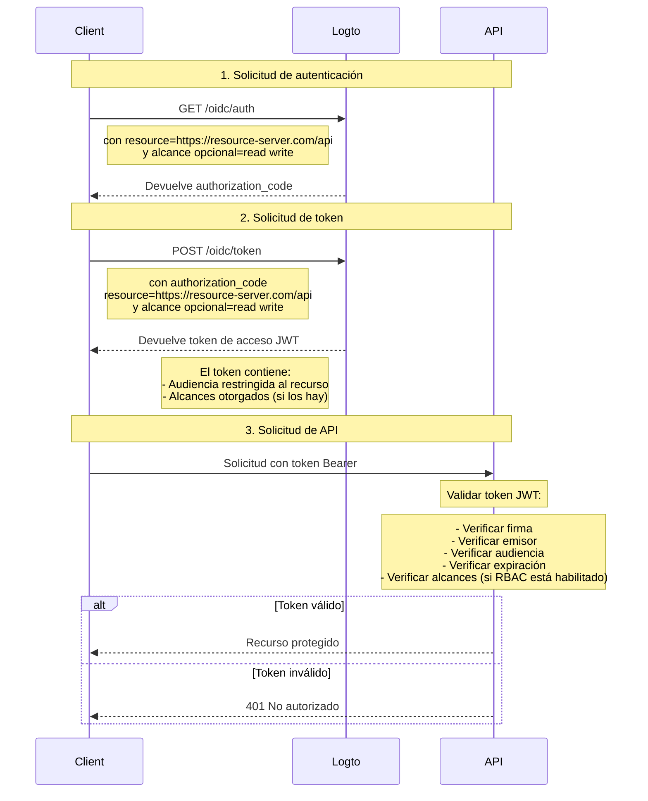

# Protege tu API

Si no necesitas políticas de control de acceso flexibles y granulares, puedes simplemente proteger tu API directamente. Te guiaremos a través de un diagrama de secuencia y los pasos necesarios para mostrar cómo integrar el control de acceso en tu aplicación.



En este tutorial

- Endpoint de Logto: `https://tenant-id.logto.app`
- Aplicación cliente: `https://client.example.org`
- Servidor de recursos de API: `https://resource-server.com/api`

Debes reemplazar estos con tus endpoints reales al implementar.

## Solicitud de autenticación \{#authentication-request}

Proporciona una lista de parámetros de indicador de recurso en una [Solicitud de Autenticación](https://openid.net/specs/openid-connect-core-1_0.html#AuthRequest). Indicará todos los recursos protegidos que el usuario puede solicitar.

```bash
GET https://tenant-id.logto.app/oidc/auth?response_type=code
    &client_id=s6BhdRkqt3
    &state=tNwzQ87pC6llebpmac_IDeeq-mCR2wLDYljHUZUAWuI
    &redirect_uri=https%3A%2F%2Fclient.example.org%2Fcb
    &resource=https%3A%2F%2Fresource-server.com%2Fapi
    &scope=read%20write
```

Logto validará y almacenará estos indicadores de recurso. Se otorgará y devolverá un `authorization_code` con alcances restringidos a estos recursos especificados.

Configuración de ejemplo del SDK de Logto:

```tsx
const config: LogtoConfig = {
  // ...otros configs
  resources: ['https://resource-server.com/api'],
  scopes: ['read', 'write'],
};
```

## Solicitud de token \{#token-request}

Cuando el parámetro de recurso está presente en una [Solicitud de Token](https://openid.net/specs/openid-connect-core-1_0.html#TokenRequest) junto con el `authorization_code` otorgado anteriormente, especificará la audiencia del recurso de API objetivo del token de acceso solicitado.

```bash
POST https://tenant-id.logto.app/oidc/token HTTP/1.1
Content-Type: application/x-www-form-urlencoded

grant_type=authorization_code&redirect_uri=https%3A%2F%2Fclient.example.org%2Fcb&code=10esc29BWC2qZB0acc9v8zAv9ltc2pko105tQauZ&resource=https%3A%2F%2Fresource-server.com%2Fapi
```

Logto otorgará un token de acceso cifrado con la audiencia restringida a este recurso solicitado. El token lleva todos los datos que necesitarás para representar el estado de autorización de la solicitud. Por ejemplo, la identidad y el rol del usuario solicitante, la audiencia del token y el tiempo de expiración.

Código de ejemplo del SDK de Logto:

```tsx
const accessToken = await logtoClient.getAccessToken('https://resource-server.com/api');
```

La carga útil del accessToken contendrá:

```tsx
{
  iss: '<your-logto-endpoint>/oidc',
  aud: 'https://resource-server.com/api',
  scope: 'read write'
}
```

## Solicitud al recurso de API \{#request-to-the-api-resource}

El usuario cliente envió una solicitud al recurso de API presentando el `access_token` dado en el encabezado de Autorización.

```bash
GET https://resource-server.com/api/users
Authorization: Bearer eyJhbGciOiJIUz...
```

Logto sigue el protocolo estándar de autorización basado en tokens para proteger tus recursos de API. Para aprender más sobre OAuth 2.0, consulta el [documento oficial](https://datatracker.ietf.org/doc/html/rfc6749#section-1.3.1) de OAuth 2.0.

## Validar tokens de autorización para solicitudes de API \{#validate-authorization-tokens-for-api-requests}

Logto emite un token de autorización en formato estándar [JWT](https://datatracker.ietf.org/doc/html/rfc7519) para cada solicitud de API autorizada. El token está cifrado y firmado como un token [JWS](https://datatracker.ietf.org/doc/html/rfc7515).

#### Entendiendo el token JWS \{#understanding-jws-token}

Un token [JWS](https://datatracker.ietf.org/doc/html/rfc7515) codificado se construye con tres partes:

- Encabezado JOSE: Declara el tipo de código y el algoritmo de codificación
- Carga útil JWS: Incluye todos los reclamos del token
- Firma JWS: Firma firmada con [JWK](https://datatracker.ietf.org/doc/html/rfc7517)

Un esquema estándar de la carga útil JWS emitida por Logto: (los reclamos pueden variar, según tu configuración personalizada de OIDC)

| clave     | descripción                          |
| --------- | ------------------------------------ |
| jti       | ID único del JWT                     |
| sub       | sujeto, generalmente user-id         |
| iat       | marca de tiempo del token emitido en |
| exp       | marca de tiempo del token expira en  |
| client_id | id de la aplicación                  |
| iss       | identidad del emisor del token       |
| aud       | audiencia del token                  |
| scope     | alcances (permisos) del token        |

:::note

Para desarrollo, para inspeccionar visualmente un token JWT, puedes visitar una [herramienta de decodificación de JWT](https://www.jstoolset.com/jwt) para decodificar y verificar los tokens que recibiste. Ten cuidado o nunca uses los tokens de un entorno de producción. Como este es un servicio público en línea proporcionado por terceros, tu token puede estar expuesto.

:::

#### Validar el token de autorización \{#validate-the-authorization-token}

1. [Validar un JWT](https://datatracker.ietf.org/doc/html/rfc7519#section-7.2)
2. [Validar la firma JWS](https://datatracker.ietf.org/doc/html/rfc7515#section-5.2)
3. El emisor del token es `https://<your-logto-domain>/oidc` (emitido por tu servidor de autenticación Logto)
4. La audiencia del token es igual al indicador de recurso del receptor actual registrado en la Consola de Administración de Logto
5. El token está dentro de su tiempo de expiración
6. (Solo [RBAC](/authorization/role-based-access-control/protect-api-resources-with-rbac)) El token tiene el `scope` deseado

Existen varias bibliotecas y paquetes de código abierto que pueden ayudarte a validar y decodificar un token JWT fácilmente. Puedes elegir uno e integrarlo con tu aplicación backend según el lenguaje y el framework que estés utilizando. Por favor, revisa algunos de los ejemplos que tenemos:

- [Node (Express)](/authorization/api-resources/node-express)
- [Spring Boot](/authorization/api-resources/spring-boot)
- [Python](/authorization/api-resources/python)

## Referencia \{#reference}

Logto utiliza el Protocolo de Autorización basado en código de OAuth 2.0 para hacer que tu solicitud de API sea segura. Si estás interesado en la estrategia detrás de esto, consulta la [especificación](https://datatracker.ietf.org/doc/html/rfc6749#section-1.3.1) de OAuth 2.0 para más detalles.
