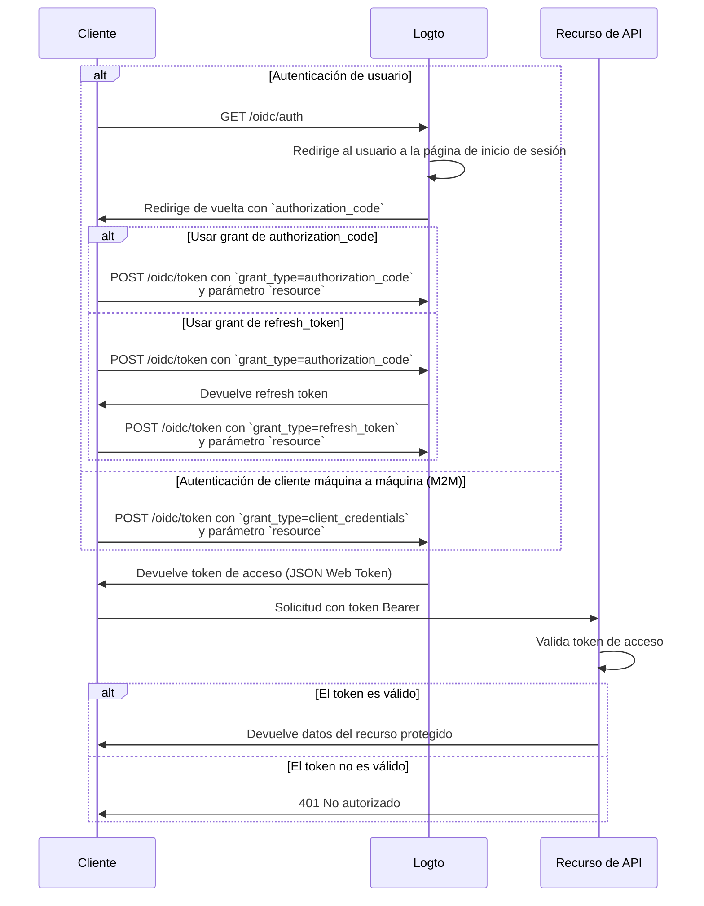

import illustration from '@site/docs/authorization/assets/rbac-global-api-resources.png';
import AuthorizationRequestExample from '@site/docs/authorization/fragments/AuthorizationRequestExample';
import ClientCredentialsRequestExample from '@site/docs/authorization/fragments/ClientCredentialsRequestExample';
import TokenRequestExample from '@site/docs/authorization/fragments/TokenRequestExample';
import HandleUserPermissionChange from '@site/docs/authorization/fragments/_handle-user-permission-change.mdx';
import TabItem from '@theme/TabItem';
import Tabs from '@theme/Tabs';

# Protege recursos de API globales

export const resource = 'https://api.your-app.com';

Protege las API de todo el producto utilizando el control de acceso basado en roles (RBAC) en Logto. Asigna roles y permisos globales para controlar el acceso de todos los usuarios y clientes en tu aplicación.

## ¿Qué son los recursos de API globales? \{#what-are-global-api-resources}

Los recursos de API globales son endpoints o servicios en tu aplicación que son accesibles para todos los usuarios, sin importar la organización o el inquilino. Normalmente, estos son APIs públicos, servicios centrales del producto o cualquier endpoint que no esté limitado a una organización específica.

**Los casos de uso incluyen**

- APIs públicas o endpoints compartidos entre toda tu base de usuarios.
- Microservicios que no están ligados a la multi-tenencia.
- APIs centrales de la aplicación (por ejemplo, `/api/users`, `/api/products`) utilizadas por todos los clientes.

Logto te permite asegurar estas APIs usando OAuth 2.1, combinado con un control de acceso flexible basado en roles.

## Cómo funciona en Logto \{#how-it-works-in-logto}

- **Los recursos de API y permisos se registran globalmente:** Cada API que deseas proteger se define con un indicador de recurso único (URI) y un conjunto de permisos (alcances) que controlan el acceso.
- **El acceso se controla mediante roles globales:** Puedes asignar permisos a roles, que luego se asignan a usuarios o clientes.
- **Separado de los permisos a nivel de organización:** Los recursos de API globales no tienen contexto de organización. Sin embargo, pueden usarse junto con roles de organización para proporcionar una capa adicional de contexto si es necesario. Para proteger APIs a nivel de organización, consulta [Proteger recursos de API a nivel de organización](/authorization/organization-level-api-resources).


### Resumen de la implementación \{#implementation-overview}

1. **Registra tu recurso de API** y define sus permisos en Logto.
2. **Define roles** con los permisos necesarios para acceder a la API.
3. **Asigna roles** a usuarios o clientes.
4. **Utiliza los flujos de autorización OAuth 2.0** para obtener tokens de acceso para la API (el parámetro resource debe coincidir con el identificador de API registrado).
5. **Valida los tokens de acceso** en tu API para hacer cumplir los permisos.

### Entendiendo los indicadores de recurso \{#understanding-resource-indicators}

Logto modela los recursos de API según [RFC 8707: Indicadores de recurso para OAuth 2.0](https://www.rfc-editor.org/rfc/rfc8707.html). Un **indicador de recurso** es un URI que identifica de forma única la API o servicio objetivo solicitado.

**Puntos clave**

- Los indicadores de recurso deben ser URIs absolutas (por ejemplo, `https://api.example.com`)
- Sin componente de fragmento; evita usar cadenas de consulta cuando sea posible.
- Los indicadores de recurso permiten tokens restringidos por audiencia y soporte para arquitecturas multi-API.

**Ejemplo**

- Management API: `https://my-tenant.logto.app/api`
- API global personalizada: `https://api.yourapp.com`

### Flujo de autorización: autenticando y asegurando tu API \{#authorization-flow-authenticating-and-securing-your-api}

El siguiente flujo aplica tanto para la autenticación interactiva de usuarios (navegador / app) como para escenarios backend máquina a máquina (M2M).

Ten en cuenta que el flujo no incluye todos los detalles sobre los parámetros o encabezados requeridos, sino que se enfoca en los pasos clave involucrados. Continúa leyendo para ver cómo funciona el flujo en la práctica.



_Autenticación de usuario = navegador / app. M2M = servicio backend o script usando credenciales de cliente._

:::note
El parámetro `resource` debe coincidir exactamente con el identificador de API (indicador de recurso) que registraste en Logto.
:::

## Pasos de implementación \{#implementation-steps}

### Registra tus recursos de API \{#register-your-api-resources}

1. Ve a <CloudLink to="/api-resources">Consola → Recursos de API</CloudLink>.
2. Crea un nuevo recurso de API (por ejemplo, `https://api.yourapp.com/org`) y define sus permisos (alcances).

Para ver los pasos completos de configuración, consulta [Definir recursos de API con permisos](/authorization/role-based-access-control#define-api-resources-with-permissions).

### Configura roles globales \{#set-up-global-roles}

1. Ve a <CloudLink to="/roles">Consola → Roles</CloudLink>.
2. Crea roles que se correspondan con los permisos de tu API (por ejemplo, `read:products`, `write:products`).
3. Asigna estos roles a los usuarios o clientes que necesiten acceso a la API.

Para ver los pasos completos de configuración, consulta [Usar roles globales](/authorization/role-based-access-control#configure-global-roles).

### Obtén tokens de acceso para recursos de API globales \{#obtain-access-tokens-for-global-api-resources}

Antes de acceder a un recurso de API global, tu cliente debe obtener un token de acceso. Logto emite [JSON Web Tokens (JWTs)](https://auth.wiki/jwt) como tokens de acceso para recursos de API globales. Esto normalmente se realiza usando el [flujo de código de autorización OAuth 2.0](https://auth.wiki/authorization-code-flow), [flujo de refresh token](https://auth.wiki/refresh-token) o el [flujo de client credentials](https://auth.wiki/client-credentials-flow).

#### Flujo de código de autorización o refresh token \{#authorization-code-or-refresh-token-flow}

Todos los SDK oficiales de Logto admiten la obtención de tokens de acceso para recursos de API globales usando el flujo de refresh token de forma predeterminada. También puedes usar una biblioteca estándar de cliente OAuth 2.0 / OIDC para implementar este flujo.

<Tabs groupId="user-client">
<TabItem value="logto-sdk" label="Logto SDK">

Al inicializar el cliente Logto, añade el indicador de recurso al parámetro `resources` (array), luego añade los permisos deseados (alcances) al parámetro `scopes`.

Una vez que el usuario esté autenticado, pasa el indicador de recurso en el parámetro `resource` o en un parámetro de nombre similar al solicitar el token de acceso (por ejemplo, llamando a `getAccessToken()`).

Para detalles sobre cada SDK, consulta los [Inicios rápidos](/quick-starts).

</TabItem>
<TabItem value="oauth-client" label="OAuth 2.0 / OIDC client library">

Al configurar tu cliente OAuth 2.0 o inicializar el flujo de código de autorización, asegúrate de incluir el parámetro `resource` y los alcances deseados en la solicitud de autorización.

Algunas bibliotecas pueden no soportar el parámetro `resource` de forma nativa, pero normalmente permiten pasar parámetros adicionales en la solicitud de autorización. Consulta la documentación de tu biblioteca para más detalles.

Aquí tienes un ejemplo no normativo de la solicitud de autorización con los parámetros `resource` y `scope`:

<AuthorizationRequestExample resource={resource} scope="read:products write:products" />

Una vez que el usuario esté autenticado, recibirás un authorization code. Intercambia este código por un token de acceso haciendo una solicitud POST al endpoint `/oidc/token` de Logto, incluyendo el parámetro `resource` en el cuerpo de la solicitud.

Aquí tienes un ejemplo no normativo de la solicitud de token usando el grant type authorization code:

<TokenRequestExample grantType="authorization_code" resource={resource} />

También puedes usar el grant type `refresh_token` para obtener un nuevo token de acceso sin interacción del usuario, siempre que el parámetro `resource` esté incluido en la solicitud.

Aquí tienes un ejemplo no normativo de la solicitud de token usando el grant type refresh token:

<TokenRequestExample grantType="refresh_token" resource={resource} />

</TabItem>
</Tabs>

#### Flujo de client credentials \{#client-credentials-flow}

Para escenarios máquina a máquina (M2M), puedes usar el flujo de client credentials para obtener un token de acceso para tu recurso de API global. Haciendo una solicitud POST al endpoint `/oidc/token` de Logto, puedes solicitar un token de acceso usando tu client ID y secret.

Hay dos parámetros clave que debes incluir en la solicitud:

- `resource`: El URI indicador de recurso de la API a la que deseas acceder (por ejemplo, `https://api.yourapp.com`).
- `scope`: Los permisos que deseas solicitar para la API (por ejemplo, `read:products write:products`).

Aquí tienes un ejemplo no normativo de la solicitud de token usando el grant type client credentials:

<ClientCredentialsRequestExample
  resource="https://api.yourapp.com"
  scope="read:products write:products"
/>

### Validando tokens de acceso JWT en tu API \{#validating-jwt-access-tokens-in-your-api}

Los JWT emitidos por Logto contienen reclamos que tu API puede usar para hacer cumplir la autorización.

Cuando tu API recibe una solicitud con un token de acceso emitido por Logto, debes:

- Verificar la firma del token (usando los JWKs de Logto).
- Confirmar que el token no ha expirado (reclamo `exp`).
- Comprobar que el `iss` (emisor) coincide con tu endpoint de Logto.
- Asegurarte de que el `aud` (audiencia) coincide con el identificador del recurso de API que registraste (por ejemplo, `https://api.yourapp.com`).
- Separar el reclamo `scope` (separado por espacios) y comprobar los permisos requeridos.

Para guías paso a paso y específicas por lenguaje, consulta [Cómo validar tokens de acceso](/authorization/validate-access-tokens).

<HandleUserPermissionChange type="global" />

## Mejores prácticas y consejos de seguridad \{#best-practices-and-security-tips}

- **Mantén los permisos orientados al negocio:** Usa nombres claros que correspondan a acciones reales.
- **Mantén la expiración de los tokens corta:** Reduce el riesgo si un token se filtra.
- **Limita los alcances concedidos:** Solo otorga a los tokens los permisos que realmente necesitan.
- **Usa restricción de audiencia:** Verifica siempre el reclamo `aud` para evitar usos indebidos.

## Preguntas frecuentes \{#faqs}

<details>
<summary>

### ¿Qué pasa si mi cliente no soporta el parámetro resource? \{#what-if-my-client-doesn-t-support-the-resource-parameter}

</summary>

Configura un recurso de API predeterminado en la Consola de Logto. Los tokens tendrán esta audiencia por defecto cuando no se especifique el parámetro resource en la solicitud de token.

</details>

<details>
<summary>

### ¿Por qué recibo 401 No autorizado de mi API? \{#why-do-i-get-401-unauthorized-from-my-api}

</summary>

Verifica los siguientes problemas comunes:

- **Firma del token**: Asegúrate de que tu backend obtiene los JWKs correctos de Logto
- **Expiración del token**: Asegúrate de que el token no haya expirado (reclamo `exp`)
- **Audiencia**: Confirma que el reclamo `aud` coincide con el indicador de recurso de API registrado
- **Alcances requeridos**: Verifica que el token contenga los permisos necesarios en el reclamo `scope`

</details>

<details>
<summary>

### ¿Cómo pruebo sin un cliente completo? \{#how-do-i-test-without-a-full-client}

</summary>

Utiliza un [token de acceso personal](/user-management/personal-access-token) para simular llamadas autenticadas. Esto te permite probar los endpoints de tu API sin implementar un flujo OAuth completo en tu aplicación cliente.

</details>

<details>
<summary>

### ¿Puedo usar prefijos de scope o versiones abreviadas al solicitar permisos? \{#can-i-use-scope-prefixes-or-shortened-versions}

</summary>

No. Los nombres de scope deben **coincidir exactamente** con los nombres de permisos definidos en tu recurso de API. Los prefijos y versiones abreviadas no funcionan como comodines.

**Ejemplo:**

Si tu recurso de API define:

- `read:elections`
- `write:elections`

Debes solicitar:

```swift
scopes: ["read:elections", "write:elections"]
```

Esto **NO funcionará**:

```swift
scopes: ["read", "write"]  // ❌ No coincide con los nombres de permisos
```

</details>

## Más información \{#further-reading}

<Url href="/authorization/validate-access-tokens">Cómo validar tokens de acceso</Url>
<Url href="/use-cases/authorization/rbac-in-practice">
  RBAC en la práctica: Implementando autorización segura para tu aplicación
</Url>
<Url href="/developers/custom-token-claims">Personalización de reclamos de tokens</Url>
<Url href="https://www.rfc-editor.org/rfc/rfc8707.html">RFC 8707: Indicadores de recurso</Url>
