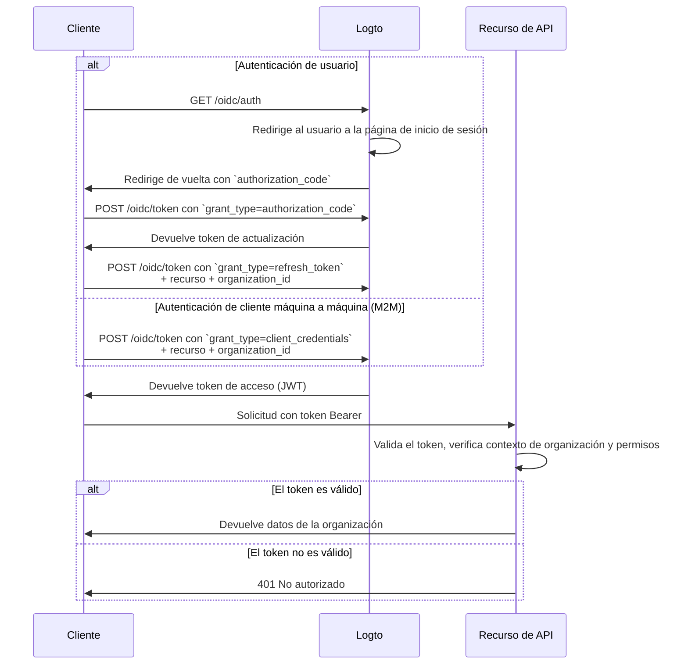

import illustration from '@site/docs/authorization/assets/rbac-organization-level-api-resources.png';
import AuthorizationRequestExample from '@site/docs/authorization/fragments/AuthorizationRequestExample';
import ClientCredentialsRequestExample from '@site/docs/authorization/fragments/ClientCredentialsRequestExample';
import TokenRequestExample from '@site/docs/authorization/fragments/TokenRequestExample';
import HandleUserPermissionChange from '@site/docs/authorization/fragments/_handle-user-permission-change.mdx';
import TabItem from '@theme/TabItem';
import Tabs from '@theme/Tabs';

import InspectOrganizationClaim from './fragments/_inspect-organization-claim.md';
import OrganizationTokenWarning from './fragments/_organization-token-warning.md';

# Protege los recursos de API a nivel de organización

export const resource = 'https://api.your-app.com/organizations';

Combina los recursos de API con la plantilla de organización para restringir el acceso a las APIs y datos dentro de cada organización, asegurando el aislamiento a nivel de inquilino en tu SaaS.

## ¿Qué son los recursos de API a nivel de organización? \{#what-are-organization-level-api-resources}

Los recursos de API a nivel de organización son endpoints o servicios en tu aplicación que están **asociados a una organización específica**. Estas APIs aplican autorización y acceso basados en el contexto de la organización, asegurando que los usuarios o clientes solo accedan a datos y acciones relevantes para su organización.

**Casos de uso incluyen**

- APIs para gestionar miembros, roles o configuraciones de la organización (por ejemplo, `/organizations/{organizationId}/members`)
- Paneles, analíticas o reportes asociados a la organización
- Endpoints de facturación, suscripción o auditoría vinculados a una organización
- Cualquier API donde las acciones y los datos estén aislados por inquilino

Logto te permite asegurar estas APIs de organización usando OAuth 2.1 y RBAC, mientras soporta arquitecturas SaaS multi-inquilino.

Estos permisos se gestionan a través de **roles de organización** definidos en la [plantilla de organización](/authorization/organization-template). Cada organización utiliza la misma plantilla, asegurando un modelo de permisos consistente en todas las organizaciones.

## Cómo funciona en Logto \{#how-it-works-in-logto}

- **Los recursos de API y permisos se registran globalmente:** Cada recurso de API se define con un indicador de recurso único (URI) y un conjunto de permisos (alcances) en Logto.
- **Roles a nivel de organización:** Los roles de organización se definen en la plantilla de organización. Los permisos de recursos de API (alcances) se asignan a los roles de organización, que luego se asignan a usuarios o clientes **dentro de cada organización**.
- **Autorización consciente del contexto:** Cuando un cliente solicita un token de acceso con un recurso de API y un `organization_id`, Logto emite un token que incluye tanto el contexto de la organización como la audiencia de la API. Los permisos (alcances) del token se determinan por los roles de organización del usuario para la organización especificada.
- **Separación de recursos globales:** Los recursos de API pueden ser accedidos con o sin contexto de organización. El RBAC de organización solo se aplica si se incluye un `organization_id` en la solicitud. Para APIs compartidas entre todos los usuarios, consulta [Proteger recursos de API globales](/authorization/global-api-resources).

### Resumen de la implementación \{#implementation-overview}

1. **Registra tu recurso de API** y define sus permisos (alcances) en Logto.
2. **Define roles de organización** en la plantilla de organización y asigna los permisos de API relevantes.
3. **Asigna roles** a usuarios o clientes dentro de cada organización.
4. **Solicita un token de acceso** para la API con un `organization_id` para incluir el contexto de organización.
5. **Valida los tokens de acceso** en tu API, aplicando tanto el contexto de organización como los permisos.

### Cómo aplica Logto el RBAC de organización \{#how-logto-applies-organization-rbac}

- Si solicitas un token de acceso **sin** un `organization_id`, solo se consideran los roles/permisos globales.
- Si solicitas un token de acceso **con** un `organization_id`, Logto evalúa los roles de organización del usuario y sus permisos asociados para esa organización.
- El JWT resultante contendrá tanto la audiencia de la API (`aud` claim) como el contexto de la organización (`organization_id` claim), con los alcances filtrados a los otorgados por los roles de organización del usuario.

### Flujo de autorización: autenticando y asegurando APIs con contexto de organización \{#authorization-flow-authenticating-and-securing-apis-with-organization-context}

El siguiente flujo muestra cómo un cliente (web, móvil o backend) obtiene y utiliza tokens de organización para acceder a recursos de API a nivel de organización.

Ten en cuenta que el flujo no incluye detalles exhaustivos sobre los parámetros o encabezados requeridos, sino que se centra en los pasos clave involucrados. Continúa leyendo para ver cómo funciona el flujo en la práctica.

_Autenticación de usuario = navegador/app. M2M = servicio backend o script usando credenciales de cliente + contexto de organización._

## Pasos de implementación \{#implementation-steps}

### Registra tu recurso de API \{#register-your-api-resource}

1. Ve a <CloudLink to="/api-resources">Consola → Recursos de API</CloudLink>.
2. Crea un nuevo recurso de API (por ejemplo, `https://api.yourapp.com/org`) y define sus permisos (alcances).

Para los pasos completos de configuración, consulta [Definir recursos de API con permisos](/authorization/role-based-access-control#define-api-resources-with-permissions).

### Configura los roles de organización \{#set-up-organization-roles}

1. Ve a <CloudLink to="/organization-template/organization-roles">Consola → Plantilla de organización → Roles de organización</CloudLink>.
2. Crea roles de organización (por ejemplo, `admin`, `member`) y asigna permisos de API a cada rol.
3. Asigna roles a usuarios o clientes dentro de cada organización. Si aún no son miembros, invítalos o agrégalos primero.

Para los pasos completos de configuración, consulta [Usar roles de organización](/authorization/role-based-access-control#configure-organization-roles).

### Obtén tokens de organización para recursos de API \{#obtain-organization-tokens-for-api-resources}

Tu cliente/app debe solicitar un token con ambos parámetros, `resource` y `organization_id`, para acceder a APIs a nivel de organización. Logto emite tokens de organización como [JSON Web Tokens (JWTs)](https://auth.wiki/jwt). Puedes obtenerlos usando el [flujo de token de actualización](https://auth.wiki/refresh-token) o el [flujo de credenciales de cliente](https://auth.wiki/client-credentials-flow).

#### Flujo de token de actualización \{#refresh-token-flow}

Casi todos los SDK oficiales de Logto admiten la obtención de tokens de organización usando el flujo de token de actualización de forma nativa. También puedes usar una biblioteca estándar de cliente OAuth 2.0 / OIDC para implementar este flujo.

<Tabs groupId="user-client">
<TabItem value="logto-sdk" label="Logto SDK">

Al inicializar el SDK de Logto, añade `urn:logto:scope:organizations` y los permisos de organización deseados (alcances) al parámetro `scopes`.

Algunos SDK de Logto tienen un alcance predefinido para organizaciones, como `UserScope.Organizations` en los SDK de JavaScript.

<InspectOrganizationClaim />

Al llamar a `getAccessToken()`, especifica tanto el recurso de API (`resource`) como el ID de la organización (`organizationId`) para obtener un token de organización.

Para detalles sobre cada SDK, consulta [Inicios rápidos](/quick-starts).

</TabItem>
<TabItem value="oauth-client" label="OAuth 2.0 / OIDC client library">

Al configurar tu cliente OAuth 2.0 o inicializar el flujo de código de autorización, asegúrate de incluir los siguientes parámetros:

- `resource`: Establece el identificador del recurso de API registrado en Logto (por ejemplo, `https://api.your-app.com/organizations`).
- `scope`: Incluye el alcance predefinido de organización (`urn:logto:scope:organizations`), `offline_access` (para obtener tokens de actualización) y cualquier permiso de API específico que necesites (por ejemplo, `manage:members view:analytics`).

Algunas bibliotecas pueden no soportar el parámetro `resource` de forma nativa, pero normalmente permiten pasar parámetros adicionales en la solicitud de autorización. Consulta la documentación de tu biblioteca para más detalles.

Aquí tienes un ejemplo no normativo de cómo podría verse la solicitud de autorización:

<AuthorizationRequestExample
  resource={resource}
  scope="urn:logto:scope:organizations invite:member manage:billing"
/>

Una vez que el usuario esté autenticado, recibirás un código de autorización. Usa este código haciendo una solicitud POST al endpoint `/oidc/token` de Logto.

Aquí tienes un ejemplo no normativo de la solicitud de token:

<TokenRequestExample grantType="authorization_code" />

<OrganizationTokenWarning />

Recibirás un token de actualización que puede usarse para obtener tokens de organización.

<InspectOrganizationClaim />

Finalmente, usa el token de actualización para obtener un token de organización haciendo una solicitud POST al endpoint `/oidc/token` de Logto. Recuerda incluir:

- El parámetro `resource` establecido al identificador del recurso de API (por ejemplo, `https://api.yourapp.com/org`).
- El parámetro `organization_id` establecido al ID de la organización deseada.
- (Opcional) El parámetro `scope` para reducir aún más los permisos que necesitas (por ejemplo, `manage:members view:reports`).

Aquí tienes un ejemplo no normativo de cómo podría verse la solicitud de token:

<TokenRequestExample
  grantType="refresh_token"
  resource={resource}
  organizationId="your-organization-id"
/>

</TabItem>
</Tabs>

#### Flujo de credenciales de cliente \{#client-credentials-flow}

Para escenarios máquina a máquina (M2M), puedes usar el flujo de credenciales de cliente para obtener un token de acceso con permisos de recursos de API a nivel de organización. Haciendo una solicitud POST al endpoint `/oidc/token` de Logto con los parámetros de organización, puedes solicitar un token de organización usando tu client ID y secret.

Estos son los parámetros clave que debes incluir en la solicitud:

- `resource`: El identificador del recurso de API (por ejemplo, `https://api.yourapp.com/org`).
- `organization_id`: El ID de la organización para la que deseas el token.
- `scope`: Los permisos de recursos de API a nivel de organización que deseas solicitar (por ejemplo, `invite:member`, `manage:billing`).

Aquí tienes un ejemplo no normativo de la solicitud de token usando el tipo de concesión de credenciales de cliente:

<ClientCredentialsRequestExample
  resource="https://api.yourapp.com/org"
  organizationId="your-organization-id"
  scope="invite:member manage:billing"
/>

### Valida los tokens de organización \{#validate-organization-tokens}

Los tokens de organización emitidos por Logto (JWTs) contienen reclamos que tu API puede usar para aplicar control de acceso a nivel de organización.

Cuando tu app reciba un token de organización, deberías:

- Verificar la firma del token (usando los JWKs de Logto).
- Confirmar que el token no esté expirado (`exp` claim).
- Comprobar que el `iss` (emisor) coincida con tu endpoint de Logto.
- Asegurarte de que el `aud` (audiencia) coincida con el identificador del recurso de API que registraste (por ejemplo, `https://api.yourapp.com/org`).
- Validar el reclamo `organization_id` para asegurar que el token esté asociado a la organización correcta.
- Separar el reclamo `scope` (separado por espacios) y comprobar los permisos requeridos.
- Si tu ruta de API incluye el ID de la organización (por ejemplo, `/organizations/{organizationId}/members`), asegúrate de que el reclamo `organization_id` coincida con el parámetro de la ruta.

Para guías paso a paso y específicas por lenguaje, consulta [Cómo validar tokens de acceso](/authorization/validate-access-tokens).

<HandleUserPermissionChange type="organization" />

## Mejores prácticas y consejos de seguridad \{#best-practices-and-security-tips}

- **Valida siempre el contexto de organización:** No confíes solo en el token; verifica el reclamo `organization_id` en cada llamada a una API asociada a organización.
- **Usa restricciones de audiencia:** Comprueba siempre el reclamo `aud` para asegurar que el token es para la organización prevista.
- **Mantén los permisos orientados al negocio:** Usa nombres claros que correspondan a acciones reales; otorga solo lo necesario para cada rol de organización.
- **Separa permisos de API y no-API** cuando sea posible (pero ambos pueden estar en un solo rol).
- **Mantén los tiempos de vida de los tokens cortos:** Reduce el riesgo si un token se filtra.
- **Revisa regularmente tu plantilla de organización:** Actualiza roles y permisos a medida que tu producto evoluciona.

## Preguntas frecuentes \{#faqs}

### ¿Qué pasa si no incluyo `organization_id` en mi solicitud de token? \{#what-if-i-don-t-include-organization-id-in-my-token-request}

Solo se evaluarán los roles/permisos globales. No se aplicará el RBAC de organización.

### ¿Puedo mezclar permisos de organización y no organización en un solo rol? \{#can-i-mix-organization-and-non-organization-permissions-in-a-single-role}

No, los permisos de organización (incluidos los permisos de API a nivel de organización) se definen por la plantilla de organización y no pueden mezclarse con permisos de API globales. Sin embargo, puedes crear roles que incluyan tanto permisos de organización como permisos de API a nivel de organización.

## Más información \{#further-reading}

<Url href="/authorization/validate-access-tokens">Cómo validar tokens de acceso</Url>
<Url href="/developers/custom-token-claims">Personalización de reclamos de token</Url>
<Url href="/use-cases/multi-tenancy/build-multi-tenant-saas-application">
  Caso de uso: Construir una aplicación SaaS multi-inquilino
</Url>
<Url href="https://www.rfc-editor.org/rfc/rfc8707.html">RFC 8707: Indicadores de recurso</Url>
