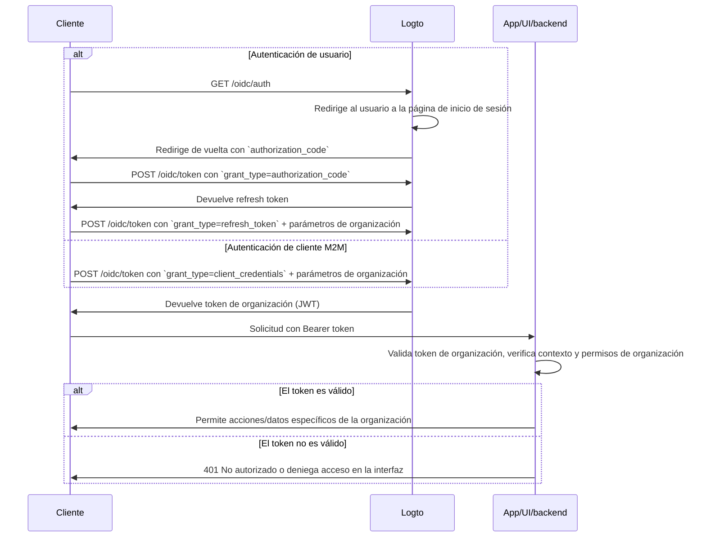

import TabItem from '@theme/TabItem';
import Tabs from '@theme/Tabs';

import illustration from '@site/docs/authorization/assets/rbac-organization-permissions.png';
import AuthorizationRequestExample from '@site/docs/authorization/fragments/AuthorizationRequestExample';
import ClientCredentialsRequestExample from '@site/docs/authorization/fragments/ClientCredentialsRequestExample';
import TokenRequestExample from '@site/docs/authorization/fragments/TokenRequestExample';
import InspectOrganizationClaim from './fragments/_inspect-organization-claim.md';
import OrganizationTokenWarning from './fragments/_organization-token-warning.md';

# Protege los permisos de organización (no API)

Utiliza la plantilla de organización para gestionar y aplicar roles y permisos a nivel de organización en Logto, controlando el acceso a funciones y flujos dentro de una organización.

## ¿Qué son los permisos de organización (no API)? \{#what-are-organization-non-api-permissions}

Los permisos de organización (no API) controlan lo que los usuarios pueden hacer **dentro del contexto de una organización**, pero no se **aplican a nivel de API**. En cambio, gobiernan el acceso a funciones de la aplicación, elementos de la interfaz, flujos de trabajo o acciones de negocio, en lugar de APIs de backend.

**Casos de uso incluyen**

- Invitar o gestionar miembros dentro de una organización
- Asignar o cambiar roles de organización
- Gestionar la facturación, configuraciones o funciones administrativas de una organización
- Acceso a paneles, analíticas o herramientas internas que no tienen endpoints de API

Logto te permite asegurar estos permisos de organización usando OAuth 2.1 y control de acceso basado en roles (RBAC), mientras soporta arquitecturas SaaS multi-tenant.

Estos permisos se gestionan a través de **roles de organización** definidos en la [plantilla de organización](/authorization/organization-template). Cada organización utiliza la misma plantilla, asegurando un modelo de permisos consistente en todas las organizaciones.

## Cómo funciona en Logto \{#how-it-works-in-logto}

- **RBAC a nivel de organización:** Los roles y permisos se definen en la plantilla de organización. Cuando un usuario se une a una organización, se le asignan uno o más roles, otorgando permisos específicos.
- **Aplicación no API:** Los permisos se verifican y aplican en la interfaz de tu app, flujo de trabajo o lógica de backend, no necesariamente por un gateway de API.
- **Separación de la protección de API:** Los permisos de organización (no API) son distintos de los permisos de recursos de API. Puedes combinar ambos para escenarios avanzados.

  

### Resumen de la implementación \{#implementation-overview}

1. **Define los permisos de organización** en Logto bajo la plantilla de organización.
2. **Crea roles de organización** que agrupen los permisos necesarios para tus acciones específicas de organización.
3. **Asigna roles** a usuarios o clientes dentro de cada organización.
4. **Obtén un token de organización (JWT)** para la organización actual usando el refresh token o el flujo de client credentials.
5. **Valida los tokens de acceso** en la interfaz o backend de tu app para aplicar los permisos de organización.

### Flujo de autorización: autenticando y asegurando permisos de organización \{#authorization-flow-authenticating-and-securing-organization-permissions}

El siguiente flujo muestra cómo un cliente (web, móvil o backend) obtiene y utiliza tokens de organización para la aplicación de permisos no API.

Ten en cuenta que el flujo no incluye detalles exhaustivos sobre los parámetros o encabezados requeridos, sino que se centra en los pasos clave involucrados. Continúa leyendo para ver cómo funciona el flujo en la práctica.

_Autenticación de usuario = navegador/app. M2M = servicio de backend o script usando client credentials + contexto de organización._

## Pasos de implementación \{#implementation-steps}

### Registra permisos de organización \{#register-organization-permissions}

1. Ve a <CloudLink to="/organization-template/organization-permissions">Consola → Plantilla de organización → Permisos de organización</CloudLink>.
2. Define los permisos de organización que necesitas (por ejemplo, `invite:member`, `manage:billing`, `view:analytics`).

Para ver los pasos completos de configuración, consulta [Definir permisos de organización](/authorization/role-based-access-control#define-organization-permissions).

### Configura roles de organización \{#set-up-organization-roles}

1. Ve a <CloudLink to="/organization-template/organization-roles">Consola → Plantilla de organización → Roles de organización</CloudLink>.
2. Crea roles que agrupen los permisos de organización que definiste antes (por ejemplo, `admin`, `member`, `billing`).
3. Asigna estos roles a usuarios o clientes dentro de cada organización.

Para ver los pasos completos de configuración, consulta [Usar roles de organización](/authorization/role-based-access-control#configure-organization-roles).

### Obtén tokens de organización (no API) \{#obtain-organization-tokens-non-api}

Tu cliente/app debe obtener un token de organización (no API) para acceder a los permisos de organización. Logto emite tokens de organización como [JSON Web Tokens (JWTs)](https://auth.wiki/jwt). Puedes obtenerlos usando el [refresh token flow](https://auth.wiki/refresh-token) o el [client credentials flow](https://auth.wiki/client-credentials-flow).

#### Flujo de refresh token \{#refresh-token-flow}

Casi todos los SDK oficiales de Logto admiten la obtención de tokens de organización usando el flujo de refresh token de forma nativa. También puedes usar una librería estándar de cliente OAuth 2.0 / OIDC para implementar este flujo.

<Tabs groupId="user-client">
<TabItem value="logto-sdk" label="Logto SDK">

Al inicializar el SDK de Logto, añade `urn:logto:scope:organizations` y los permisos de organización deseados (alcances) al parámetro `scopes`.

Algunos SDK de Logto tienen un alcance predefinido para organizaciones, como `UserScope.Organizations` en los SDK de JavaScript.

<InspectOrganizationClaim />

Utiliza `getOrganizationToken` o un método similar (como `getAccessToken` con un ID de organización) para solicitar un token de organización para una organización específica.

Para detalles sobre cada SDK, consulta [Guías rápidas](/quick-starts).

</TabItem>
<TabItem value="oauth-client" label="OAuth 2.0 / OIDC client library">

Al configurar tu cliente OAuth 2.0 o inicializar el flujo de código de autorización, asegúrate de incluir los siguientes parámetros:

- `resource`: Establece en `urn:logto:resource:organizations` para indicar que deseas un token de organización.
- `scope`: Incluye el alcance predefinido de organización (`urn:logto:scope:organizations`), `offline_access` (para obtener refresh tokens) y cualquier permiso específico de organización que necesites (por ejemplo, `invite:member`, `manage:billing`).

Algunas librerías pueden no soportar el parámetro `resource` de forma nativa, pero normalmente permiten pasar parámetros adicionales en la solicitud de autorización. Consulta la documentación de tu librería para más detalles.

Aquí tienes un ejemplo no normativo de cómo podría verse la solicitud de autorización:

<AuthorizationRequestExample
  scope="urn:logto:scope:organizations invite:member manage:billing"
  resource="urn:logto:resource:organizations"
/>

Una vez que el usuario esté autenticado, recibirás un authorization code. Usa este código haciendo una solicitud POST al endpoint `/oidc/token` de Logto.

Aquí tienes un ejemplo no normativo de la solicitud de token:

<TokenRequestExample grantType="authorization_code" />

<OrganizationTokenWarning />

Recibirás un refresh token que puede usarse para obtener tokens de organización.

<InspectOrganizationClaim />

Finalmente, usa el refresh token para obtener un token de organización haciendo una solicitud POST al endpoint `/oidc/token` de Logto. Recuerda incluir:

- El parámetro `organization_id` establecido al ID de la organización deseada.
- (Opcional) El parámetro `scope` para reducir aún más los permisos que necesitas (por ejemplo, `manage:members view:reports`).

Aquí tienes un ejemplo no normativo de cómo podría verse la solicitud de token:

<TokenRequestExample grantType="refresh_token" organizationId="your-organization-id" />

</TabItem>
</Tabs>

#### Flujo de client credentials \{#client-credentials-flow}

Para escenarios máquina a máquina (M2M), puedes usar el flujo de client credentials para obtener un token de acceso para permisos de organización. Haciendo una solicitud POST al endpoint `/oidc/token` de Logto con parámetros de organización, puedes solicitar un token de organización usando tu client ID y secret.

Estos son los parámetros clave a incluir en la solicitud:

- `organization_id`: El ID de la organización para la que deseas el token.
- `scope`: Los permisos de organización que deseas solicitar (por ejemplo, `invite:member`, `manage:billing`).

Aquí tienes un ejemplo no normativo de la solicitud de token usando el tipo de grant client credentials:

<ClientCredentialsRequestExample
  organizationId="your-organization-id"
  scope="invite:member manage:billing"
/>

### Valida los tokens de organización \{#validate-organization-tokens}

Los tokens de organización emitidos por Logto (JWTs) contienen reclamos que tu app/interfaz/backend puede usar para aplicar el control de acceso a nivel de organización.

Cuando tu app reciba un token de organización, deberías:

- Verificar la firma del token (usando los JWKs de Logto).
- Confirmar que el token no ha expirado (reclamo `exp`).
- Comprobar que el `iss` (emisor) coincide con tu endpoint de Logto.
- Asegurarte de que el `aud` (audiencia) coincide con el identificador de organización formateado (por ejemplo, `urn:logto:organization:{organization_id}`).
- Separar el reclamo `scope` (separado por espacios) y comprobar los permisos requeridos.

Para guías paso a paso y específicas por lenguaje, consulta [Cómo validar tokens de acceso](/authorization/validate-access-tokens).

## Mejores prácticas y consejos de seguridad \{#best-practices-and-security-tips}

- **Nunca confíes solo en la aplicación en la interfaz:** Siempre valida los permisos en el backend para acciones críticas.
- **Usa restricciones de audiencia:** Comprueba siempre el reclamo `aud` para asegurarte de que el token es para la organización prevista.
- **Mantén los permisos orientados al negocio:** Usa nombres claros que correspondan a acciones reales; concede solo lo necesario para cada rol de organización.
- **Separa permisos de API y no API** cuando sea posible (pero ambos pueden estar en un solo rol).
- **Revisa la plantilla de organización regularmente** a medida que evoluciona tu producto.

## Preguntas frecuentes \{#faqs}

### ¿Puedo mezclar permisos de organización y no organización en un solo rol? \{#can-i-mix-organization-and-non-organization-permissions-in-a-single-role}

No, los permisos de organización (incluidos los permisos de API a nivel de organización) se definen por la plantilla de organización y no pueden mezclarse con permisos globales de API. Sin embargo, puedes crear roles que incluyan tanto permisos de organización como permisos de API a nivel de organización.

### ¿Dónde debo aplicar los permisos no API? \{#where-should-i-enforce-non-api-permissions}

Verifica los permisos no API tanto en la interfaz (para limitar funciones) como en la lógica del servidor para acciones sensibles.

## Más información \{#further-reading}

<Url href="/authorization/validate-access-tokens">Cómo validar tokens de acceso</Url>
<Url href="/developers/custom-token-claims">Personalización de reclamos de tokens</Url>
<Url href="/use-cases/multi-tenancy/build-multi-tenant-saas-application">
  Caso de uso: Construir una aplicación SaaS multi-tenant
</Url>
