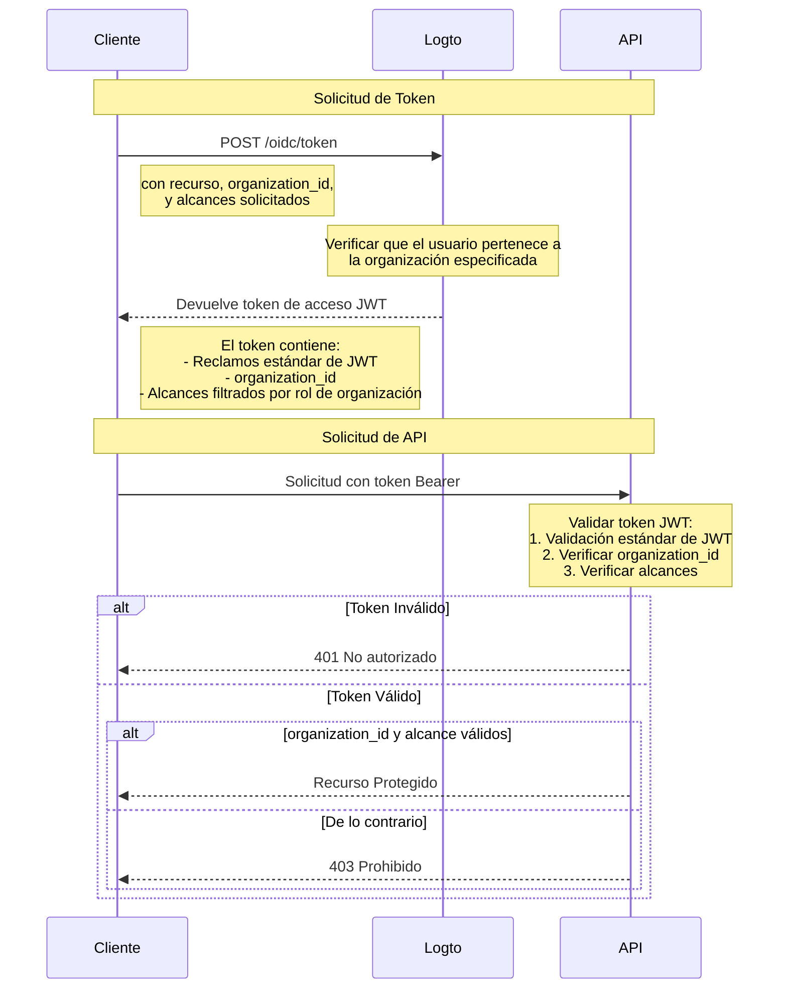

# Proteger el recurso de API con plantilla de organización

Además de [Proteger tu API](/authorization/api-resources/protect-your-api), que asegura los recursos garantizando que un JWT válido esté presente, los roles de organización también se pueden aplicar para filtrar los alcances. En este artículo, nos centraremos en cómo el rol de la organización afecta la delegación y validación de alcances en tu flujo de autenticación.



## El parámetro adicional `organization_id`

Además de la solicitud normal de concesión de token de acceso, en el diagrama añadimos un parámetro adicional `organization_id`, esto le indica a Logto que reduzca los alcances a los roles específicos de la organización.

## Configuración del cliente

Si estás utilizando el SDK de Logto, puedes agregar `organization_id` como el segundo parámetro del método `getAccessToken`.

```tsx
const accessToken = await logto.getAccessToken('https://my-resource.com/api', 'org_1');

// O obtener reclamos directamente
const accessTokenClaims = await logto.getAccessTokenClaims('https://my-resource.com/api', 'org_1');
console.log(accessTokenClaims.organization_id); // 'org_1'
console.log(accessTokenClaims.aud); // 'https://my-resource.com/api'
```

Entonces, solo los alcances heredados de los roles de esta organización se incluirán en el token de acceso, así como un reclamo adicional `organization_id`.

## Validación del servidor API

Además de la validación normal del token de acceso JWT, necesitarás agregar un nivel adicional para verificar si `organization_id` está presente y es válido.
