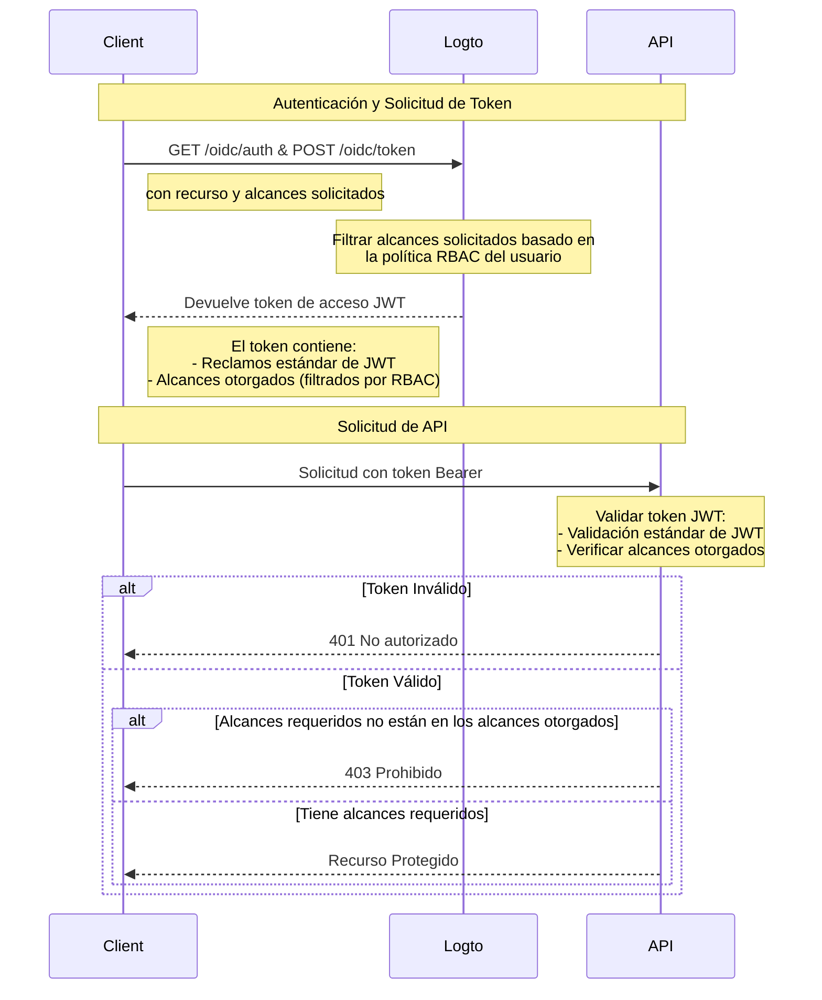

# Protege recursos de API con RBAC

Además de [Proteger tu API](/authorization/api-resources/protect-your-api), que asegura los recursos al garantizar que un JWT válido esté presente, también se puede aplicar el Control de Acceso Basado en Roles (RBAC).

En este artículo, nos centraremos en cómo RBAC afecta la delegación y validación de alcances en tu flujo de autenticación.

## Diagrama de flujo de autorización



Como puedes ver en el diagrama, la principal diferencia con la protección básica de API es el manejo de los alcances. En lugar de otorgar directamente todos los alcances solicitados, Logto ahora los filtra según la política RBAC del usuario. El token JWT solo contendrá los alcances que el usuario ha recibido a través de sus roles. En el lado de la API, después de validar la autenticidad del token, hay una verificación adicional para asegurar que el token contenga los alcances requeridos para el recurso solicitado.

## Opcional: Manejar cambios en los permisos del usuario

Los permisos del usuario pueden ser alterados durante una sesión; por ejemplo, se les pueden asignar nuevos roles o modificar los permisos de roles existentes. En estos escenarios, puede ser necesario detectar estos cambios y actualizar la interfaz de usuario de la aplicación.

¿Qué sucede cuando cambian los permisos de un usuario? Hay dos casos.

### No se introducen nuevos permisos en el sistema

Los tokens de acceso actuales seguirán siendo válidos hasta que expiren, incluso después de que se cambien los permisos de un usuario. Sin embargo, los nuevos permisos se reflejarán en los tokens de acceso subsiguientes, y cualquier permiso revocado será omitido.

Aquí hay algunas **acciones recomendadas**:

**Opción 1: Usar tiempos de expiración cortos para los tokens de acceso**

Los tokens de acceso de corta duración aseguran actualizaciones más frecuentes de los permisos del usuario. Configura los ajustes de expiración de tokens en la configuración del [Recurso de API](/authorization/api-resources/#logto-api-resource-schema) de la Consola. La desventaja es que aumentará el uso de tus tokens.

**Opción 2: Verificar dinámicamente los permisos**

Llama a los endpoints de [Logto Management API](/integrate-logto/interact-with-management-api) periódicamente (por ejemplo, SWR) o utiliza técnicas como WebSocket para implementar conexiones de larga duración para obtener dinámicamente los permisos del usuario. Al detectar cambios, borra el token de acceso existente y los nuevos tokens emitidos reflejarán automáticamente los cambios en el alcance de los permisos. - API: User-role - API: Role-permission

    Cuando se detecten cambios en los permisos, borra primero el token de acceso del almacenamiento y luego llama al método del SDK `getAccessToken()` para adquirir uno nuevo. El nuevo token de acceso emitido debería reflejar los cambios en los permisos.

### Se introduce un nuevo permiso en el sistema y se asigna a un usuario

Esto sucede cuando se introducen nuevos permisos en tu sistema. En este caso, primero tendrás que incluir los nuevos alcances de permisos introducidos al inicializar el cliente Logto. Por ejemplo:

```tsx
new LogtoClient({
  appId: 'your-app-id',
  redirectUrl: 'your-redirect-url',
  resources: ['your-api-resource'],
  scopes: [
    // ... tus alcances de permisos existentes,
    'new-scope',
  ],
});
```

En segundo lugar, cada una de tus aplicaciones cliente necesitará volver a consentir o volver a iniciar sesión para que los usuarios reciban el cambio de permiso nuevo. Entonces, el nuevo alcance de permiso se reflejará en los nuevos tokens de acceso.

Ejemplo de código para volver a consentir:

```tsx
signIn({ redirectUrl: 'your-redirect-url', prompt: 'consent' });
```

## Recursos relacionados

<Url href="https://blog.logto.io/logto-x-cloudflare-workers">
  Logto x Cloudflare Workers: ¿Cómo proteger tus workers del acceso público?
</Url>

<Url href="https://blog.logto.io/secure-api-for-machine-to-machine">
  Protege tus recursos de API para la comunicación máquina a máquina
</Url>
