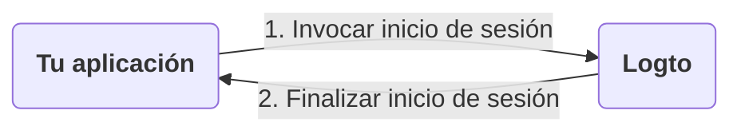
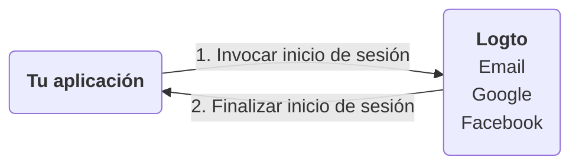
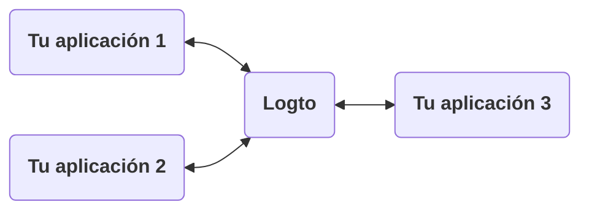
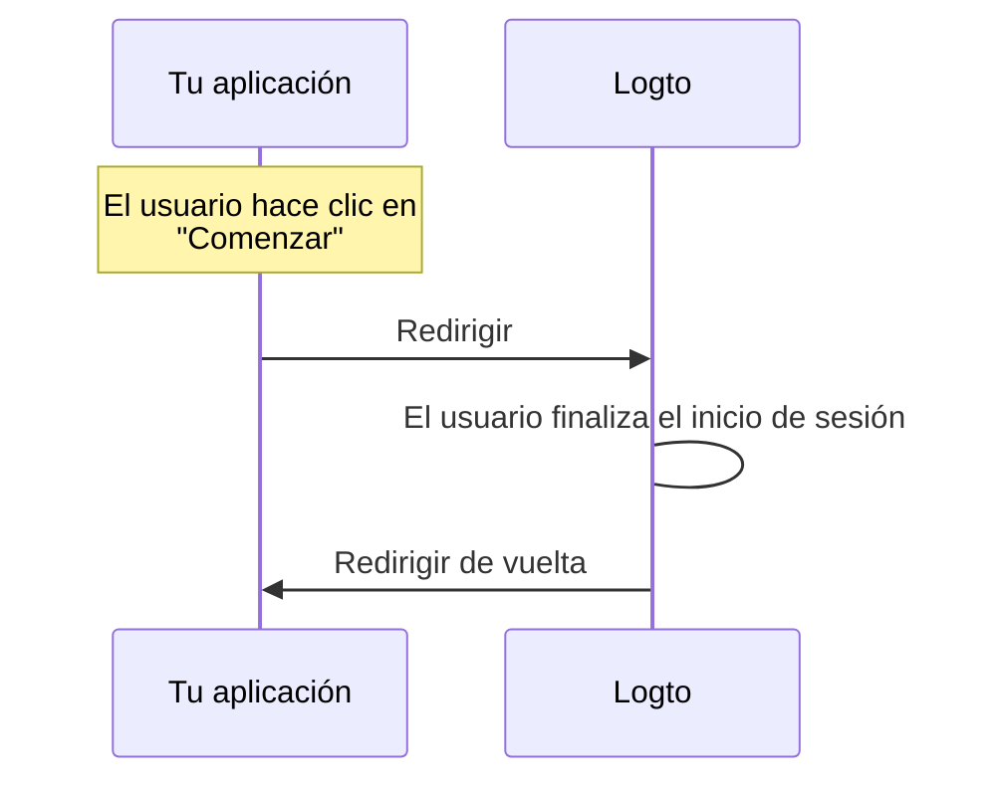
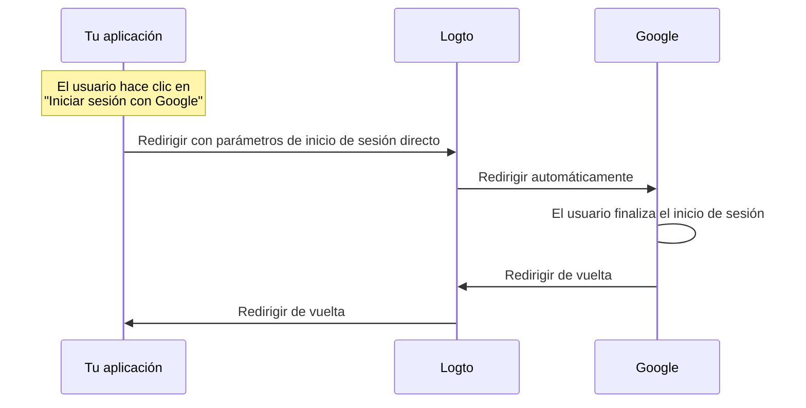

# Explicación de la experiencia de inicio de sesión

Esta página explica la experiencia de inicio de sesión en Logto y por qué está diseñada de esta manera.

## Introducción \{#introduction}

La experiencia de inicio de sesión es el proceso de autenticación de usuario en Logto. El proceso se puede simplificar de la siguiente manera:



1. Tu aplicación invoca el método de inicio de sesión.
2. El usuario es redirigido a la página de inicio de sesión de Logto. Para aplicaciones nativas, se abre el navegador del sistema.
3. El usuario inicia sesión y es redirigido de vuelta a tu aplicación (configurada como el "Redirect URI" en Logto).

Aunque el proceso es simple, la parte de redirección puede parecer excesiva a veces. Sin embargo, puede ser beneficiosa y segura de muchas maneras. Explicaremos las razones en las siguientes secciones.

## ¿Por qué redirigir? \{#why-redirect}

### Flexibilidad \{#flexibility}

La redirección te permite desacoplar el proceso de autenticación de tu aplicación. A medida que tu negocio crece, puedes mantener el mismo proceso de autenticación sin cambiar tu aplicación. Por ejemplo, puedes añadir autenticación multifactor (MFA) o cambiar los métodos de inicio de sesión sin tocar tu aplicación.



### Soporte para múltiples aplicaciones \{#multi-app-support}

Si tienes múltiples aplicaciones, tus usuarios pueden iniciar sesión una vez y acceder a todas las aplicaciones sin volver a iniciar sesión. Esto es especialmente útil para negocios SaaS o empresas con múltiples servicios.



### Aplicaciones nativas \{#native-apps}

Para aplicaciones nativas, redirigir al navegador del sistema es una forma segura de autenticar a los usuarios y tiene soporte integrado tanto para iOS como para Android.

- **iOS**: Apple ofrece [ASWebAuthenticationSession](https://developer.apple.com/documentation/authenticationservices/aswebauthenticationsession) para autenticación segura.
- **Android**: Google proporciona [Custom Tabs](https://developer.chrome.com/docs/android/custom-tabs) para una experiencia fluida.

### Seguridad \{#security}

En el fondo, Logto es un proveedor de [OpenID Connect (OIDC)](https://openid.net/specs/openid-connect-core-1_0.html). OIDC es un estándar ampliamente adoptado para la autenticación de usuarios.

Logto aplica medidas de seguridad estrictas, como [PKCE](https://tools.ietf.org/html/rfc7636), y desactiva flujos inseguros como el flujo implícito. La redirección es una forma segura de autenticar a los usuarios y puede prevenir muchos ataques comunes.

## ¿Qué pasa si necesito mostrar algunos componentes de inicio de sesión en mi aplicación? \{#what-if-i-need-to-show-some-sign-in-components-in-my-app}

A veces, tu equipo puede querer mostrar algunos componentes de inicio de sesión en la aplicación, como un botón de "Iniciar sesión con Google". Esto se puede lograr utilizando la función de "Inicio de sesión directo" en Logto.

### ¿Cómo funciona? \{#how-does-it-work}

Supongamos que tienes dos botones de llamada a la acción en tu aplicación: "Comenzar" e "Iniciar sesión con Google". Estos botones están diseñados para:

- "Comenzar": Redirigir a la página de inicio de sesión normal.
- "Iniciar sesión con Google": Redirigir a la página de inicio de sesión de Google.

Ambas acciones necesitan completar el proceso de inicio de sesión y redirigir de vuelta a tu aplicación.

---

#### Proceso al hacer clic en "Comenzar" \{#process-of-clicking-get-started}

En este caso, la experiencia de inicio de sesión es la misma que la predeterminada. El usuario es redirigido a la página de inicio de sesión de Logto y luego de vuelta a tu aplicación.



:::note
Si has configurado métodos de inicio de sesión social (por ejemplo, Google, Facebook) en Logto, el usuario puede ser redirigido a la página de inicio de sesión correspondiente. En la ilustración, solo mostramos el flujo general para simplificar.
:::

---

#### Proceso al hacer clic en "Iniciar sesión con Google" \{#process-of-clicking-sign-in-with-google}

En este caso, el usuario es redirigido a la página de inicio de sesión de Google automáticamente sin interactuar con la página de inicio de sesión de Logto. La velocidad de esta redirección automática es casi instantánea, por lo que los usuarios pueden no notar la redirección.



---

En resumen, la función de inicio de sesión directo es una forma de automatizar algunas interacciones en la experiencia de inicio de sesión sin cambiar el nivel de seguridad.

### Usar inicio de sesión directo en tu aplicación \{#use-direct-sign-in-in-your-app}

Para usar el inicio de sesión directo, necesitas pasar el parámetro `direct_sign_in` al invocar el método de inicio de sesión. El valor debe estar compuesto en un formato que Logto reconozca. Por ejemplo, para iniciar sesión con Google, el valor debe ser `social:google`.

En algunos de los SDK oficiales de Logto, hay una opción dedicada para el inicio de sesión directo. Aquí tienes un ejemplo de cómo usar el inicio de sesión directo en el SDK de JavaScript `@logto/client`:

```ts
client.signIn({
  redirectUri: 'https://some-redirect-uri',
  directSignIn: { method: 'social', target: 'google' },
});
```

Para más detalles, consulta [Inicio de sesión directo](/end-user-flows/authentication-parameters/direct-sign-in).

:::info
Estamos implementando gradualmente esta función en todos los SDK oficiales de Logto. Si no la ves en tu SDK, no dudes en contactarnos.
:::

## Necesito que mis usuarios ingresen sus credenciales en mi aplicación \{#i-need-my-users-to-fill-in-their-credentials-in-my-app}

Si necesitas que tus usuarios ingresen sus credenciales (como correo electrónico y contraseña) directamente en tu aplicación, en lugar de redirigir a Logto, no podemos ayudarte con eso en este momento. Históricamente, existía un "Resource Owner Password Credentials" grant, pero ahora se considera inseguro y ha sido [formalmente desaprobado en OAuth 2.1](https://datatracker.ietf.org/doc/html/draft-ietf-oauth-security-topics#name-resource-owner-password-cre).

Para aprender más sobre los riesgos de seguridad del tipo de grant ROPC, consulta nuestra publicación en el blog [Por qué deberías desaprobar el tipo de grant ROPC](https://blog.logto.io/deprecated-ropc-grant-type/).

## Recursos relacionados \{#related-resources}

<Url href="https://blog.logto.io/oauth-2-1/">OAuth 2.1 está aquí: Lo que necesitas saber</Url>
<Url href="https://blog.logto.io/how-pkce-protects-the-authorization-code-flow-for-native-apps">
  Qué es PKCE: desde conceptos básicos hasta comprensión profunda
</Url>
