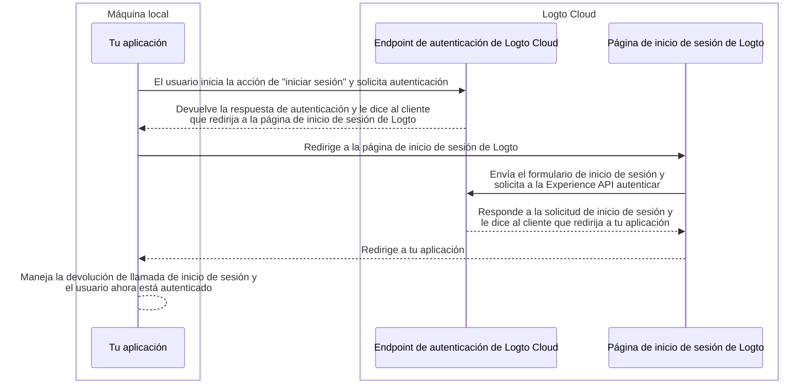
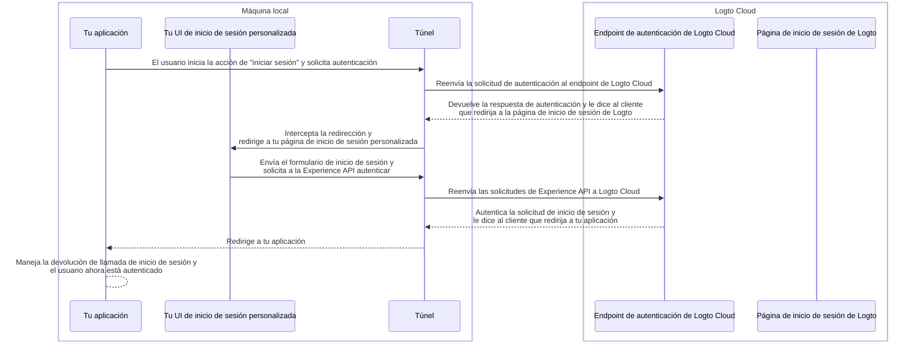

import TabItem from '@theme/TabItem';
import Tabs from '@theme/Tabs';

# Depura y prueba tu UI personalizada localmente

Para los usuarios de Logto Cloud, hemos facilitado que puedas "Traer tu propia UI" a Logto. Los usuarios de Cloud ahora pueden subir un archivo zip que contenga los activos de la UI personalizada en <CloudLink to="/sign-in-experience/branding">Consola > Experiencia de inicio de sesión > Branding > Trae tu UI</CloudLink> (Consulta la página [Trae tu UI](/customization/bring-your-ui) para más detalles).

Sin embargo, al desarrollar dichas páginas de UI personalizadas, los usuarios quieren probar y depurar el código localmente antes de subirlo a Logto Cloud. Este comando de CLI te ayuda a configurar un túnel local y conectar las siguientes 3 entidades juntas: tu endpoint de autenticación de Logto Cloud, tu aplicación y tu UI de inicio de sesión personalizada.

## ¿Por qué necesito esto?

Por defecto, cuando haces clic en el botón "iniciar sesión" en tu aplicación, serás dirigido a la página de inicio de sesión configurada en el endpoint de Logto. Un flujo de inicio de sesión exitoso se puede ilustrar de la siguiente manera:



Pero ahora, dado que estás desarrollando tu propia UI de inicio de sesión personalizada, necesitas una manera de navegar a las páginas de UI de inicio de sesión personalizadas que se ejecutan en tu máquina local.
Esto requiere un servicio de túnel local para interceptar las solicitudes salientes de tu aplicación y redirigirlas a tus páginas de UI de inicio de sesión personalizadas.

Además, necesitas interactuar con la Experience API de Logto para autenticar usuarios y gestionar sesiones.
Este servicio también ayudará a reenviar estas solicitudes de Experience API a Logto Cloud para evitar problemas de CORS.

El siguiente diagrama de secuencia ilustra cómo funciona un flujo de "inicio de sesión" exitoso con tu UI personalizada y el servicio de túnel en su lugar:



Con el servicio de túnel en su lugar, ahora puedes desarrollar y probar tu UI de inicio de sesión personalizada localmente, sin necesidad de subir los activos a Logto Cloud cada vez que realices un cambio.

## Instrucciones

### Paso 1: Ejecuta el comando

Suponiendo que tu ID de inquilino de Cloud es `foobar`, y tienes una página de inicio de sesión personalizada ejecutándose en tu servidor de desarrollo local en `http://localhost:4000`, entonces puedes ejecutar el comando de esta manera:

<Tabs groupId="cmd">

  <TabItem value="cli" label="CLI">

```bash
logto-tunnel -p 9000 --experience-uri http://localhost:4000/ --endpoint https://foobar.logto.app/
```

  </TabItem>
  <TabItem value="npx" label="npx">

```bash
npx @logto/tunnel -p 9000 --experience-uri http://localhost:4000/ --endpoint https://foobar.logto.app/
```

  </TabItem>

</Tabs>

También funciona si tienes un dominio personalizado configurado en Logto:

<Tabs groupId="cmd">

  <TabItem value="cli" label="CLI">

```bash
logto-tunnel -p 9000 --experience-uri http://localhost:4000/ --endpoint https://your.custom.domain/
```

  </TabItem>
  <TabItem value="npx" label="npx">

```bash
npx @logto/tunnel -p 9000 --experience-uri http://localhost:4000/ --endpoint https://your.custom.domain/
```

  </TabItem>

</Tabs>

Alternativamente, el comando también admite activos HTML estáticos sin necesidad de ejecutarlos primero en un servidor de desarrollo. Solo asegúrate de que haya un `index.html` en la ruta que especificaste.

<Tabs groupId="cmd">

  <TabItem value="cli" label="CLI">

```bash
logto-tunnel -p 9000 --experience-path /path/to/your/static/files --endpoint https://foobar.logto.app/
```

  </TabItem>
  <TabItem value="npx" label="npx">

```bash
npx @logto/tunnel -p 9000 --experience-path /path/to/your/static/files --endpoint https://foobar.logto.app/
```

  </TabItem>

</Tabs>

### Paso 2: Actualiza el URI del endpoint en tu aplicación

Finalmente, ejecuta tu aplicación y configura su endpoint de Logto a la dirección del servicio de túnel `http://localhost:9000/` en su lugar.

Tomemos una aplicación React como ejemplo:

```tsx title=App.tsx
import { LogtoProvider, LogtoConfig } from '@logto/react';

const config: LogtoConfig = {
  // endpoint: 'https://foobar.logto.app/', // endpoint original de Logto Cloud
  endpoint: 'http://localhost:9000/', // dirección del servicio de túnel
  appId: '<your-application-id>',
};

const App = () => (
  <LogtoProvider config={config}>
    <YourAppContent />
  </LogtoProvider>
);
```

Si estás utilizando inicio de sesión social, también necesitas actualizar el URI de redirección en la configuración de tu proveedor social a la dirección del servicio de túnel.

```
http://localhost:9000/callback/<connector-id>
```

Si todo está configurado correctamente, cuando hagas clic en el botón "iniciar sesión" en tu aplicación, deberías ser dirigido a tu página de inicio de sesión personalizada en lugar de la UI integrada de Logto, junto con una sesión válida (cookies) que te permita interactuar más con la Experience API de Logto.

¡Feliz codificación!
