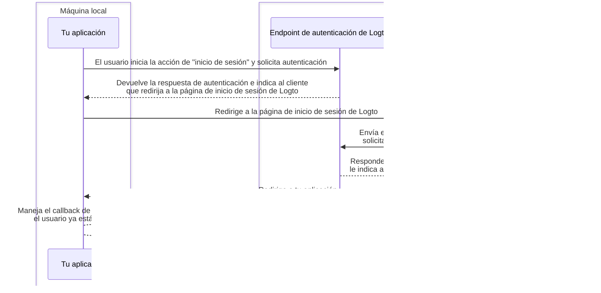
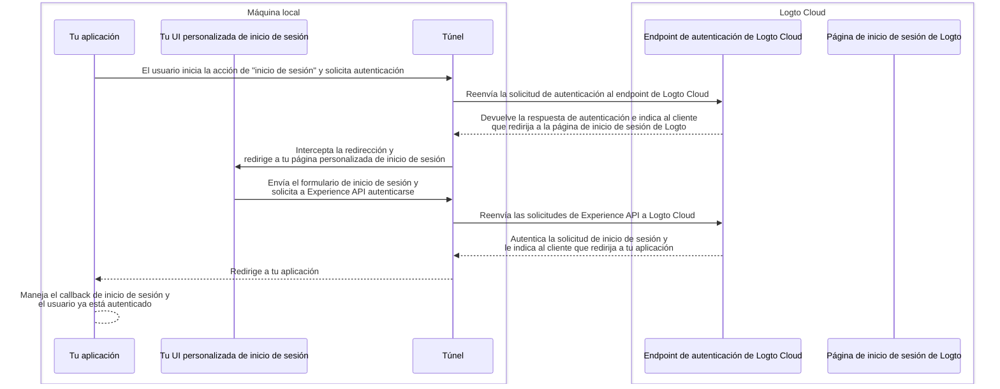

import TabItem from '@theme/TabItem';
import Tabs from '@theme/Tabs';

# Depura y prueba tu UI personalizada localmente

Para los usuarios de Logto Cloud, hemos facilitado la opción de "Trae tu propia UI" a Logto. Los usuarios de Cloud ahora pueden subir un archivo zip que contenga los recursos de la UI personalizada en <CloudLink to="/sign-in-experience/branding">Consola > Inicio de sesión y cuenta > Marca > Trae tu UI</CloudLink> (Consulta la página de [Trae tu UI](/customization/bring-your-ui) para más detalles).

Sin embargo, al desarrollar estas páginas de UI personalizadas, los usuarios quieren probar y depurar el código localmente antes de subirlo a Logto Cloud. Este comando de CLI te ayuda a configurar un túnel local y conectar las siguientes 3 entidades juntas:
tu endpoint de autenticación de Logto Cloud, tu aplicación y tu UI personalizada de inicio de sesión.

## ¿Por qué necesito esto? \{#why-do-i-need-this}

Por defecto, cuando haces clic en el botón de "inicio de sesión" en tu aplicación, serás dirigido a la página de inicio de sesión configurada en el endpoint de Logto. Un flujo de inicio de sesión exitoso se puede ilustrar de la siguiente manera:


```mermaid
sequenceDiagram
    box Máquina local
    participant A as Tu aplicación
    end
    box Logto Cloud
    participant B as Endpoint de autenticación de Logto Cloud
    participant C as Página de inicio de sesión de Logto
    end
    A ->> B: El usuario inicia la acción de "inicio de sesión" y solicita autenticación
    B -->> A: Devuelve la respuesta de autenticación e indica al cliente<br/>que redirija a la página de inicio de sesión de Logto
    A ->> C: Redirige a la página de inicio de sesión de Logto
    C ->> B: Envía el formulario de inicio de sesión y<br/>solicita a Experience API autenticarse
    B -->> C: Responde a la solicitud de inicio de sesión y<br/>le indica al cliente que redirija a tu aplicación
    C -->> A: Redirige a tu aplicación
    A --> A: Maneja el callback de inicio de sesión y<br/>el usuario ya está autenticado
```

Pero ahora, como estás desarrollando tu propia UI personalizada de inicio de sesión, necesitas una forma de navegar a las páginas de UI personalizadas que se ejecutan en tu máquina local.
Esto requiere un servicio de túnel local para interceptar las solicitudes salientes de tu aplicación y redirigirlas a tus páginas personalizadas de inicio de sesión.

Además, necesitas interactuar con la [Experience API de Logto](https://openapi.logto.io/group/endpoint-experience) para autenticar usuarios y gestionar sesiones.
Este servicio también ayudará a reenviar estas solicitudes de Experience API a Logto Cloud para evitar problemas de CORS.

El siguiente diagrama de secuencia ilustra cómo funciona un flujo exitoso de "inicio de sesión" con tu UI personalizada y el servicio de túnel en funcionamiento:


```mermaid
sequenceDiagram
    box Máquina local
    participant A as Tu aplicación
    participant B as Tu UI personalizada de inicio de sesión
    participant C as Túnel
    end
    box Logto Cloud
    participant D as Endpoint de autenticación de Logto Cloud
    participant E as Página de inicio de sesión de Logto
    end
    A ->> C: El usuario inicia la acción de "inicio de sesión" y solicita autenticación
    C ->> D: Reenvía la solicitud de autenticación al endpoint de Logto Cloud
    D -->> C: Devuelve la respuesta de autenticación e indica al cliente<br/>que redirija a la página de inicio de sesión de Logto
    C ->> B: Intercepta la redirección y<br/>redirige a tu página personalizada de inicio de sesión
    B ->> C: Envía el formulario de inicio de sesión y<br/>solicita a Experience API autenticarse
    C ->> D: Reenvía las solicitudes de Experience API a Logto Cloud
    D -->> C: Autentica la solicitud de inicio de sesión y<br/>le indica al cliente que redirija a tu aplicación
    C -->> A: Redirige a tu aplicación
    A --> A: Maneja el callback de inicio de sesión y<br/>el usuario ya está autenticado
```

Con el servicio de túnel en funcionamiento, ahora puedes desarrollar y probar tu UI personalizada de inicio de sesión localmente, sin necesidad de subir los recursos a Logto Cloud cada vez que realices un cambio.

## Instrucciones \{#instructions}

### Paso 1: Ejecuta el comando \{#step-1-execute-the-command}

Suponiendo que tu tenant de Cloud es `foobar`, y tienes una página personalizada de inicio de sesión ejecutándose en tu servidor local de desarrollo en `http://localhost:4000`, entonces puedes ejecutar el comando de esta manera:

<Tabs groupId="cmd">

  <TabItem value="cli" label="CLI">

```bash
logto-tunnel -p 9000 --experience-uri http://localhost:4000/ --endpoint https://foobar.logto.app/
```

  </TabItem>
  <TabItem value="npx" label="npx">

```bash
npx @logto/tunnel -p 9000 --experience-uri http://localhost:4000/ --endpoint https://foobar.logto.app/
```

  </TabItem>

</Tabs>

También funciona si tienes un dominio personalizado configurado en Logto:

<Tabs groupId="cmd">

  <TabItem value="cli" label="CLI">

```bash
logto-tunnel -p 9000 --experience-uri http://localhost:4000/ --endpoint https://your.custom.domain/
```

  </TabItem>
  <TabItem value="npx" label="npx">

```bash
npx @logto/tunnel -p 9000 --experience-uri http://localhost:4000/ --endpoint https://your.custom.domain/
```

  </TabItem>

</Tabs>

Alternativamente, el comando también admite recursos html estáticos sin necesidad de ejecutarlos primero en un servidor de desarrollo. Solo asegúrate de que haya un `index.html` en la ruta que especifiques.

<Tabs groupId="cmd">

  <TabItem value="cli" label="CLI">

```bash
logto-tunnel -p 9000 --experience-path /path/to/your/static/files --endpoint https://foobar.logto.app/
```

  </TabItem>
  <TabItem value="npx" label="npx">

```bash
npx @logto/tunnel -p 9000 --experience-path /path/to/your/static/files --endpoint https://foobar.logto.app/
```

  </TabItem>

</Tabs>

### Paso 2: Actualiza el URI del endpoint en tu aplicación \{#step-2-update-endpoint-uri-in-your-application}

Finalmente, ejecuta tu aplicación y configura su endpoint de Logto a la dirección del servicio de túnel `http://localhost:9000/` en su lugar.

Tomemos como ejemplo una aplicación React:

```tsx title=App.tsx
import { LogtoProvider, LogtoConfig } from '@logto/react';

// endpoint: 'https://foobar.logto.app/', // endpoint original de Logto Cloud
const config: LogtoConfig = {
  endpoint: 'http://localhost:9000/', // dirección del servicio de túnel
  appId: '<your-application-id>',
};

const App = () => (
  <LogtoProvider config={config}>
    <YourAppContent />
  </LogtoProvider>
);
```

Si estás usando inicio de sesión social, también necesitas actualizar el URI de redirección en la configuración de tu proveedor social a la dirección del servicio de túnel.

```
http://localhost:9000/callback/<connector-id>
```

Si todo está configurado correctamente, cuando hagas clic en el botón de "inicio de sesión" en tu aplicación, deberías ser dirigido a tu página personalizada de inicio de sesión en lugar de la UI incorporada de Logto, junto con una sesión válida (cookies) que te permitirá interactuar con Logto Experience API.

¡Feliz programación!

## Recursos relacionados \{#related-resources}

<Url href="https://blog.logto.io/automate-custom-sign-in-ui-deployment-with-github-actions">
  Automatiza el despliegue de tu UI personalizada de inicio de sesión con el flujo de trabajo de
  GitHub Actions
</Url>
