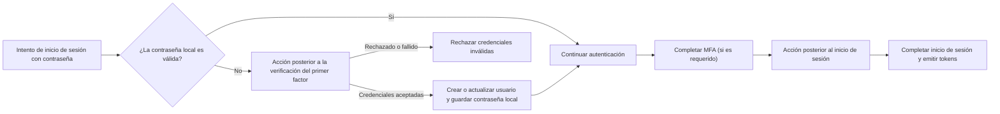

# Acciones

Las Acciones de Logto te permiten ejecutar JavaScript confiable en puntos específicos del flujo de autenticación. Una acción se ejecuta de forma sincrónica: la solicitud de autenticación espera el script, y el resultado del script puede actualizar al usuario o determinar si el flujo continúa.

Las acciones son útiles cuando la decisión debe ocurrir dentro del flujo de autenticación. Los casos de uso comunes incluyen:

- Migrar usuarios y contraseñas desde un sistema de identidad heredado cuando inician sesión por primera vez.
- Actualizar el perfil del usuario o datos específicos de la aplicación antes de que Logto complete un inicio de sesión.
- Llamar a un servicio externo y aplicar su resultado al usuario de Logto.

:::note
Las acciones están disponibles en Logto OSS y en los planes Enterprise de Logto Cloud.
:::

:::warning
Los scripts de acción pueden afectar la autenticación y modificar los datos del usuario. Solo los administradores de confianza deben poder ver, crear, editar, probar, habilitar o eliminarlos.

En implementaciones autogestionadas, los scripts de acción se ejecutan en una máquina virtual dentro del proceso de Logto. Trátalos como código confiable del lado del servidor, no como un límite de seguridad para código no confiable.
:::

## Cómo encajan las Acciones en el inicio de sesión \{#how-actions-fit-into-sign-in}

Actualmente, Logto proporciona dos tipos de acciones:



| Tipo de acción                                                                       | Cuándo se ejecuta                                                                                                                                                              | Qué puede hacer                                                                                                                                                  |
| ------------------------------------------------------------------------------------ | ------------------------------------------------------------------------------------------------------------------------------------------------------------------------------ | ---------------------------------------------------------------------------------------------------------------------------------------------------------------- |
| [Post first-factor verification](/developers/actions/post-first-factor-verification) | Durante un inicio de sesión con contraseña, solo después de que falle la verificación de la contraseña local de Logto. No se ejecuta si la contraseña local es válida.         | Verificar las credenciales enviadas contra un sistema heredado, luego crear un nuevo usuario de Logto o actualizar uno existente y migrar la contraseña enviada. |
| [Post sign-in](/developers/actions/post-sign-in)                                     | Después de que el usuario haya completado todos los factores de autenticación, incluido MFA si es requerido, y antes de que Logto complete el inicio de sesión y emita tokens. | Actualizar y enriquecer el usuario existente de Logto usando el contexto final del inicio de sesión.                                                             |

Ambos tipos de acción se ejecutan solo para interacciones de `SignIn` en la Experience API. La verificación posterior al primer factor se aplica solo al inicio de sesión con contraseña; la acción posterior al inicio de sesión es independiente del método de autenticación.

## Modelo de script \{#script-model}

Cada tipo de acción tiene una configuración y una función de entrada JavaScript llamada `runAction`:

```js
const runAction = async ({ event, environmentVariables = {} }) => {
  // Inspecciona el evento, opcionalmente obtiene datos externos y retorna
  // un resultado compatible con este tipo de acción.
};
```

La carga útil contiene:

- `event`: El evento de autenticación en producción. Su forma depende del tipo de acción.
- `environmentVariables`: Los valores de cadena configurados para esta acción. Estos valores se pasan a través de la carga útil de la función; no están disponibles a través de `process.env`.

El editor proporciona información de tipos, pero el script guardado se ejecuta como JavaScript. El script puede ser asíncrono y puede usar la función `fetch` inyectada para llamar a APIs HTTPS externas. No puede importar paquetes ni acceder a globales de Node.js como `require` o `process`.

El resultado compatible es diferente para cada tipo de acción; consulta la página de referencia correspondiente antes de habilitar una Acción.

## Acciones y Webhooks \{#actions-and-webhooks}

Las acciones y los [Webhooks](/developers/webhooks) cumplen propósitos diferentes:

|                                                  | Acciones                                                             | Webhooks                                                                   |
| ------------------------------------------------ | -------------------------------------------------------------------- | -------------------------------------------------------------------------- |
| Ejecución                                        | Sincrónica y en línea con la autenticación                           | Asíncrona y fuera de la solicitud de autenticación                         |
| ¿Puede afectar el flujo de autenticación actual? | Sí                                                                   | No                                                                         |
| ¿Puede modificar un usuario desde su resultado?  | Sí, usando el parche de usuario compatible                           | No directamente; el receptor puede llamar a la Management API por separado |
| Cobertura de eventos                             | Puntos de autenticación seleccionados                                | Un amplio conjunto de eventos de interacción y cambio de datos             |
| Uso típico                                       | Migración de credenciales, enriquecimiento de perfil previo al token | Notificaciones, sincronización downstream, analítica                       |

Mantén el trabajo asíncrono en los Webhooks. Usa una Acción solo cuando Logto necesite el resultado antes de que la autenticación pueda continuar.

## Próximos pasos \{#next-steps}

- [Configura y prueba Acciones](/developers/actions/configure-and-test-actions)
- [Migra usuarios en el inicio de sesión con contraseña](/developers/actions/post-first-factor-verification)
- [Enriquece un usuario después del inicio de sesión](/developers/actions/post-sign-in)
