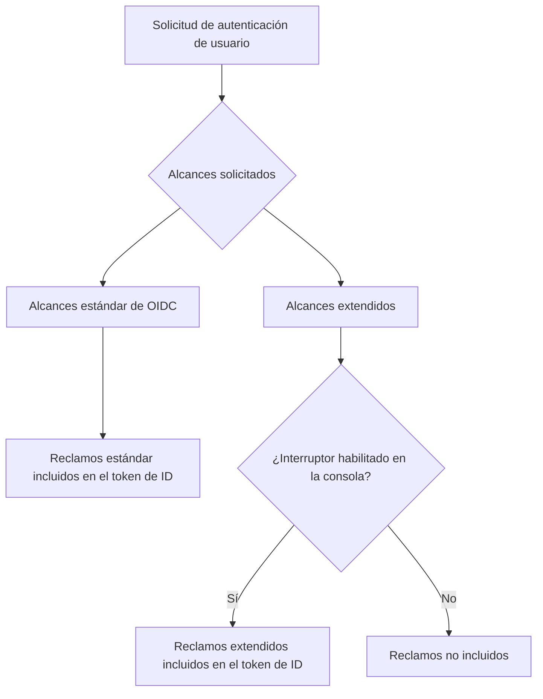

# Token de ID personalizado

## Introducción \{#introduction}

El [token de ID (ID token)](https://auth.wiki/id-token) es un tipo especial de token definido por el protocolo [OpenID Connect (OIDC)](https://auth.wiki/openid-connect). Sirve como una afirmación de identidad emitida por el servidor de autorización (Logto) después de que un usuario se autentica con éxito, transportando reclamos sobre la identidad del usuario autenticado.

A diferencia de los [tokens de acceso](/developers/custom-token-claims), que se utilizan para acceder a recursos protegidos, los tokens de ID están diseñados específicamente para transmitir la identidad del usuario autenticado a las aplicaciones cliente. Son [JSON Web Tokens (JWTs)](https://auth.wiki/jwt) que contienen reclamos sobre el evento de autenticación y el usuario autenticado.

## Cómo funcionan los reclamos del token de ID \{#how-id-token-claims-work}

En Logto, los reclamos del token de ID se dividen en dos categorías:

1. **Reclamos estándar de OIDC**: Definidos por la especificación OIDC, estos reclamos están completamente determinados por los alcances solicitados durante la autenticación.
2. **Reclamos extendidos**: Reclamos extendidos por Logto para transportar información de identidad adicional, controlados por un **modelo de doble condición** (Alcance + Interruptor).

## Reclamos estándar de OIDC \{#standard-oidc-claims}

Los reclamos estándar están completamente gobernados por la especificación OIDC. Su inclusión en el token de ID depende únicamente de los alcances que tu aplicación solicite durante la autenticación. Logto no proporciona ninguna opción para deshabilitar o excluir selectivamente reclamos estándar individuales.

La siguiente tabla muestra la relación entre los alcances estándar y sus reclamos correspondientes:

| Alcance   | Reclamos                                                                                                                                                                         |
| --------- | -------------------------------------------------------------------------------------------------------------------------------------------------------------------------------- |
| `openid`  | `sub`                                                                                                                                                                            |
| `profile` | `name`, `family_name`, `given_name`, `middle_name`, `nickname`, `preferred_username`, `profile`, `picture`, `website`, `gender`, `birthdate`, `zoneinfo`, `locale`, `updated_at` |
| `email`   | `email`, `email_verified`                                                                                                                                                        |
| `phone`   | `phone_number`, `phone_number_verified`                                                                                                                                          |
| `address` | `address`                                                                                                                                                                        |

Por ejemplo, si tu aplicación solicita los alcances `openid profile email`, el token de ID incluirá todos los reclamos de los alcances `openid`, `profile` y `email`.

## Reclamos extendidos \{#extended-claims}

Más allá de los reclamos estándar de OIDC, Logto extiende reclamos adicionales que transportan información de identidad específica del ecosistema Logto. Estos reclamos extendidos siguen un **modelo de doble condición** para ser incluidos en el token de ID:

1. **Condición de alcance**: La aplicación debe solicitar el alcance correspondiente durante la autenticación.
2. **Interruptor en la consola**: El administrador debe habilitar la inclusión del reclamo en el token de ID a través de Logto Console.

Ambas condiciones deben cumplirse simultáneamente. El alcance sirve como declaración de acceso a nivel de protocolo, mientras que el interruptor sirve como control de exposición a nivel de producto: sus responsabilidades son claras y no sustituibles.

### Alcances y reclamos extendidos disponibles \{#available-extended-scopes-and-claims}

| Alcance                              | Reclamos                       | Descripción                                              | Incluido por defecto |
| ------------------------------------ | ------------------------------ | -------------------------------------------------------- | -------------------- |
| `custom_data`                        | `custom_data`                  | Datos personalizados almacenados en el objeto de usuario |                      |
| `identities`                         | `identities`, `sso_identities` | Identidades sociales y SSO vinculadas del usuario        |                      |
| `roles`                              | `roles`                        | Roles asignados al usuario                               | ✅                   |
| `urn:logto:scope:organizations`      | `organizations`                | IDs de las organizaciones del usuario                    | ✅                   |
| `urn:logto:scope:organizations`      | `organization_data`            | Datos de la organización del usuario                     |                      |
| `urn:logto:scope:organization_roles` | `organization_roles`           | Asignaciones de roles de organización del usuario        | ✅                   |

### Configuración en Logto Console \{#configure-in-logto-console}

Para habilitar reclamos extendidos en el token de ID:

1. Navega a <CloudLink to="/customize-jwt">Consola > JWT personalizado</CloudLink>.
2. Activa los reclamos que deseas incluir en el token de ID.
3. Asegúrate de que tu aplicación solicite los alcances correspondientes durante la autenticación.

## Recursos relacionados \{#related-resources}

<Url href="/developers/custom-token-claims">Token de acceso personalizado</Url>

<Url href="https://openid.net/specs/openid-connect-core-1_0.html#IDToken">
  OpenID Connect Core - Token de ID
</Url>
