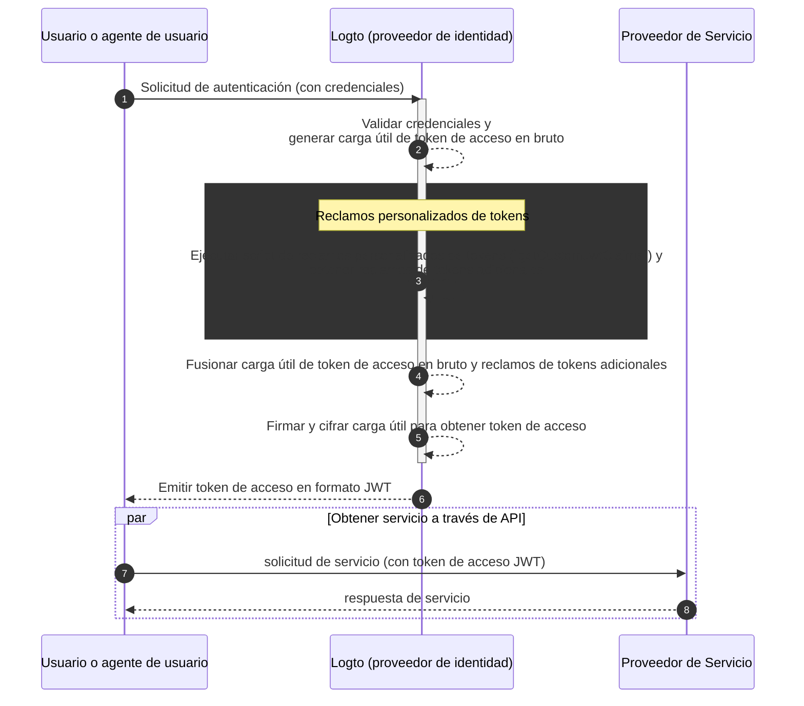

# Reclamos personalizados de tokens

Logto proporciona la flexibilidad de añadir reclamos personalizados dentro de los tokens de acceso (JWT / Token opaco). Con esta función, puedes incluir información adicional para tu lógica de negocio, todo transmitido de manera segura en los tokens y recuperable mediante introspección en el caso de los tokens opacos.

## Introducción \{#introduction}

[Tokens de acceso (Access tokens)](https://auth.wiki/access-token) juegan un papel crítico en el proceso de autenticación y autorización, llevando la información de identidad del sujeto y permisos, y se pasan entre el [servidor Logto](/concepts/core-service) (sirve como servidor de autenticación o proveedor de identidad, IdP), tu servidor de servicio web (proveedor de recursos), y aplicaciones cliente (clientes).

[Reclamos de tokens (Token claims)](https://auth.wiki/claim) son los pares clave-valor que proporcionan información sobre una entidad o el propio token. Los reclamos pueden incluir información del usuario, tiempo de expiración del token, permisos y otros metadatos que son relevantes para el proceso de autenticación (enlace a auth.wiki) y autorización (enlace a auth.wiki).

Hay dos tipos de tokens de acceso en Logto:

- **JSON Web Token:** [JSON Web Token (JWT)](https://auth.wiki/jwt) es un formato popular que codifica reclamos de una manera que es segura y legible por los clientes. Reclamos comunes como `sub`, `iss`, `aud`, etc., se utilizan en línea con el protocolo OAuth 2.0 (Consulta [este enlace](https://datatracker.ietf.org/doc/html/rfc7519#section-4) para más detalles). Los tokens JWT permiten a los consumidores acceder directamente a los reclamos sin pasos de validación adicionales. En Logto, los tokens de acceso se emiten en formato JWT por defecto cuando un cliente inicia solicitudes de autorización de recursos o organizaciones específicas.
- **Token opaco:** Un [token opaco](http://localhost:3000/concepts/opaque-token) no es autocontenido y siempre requiere un paso de validación adicional a través del endpoint de [introspección de tokens](https://auth.wiki/token-introspection). A pesar de su formato no transparente, los tokens opacos pueden ayudar a obtener reclamos y ser transmitidos de manera segura entre las partes. Los reclamos de tokens se almacenan de manera segura en el servidor Logto y son accedidos por las aplicaciones cliente a través del endpoint de introspección de tokens. Los tokens de acceso se emiten en formato opaco cuando no se incluye un recurso o una organización específica en la solicitud de autorización. Estos tokens se utilizan principalmente para acceder al endpoint `userinfo` de OIDC y otros propósitos generales.

En muchos casos, los reclamos estándar no son suficientes para satisfacer las necesidades específicas de tus aplicaciones, ya sea que estés utilizando JWT o tokens opacos. Para abordar esto, Logto proporciona la flexibilidad de añadir reclamos personalizados dentro de los tokens de acceso. Con esta función, puedes incluir información adicional para tu lógica de negocio, todo transmitido de manera segura en los tokens y recuperable mediante introspección en el caso de los tokens opacos.

## ¿Cómo funcionan los reclamos personalizados de tokens? \{#how-do-custom-token-claims-work}

Logto te permite insertar reclamos personalizados en el `token de acceso` a través de una función de callback `getCustomJwtClaims`. Puedes proporcionar tu implementación de la función `getCustomJwtClaims` para devolver un objeto de reclamos personalizados. El valor devuelto se fusionará con la carga útil original del token y se firmará para generar el token de acceso final.

:::warning
Los reclamos de tokens integrados de Logto NO pueden ser sobrescritos o modificados. Los reclamos personalizados se añadirán al token como reclamos adicionales. Si algún reclamo personalizado entra en conflicto con los reclamos integrados, esos reclamos personalizados serán ignorados.
:::

## Recursos relacionados \{#related-resources}

<Url href="https://blog.logto.io/glance-on-custom-jwt-access-token-claims">
  Añade reclamos personalizados para tokens de acceso JWT con Logto para mejorar tu autorización
</Url>
