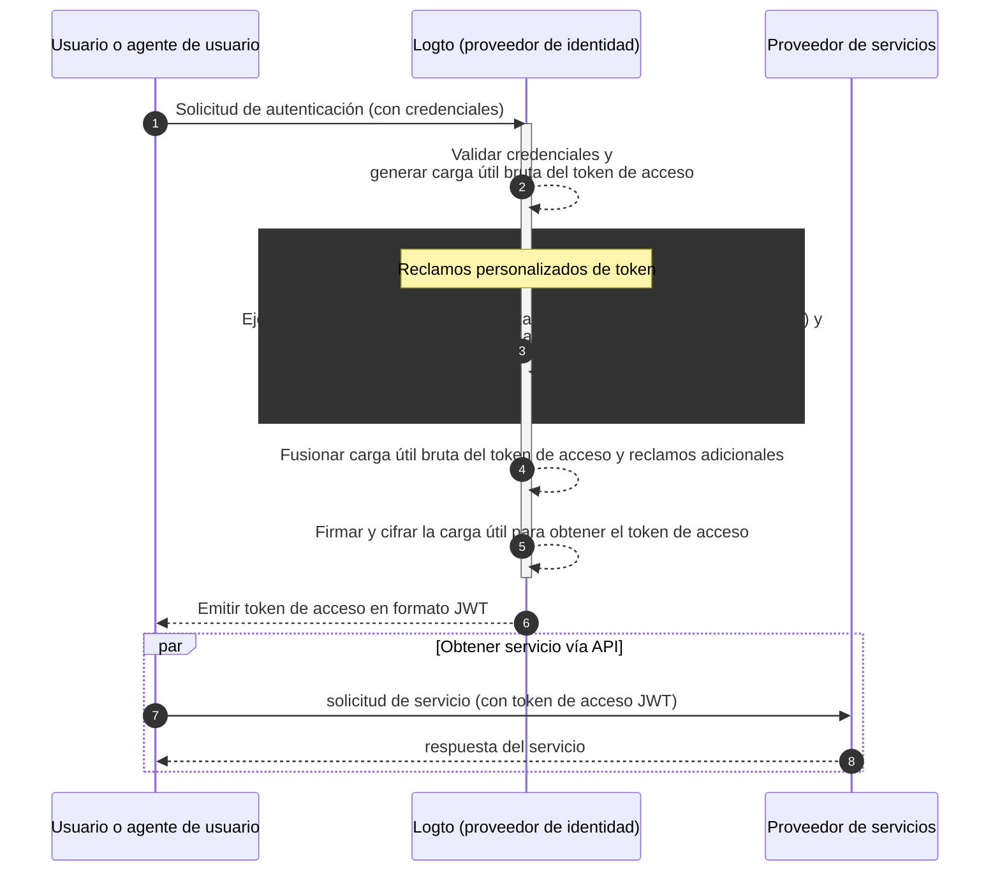

# Reclamos personalizados de token

Logto proporciona la flexibilidad de añadir reclamos personalizados dentro de los tokens de acceso (JWT / Token opaco (Opaque token)). Con esta función, puedes incluir información adicional para tu lógica de negocio, todo transmitido de forma segura en los tokens y recuperable mediante introspección en el caso de los tokens opacos.

## Introducción \{#introduction}

Los [tokens de acceso (Access tokens)](https://auth.wiki/access-token) juegan un papel fundamental en el proceso de autenticación (Authentication) y autorización (Authorization), transportando la información de identidad y permisos del sujeto, y se transmiten entre el [servidor Logto](/concepts/core-service) (sirve como servidor de autenticación o proveedor de identidad, IdP), tu servidor de servicios web (proveedor de recursos), y las aplicaciones cliente (clientes).

Los [reclamos de token (Token claims)](https://auth.wiki/claim) son los pares clave-valor que proporcionan información sobre una entidad o el propio token. Los reclamos pueden incluir información del usuario, tiempo de expiración del token, permisos y otros metadatos relevantes para el proceso de autenticación (Authentication) y autorización (Authorization).

Hay dos tipos de tokens de acceso en Logto:

- **JSON Web Token:** [JSON Web Token (JWT)](https://auth.wiki/jwt) es un formato popular que codifica los reclamos de manera segura y legible por los clientes. Reclamos comunes como `sub`, `iss`, `aud`, etc., se utilizan en línea con el protocolo OAuth 2.0 (Consulta [este enlace](https://datatracker.ietf.org/doc/html/rfc7519#section-4) para más detalles). Los JWT permiten a los consumidores acceder directamente a los reclamos sin pasos de validación adicionales. En Logto, los tokens de acceso se emiten en formato JWT por defecto cuando un cliente inicia solicitudes de autorización de recursos o organizaciones específicas.
- **Token opaco (Opaque token):** Un [token opaco (opaque token)](http://localhost:3000/concepts/opaque-token) no es autocontenido y siempre requiere un paso de validación adicional a través del endpoint de [introspección de token (token introspection)](https://auth.wiki/token-introspection). A pesar de su formato no transparente, los tokens opacos pueden ayudar a obtener reclamos y transmitirse de forma segura entre las partes. Los reclamos de token se almacenan de forma segura en el servidor Logto y son accedidos por las aplicaciones cliente a través del endpoint de introspección de token. Los tokens de acceso se emiten en formato opaco cuando no se incluye un recurso u organización específica en la solicitud de autorización. Estos tokens se utilizan principalmente para acceder al endpoint OIDC `userinfo` y otros propósitos generales.

En muchos casos, los reclamos estándar no son suficientes para satisfacer las necesidades específicas de tus aplicaciones, ya sea que utilices JWT o tokens opacos. Para abordar esto, Logto proporciona la flexibilidad de añadir reclamos personalizados dentro de los tokens de acceso. Con esta función, puedes incluir información adicional para tu lógica de negocio, todo transmitido de forma segura en los tokens y recuperable mediante introspección en el caso de los tokens opacos.

## ¿Cómo funcionan los reclamos personalizados de token? \{#how-do-custom-token-claims-work}

Logto te permite insertar reclamos personalizados en el `token de acceso (access token)` a través de una función de callback `getCustomJwtClaims`. Puedes proporcionar tu propia implementación de la función `getCustomJwtClaims` para devolver un objeto de reclamos personalizados. El valor de retorno se fusionará con la carga útil original del token y se firmará para generar el token de acceso final.

:::warning
Los reclamos integrados de Logto NO pueden ser sobrescritos ni modificados. Los reclamos personalizados se añadirán al token como reclamos adicionales. Si algún reclamo personalizado entra en conflicto con los reclamos integrados, esos reclamos personalizados serán ignorados.
:::

## Recursos relacionados \{#related-resources}

<Url href="https://blog.logto.io/glance-on-custom-jwt-access-token-claims">
  Añade reclamos personalizados para tokens de acceso JWT con Logto para potenciar tu autorización
  (Authorization)
</Url>
