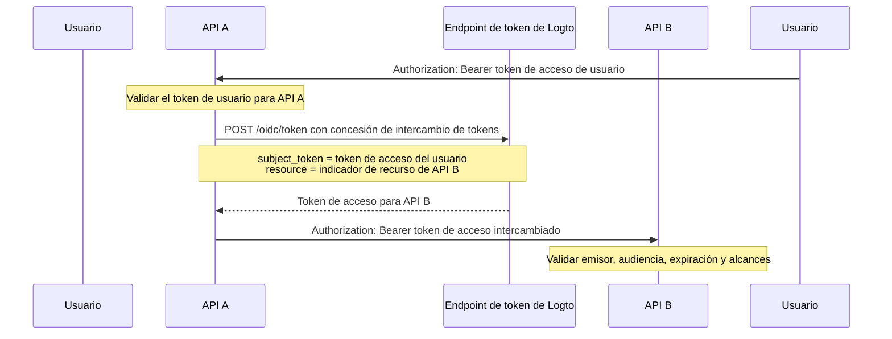

import TokenExchangePrerequisites from './fragments/_token-exchange-prerequisites.mdx';

# Delegación de servicio a servicio

En algunas arquitecturas de API, un servicio backend recibe una solicitud de un usuario autenticado y necesita llamar a otro servicio backend mientras preserva la identidad del usuario.

Por ejemplo:

```text
Usuario -> API A -> API B
```

API B necesita saber dos cosas:

1. El llamador es un servicio confiable, como API A.
2. La operación se está realizando para el usuario original.

Utiliza la concesión de intercambio de tokens de Logto para intercambiar el token de acceso del usuario por un nuevo token de acceso cuyo público sea el recurso de API downstream. Esto sigue el patrón de intercambio de tokens de OAuth 2.0 y evita reenviar el token original del usuario a los servicios downstream.

## Cuándo usar este flujo \{#when-to-use-this-flow}

Utiliza la delegación de servicio a servicio cuando:

- API A es un servicio backend que puede autenticarse de forma segura en el endpoint de token de Logto.
- API A recibe un token de acceso de usuario emitido por Logto.
- API A necesita llamar a API B en nombre del mismo usuario.
- API B debe validar un token de acceso con su propio recurso de API como audiencia.

No utilices este flujo para acceso puramente máquina a máquina sin un usuario. En ese caso, utiliza el [flujo de credenciales de cliente](/quick-starts/m2m). Para escenarios de soporte, administración o agente donde un usuario actúa temporalmente como otro usuario, utiliza la [suplantación de usuario](/developers/user-impersonation).

## Cómo funciona \{#how-it-works}



El token de acceso intercambiado representa al usuario original (`sub`) y está vinculado al recurso de API downstream (`aud`). La API downstream también puede inspeccionar el reclamo `client_id` para identificar la aplicación que inició el intercambio.

## Requisitos previos \{#prerequisites}

1. Crea recursos de API para los servicios involucrados. Consulta [Proteger recursos de API globales](/authorization/global-api-resources).
2. Configura los permisos de API B y asígnalos a los usuarios a través de roles o roles de organización.
3. Utiliza una aplicación del lado del servidor para API A, como una aplicación máquina a máquina o una aplicación web tradicional, para que pueda autenticarse de forma segura con un secreto de aplicación.
4. Habilita el intercambio de tokens para la aplicación de API A.

<TokenExchangePrerequisites />

## Solicitar un token de acceso para la API downstream \{#request-an-access-token-for-the-downstream-api}

Cuando API A necesita llamar a API B, realiza una solicitud de intercambio de tokens al [endpoint de token](/integrate-logto/application-data-structure#token-endpoint) de Logto.

Para aplicaciones web tradicionales o aplicaciones máquina a máquina con un secreto de aplicación, incluye las credenciales en el encabezado `Authorization`:

```bash
POST /oidc/token HTTP/1.1
Host: tenant.logto.app
Content-Type: application/x-www-form-urlencoded
# highlight-next-line
Authorization: Basic <base64(api-a-app-id:api-a-app-secret)>

grant_type=urn:ietf:params:oauth:grant-type:token-exchange
&subject_token=<user_access_token_received_by_api_a>
&subject_token_type=urn:ietf:params:oauth:token-type:access_token
&resource=https://api-b.example.com
&scope=read:orders
```

Parámetros:

1. `grant_type`: Usa `urn:ietf:params:oauth:grant-type:token-exchange`.
2. `subject_token`: El token de acceso de usuario emitido por Logto recibido por API A.
3. `subject_token_type`: Usa `urn:ietf:params:oauth:token-type:access_token`.
4. `resource`: El indicador de recurso de API de API B.
5. `scope`: Los permisos downstream que API A solicita para esta llamada delegada. Logto emite solo los alcances solicitados que están disponibles para el usuario original para este recurso según la configuración de RBAC.

Logto devuelve un token de acceso para API B:

```json
{
  "access_token": "eyJhbGci...<truncado>",
  "token_type": "Bearer",
  "expires_in": 3600,
  "scope": "read:orders"
}
```

Al decodificarlo, el token de acceso incluye reclamos similares a:

```json
{
  "sub": "user_id",
  "client_id": "api_a_app_id",
  "iss": "https://tenant.logto.app/oidc",
  "aud": "https://api-b.example.com",
  "scope": "read:orders",
  "exp": 1760000000
}
```

Luego, API A llama a API B con el token intercambiado:

```bash
GET /orders HTTP/1.1
Host: api-b.example.com
Authorization: Bearer <exchanged_access_token>
```

## Validar el token en API B \{#validate-the-token-in-api-b}

API B debe validar el token intercambiado igual que cualquier token de acceso de recurso de API emitido por Logto:

1. Verifica la firma usando los JWKs de Logto.
2. Verifica el emisor (`iss`).
3. Verifica que la audiencia (`aud`) coincida con el indicador de recurso de API B.
4. Verifica la expiración (`exp`).
5. Verifica los alcances requeridos.
6. Usa `sub` como el ID de usuario original.
7. Opcionalmente verifica `client_id` si solo se permite que servicios upstream específicos realicen llamadas delegadas.

Consulta [Validar tokens de acceso en API](/authorization/validate-access-tokens) para orientación sobre la implementación.

## Recursos relacionados \{#related-resources}

<Url href="/authorization/global-api-resources">Proteger recursos de API globales</Url>

<Url href="/authorization/validate-access-tokens">Validar tokens de acceso en API</Url>

<Url href="/developers/user-impersonation">Suplantación de usuario</Url>
