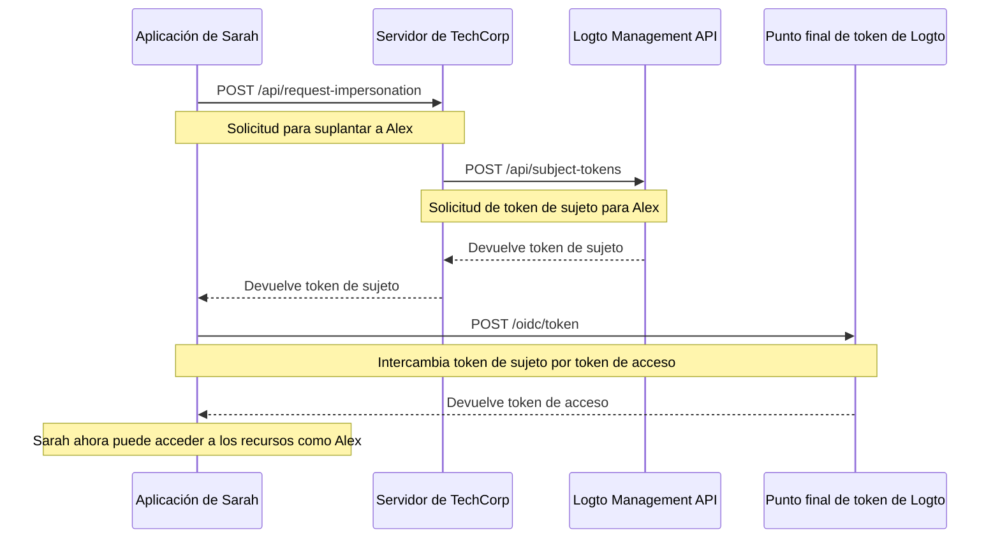

# Suplantación de usuario (User impersonation)

Imagina que Sarah, una ingeniera de soporte en TechCorp, recibe un ticket urgente de Alex, un cliente que no puede acceder a un recurso crítico. Para diagnosticar y resolver el problema de manera eficiente, Sarah necesita ver exactamente lo que Alex ve en el sistema. Aquí es donde la función de suplantación de usuario de Logto resulta útil.

La suplantación de usuario permite que usuarios autorizados como Sarah actúen temporalmente en nombre de otros usuarios como Alex dentro del sistema. Esta potente función es invaluable para la resolución de problemas, el soporte al cliente y la realización de tareas administrativas.

## ¿Cómo funciona? \{#how-it-works}



El proceso de suplantación implica tres pasos principales:

1. Sarah solicita la suplantación a través del servidor backend de TechCorp
2. El servidor de TechCorp obtiene un token de sujeto del Management API de Logto
3. La aplicación de Sarah intercambia este token de sujeto por un token de acceso

Veamos cómo Sarah puede usar esta función para ayudar a Alex.

### Paso 1: Solicitar suplantación \{#step-1-requesting-impersonation}

Primero, la aplicación de soporte de Sarah debe solicitar la suplantación al servidor backend de TechCorp.

**Solicitud (aplicación de Sarah al servidor de TechCorp)**

```bash
POST /api/request-impersonation HTTP/1.1
Host: api.techcorp.com
Authorization: Bearer <Sarah's_access_token>
Content-Type: application/json

{
  "userId": "alex123",
  "reason": "Investigando problema de acceso a recurso",
  "ticketId": "TECH-1234"
}
```

En esta API, el backend debe realizar las comprobaciones de autorización adecuadas para asegurarse de que Sarah tiene los permisos necesarios para suplantar a Alex.

### Paso 2: Obtener un token de sujeto \{#step-2-obtaining-a-subject-token}

El servidor de TechCorp, tras validar la solicitud de Sarah, llamará al [Management API](/integrate-logto/interact-with-management-api) de Logto para obtener un token de sujeto.

**Solicitud (servidor de TechCorp al Management API de Logto)**

```bash
POST /api/subject-tokens HTTP/1.1
Host: techcorp.logto.app
Authorization: Bearer <TechCorp_m2m_access_token>
Content-Type: application/json

{
  "userId": "alex123",
  "context": {
    "ticketId": "TECH-1234",
    "reason": "Problema de acceso a recurso",
    "supportEngineerId": "sarah789"
  }
}
```

**Respuesta (Logto al servidor de TechCorp)**

```json
{
  "subjectToken": "sub_7h32jf8sK3j2",
  "expiresIn": 600
}
```

El servidor de TechCorp debe devolver este token de sujeto a la aplicación de Sarah.

**Respuesta (servidor de TechCorp a la aplicación de Sarah)**

```json
{
  "subjectToken": "sub_7h32jf8sK3j2",
  "expiresIn": 600
}
```

### Paso 3: Intercambiar el token de sujeto por un token de acceso \{#step-3-exchanging-the-subject-token-for-an-access-token}

Ahora, la aplicación de Sarah intercambia este token de sujeto por un token de acceso que representa a Alex, especificando el recurso donde se utilizará el token.

**Solicitud (aplicación de Sarah al punto final de token de Logto)**

```bash
POST /oidc/token HTTP/1.1
Host: techcorp.logto.app
Content-Type: application/x-www-form-urlencoded

grant_type=urn:ietf:params:oauth:grant-type:token-exchange
&client_id=techcorp_support_app
&scope=resource:read
&subject_token=alx_7h32jf8sK3j2
&subject_token_type=urn:ietf:params:oauth:token-type:access_token
&resource=https://api.techcorp.com/customer-data
```

**Respuesta (Logto a la aplicación de Sarah)**

```json
{
  "access_token": "eyJhbG...<truncated>",
  "issued_token_type": "urn:ietf:params:oauth:token-type:access_token",
  "token_type": "Bearer",
  "expires_in": 3600,
  "scope": "resource:read"
}
```

El `access_token` devuelto estará vinculado al recurso especificado, asegurando que solo pueda usarse con la API de datos de clientes de TechCorp.

**Nota**: Para aplicaciones web tradicionales, incluye `client_id` y `client_secret` en el encabezado de la solicitud de token para evitar un error 401 invalid_client.

Aquí tienes un ejemplo en Node.js:

```json
Authorization: `Basic ${Buffer.from(`${client_id}:${client_secret}`, 'utf8').toString('base64')}`
```

## Ejemplo de uso \{#example-usage}

Así es como Sarah podría usar esto en una aplicación de soporte en Node.js:

```jsx
interface ImpersonationResponse {
  subjectToken: string;
  expiresIn: number;
}

interface TokenExchangeResponse {
  access_token: string;
  issued_token_type: string;
  token_type: string;
  expires_in: number;
  scope: string;
}

async function impersonateUser(
  userId: string,
  clientId: string,
  ticketId: string,
  resource: string
): Promise<string> {
  try {
    // Paso 1 y 2: Solicitar suplantación y obtener token de sujeto
    const impersonationResponse = await fetch(
      'https://api.techcorp.com/api/request-impersonation',
      {
        method: 'POST',
        headers: {
          Authorization: "Bearer <Sarah's_access_token>",
          'Content-Type': 'application/json',
        },
        body: JSON.stringify({
          userId,
          reason: 'Investigando problema de acceso a recurso',
          ticketId,
        }),
      }
    );

    if (!impersonationResponse.ok) {
      throw new Error(`HTTP error occurred. Status: ${impersonationResponse.status}`);
    }

    const { subjectToken } = (await impersonationResponse.json()) as ImpersonationResponse;

    // Paso 3: Intercambiar token de sujeto por token de acceso
    const tokenExchangeBody = new URLSearchParams({
      grant_type: 'urn:ietf:params:oauth:grant-type:token-exchange',
      client_id: clientId,
      scope: 'openid profile resource.read',
      subject_token: subjectToken,
      subject_token_type: 'urn:ietf:params:oauth:token-type:access_token',
      resource: resource,
    });

    const tokenExchangeResponse = await fetch('https://techcorp.logto.app/oidc/token', {
      method: 'POST',
      headers: { 'Content-Type': 'application/x-www-form-urlencoded' },
      body: tokenExchangeBody,
    });

    if (!tokenExchangeResponse.ok) {
      throw new Error(`HTTP error! status: ${tokenExchangeResponse.status}`);
    }

    const tokenData = (await tokenExchangeResponse.json()) as TokenExchangeResponse;
    return tokenData.access_token;
  } catch (error) {
    console.error('La suplantación falló:', error);
    throw error;
  }
}

// Sarah usa esta función para suplantar a Alex
async function performImpersonation(): Promise<void> {
  try {
    const accessToken = await impersonateUser(
      'alex123',
      'techcorp_support_app',
      'TECH-1234',
      'https://api.techcorp.com/customer-data'
    );
    console.log('Token de acceso de suplantación para Alex:', accessToken);
  } catch (error) {
    console.error('No se pudo realizar la suplantación:', error);
  }
}

// Ejecutar la suplantación
void performImpersonation()
```

:::note

1. El token de sujeto es de corta duración y de un solo uso.
2. El token de acceso de suplantación no viene con un [token de actualización (Refresh token)](https://auth.wiki/refresh-token). Sarah tendrá que repetir este proceso si el token expira antes de resolver el problema de Alex.
3. El servidor backend de TechCorp debe implementar comprobaciones de autorización adecuadas para garantizar que solo el personal de soporte autorizado como Sarah pueda solicitar la suplantación.

:::

## Reclamo `act` \{#act-claim}

Al usar el flujo de intercambio de tokens para la suplantación, el token de acceso emitido puede incluir un reclamo adicional `act` (actor). Este reclamo representa la identidad de la "parte actuante", en nuestro ejemplo, Sarah, quien realiza la suplantación.

Para incluir el reclamo `act`, la aplicación de Sarah debe proporcionar un `actor_token` en la solicitud de intercambio de token. Este token debe ser un token de acceso válido para Sarah con el alcance `openid`. Así es como se incluye en la solicitud de intercambio de token:

```bash
POST /oidc/token HTTP/1.1
Host: techcorp.logto.app
Content-Type: application/x-www-form-urlencoded

grant_type=urn:ietf:params:oauth:grant-type:token-exchange
&client_id=techcorp_support_app
&scope=resource:read
&subject_token=alx_7h32jf8sK3j2
&subject_token_type=urn:ietf:params:oauth:token-type:access_token
&actor_token=sarah_access_token
&actor_token_type=urn:ietf:params:oauth:token-type:access_token
&resource=https://api.techcorp.com/customer-data
```

Si se proporciona un `actor_token`, el token de acceso resultante contendrá un reclamo `act` como este:

```json
{
  "aud": "https://api.techcorp.com",
  "iss": "https://techcorp.logto.app",
  "exp": 1443904177,
  "sub": "alex123",
  "act": {
    "sub": "sarah789"
  }
}
```

Este reclamo `act` indica claramente que Sarah (sarah789) está actuando en nombre de Alex (alex123). El reclamo `act` puede ser útil para auditoría y seguimiento de acciones de suplantación.

## Personalización de los reclamos del token \{#customizing-token-claims}

Logto te permite [personalizar los reclamos del token](/developers/custom-token-claims) para los tokens de suplantación. Esto puede ser útil para agregar contexto o metadatos adicionales al proceso de suplantación, como el motivo de la suplantación o el ticket de soporte asociado.

Cuando el servidor de TechCorp solicita un token de sujeto al Management API de Logto, puede incluir un objeto `context`:

```json
{
  "userId": "alex123",
  "context": {
    "ticketId": "TECH-1234",
    "reason": "Problema de acceso a recurso",
    "supportEngineerId": "sarah789"
  }
}
```

Este [contexto](/developers/custom-token-claims/create-script#context-only-available-for-user-access-token) puede usarse en una función `getCustomJwtClaims()` para agregar reclamos específicos al token de acceso final. Aquí tienes un ejemplo de cómo podría implementarse:

```tsx
const getCustomJwtClaims = async ({ token, context, environmentVariables }) => {
  if (context.grant?.type === 'urn:ietf:params:oauth:grant-type:token-exchange') {
    const { ticketId, reason, supportEngineerId } = context.grant.subjectTokenContext;
    return {
      impersonation_context: {
        ticket_id: ticketId,
        reason: reason,
        support_engineer: supportEngineerId,
      },
    };
  }
  return {};
};
```

El token de acceso resultante que recibe Sarah podría verse así:

```json
{
  "sub": "alex123",
  "aud": "https://api.techcorp.com/customer-data",
  "impersonation_context": {
    "ticket_id": "TECH-1234",
    "reason": "Problema de acceso a recurso",
    "support_engineer": "sarah789"
  }
  // ... otros reclamos estándar
}
```

Al personalizar los reclamos del token de acceso de esta manera, TechCorp puede incluir información valiosa sobre el contexto de la suplantación, facilitando la auditoría y la comprensión de las actividades de suplantación en su sistema.

:::note
Ten cuidado al agregar reclamos personalizados a tus tokens. Evita incluir información sensible que pueda suponer riesgos de seguridad si el token es interceptado o filtrado. Los JWT están firmados pero no cifrados, por lo que los reclamos son visibles para cualquiera que tenga acceso al token.
:::

## Recursos relacionados

<Url href="https://blog.logto.io/impersonation">
  ¿Qué es la suplantación en ciberseguridad y gestión de identidades? ¿Cómo pueden usarla los
  agentes de IA?
</Url>
