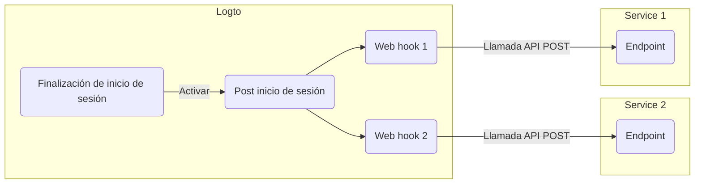

# Webhooks

Logto [Webhook](https://auth.wiki/webhook) proporciona notificaciones en tiempo real para varios eventos, incluidos cambios en [cuenta de usuario](/user-management/user-data), [rol](/authorization/role-based-access-control#roles), [permiso](/authorization/role-based-access-control#permissionsscopes), [organización](/organizations/organization-data), [rol de organización](/authorization/organization-template#organization-role), [permiso de organización](/authorization/organization-template#organization-permission), e [interacción del usuario](/end-user-flows).

Cuando se activa un evento, Logto envía una solicitud HTTP a la URL del Endpoint que proporcionas, conteniendo información detallada sobre el evento, como ID de usuario, nombre de usuario, correo electrónico y otros detalles relevantes (para más información sobre los datos incluidos en la carga útil y el encabezado, consulta [Solicitud de Webhook](/developers/webhooks/webhooks-request)). Tu aplicación puede procesar esta solicitud y tomar acciones personalizadas, como enviar un correo electrónico o actualizar datos en la base de datos.

Continuamente agregamos más eventos basados en las necesidades de los usuarios. Si tienes requisitos específicos para tu negocio, por favor háznoslo saber.

## ¿Por qué usar Webhook?

Los Webhooks ofrecen comunicación en tiempo real entre aplicaciones, eliminando la necesidad de sondeo y permitiendo actualizaciones de datos inmediatas. Simplifican la integración de aplicaciones y la automatización de flujos de trabajo sin código complejo o APIs propietarias.

Aquí hay algunos ejemplos de casos de uso comunes de Webhook para CIAM:

- **Enviar correos electrónicos:** Configura un Webhook para enviar un correo de bienvenida a nuevos usuarios al registrarse o notificar a los administradores cuando un usuario inicia sesión desde un nuevo dispositivo o ubicación.
- **Enviar notificaciones:** Configura un Webhook para activar un asistente virtual con tu sistema CRM para proporcionar soporte al cliente en tiempo real cuando los usuarios se registren.
- **Realizar llamadas adicionales a API**: Configura un Webhook para verificar el acceso del usuario comprobando su dominio de correo electrónico o dirección IP y luego usa el Logto Management API para asignar roles apropiados con permisos de recursos.
- **Sincronización de datos:** Configura Webhook para mantener la aplicación actualizada sobre cambios como suspensiones o eliminaciones de cuentas de usuario.
- **Generar informes**: Configura un Webhook para recibir datos de actividad de inicio de sesión de usuarios y utilizarlos para crear informes sobre el compromiso o patrones de uso de los usuarios.

## Términos

| Elemento                                                                                                                                                                                                                                     | Descripción                                                                                                                                                                                                                     |
| -------------------------------------------------------------------------------------------------------------------------------------------------------------------------------------------------------------------------------------------- | ------------------------------------------------------------------------------------------------------------------------------------------------------------------------------------------------------------------------------- |
| Evento                                                                                                                                                                                                                                       | Cuando se realiza una acción específica, activará un evento de hook con un tipo específico. Por ejemplo, Logto emitirá un evento de hook PostRegister cuando el usuario termine el proceso de registro y cree una nueva cuenta. |
| Hook                                                                                                                                                                                                                                         | Una acción o serie de acciones que se enganchan a un evento específico. La acción puede ser llamar a una API, ejecutar fragmentos de código, etc.                                                                               |
| Webhook                                                                                                                                                                                                                                      | Un subtipo de hook que indica llamar a una API con la carga útil del evento.                                                                                                                                                    |
| Supongamos que un desarrollador quiere enviar una notificación cuando un usuario inicie sesión a través de un nuevo dispositivo, el desarrollador puede agregar un webhook que llame a su API de servicio de seguridad al evento PostSignIn. |

Aquí tienes un ejemplo de cómo habilitar dos webhooks para el evento `PostSignIn` en Logto:

## Preguntas frecuentes

¿Logto admite webhooks sincronizados?

Aunque los webhooks sincronizados harían que el flujo de inicio de sesión del usuario fuera más fluido, aún no los admitimos (lo haremos en el futuro). Por lo tanto, los escenarios que dependen de webhooks sincronizados actualmente requieren diferentes soluciones alternativas. Si tienes alguna pregunta, no dudes en contactarnos.

¿Cómo manejar el cambio de permisos de usuario?

Consulta la guía [Gestionar el cambio de permisos de usuario](/authorization/role-based-access-control/protect-api-resources-with-rbac/#optional-handle-user-permission-change).

¿Cómo depurar el tiempo de espera del webhook?

Para el endpoint que recibe Webhooks, debe devolver una respuesta 2xx lo más rápido posible para informar a Logto que el Webhook se ha recibido correctamente. Dado que diferentes usuarios tienen lógicas de procesamiento muy diferentes para Webhooks, las tareas excesivamente complejas podrían tardar varios segundos, causando que el Webhook de Logto se agote. La mejor práctica es mantener tu propia cola de eventos; al recibir el Webhook de Logto, inserta el evento en la cola y devuelve una respuesta 2xx a Logto. Luego deja que tu propio trabajador procese las tareas en la cola paso a paso. Si el trabajador encuentra un error, manéjalo en tu propio servidor.

¿Puedo obtener la dirección IP del cliente desde los webhooks `PostSignIn`?

Sí, puedes obtener la dirección IP, agentes de usuario, etc., en la carga útil del Webhook. Si necesitas información que actualmente no está soportada, puedes crear solicitudes de características en los problemas de GitHub, o contactarnos.

## Recursos relacionados

<Url href="https://blog.logto.io/webhooks-vs-polling">Webhooks vs. polling</Url>
