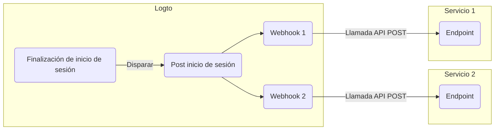

# Webhooks

Logto [Webhooks](https://auth.wiki/webhook) proporcionan notificaciones en tiempo real para varios eventos, incluyendo cambios en cuentas de usuario, roles, permisos, organizaciones, roles de organización, permisos de organización e [interacciones de usuario](/end-user-flows).

Cuando se activa un evento, Logto envía de forma asíncrona una solicitud HTTP al endpoint URL que proporciones. La solicitud contiene detalles sobre el evento, como el usuario, la aplicación y el contexto de la solicitud. Consulta [Solicitud de Webhook](/developers/webhooks/webhooks-request) para la referencia de payload y encabezados.

La entrega del Webhook ocurre fuera de la solicitud de autenticación y no puede cambiar el resultado del flujo actual. Para código síncrono que debe finalizar antes de que continúe el inicio de sesión, utiliza [Acciones](/developers/actions).

Continuamente agregamos más eventos según las necesidades de los usuarios. Si tienes requisitos específicos para tu negocio, por favor háznoslo saber.

## ¿Por qué usar Webhook? \{#why-use-webhook}

Los Webhooks ofrecen comunicación en tiempo real entre aplicaciones, eliminando la necesidad de sondeo y permitiendo actualizaciones de datos inmediatas. Simplifican la integración de aplicaciones y la automatización de flujos de trabajo sin código complejo ni APIs propietarias.

Aquí tienes algunos ejemplos de casos de uso comunes de Webhook para CIAM:

- **Enviar correos electrónicos:** Configura un Webhook para enviar un correo de bienvenida a los nuevos usuarios al registrarse o notificar a los administradores cuando un usuario inicia sesión desde un nuevo dispositivo o ubicación.
- **Enviar notificaciones:** Configura un Webhook para activar un asistente virtual con tu sistema CRM y proporcionar soporte al cliente en tiempo real cuando los usuarios se registren.
- **Realizar llamadas API adicionales**: Configura un Webhook para verificar el acceso del usuario comprobando su dominio de correo electrónico o dirección IP y luego utiliza la Management API de Logto para asignar los roles apropiados con permisos de recursos.
- **Sincronización de datos:** Configura Webhook para mantener la aplicación actualizada sobre cambios como suspensiones o eliminaciones de cuentas de usuario.
- **Generar informes**: Configura un Webhook para recibir datos de actividad de inicio de sesión de usuarios y aprovecharlos para crear informes sobre la participación o patrones de uso de los usuarios.

## Términos \{#terms}

| Ítem              | Descripción                                                                                    |
| ----------------- | ---------------------------------------------------------------------------------------------- |
| Evento de Webhook | Un tipo de evento compatible que Logto puede entregar, como `PostSignIn` o `User.Created`.     |
| Webhook           | Una configuración que se suscribe a uno o más eventos y envía sus payloads a un endpoint HTTP. |

Por ejemplo, para notificar a un servicio de seguridad después de que un usuario inicie sesión, crea un Webhook que se suscriba a `PostSignIn`.

Aquí tienes un ejemplo de cómo habilitar dos Webhooks para el evento `PostSignIn` en Logto:

```mermaid
graph LR
  subgraph Logto
    SF(Finalización de inicio de sesión)
    PS(Post inicio de sesión)
    WH2(Webhook 2)
    WH1(Webhook 1)
  end

  subgraph Servicio 2
    E2(Endpoint)
  end

  subgraph Servicio 1
    E1(Endpoint)
  end

  SF -->|Disparar| PS
  PS --> WH1
  PS --> WH2
  WH1 --->|Llamada API POST| E1
  WH2 --->|Llamada API POST| E2

```

## Preguntas frecuentes \{#faqs}

### ¿Pueden los Webhooks tomar una decisión de autenticación síncrona? \{#does-logto-support-synced-webhooks}

No. Los Webhooks son notificaciones asíncronas, por lo que su respuesta no puede permitir, bloquear ni modificar el flujo de autenticación actual.

Utiliza [Acciones](/developers/actions) cuando Logto deba ejecutar código personalizado, llamar a una API externa o actualizar un usuario antes de que continúe el inicio de sesión. Dado que las Acciones son síncronas, mantén sus dependencias externas rápidas y confiables.

### ¿Cómo manejar el cambio de permisos de usuario? \{#how-to-deal-with-user-permission-change}

Consulta la guía [Gestionar el cambio de permisos de usuario](/authorization/global-api-resources/#optional-handle-user-permission-change).

### ¿Cómo depurar el timeout de un webhook? \{#how-to-debug-webhook-timeout}

Para el endpoint que recibe Webhooks, debe devolver una respuesta 2xx lo más rápido posible para indicar a Logto que el Webhook se ha recibido correctamente. Dado que diferentes usuarios tienen lógicas de procesamiento muy diferentes para los Webhooks, las tareas excesivamente complejas pueden tardar varios segundos, lo que provoca que el Webhook de Logto agote el tiempo de espera. La mejor práctica es mantener tu propia cola de eventos; al recibir el Webhook de Logto, inserta el evento en la cola y devuelve una respuesta 2xx a Logto. Luego, deja que tu propio worker procese las tareas en la cola paso a paso. Si el worker encuentra un error, manéjalo en tu propio servidor.

### ¿Puedo obtener la dirección IP del cliente desde los webhooks `PostSignIn`? \{#can-i-get-the-client-ip-address-from-postsignin-webhooks}

Sí, puedes obtener la dirección IP, user agents, etc. en el payload del Webhook. Si necesitas información que actualmente no está soportada, puedes crear solicitudes de características en los issues de GitHub, o contactarnos.

## Recursos relacionados \{#related-resources}

<Url href="https://blog.logto.io/webhooks-vs-polling">Webhooks vs. polling</Url>
